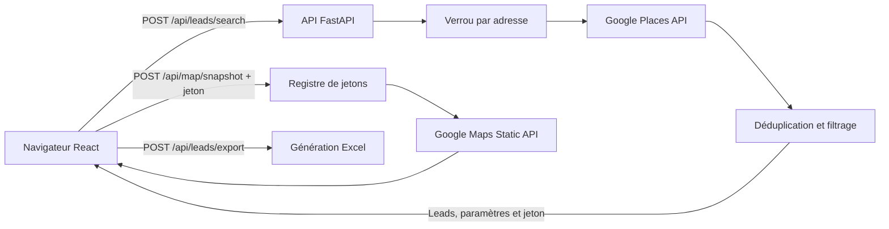

# Prospect — générateur de leads Google Maps

Prospect est une application Web Python + React qui recherche des entreprises locales avec **Google Places API (New) — Text Search**, élimine les doublons, vérifie leur présence dans un rayon donné et exporte les résultats dans un classeur Excel.

Ce fichier réunit la documentation utilisateur et la documentation technique du projet.

## Fonctionnalités

- recherche multi-zones autour de coordonnées géographiques ;
- pagination Google Places, jusqu’à trois pages par zone ;
- déduplication par `PlaceId`, avec repli sur le nom et l’adresse ;
- filtrage géographique par distance Haversine ;
- prise en charge configurable des entreprises de zone de service ;
- récupération facultative du téléphone et du site Web ;
- carte Google statique des résultats ;
- filtrage des résultats dans l’interface ;
- export Excel avec feuille de données et récapitulatif de la recherche ;
- identification du demandeur et blocage des recherches simultanées pour une même adresse ;
- pages de conditions d’utilisation et de politique de confidentialité.

> **Migration CRM V1 :** la recherche multi-zone/multi-page et l’export des résultats Google bruts sont transitoires. Leurs routes et paramètres sont marqués `deprecated` dans OpenAPI. Leur remplacement et leurs règles de suppression sont suivis dans [`docs/TRANSITIONAL_FEATURES.md`](docs/TRANSITIONAL_FEATURES.md).

## Guide utilisateur

### 1. Préparer une recherche

Le panneau de gauche contient les paramètres suivants :

| Paramètre | Utilisation |
| --- | --- |
| Type d’entreprise | Terme métier simple, par exemple `plombier` ou `électricien`. Évitez d’ajouter la ville au terme. |
| Latitude et longitude | Centre géographique de la recherche. |
| Rayon global | Distance maximale autour du centre, de 1 à 50 km. |
| Objectif | Nombre de leads souhaité, de 1 à 500. La recherche s’arrête lorsque cet objectif est atteint. |
| Zones | Nombre de points de recherche Google, de 1 à 30. |
| Pages par zone | Nombre maximal de pages Google consultées, de 1 à 3. |
| Téléphone et site Web | Active les champs de contact, susceptibles d’augmenter le coût Google. |
| Entreprises de zone de service | Conserve les entreprises qui masquent leur adresse ou leurs coordonnées. |

L’estimation affichée correspond au maximum théorique `zones × pages`. Le nombre réel d’appels peut être inférieur lorsque l’objectif est atteint ou qu’aucune page suivante n’est disponible.

### 2. Identifier le demandeur

Au clic sur **Générer les leads**, renseignez :

- votre prénom ;
- la raison sociale ;
- l’adresse professionnelle.

Ces informations sont validées par le serveur. Elles ne sont ni incluses dans l’export ni renvoyées dans les paramètres de résultat. Une même adresse normalisée ne peut lancer qu’une génération à la fois dans le processus serveur courant.

### 3. Consulter les résultats

Après la recherche, l’application affiche :

- le nombre de leads uniques ;
- le nombre de zones explorées ;
- le nombre d’appels Google effectués et de doublons retirés ;
- une carte Google avec le centre et jusqu’à 50 résultats géolocalisés ;
- le nom, les contacts demandés, l’adresse, la distance et le statut des entreprises.

La carte, les métriques et l’export restent associés aux paramètres réellement soumis. Il est donc possible de préparer une nouvelle recherche dans le formulaire sans modifier les informations de la recherche terminée.

Les entreprises sans coordonnées peuvent être conservées lorsque l’option correspondante est activée. Leur distance est alors indiquée comme non vérifiable.

### 4. Filtrer et exporter

Le champ situé au-dessus du tableau filtre les résultats par nom, adresse, téléphone ou type d’entreprise. Le filtre **Avec contact** limite l’affichage aux entreprises possédant un téléphone ou un site Web.

Le bouton **Exporter Excel** télécharge un fichier `.xlsx` contenant :

- une feuille `Leads` avec les entreprises ;
- une feuille `Recherche` avec les paramètres réellement utilisés.

Les textes externes commençant comme une formule Excel sont neutralisés avant l’écriture afin d’empêcher leur interprétation comme formule active.

### Premier essai recommandé

Pour limiter les coûts pendant la prise en main :

- objectif : `20` ;
- zones : `1` ;
- pages par zone : `1` ;
- téléphone et site Web : désactivés.

Augmentez ensuite progressivement la couverture et activez les champs de contact si nécessaire.

## Installation locale

### Prérequis

- Python 3.12 ou version ultérieure ;
- Node.js 22 ou version ultérieure ;
- un projet Google Cloud avec facturation activée ;
- **Places API (New)** activée ;
- **Maps Static API** activée pour afficher la carte.

### Installer les dépendances

Depuis la racine du projet, sous PowerShell :

```powershell
python -m venv .venv
.\.venv\Scripts\Activate.ps1
pip install -r backend\requirements-dev.txt

cd client
npm ci
cd ..
```

### Configurer les clés Google

```powershell
$env:GOOGLE_MAPS_API_KEY = "VOTRE_CLE_PLACES"
$env:GOOGLE_MAPS_STATIC_API_KEY = "VOTRE_CLE_MAPS_STATIC"
```

| Variable | Obligatoire | Description |
| --- | --- | --- |
| `GOOGLE_MAPS_API_KEY` | Oui | Clé serveur utilisée pour Places API (New). |
| `GOOGLE_MAPS_STATIC_API_KEY` | Non | Clé serveur distincte recommandée pour Maps Static API. En son absence, la clé Places est réutilisée. |

Le fichier `.env.example` sert de modèle, mais l’application ne charge pas automatiquement un fichier `.env`. Injectez les valeurs dans l’environnement du processus ou dans le gestionnaire de secrets de la plateforme.

Ne commitez jamais les clés. Restreignez chaque clé aux API nécessaires et, lorsque l’infrastructure le permet, aux adresses IP du serveur. Les clés restent côté serveur et ne sont jamais envoyées au navigateur.

### Démarrer en développement

Terminal 1 :

```powershell
.\.venv\Scripts\Activate.ps1
uvicorn backend.app.main:app --reload --host 127.0.0.1 --port 8000
```

Terminal 2 :

```powershell
cd client
npm run dev
```

Ouvrez `http://localhost:5173`. Vite redirige les requêtes `/api` vers `http://127.0.0.1:8000`.

## Architecture technique

### Stack

- API : FastAPI, Pydantic et HTTPX ;
- logique métier : Python 3.12 ;
- interface : React 19 et Vite ;
- export : openpyxl ;
- tests : pytest et `httpx.MockTransport` ;
- intégration continue : Azure Pipelines.

### Flux principal



### Organisation du code

Le backend suit une Clean Architecture pragmatique. Les dépendances pointent vers l’intérieur : la présentation et l’infrastructure dépendent de l’application, tandis que le domaine ne dépend d’aucun framework.

| Dossier ou fichier | Responsabilité |
| --- | --- |
| `backend/app/domain/` | Objets métier et calculs géographiques sans FastAPI, Pydantic ni fournisseur externe. |
| `backend/app/application/use_cases/` | Recherche, génération, carte et export sous forme de cas d’utilisation. |
| `backend/app/application/ports/` | Interfaces des services Google, verrous, jetons, cartes et exports. |
| `backend/app/infrastructure/google/` | Clients et adaptateurs Google Places et Maps Static. |
| `backend/app/infrastructure/memory/` | Implémentations locales temporaires des verrous et jetons. |
| `backend/app/infrastructure/export/` | Adaptateur de génération Excel. |
| `backend/app/presentation/api/` | Schémas, mappers, dépendances et routes FastAPI. |
| `backend/app/config.py` | Chargement et validation centralisés des variables d’environnement. |
| `backend/app/bootstrap.py` | `create_app()` et composition des dépendances concrètes. |
| `backend/app/container.py` | Conteneur injecté dans les routes. |
| `backend/app/main.py` | Point d’entrée ASGI minimal pour Uvicorn. |
| `backend/app/{models,places,search_service,...}.py` | Façades temporaires maintenant les anciens imports compatibles. |
| `client/src/app/` | Composant racine, registre des chemins CRM et routage côté navigateur. |
| `client/src/features/lead-search/` | Page, composants, hooks et API de la fonctionnalité de recherche actuelle. |
| `client/src/shared/api/` | Client HTTP, erreurs réseau et décodage centralisé des réponses. |
| `client/src/shared/browser/` | Téléchargement des fichiers et gestion des URL temporaires. |
| `client/src/shared/hooks/` | Comportements d’interface réutilisables sans dépendance métier. |
| `client/src/shared/ui/` | Contrôles visuels partagés. |
| `client/src/App.jsx` | Façade temporaire maintenant l’ancien import compatible. |
| `client/public/` | Pages légales et leur feuille de style. |

## Contrat API

### `GET /api/health`

Retourne l’état de l’API et indique si `GOOGLE_MAPS_API_KEY` est présente.

### `POST /api/leads/search` — transitoire

Exécute une recherche et exige l’identité du demandeur.

Exemple minimal :

```json
{
  "query": "plombier",
  "center_latitude": 46.8139,
  "center_longitude": -71.208,
  "radius_km": 15,
  "target": 20,
  "max_tiles": 1,
  "max_pages": 1,
  "contact_fields": false,
  "include_service_area_businesses": true,
  "language_code": "fr",
  "region_code": "CA",
  "requester": {
    "first_name": "Alex",
    "company_name": "Entreprise Exemple",
    "business_address": "100 rue Principale, Québec, Canada"
  }
}
```

La réponse contient :

- `leads` : entreprises normalisées ;
- `stats` : appels, pages, zones, doublons et exclusions ;
- `generated_at` : horodatage UTC ;
- `search_parameters` : paramètres validés réellement utilisés, sans identité ;
- `map_snapshot_token` : jeton de carte éphémère.

### `POST /api/map/snapshot`

```json
{
  "token": "JETON_RECU_APRES_LA_RECHERCHE"
}
```

Le serveur détermine lui-même le centre, le rayon et les marqueurs associés. Le navigateur ne peut pas fournir librement ces paramètres. Le jeton :

- expire après 5 minutes ;
- est utilisable une seule fois après une réponse Google réussie ;
- refuse une utilisation simultanée ;
- redevient disponible si l’appel Google échoue temporairement.

Le registre conserve au maximum 1 000 jetons dans le processus courant.

### `POST /api/leads/export` — transitoire

Reçoit la liste des leads et les paramètres de recherche, puis retourne un fichier Excel. Une liste vide produit une erreur 400 et la requête accepte au maximum 1 000 leads.

## Sécurité et protections

- les clés Google ne quittent pas le serveur ;
- les recherches concurrentes pour une même adresse sont bloquées ;
- la clé du verrou conserve les écritures Unicode tout en harmonisant casse, accents, ponctuation et caractères pleine largeur ;
- la route Maps exige un jeton aléatoire, court et à usage unique émis après une recherche réussie ;
- les coordonnées Maps sont conservées côté serveur et ne sont pas acceptées depuis le navigateur ;
- les valeurs Excel susceptibles d’être interprétées comme des formules sont converties en texte ;
- Pydantic limite les longueurs, coordonnées, rayons, pages, zones et volumes exportés ;
- CORS autorise uniquement les origines locales Vite prévues pour le développement.

Les registres de verrouillage et de jetons sont actuellement conservés en mémoire. Pour plusieurs workers, plusieurs conteneurs ou plusieurs serveurs, utilisez un stockage partagé avec expiration et opérations atomiques, par exemple Redis.

Le jeton Maps protège l’appel direct à Maps Static API, mais ne remplace pas une authentification, une limitation de débit et des quotas par organisation si l’application est exposée publiquement.

## Tests et intégration continue

Vérifier puis tester le backend :

```powershell
.\.venv\Scripts\python.exe -m ruff check backend/app tests
.\.venv\Scripts\python.exe -m ruff format --check backend/app tests
.\.venv\Scripts\python.exe -m mypy
.\.venv\Scripts\python.exe -m pytest -q
```

Vérifier, tester puis compiler l’interface :

```powershell
cd client
npm run lint
npm test
npm run build
```

La suite couvre notamment :

- géométrie et maillage ;
- pagination et déduplication ;
- filtrage par rayon et entreprises de service ;
- retry après HTTP 429 et masque de champs ;
- export Excel et neutralisation des formules ;
- normalisation Unicode et verrouillage par adresse ;
- durée de vie, usage unique et concurrence des jetons Maps ;
- conservation des paramètres réellement soumis ;
- chargement de `Settings`, fabrique `create_app()` et injection des cas d’utilisation ;
- parcours d’intégration FastAPI avec faux adaptateurs Google ;
- client HTTP, parcours de recherche React, erreurs communes et registre des routes CRM ;
- frontières Clean Architecture et statut déprécié des fonctions transitoires.

`azure-pipelines.yml` installe Python et Node.js, exécute Ruff, mypy, pytest, ESLint, Vitest et le build React, publie les résultats JUnit puis prépare l’artefact de déploiement.

## Build et déploiement

```powershell
cd client
npm ci
npm run build
cd ..
uvicorn backend.app.main:app --host 0.0.0.0 --port 8000
```

Lorsque `client/dist` existe, FastAPI le sert automatiquement à la racine. Le mode ci-dessus utilise un seul processus et convient au registre en mémoire actuel.

Avant une mise en production publique :

- ajoutez une authentification et des quotas côté serveur ;
- remplacez les registres en mémoire si le service est répliqué ;
- placez l’application derrière HTTPS et un proxy correctement configuré ;
- injectez les clés avec un gestionnaire de secrets ;
- configurez les quotas et alertes budgétaires Google Cloud ;
- complétez et faites valider `client/public/conditions.html` et `client/public/confidentialite.html`.

## Codes d’erreur usuels

| Code | Situation courante |
| --- | --- |
| `400` | Export demandé sans lead. |
| `403` | Jeton Maps invalide, expiré ou déjà utilisé. |
| `409` | Recherche déjà active pour cette adresse ou carte déjà en génération. |
| `422` | Données absentes ou hors des contraintes Pydantic. |
| `429` | Quota ou limitation renvoyée par Google Places. |
| `502` | Google Places ou Maps Static est temporairement indisponible ou refuse la requête. |
| `503` | Clé Google requise absente du serveur. |

## Données exportées

La feuille `Leads` contient : `Name`, `Address`, `Phone`, `InternationalPhone`, `Website`, `GoogleMapsUrl`, `Latitude`, `Longitude`, `PlaceId`, `PrimaryType`, `BusinessStatus`, `ServiceAreaBusiness`, `ZoneIndex`, `ZoneLatitude`, `ZoneLongitude`, `DistanceKm`, `RadiusVerified` et `CollectedAt`.

## Limites, coûts et conformité

- chaque zone et chaque page peut entraîner un appel Google facturable ;
- les champs de contact peuvent modifier le niveau de facturation ;
- Maps Static API peut être facturée séparément ;
- plusieurs biais géographiques améliorent la couverture sans garantir l’exhaustivité ;
- Google ne garantit ni la stabilité ni l’exactitude des résultats ;
- la présence dans le rayon ne peut pas être confirmée pour une entreprise sans coordonnées ;
- l’utilisateur reste responsable du respect des conditions Google Maps Platform et des lois applicables à la prospection ;
- les pages légales fournies sont des modèles à compléter et ne remplacent pas un avis juridique.

## Références officielles

- [Text Search (New)](https://developers.google.com/maps/documentation/places/web-service/text-search)
- [Sécurité des clés API Google Maps](https://developers.google.com/maps/api-security-best-practices)
- [Maps Static API](https://developers.google.com/maps/documentation/maps-static/overview)
- [FastAPI](https://fastapi.tiangolo.com/)
- [Pydantic](https://docs.pydantic.dev/)
- [openpyxl](https://openpyxl.readthedocs.io/)
- [pytest](https://docs.pytest.org/)
