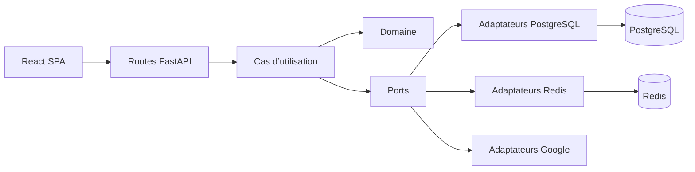

# Phase 2 — Spécifications détaillées des fondations CRM

| Métadonnée | Valeur |
| --- | --- |
| Produit | Prospect CRM |
| Version du document | 1.7 |
| Statut | Spécification validée ; 2.1, 2.2 et 2.3.1 acceptés ; détail 2.3.2 validé |
| Date | 23 juillet 2026 |
| Validation produit | 22 juillet 2026 ; détails 2.3 et 2.3.2 validés le 23 juillet 2026 |
| Phase couverte | Phase 2 — Fondations |
| Marché initial | Canada |

## 1. Objet

Cette phase transforme le socle FastAPI et React actuel en plateforme CRM persistante, authentifiée et multi-organisation. Elle prépare les invariants nécessaires aux modules métier sans livrer prématurément le Kanban, les activités, les opportunités ou les traitements complets d’import et d’export.

Le document complète et respecte les trois références suivantes :

- [`../README.md`](../README.md), qui décrit le comportement réellement disponible après la phase 1 ;
- [`SPECIFICATION_CRM_V1.md`](SPECIFICATION_CRM_V1.md), qui définit les neuf modules et l’architecture cible ;
- [`PHASE_1_1_ACQUISITION_CONSERVATION.md`](PHASE_1_1_ACQUISITION_CONSERVATION.md), dont les huit décisions validées deviennent des contraintes de conception.

## 2. Résultat attendu

À la sortie de la phase 2 :

- PostgreSQL est la source de vérité des données CRM ;
- SQLAlchemy 2 et Alembic fournissent l’accès transactionnel et les migrations ;
- Redis porte les sessions, quotas, verrous et jetons éphémères ;
- les utilisateurs se connectent avec une session serveur sécurisée ;
- les organisations et rôles Administrateur, Gestionnaire et Commercial sont opérationnels ;
- l’isolation multi-organisation est appliquée dans l’application et dans PostgreSQL ;
- le journal d’audit est append-only ;
- les tables de provenance, permission de contact, fournisseur et rétention existent avec leurs contraintes ;
- la recherche Google de la phase 1 reste limitée, non persistante et protégée, mais utilise désormais l’identité authentifiée ;
- les contrôles de qualité existants restent verts et incluent PostgreSQL et Redis réels.

## 3. Invariants non négociables

1. Le navigateur ne choisit jamais librement l’`organization_id` d’une opération métier.
2. Toute donnée appartenant à une organisation porte un `organization_id` obligatoire.
3. Toute requête métier s’exécute dans une transaction et un contexte d’organisation explicites.
4. Une donnée Google descriptive n’est écrite dans aucune table, trace, export ou cache applicatif.
5. Seul le `place_id` peut être conservé pour une référence Google.
6. Une coordonnée persistante sans provenance est rejetée.
7. L’absence de permission explicite d’un canal équivaut à `unknown` et bloque les actions automatisées.
8. Une opposition n’est jamais affaiblie par une importation, une fusion ou une nouvelle provenance.
9. Une durée de conservation chiffrée reste configurable et inactive tant qu’elle n’a pas été validée.
10. Les règles d’accès sont vérifiées côté serveur, indépendamment de l’état de l’interface.
11. Les secrets, mots de passe, cookies, jetons, contenus Google et preuves sensibles sont exclus des journaux.
12. Les adaptateurs PostgreSQL, Redis et Google dépendent des ports applicatifs ; le domaine ne dépend d’aucun framework.

## 4. Périmètre

### 4.1 Inclus

- configuration de PostgreSQL et Redis par environnement ;
- cycle de vie des connexions et contrôles de disponibilité ;
- modèles SQLAlchemy, dépôts, unité de travail et migrations Alembic ;
- organisations, utilisateurs, appartenances, rôles et invitations ;
- connexion, déconnexion, session, changement d’organisation et révocation ;
- protection CSRF et limitation des tentatives de connexion ;
- isolation multi-organisation et Row-Level Security ;
- journal d’audit ;
- schéma minimal des prospects et du pipeline nécessaire aux contraintes de conformité ;
- acquisition, provenance, coordonnées internes, permissions de contact, preuves, fournisseurs, rétention et déclarations d’import ;
- remplacement des verrous et jetons mémoire par Redis ;
- protection authentifiée des appels Google facturables ;
- écrans Connexion, Mon compte, Organisation et Utilisateurs ;
- enrichissement de la CI et des tests d’intégration.

### 4.2 Explicitement différé

- Kanban interactif et personnalisation complète du pipeline ;
- CRUD utilisateur des prospects, activités, tâches et opportunités ;
- ajout groupé depuis les résultats Google ;
- téléphones et sites Google dans la fiche détaillée ;
- traitement des fichiers CSV et XLSX ;
- génération des exports internes ;
- purge automatique de rétention ;
- worker asynchrone et planification des rappels ;
- tableau de bord métier ;
- fournisseur B2B connecté ;
- envoi automatisé de campagnes ;
- choix final de l’hébergement et des durées juridiques.

Les tables nécessaires à ces capacités peuvent être créées en phase 2, mais aucune route publique ne doit exposer une fonctionnalité incomplète.

## 5. Découpage en incréments testables

### 2.1 — Socle PostgreSQL, Redis et migrations

**État d’implémentation :** livré, doublement revu et validé localement avec PostgreSQL et Redis réels le 23 juillet 2026. La première exécution Azure Pipelines reste le verrou de validation CI. Le rapport détaillé se trouve dans [`PHASE_2_1_RAPPORT_IMPLEMENTATION.md`](PHASE_2_1_RAPPORT_IMPLEMENTATION.md).

Livrables :

- dépendances SQLAlchemy, pilote PostgreSQL asynchrone, Alembic et client Redis ;
- `DatabaseSettings` et `RedisSettings` intégrés à `Settings` ;
- création et fermeture des pools dans le cycle de vie FastAPI ;
- `UnitOfWork` et ports de dépôt ;
- configuration Alembic et convention de nommage des contraintes ;
- environnement local et CI avec PostgreSQL et Redis ;
- routes de vivacité et de disponibilité.

Validation avant de poursuivre :

- migration d’une base vide jusqu’à `head` ;
- `alembic check` sans différence non migrée ;
- transaction annulée intégralement en cas d’exception ;
- application indisponible en readiness si PostgreSQL ou Redis est inaccessible ;
- recherche Google de phase 1 inchangée fonctionnellement.

### 2.2 — Identité, mots de passe et sessions

**État d’implémentation :** livré, doublement revu et validé localement par le responsable produit le 23 juillet 2026. Les contrôles utilisent PostgreSQL et Redis réels. Le rapport détaillé se trouve dans [`PHASE_2_2_RAPPORT_IMPLEMENTATION.md`](PHASE_2_2_RAPPORT_IMPLEMENTATION.md).

Livrables :

- tables `users`, `organizations`, `memberships` et `user_invitations` ;
- bootstrap contrôlé du premier administrateur de plateforme ;
- hachage Argon2id ;
- connexion, déconnexion et `GET /api/auth/me` ;
- session opaque stockée dans Redis ;
- cookie sécurisé, protection CSRF et limitation des échecs de connexion ;
- écran de connexion et restauration de session sans stockage Web persistant.

Validation avant de poursuivre :

- erreur de connexion générique et temps comparable pour un courriel connu ou inconnu ;
- cookie `HttpOnly`, `SameSite=Lax` et `Secure` en production ;
- expiration d’inactivité et expiration absolue appliquées côté serveur ;
- déconnexion et désactivation invalidant la session ;
- absence de mot de passe, jeton ou cookie dans les journaux.

### 2.3 — Organisations, rôles et isolation

**État de spécification :** contrat général validé par le responsable produit le 23 juillet 2026. Il se trouve dans
[`PHASE_2_3_SPECIFICATIONS_DETAILLEES.md`](PHASE_2_3_SPECIFICATIONS_DETAILLEES.md). Le socle 2.3.1 est accepté et le
contrat détaillé validé de 2.3.2 se trouve dans
[`PHASE_2_3_2_SPECIFICATIONS_DETAILLEES.md`](PHASE_2_3_2_SPECIFICATIONS_DETAILLEES.md). Son implémentation est
autorisée.

Livrables :

- administration de l’organisation et des membres ;
- invitations à usage unique ;
- rôles Administrateur, Gestionnaire et Commercial ;
- contexte d’organisation issu de la session ;
- politiques PostgreSQL RLS et clés étrangères composites ;
- contrôle des permissions dans les cas d’utilisation ;
- protection authentifiée des routes Google existantes.

Validation avant de poursuivre :

- tests croisés entre au moins deux organisations ;
- identifiant appartenant à une autre organisation retournant `404` ;
- tentative d’injection d’un `organization_id` ignorée ou rejetée ;
- un Commercial ne pouvant ni administrer les membres ni lire l’audit ;
- impossibilité de supprimer ou désactiver le dernier Administrateur actif ;
- recherche Google facturable inaccessible sans session.

### 2.4 — Audit transactionnel

Livrables :

- table `audit_events` append-only ;
- port `AuditRecorder` ;
- écriture dans la même transaction que l’opération métier ;
- consultation paginée réservée aux rôles autorisés ;
- filtrage des métadonnées et identifiant de corrélation.

Validation avant de poursuivre :

- absence d’événement si la transaction métier est annulée ;
- événement présent après succès ;
- impossibilité pour le rôle applicatif de modifier ou supprimer un événement ;
- aucun contenu Google, mot de passe, jeton ou preuve brute dans `metadata`.

### 2.5 — Socle de conformité et de conservation

Livrables :

- tables minimales des prospects et étapes ;
- acquisition, coordonnées, permissions, preuves, fournisseurs et règles contractuelles ;
- politiques de conservation et mises en attente ;
- déclaration d’import sans traitement de fichier ;
- contraintes de provenance et d’opposition ;
- services de domaine prêts pour la phase 3.

Validation avant de poursuivre :

- source inconnue rejetée ;
- coordonnée sans provenance rejetée ;
- provenance Google interdite pour une coordonnée persistante ;
- permission absente évaluée comme `unknown` ;
- contrat expiré refusant une nouvelle acquisition ;
- mise en attente empêchant toute décision de purge ;
- unicité du `place_id` actif dans une organisation.

### 2.6 — Redis partagé, durcissement et régression

La proposition détaillée, son découpage en trois sous-incréments et les seize décisions soumises à validation sont
consignés dans [`PHASE_2_6_SPECIFICATIONS_DETAILLEES.md`](PHASE_2_6_SPECIFICATIONS_DETAILLEES.md). Elle étend le
périmètre au jeton de sélection Google introduit en 2.5, condition nécessaire au fonctionnement derrière plusieurs
instances API.

Livrables :

- implémentations Redis des verrous de recherche et jetons de carte ;
- quotas par utilisateur et organisation ;
- suppression des implémentations mémoire du profil de production ;
- métriques, journaux structurés et contrôles CI ;
- documentation utilisateur et technique actualisée.

Validation finale :

- comportement correct avec deux instances API ;
- un seul détenteur pour un verrou distribué ;
- consommation atomique du jeton de carte ;
- expiration automatique des clés Redis ;
- tous les tests de conformité Google de phase 1 restent verts ;
- Ruff, mypy, pytest, Alembic, ESLint, Vitest et build sont verts.

## 6. Architecture cible de la phase 2



### 6.1 Règles de dépendance

- `domain/` contient les entités, valeurs, politiques et erreurs métier ;
- `application/` orchestre les cas d’utilisation et définit les ports ;
- `infrastructure/postgres/` contient modèles SQLAlchemy, dépôts et unité de travail ;
- `infrastructure/redis/` contient sessions, quotas, verrous et jetons ;
- `infrastructure/security/` contient hachage et génération de jetons ;
- `presentation/api/` traduit HTTP vers les commandes applicatives ;
- les modèles SQLAlchemy ne sont pas exposés directement par les routes ;
- les schémas Pydantic de sortie sont construits par des mappers explicites.

### 6.2 Arborescence recommandée

```text
backend/app/
  domain/
    identity/
    tenancy/
    compliance/
    prospects/
  application/
    ports/
    use_cases/
  infrastructure/
    postgres/
      models/
      repositories/
      migrations/
    redis/
    security/
    google/
  presentation/api/
    routers/
    schemas/
  bootstrap.py
  config.py
  container.py
```

Chaque `AsyncSession` SQLAlchemy est limitée à une unité de travail et n’est jamais partagée entre plusieurs tâches asynchrones concurrentes.

## 7. Persistance PostgreSQL

### 7.1 Choix techniques

- PostgreSQL avec schéma partagé multi-organisation ;
- SQLAlchemy 2 en mode asynchrone ;
- un `AsyncSession` par unité de travail ;
- pilote PostgreSQL asynchrone ;
- Alembic pour toute modification de schéma ;
- UUID générés par l’application ;
- `TIMESTAMPTZ` en UTC pour toutes les dates techniques ;
- `NUMERIC` pour les montants futurs ;
- `VARCHAR` avec contraintes `CHECK` pour les statuts métier évolutifs ;
- contraintes, index et clés étrangères nommés explicitement.

### 7.2 Unité de travail

Le port `UnitOfWork` expose au minimum :

- les dépôts nécessaires au cas d’utilisation ;
- `commit()` ;
- `rollback()` ;
- un contexte transactionnel ;
- le contexte `organization_id`, `actor_id` et `request_id`.

Une route ne valide jamais partiellement une opération. L’écriture métier et son audit réussissent ou échouent ensemble.

### 7.3 Migrations

- une migration est générée, relue et corrigée manuellement ;
- une migration ne dépend pas d’un modèle Python exécuté au moment futur ;
- les opérations de données utilisent des valeurs figées dans la révision ;
- les changements destructifs sont séparés en étapes compatibles ;
- `alembic check` est exécuté en CI ;
- une base vide doit pouvoir atteindre `head` ;
- les politiques RLS et permissions SQL sont écrites explicitement dans les migrations ;
- le rôle d’exécution applicatif n’est ni propriétaire des tables, ni superutilisateur, ni `BYPASSRLS`.

## 8. Modèle de données détaillé

### 8.1 Identité et organisations

#### `organizations`

| Colonne | Règle |
| --- | --- |
| `id` | UUID, clé primaire |
| `name` | 1 à 160 caractères |
| `locale` | code applicatif, défaut `fr-CA` |
| `timezone` | identifiant IANA obligatoire |
| `status` | `active` ou `suspended` |
| `google_search_daily_limit` | entier positif, défaut opérateur borné |
| `created_at`, `updated_at` | UTC |
| `version` | entier de verrouillage optimiste |

#### `users`

| Colonne | Règle |
| --- | --- |
| `id` | UUID, clé primaire |
| `email` | valeur d’affichage validée |
| `email_normalized` | NFKC, domaine IDNA, comparaison insensible à la casse |
| `display_name` | 1 à 120 caractères |
| `password_hash` | Argon2id ; nullable uniquement pour une invitation non acceptée |
| `status` | `pending`, `active` ou `disabled` |
| `platform_role` | `platform_admin` ou `NULL` |
| `last_active_organization_id` | dernière organisation choisie, nullable |
| `last_login_at` | UTC, nullable |
| `created_at`, `updated_at` | UTC |
| `version` | verrouillage optimiste |

`email_normalized` possède une contrainte unique globale. Le mot de passe n’est jamais normalisé ou tronqué silencieusement.

#### `memberships`

| Colonne | Règle |
| --- | --- |
| `id` | UUID, clé primaire |
| `organization_id` | FK obligatoire |
| `user_id` | FK obligatoire |
| `role` | `admin`, `manager` ou `sales` |
| `status` | `active` ou `disabled` |
| `created_by` | utilisateur invitant |
| `created_at`, `updated_at` | UTC |

Contrainte unique sur `(organization_id, user_id)`. Le schéma autorise plusieurs appartenances, mais une session n’active qu’une organisation à la fois.

À la connexion, la dernière organisation encore autorisée est réutilisée. À défaut, la première appartenance active est sélectionnée de manière déterministe. Un changement explicite fait tourner la session et met à jour cette préférence.

#### `user_invitations`

- `id`, `organization_id`, `email`, `email_normalized`, `role` ;
- `token_hash`, jamais le jeton brut ;
- `expires_at`, `accepted_at`, `revoked_at` ;
- `invited_by`, `created_at` ;
- une seule invitation active par organisation et courriel ;
- expiration initiale recommandée : 72 heures, configurable.

### 8.2 Pipeline minimal

#### `pipeline_stages`

- `id`, `organization_id` ;
- `system_category` stable ;
- `label`, `color`, `position`, `is_active` ;
- `created_at`, `updated_at`, `version` ;
- unicité de la position active dans une organisation ;
- création des huit étapes initiales dans la même transaction que l’organisation.

La personnalisation et l’interface Kanban restent en phase 3.

### 8.3 Acquisition et prospects

Les seuls codes d’origine acceptés sont :

| Code | Source validée |
| --- | --- |
| `google_reference` | référence Google sélectionnée explicitement |
| `manual` | saisie manuelle avec provenance |
| `customer_import` | portefeuille fourni par l’organisation cliente |
| `inbound` | demande ou interaction entrante |
| `referral_partner` | recommandation ou partenaire |
| `licensed_provider` | fournisseur B2B sous contrat compatible |
| `authorized_public_source` | source publique dont la licence autorise l’usage prévu |

Toute autre valeur est rejetée par le schéma Pydantic, le domaine et une contrainte PostgreSQL.

#### `acquisition_records`

- `id`, `organization_id` ;
- `source_code` parmi les sept sources validées ;
- `source_label`, `purpose`, `acquired_at` ;
- `provider_id` ou référence d’événement, selon la source ;
- `rights_attested_at`, `rights_attested_by` ;
- `territory_codes`, `restrictions`, `expires_at` ;
- `status` : `draft`, `validated`, `expired`, `rejected` ;
- `created_at`, `updated_at`.

Une source inconnue ne peut pas passer à `validated`.

#### `prospects`

- `id`, `organization_id` ;
- `google_place_id`, nullable ;
- `internal_alias`, nullable ;
- `origin`, `source_label`, `acquired_at`, `acquisition_record_id` ;
- `owner_id`, `stage_id`, `priority`, `next_action_at` ;
- `retention_review_at`, `version` ;
- `created_by`, `created_at`, `updated_at`, `archived_at`.

Contraintes :

- origine parmi les sept codes validés ;
- `google_place_id` requis si l’origine est `google_reference` ;
- index unique partiel sur `(organization_id, google_place_id)` lorsque `archived_at IS NULL` ;
- aucune colonne `google_name`, `google_address`, `google_phone`, `google_website`, catégorie, note ou coordonnées Google ;
- clés étrangères composites avec `organization_id` pour empêcher une relation inter-organisation.

La table existe en phase 2 pour porter les contraintes. Son CRUD utilisateur est livré en phase 3.

### 8.4 Coordonnées et permissions

#### `prospect_contacts`

- `id`, `organization_id`, `prospect_id` ;
- `type` : `email`, `phone`, `postal_address` ou `website` ;
- `value`, `normalized_value` ;
- `provenance`, `source_label`, `purpose`, `obtained_at` ;
- `acquisition_record_id`, `created_by` ;
- `verification_status`, `verified_at` ;
- `contract_restrictions`, `created_at`, `updated_at`, `archived_at`.

Contraintes :

- provenance obligatoire ;
- `google_reference` interdit comme provenance d’une coordonnée ;
- valeur normalisée obligatoire pour le courriel et le téléphone ;
- une similarité ne déclenche jamais de fusion automatique.

#### `contact_permissions`

- `id`, `organization_id`, `prospect_id` ;
- `channel` : `email`, `sms`, `phone` ou `postal` ;
- `status` : `unknown`, `allowed`, `blocked`, `withdrawn` ou `expired` ;
- `basis` : `express_consent`, `documented_implied_consent`, `business_relationship`, `applicable_publication` ou `other_validated_basis` ;
- `evidence_id`, `effective_at`, `expires_at` ;
- `reason`, `recorded_by`, `created_at`, `updated_at`, `version` ;
- unicité sur `(organization_id, prospect_id, channel)`.

Règles :

- ligne absente équivalente à `unknown` ;
- `allowed` exige une base, une date d’effet et une provenance démontrable ;
- `blocked` et `withdrawn` exigent un motif ;
- une autorisation expirée est évaluée comme `expired`, même avant la tâche de maintenance ;
- la levée d’une opposition exige Administrateur ou Gestionnaire, justification et audit.

#### `consent_evidence`

- référence minimale vers la preuve ;
- finalité, version de l’avis, date de collecte et échéance ;
- aucun fichier brut ni secret dans la table d’audit ;
- stockage de document externe différé et isolé derrière un port.

### 8.5 Fournisseurs et partenaires

#### `data_providers`

- `id`, `organization_id`, `legal_name`, `source_type` ;
- `status` : `draft`, `active`, `suspended` ou `expired` ;
- contact contractuel minimal ;
- `contract_reference`, `effective_at`, `expires_at`, `last_review_at` ;
- `created_by`, `created_at`, `updated_at`.

#### `provider_contract_rules`

- `provider_id`, `organization_id` ;
- territoires et catégories autorisés ;
- droits séparés de stockage, contact, enrichissement et export ;
- restrictions de sous-traitance ;
- dates d’effet et d’expiration.

Le service de domaine bloque une acquisition lorsque le fournisseur ou la règle est suspendu, expiré ou incompatible avec le territoire et la finalité.

### 8.6 Conservation

#### `retention_policies`

- `id`, `organization_id`, `category` ;
- `action` : `review`, `anonymize` ou `delete` ;
- `duration_days`, nullable tant que la durée n’est pas validée ;
- `enabled`, `legal_basis_reference`, `last_reviewed_at` ;
- `created_by`, `updated_by`, `created_at`, `updated_at` ;
- une seule politique active par organisation et catégorie.

Une politique sans durée validée peut produire une revue, mais jamais une suppression automatique.

#### `retention_holds`

- `id`, `organization_id`, `entity_type`, `entity_id` ;
- `reason`, `effective_at`, `released_at` ;
- `created_by`, `released_by`, `created_at` ;
- unicité d’une mise en attente active pour une entité et un motif.

### 8.7 Déclarations d’import

#### `import_jobs`

La phase 2 crée uniquement le modèle de déclaration :

- `id`, `organization_id`, `status` ;
- propriétaire ou fournisseur, source, date de collecte, finalité et territoires ;
- attestation des droits, restrictions et échéance ;
- auteur, dates et compteurs minimisés ;
- clé de fichier temporaire nullable, jamais un contenu de fichier en base.

Les états de traitement et l’aperçu CSV/XLSX seront activés immédiatement après le CRUD des prospects en phase 3.

### 8.8 Audit

#### `audit_events`

- `id`, `organization_id`, `occurred_at` ;
- `actor_id`, nullable uniquement pour une opération système identifiée ;
- `action`, `entity_type`, `entity_id` ;
- `request_id`, `ip_hash` optionnel, `metadata` JSONB minimisé ;
- aucune mise à jour et aucune suppression accordées au rôle applicatif.

Les adresses IP ne sont pas conservées en clair par défaut. Si elles deviennent nécessaires, leur finalité et leur durée devront être validées.

## 9. Isolation multi-organisation

### 9.1 Défense en profondeur

Chaque accès est protégé par quatre niveaux :

1. la session détermine l’organisation active ;
2. le cas d’utilisation vérifie le rôle et la portée ;
3. le dépôt applique le contexte sans accepter d’organisation issue du corps HTTP ;
4. PostgreSQL applique Row-Level Security.

### 9.2 Contexte PostgreSQL

Au début de chaque transaction authentifiée, l’unité de travail exécute l’équivalent de :

```sql
SELECT set_config('app.organization_id', :organization_id, true);
```

Le paramètre local disparaît à la fin de la transaction. Une politique type utilise `organization_id = current_setting('app.organization_id', true)::uuid` avec gestion explicite de la valeur absente.

Toutes les tables appartenant à une organisation activent `ENABLE ROW LEVEL SECURITY` et `FORCE ROW LEVEL SECURITY`. Le rôle applicatif n’est pas propriétaire des tables.

### 9.3 Relations composites

Les tables enfants portent aussi `organization_id`. Une coordonnée référence donc `(organization_id, prospect_id)` et non le seul `prospect_id`. Cette redondance volontaire empêche de relier des enregistrements de deux organisations différentes.

### 9.4 Réponses HTTP

- ressource inexistante ou située dans une autre organisation : `404` ;
- ressource visible mais action interdite par le rôle : `403` ;
- session absente ou expirée : `401` ;
- conflit de version ou dernier administrateur : `409`.

## 10. Authentification et sessions

### 10.1 Mots de passe

- hachage Argon2id via un port `PasswordHasher` ;
- longueur de 12 à 128 caractères ;
- aucune règle arbitraire de composition ;
- aucune normalisation Unicode du mot de passe ;
- comparaison par la bibliothèque de hachage ;
- faux hash vérifié pour un courriel inconnu afin de limiter l’énumération temporelle ;
- rehachage lors d’une connexion réussie si les paramètres deviennent obsolètes.

### 10.2 Session opaque

- identifiant aléatoire d’au moins 256 bits ;
- seul le hash de l’identifiant apparaît dans la clé Redis ;
- valeur Redis minimale : utilisateur, organisation active, dates, jeton CSRF et version ;
- durée d’inactivité recommandée : 30 minutes ;
- durée absolue recommandée : 12 heures ;
- valeurs configurables par l’exploitant ;
- rotation à la connexion, au changement d’organisation, au changement de mot de passe et à l’élévation de privilège ;
- Redis indisponible : authentification refusée de manière fermée avec `503`.

L’état actif de l’utilisateur et de son appartenance est relu dans PostgreSQL à chaque requête authentifiée. La désactivation prend donc effet immédiatement, même si une ancienne session existe encore dans Redis.

### 10.3 Cookie

Nom de production recommandé : `__Host-prospect_session`.

Attributs :

- `HttpOnly` ;
- `Secure` en production ;
- `SameSite=Lax` ;
- `Path=/` ;
- aucun attribut `Domain` ;
- suppression explicite à la déconnexion.

Le navigateur ne conserve ni JWT ni jeton de session dans `localStorage` ou `sessionStorage`.

### 10.4 CSRF

- jeton aléatoire associé à la session ;
- envoyé au client par la réponse d’authentification ou `GET /api/auth/me` ;
- conservé uniquement dans l’état mémoire React ;
- exigé dans `X-CSRF-Token` pour `POST`, `PUT`, `PATCH` et `DELETE` authentifiés ;
- comparaison en temps constant ;
- validation stricte de `Origin` ou `Referer` selon les origines configurées ;
- rejet des contenus simples inattendus ; l’API métier accepte `application/json` ;
- aucun jeton CSRF dans une URL ou un journal.

### 10.5 Limitation de connexion

Redis maintient des compteurs par adresse IP et hash de courriel normalisé. Valeurs initiales proposées :

- 5 échecs sur 15 minutes par couple IP/courriel ;
- 20 échecs sur 15 minutes par IP ;
- réponse générique `429` avec `Retry-After` ;
- compteur remis à zéro après une connexion réussie ;
- métrique sans courriel en clair.

## 11. Autorisations

| Capacité de phase 2 | Administrateur | Gestionnaire | Commercial |
| --- | :---: | :---: | :---: |
| Consulter son organisation | Oui | Oui | Oui |
| Modifier les paramètres d’organisation | Oui | Non | Non |
| Inviter, désactiver ou changer un rôle | Oui | Non | Non |
| Consulter la liste des membres | Oui | Oui | Non |
| Consulter l’audit | Oui | Oui | Non |
| Gérer fournisseurs et politiques de rétention | Oui | Consultation | Non |
| Utiliser la recherche Google | Oui | Oui | Oui |
| Modifier une opposition | Oui | Oui, avec justification | Non |

Un Administrateur de plateforme peut créer une organisation et son premier Administrateur. Ce rôle n’accorde pas automatiquement l’accès aux données métier de l’organisation.

## 12. Redis

### 12.1 Clés

Préfixes recommandés, incluant l’environnement :

- `prospect:{env}:session:{token_hash}` ;
- `prospect:{env}:login-limit:{dimension}` ;
- `prospect:{env}:v1:google:{organization}:quota:{period}:{scope}` ;
- `prospect:{env}:v1:google:{organization}:search-lock:{user}` ;
- `prospect:{env}:v1:map-grant:{token_hash}` ;
- `prospect:{env}:v1:selection-grant:{token_hash}`.

Aucune clé ne contient un courriel, une adresse ou un nom en clair.

### 12.2 Verrous

- acquisition atomique avec valeur aléatoire et expiration ;
- libération uniquement si la valeur appartient au détenteur ;
- script atomique ou primitive équivalente pour comparer puis supprimer ;
- expiration couvrant le délai maximal de l’opération ;
- aucun `DEL` aveugle d’un verrou susceptible d’avoir été réattribué.

### 12.3 Jetons de carte

- contenu minimal chiffré ou opaque côté serveur ;
- expiration identique à la phase 1, cinq minutes par défaut ;
- réservation atomique lors de l’appel ;
- consommation terminale après la première tentative Maps, succès ou échec externe, afin d’empêcher un nouvel appel
  facturable avec le même jeton ;
- un seul appel simultané autorisé.

### 12.4 Quotas

Les incréments sont atomiques, portent une expiration et utilisent l’identité de session. Le compteur technique ne contient aucun contenu de recherche Google.

## 13. API de la phase 2

### 13.1 Conventions

- JSON UTF-8 et `Content-Type: application/json` ;
- champs inconnus rejetés sur les commandes sensibles ;
- dates ISO 8601 avec fuseau ;
- identifiants UUID ;
- pagination par curseur, 25 éléments par défaut et 100 maximum ;
- `ETag` ou champ `version` obligatoire pour les modifications concurrentes ;
- réponses d’authentification et données sensibles avec `Cache-Control: no-store` ;
- `request_id` présent dans les erreurs et l’en-tête de réponse.

Erreur uniforme :

```json
{
  "error": {
    "code": "version_conflict",
    "message": "La ressource a été modifiée.",
    "request_id": "01J...",
    "fields": {}
  }
}
```

### 13.2 Authentification

| Méthode et chemin | Fonction |
| --- | --- |
| `POST /api/auth/login` | Vérifier les identifiants, créer la session et retourner l’utilisateur courant |
| `POST /api/auth/logout` | Révoquer la session et supprimer le cookie |
| `GET /api/auth/me` | Restaurer l’utilisateur, l’organisation active, les capacités et le jeton CSRF |
| `POST /api/auth/switch-organization` | Changer l’organisation active et faire tourner la session |
| `POST /api/auth/invitations/accept` | Accepter un jeton d’invitation à usage unique et définir le mot de passe |

`POST /api/auth/login` :

```json
{
  "email": "alex@example.ca",
  "password": "mot-de-passe-confidentiel"
}
```

La réponse ne contient jamais l’identifiant de session. Elle contient l’utilisateur, l’organisation active, les appartenances disponibles, les capacités et un jeton CSRF.

### 13.3 Organisations et membres

| Méthode et chemin | Permission |
| --- | --- |
| `POST /api/platform/organizations` | Administrateur de plateforme |
| `GET /api/organization` | Tout membre actif |
| `PATCH /api/organization` | Administrateur |
| `GET /api/users` | Administrateur ou Gestionnaire |
| `POST /api/users/invitations` | Administrateur |
| `DELETE /api/users/invitations/{id}` | Administrateur |
| `PATCH /api/users/{user_id}` | Administrateur |

Le corps de ces routes ne contient pas d’`organization_id`, sauf la création de plateforme qui ne s’exécute pas dans un contexte locataire existant.

### 13.4 Audit et conformité

| Méthode et chemin | Permission |
| --- | --- |
| `GET /api/audit-events` | Administrateur ou Gestionnaire |
| `GET /api/compliance/data-providers` | Administrateur ou Gestionnaire |
| `POST/PATCH /api/compliance/data-providers` | Administrateur |
| `GET /api/compliance/retention-policies` | Administrateur ou Gestionnaire |
| `PATCH /api/compliance/retention-policies/{id}` | Administrateur |

Les routes de prospects et d’import restent non montées jusqu’à leur incrément de phase 3.

### 13.5 Recherche Google existante

`POST /api/google/places/search` conserve toutes les protections de phase 1 :

- exactement un appel Text Search ;
- vingt résultats maximum ;
- aucun `nextPageToken` suivi ;
- aucun téléphone ou site dans la liste ;
- `Cache-Control: no-store` ;
- aucune persistance des résultats ;
- attribution Google Maps ;
- carte derrière un jeton court.

Après l’activation de l’authentification :

- la route exige une session ;
- l’utilisateur et l’organisation viennent de la session ;
- le bloc `requester` et la fenêtre d’identification temporaire sont supprimés ;
- les quotas et le verrou utilisent les identifiants internes ;
- le champ `organization_id` est interdit dans la requête.

## 14. Frontend

### 14.1 Routes

- `/login` ;
- `/app/search` ;
- `/app/account` ;
- `/app/admin/organization` ;
- `/app/admin/users` ;
- `/app/admin/compliance` ;
- `/app/audit`.

Les futurs chemins prospects, pipeline, tâches et tableau de bord restent enregistrés mais affichent un état contrôlé tant que leur phase n’est pas livrée.

### 14.2 État d’authentification

- `AuthProvider` charge `GET /api/auth/me` au démarrage ;
- l’utilisateur, les capacités et le jeton CSRF restent en mémoire ;
- le client HTTP utilise `credentials: "include"` ;
- les méthodes non sûres ajoutent `X-CSRF-Token` ;
- une réponse `401` vide l’état et redirige vers `/login` ;
- une réponse `403` affiche une erreur d’autorisation sans masquer l’erreur serveur ;
- aucun jeton n’est écrit dans le stockage Web.

### 14.3 Contrôle visuel des rôles

L’interface utilise les capacités retournées par le serveur pour afficher les actions. Ce contrôle améliore l’expérience mais ne remplace jamais l’autorisation backend.

### 14.4 Transition de l’écran Google

- conserver la recherche et le rendu actuels ;
- supprimer la fenêtre demandant prénom, société et adresse ;
- utiliser l’utilisateur connecté pour le verrou et l’audit technique ;
- conserver le bouton d’export visible et désactivé ;
- ne pas introduire de stockage navigateur des résultats.

## 15. Configuration

Variables à ajouter, sans valeur secrète dans le dépôt :

| Variable | Usage |
| --- | --- |
| `APP_ENV` | `development`, `test`, `staging` ou `production` |
| `DATABASE_URL` | connexion du rôle applicatif PostgreSQL |
| `MIGRATION_DATABASE_URL` | connexion du rôle propriétaire utilisée uniquement par Alembic |
| `REDIS_URL` | sessions et données éphémères |
| `PUBLIC_APP_URL` | origine publique de confiance |
| `CORS_ALLOWED_ORIGINS` | origines exactes, sans joker avec cookies |
| `SESSION_COOKIE_NAME` | nom du cookie |
| `SESSION_IDLE_SECONDS` | expiration d’inactivité |
| `SESSION_ABSOLUTE_SECONDS` | expiration absolue |
| `INVITATION_TTL_SECONDS` | durée d’une invitation |
| `LOGIN_RATE_LIMIT_*` | seuils de connexion |
| `GOOGLE_*` | clés, délais et quotas existants |

En production, le démarrage échoue si :

- PostgreSQL ou Redis n’est pas configuré ;
- le cookie sécurisé est désactivé ;
- une origine locale ou un joker CORS est présent ;
- une clé Google requise manque ;
- le rôle applicatif PostgreSQL possède des privilèges de propriétaire ou `BYPASSRLS`.

## 16. Journalisation et audit

### 16.1 Journal technique

Champs autorisés : niveau, horodatage, `request_id`, route normalisée, méthode, statut, durée, identifiants internes, type d’opération et code d’erreur.

Champs interdits : corps de requête d’authentification, courriel en clair si inutile, cookie, en-tête CSRF, clé Google, réponse Google, coordonnées de contact, preuve de consentement et contenu de notes.

### 16.2 Actions auditées

- connexion réussie, échec agrégé et déconnexion ;
- création, suspension ou modification d’une organisation ;
- invitation, acceptation, changement de rôle et désactivation ;
- changement d’organisation active ;
- création ou modification d’un fournisseur ou d’une politique ;
- création, levée ou tentative de levée d’une opposition ;
- création ou modification future d’un prospect, d’une provenance ou d’un import ;
- opérations de maintenance et de rétention.

Les échecs d’authentification ne créent pas un événement contenant le courriel essayé. Ils alimentent une métrique et un journal de sécurité minimisés.

## 17. Performance, disponibilité et erreurs

- p95 inférieur à 500 ms pour une opération interne simple ;
- délais PostgreSQL et Redis configurés et bornés ;
- `pool_pre_ping` activé pour PostgreSQL ;
- aucune reconnexion infinie dans une requête ;
- Redis ou PostgreSQL indisponible entraîne `503` et un `request_id` ;
- Google indisponible n’empêche pas l’accès aux données CRM ;
- aucun retry automatique ne doit transformer une action Google en plusieurs Text Search ;
- `/api/health/live` vérifie uniquement le processus ;
- `/api/health/ready` vérifie PostgreSQL, Redis et la configuration, sans appeler Google.

## 18. Tests obligatoires

### 18.1 Unitaires

- normalisation des courriels Unicode et IDNA ;
- absence de normalisation des mots de passe ;
- rôles et capacités ;
- dernier Administrateur ;
- provenance et codes de source ;
- permissions par canal et priorité de l’opposition ;
- expiration fournisseur et permission ;
- décision de rétention et mise en attente ;
- filtrage des métadonnées d’audit ;
- valeur et propriété des verrous Redis.

### 18.2 Intégration PostgreSQL

- migrations sur base vide ;
- contraintes et index nommés ;
- transaction et audit atomiques ;
- verrouillage optimiste ;
- unicité partielle du `place_id` ;
- clés étrangères composites ;
- RLS entre deux organisations avec le rôle applicatif réel ;
- absence de résultat sans contexte d’organisation ;
- impossibilité de modifier ou supprimer l’audit ;
- `alembic check` sans opération manquante.

### 18.3 Intégration Redis

- expiration de session ;
- expiration absolue malgré l’activité ;
- déconnexion ;
- limite de connexion et `Retry-After` ;
- verrou acquis par un seul concurrent ;
- libération refusée à un non-propriétaire ;
- jeton de carte réservé puis consommé ;
- quotas atomiques ;
- comportement fermé lorsque Redis est indisponible.

### 18.4 Intégration API

- login, `me`, CSRF et logout ;
- cookie selon l’environnement ;
- invitation expirée, révoquée et déjà utilisée ;
- désactivation immédiate ;
- changement de rôle et dernier Administrateur ;
- accès croisés entre deux organisations ;
- codes `401`, `403`, `404`, `409`, `422`, `429` et `503` ;
- aucune organisation acceptée depuis une commande locataire ;
- erreurs sans détails internes.

### 18.5 Frontend

- écran de connexion accessible au clavier ;
- restauration d’une session ;
- redirection après `401` ;
- actions masquées selon les capacités ;
- en-tête CSRF sur les mutations ;
- absence de jeton dans `localStorage` et `sessionStorage` ;
- suppression de la fenêtre d’identité temporaire ;
- recherche Google et attribution inchangées ;
- bouton d’export toujours désactivé.

### 18.6 Non-régression conformité Google

Les tests de phase 1 restent obligatoires :

- un seul appel Text Search ;
- aucun suivi de `nextPageToken` ;
- vingt résultats maximum ;
- absence de téléphone et site dans la liste ;
- `no-store` ;
- aucune route historique d’export ;
- aucun stockage navigateur des résultats ;
- attribution Google Maps visible ;
- clé et carte facturable protégées.

## 19. CI et environnements de test

Azure Pipelines ajoute PostgreSQL et Redis éphémères puis exécute, dans cet ordre :

1. installation Python ;
2. Ruff et format ;
3. mypy ;
4. migration Alembic jusqu’à `head` ;
5. `alembic check` ;
6. pytest avec PostgreSQL et Redis réels ;
7. installation Node ;
8. ESLint ;
9. Vitest ;
10. build React.

Les tests ne partagent ni base ni préfixe Redis avec le développement. Les données sont supprimées avec l’environnement éphémère, pas au moyen d’une commande destructive visant une instance non vérifiée.

## 20. Stratégie de transition

1. Ajouter PostgreSQL et Redis sans modifier l’écran actuel.
2. Créer les migrations et le bootstrap d’administration.
3. Livrer la connexion et les écrans d’administration.
4. Protéger toutes les routes facturables par la session.
5. Remplacer l’identité temporaire de la recherche par l’utilisateur connecté.
6. Remplacer les adaptateurs mémoire par Redis.
7. Créer et tester le schéma de conformité sans monter les routes métier de phase 3.
8. Actualiser README, spécification, pages légales et procédures d’exploitation.

Aucune donnée métier historique n’est à migrer puisque la phase 1 ne persiste pas les résultats Google. Les secrets et compteurs mémoire ne sont pas migrés.

## 21. Critères de sortie de la phase 2

La phase est terminée lorsque :

- les six incréments ont été testés et acceptés séparément ;
- les migrations reconstruisent une base vide ;
- l’application utilise PostgreSQL et Redis dans son profil cible ;
- authentification, CSRF, invitations et révocation fonctionnent ;
- l’isolation multi-organisation est prouvée par des tests RLS et API ;
- aucun rôle ne peut contourner ses capacités ;
- le journal d’audit est atomique, minimisé et immuable pour l’application ;
- le schéma de conformité encode les huit décisions de phase 1.1 ;
- aucune donnée Google descriptive n’est persistée ;
- les protections Google de phase 1 n’ont pas régressé ;
- la documentation et la CI correspondent au comportement réel ;
- tous les contrôles obligatoires sont verts.

## 22. Décisions validées pour l’implémentation

1. Utiliser un schéma PostgreSQL partagé avec `organization_id`, clés étrangères composites et RLS obligatoire.
2. Utiliser SQLAlchemy 2 asynchrone avec une unité de travail par cas d’utilisation.
3. Utiliser des sessions opaques Redis par cookie, et non des JWT conservés dans le navigateur.
4. Utiliser Argon2id, une inscription publique désactivée et des invitations à usage unique.
5. Autoriser plusieurs appartenances dans le schéma, avec une seule organisation active par session.
6. Rendre la recherche Google accessible uniquement aux utilisateurs authentifiés et supprimer l’identité temporaire du formulaire.
7. Créer en phase 2 le schéma minimal des prospects et de conformité, sans exposer le CRUD avant la phase 3.
8. Ne lancer aucune purge automatique tant que les durées chiffrées ne sont pas validées ; autoriser uniquement les revues.
9. Garder l’envoi d’invitation derrière un port ; exiger un adaptateur de livraison approuvé avant la production.
10. Utiliser comme valeurs initiales configurables 30 minutes d’inactivité, 12 heures absolues et 72 heures pour une invitation.

Ces dix décisions ont été validées par le responsable produit le 22 juillet 2026. Elles constituent les règles de conception obligatoires de la phase 2. Toute dérogation devra être documentée, justifiée et validée avant son implémentation.

## 23. Références techniques

- [SQLAlchemy 2 — Session et transactions](https://docs.sqlalchemy.org/en/20/orm/session_basics.html)
- [SQLAlchemy 2 — Intégration asyncio](https://docs.sqlalchemy.org/en/20/orm/extensions/asyncio.html)
- [Alembic — Autogenerate et contrôle des migrations](https://alembic.sqlalchemy.org/en/latest/autogenerate.html)
- [PostgreSQL — Row Security Policies](https://www.postgresql.org/docs/current/ddl-rowsecurity.html)
- [PostgreSQL — portée transactionnelle de `SET LOCAL`](https://www.postgresql.org/docs/current/sql-set.html)
- [Redis — commande `SET` et expiration](https://redis.io/docs/latest/commands/set/)
- [FastAPI — sécurité et hachage Argon2](https://fastapi.tiangolo.com/tutorial/security/oauth2-jwt/)
- [OWASP — gestion des sessions](https://cheatsheetseries.owasp.org/cheatsheets/Session_Management_Cheat_Sheet.html)
- [OWASP — prévention CSRF](https://cheatsheetseries.owasp.org/cheatsheets/Cross-Site_Request_Forgery_Prevention_Cheat_Sheet.html)

Ce document reste une spécification produit et technique. Les durées de conservation, les canaux de prospection et les choix d’hébergement exigent leur validation juridique et opérationnelle avant la production.
