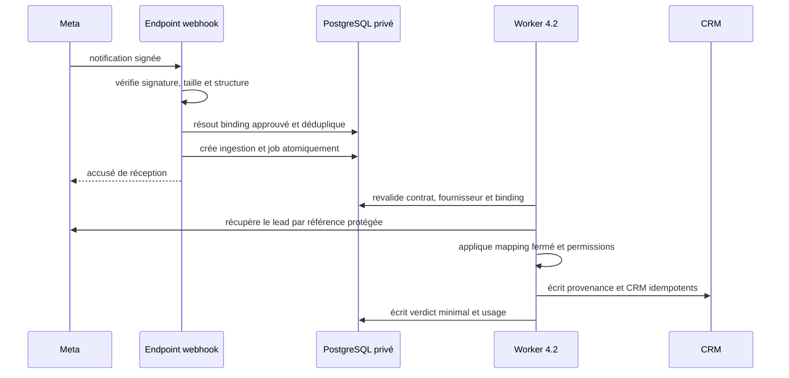

# Phase 4.5 — Fournisseurs et connecteur pilote

| Métadonnée | Valeur |
| --- | --- |
| Produit | Marketteo CRM |
| Lot | 4.5 — Fournisseurs et connecteur pilote |
| Version | 0.2 — décisions produit validées |
| Statut | Décisions P4.5-01 à P4.5-08 validées ; GO d’implémentation distinct requis ; aucun appel Meta, jeton ni webhook réel n’est autorisé par ce document seul |
| Date | 24 septembre 2026 (UTC) |
| Contrat parent | [PHASE_4_SPECIFICATIONS_DETAILLEES.md](PHASE_4_SPECIFICATIONS_DETAILLEES.md), section 8 et décisions P4-05/P4-07 |
| Prérequis | Fondations de conformité 2.5, worker 4.2, exports/imports 4.3 et registre d’usage 4.4 ; recette fonctionnelle globale au lot 4.6 |

## 1. Résultat attendu et frontière

Le lot 4.5 rend le registre des fournisseurs exécutoire pour un premier connecteur. Il ajoute un contrat de connexion par organisation, une revue préalable traçable et un pilote **Meta Lead Ads** capable de recevoir une notification autorisée, de récupérer le lead dans un travail asynchrone et de créer les données CRM admissibles avec leur provenance et leur permission de contact.

Le pilote ne démarre pour une organisation que si, au moment du traitement, toutes les portes suivantes sont vertes :

1. le fournisseur Facebook est **active**, attesté, dans sa période contractuelle et autorise la finalité, le territoire et les catégories concernées ;
2. le contrat de connexion Meta est approuvé, non expiré et son binding est actif ;
3. les revues internes sécurité, confidentialité et produit sont clôturées ;
4. l’application Meta possède les accès approuvés et le compte autorisé accède à la Page et au formulaire déclarés ;
5. les secrets nécessaires sont présents et non révoqués.

Le statut approuvé d’un fournisseur ou d’une acquisition ne remplace jamais les autres contrôles. Toute absence, expiration ou incohérence bloque avant lecture du lead. Les données CRM déjà créées restent soumises à leurs règles de conservation.

Sont hors périmètre : activation large, autre fournisseur, scraping, intégration indirecte, synchronisation rétroactive massive, campagne publicitaire, écriture vers Meta, envoi automatique, enrichissement, appariement probabiliste, choix libre de champs ou permissions, stockage du JSON brut du webhook et conservation d’un jeton dans PostgreSQL. La recette utilisateur complète reste au lot 4.6.

## 2. État du socle et écarts à fermer

Le domaine possède **source_providers**, **acquisition_records**, **provenance_records** et **contact_permissions**. Le fournisseur porte termes, durée, territoire, finalité, catégories, attestation et état. La règle existante de quarantaine bloque une provenance dont le fournisseur est inactif, non attesté, hors période, hors territoire, hors finalité ou hors catégorie. Les exports 4.3 réévaluent la source à l’exécution.

Le socle ne décrit pas encore un accès API. Il manque le contrat de connecteur, sa revue, les ressources Meta liées, les références de secret, l’idempotence d’un événement entrant, la récupération par worker et son verdict. Le worker 4.2 possède la file durable, mais son registre fermé ne contient pas de travail Meta. Le registre d’usage 4.4 doit recevoir des codes Meta sans contenu source.

Le lot complète ces éléments sans modifier leur sens : le fournisseur porte le droit de collecter ; le contrat de connecteur porte le droit de faire fonctionner cette intégration ; l’acquisition, la provenance et la permission sont créées ou reliées pour chaque lead importé.

## 3. Contrat fournisseur et revue préalable

### 3.1 États fermés

| État | Sens | Traitement entrant |
| --- | --- | --- |
| **draft** | Configuration incomplète ou non soumise. | Refusé. |
| **pending_review** | Dossier soumis à la revue interne. | Refusé. |
| **approved** | Dossier complet et pilote autorisé. | Admissible sous réserve des contrôles à l’exécution. |
| **suspended** | Arrêt temporaire par incident, échéance ou contrôle. | Refusé. |
| **revoked** | Autorisation retirée définitivement. | Refusé, secrets révoqués. |
| **expired** | Fin de validité constatée par le système. | Refusé ; nouvelle revue requise. |

Les seules transitions sont **draft → pending_review**, **pending_review → approved|draft**, **approved → suspended|revoked|expired**, **suspended → approved|revoked|expired** et **expired → draft**. Un auteur ne peut pas approuver son propre dossier. Chaque transition impose version optimiste, motif codifié et audit minimisé.

### 3.2 Dossier contrôlé

| Élément | Valeur persistée | Contrôle |
| --- | --- | --- |
| Connecteur | Code fermé **meta_lead_ads** | Aucun code libre. |
| Fournisseur | Référence à un fournisseur Facebook | Même organisation et fournisseur **active**. |
| Contrat | Référence de termes, période, territoire, finalité, catégories | Ne peut pas élargir le fournisseur. |
| Revue interne | Référence de preuve, décideur, date, échéance, motif | Les volets sécurité, confidentialité et produit doivent être approuvés. |
| Revue Meta | Référence de l’application, état, permissions demandées/accordées, dernière vérification | Aucun accès non prouvé n’est supposé accordé. |
| Ressources pilote | Références opaques de Page et formulaire, territoire, acquisition | Une paire ne peut appartenir à deux bindings actifs. |
| Secrets | Seulement référence, type, validité et statut | Jamais la valeur secrète dans la base, l’audit ou le navigateur. |

Les identifiants de Page, formulaire et lead sont des données contrôlées. Ils ne sont jamais publics, journalisés librement ou inclus dans un export. L’audit emploie des identifiants internes et des empreintes HMAC, avec clé distincte des secrets Meta.

### 3.3 Revue externe Meta

Le contrat ne code pas une liste de permissions présumée stable. Avant chaque soumission et activation, le dossier est vérifié contre la documentation Meta alors publiée ; il conserve le manifeste réellement soumis, le verdict et la date de vérification.

La documentation Meta indique que la permission **leads_retrieval** couvre la lecture des informations collectées par un formulaire Lead Ads et peut servir à un CRM autorisé par l’annonceur. Meta indique également que les webhooks respectent les permissions et accès accordés à l’application. Ces sources justifient la porte externe sans remplacer le contrat client ou la revue interne.

Références à revalider : [permissions Meta](https://developers.facebook.com/docs/permissions/reference), [webhooks Meta](https://developers.facebook.com/docs/graph-api/webhooks/) et [niveaux d’accès](https://developers.facebook.com/docs/graph-api/overview/access-levels/).

## 4. Modèle de données et isolation

### 4.1 Ressources nouvelles

La migration 4.5 crée les ressources tenant-scopées suivantes. Elles portent toutes organisation, dates UTC, version optimiste, RLS activée et forcée, et des clés étrangères composites tenant-scopées.

| Table | Finalité | Données principales | Exclusions |
| --- | --- | --- | --- |
| **provider_connector_contracts** | Autoriser le connecteur par fournisseur et organisation. | fournisseur, code, état, contraintes figées, preuves, revue, expiration, décideurs. | Jetons, secrets, URL libre. |
| **provider_connector_bindings** | Lier Page et formulaire à un contrat et une acquisition. | références Meta protégées, empreintes, acquisition, état, dernière vérification. | Nom de lead et payload. |
| **connector_ingestions** | Registre d’un événement et de sa récupération. | binding, empreinte du lead, référence chiffrée, état, travail, tentatives, codes et dates. | JSON webhook, nom, courriel, téléphone, réponse libre. |
| **connector_ingestion_outcomes** | Verdict CRM idempotent. | ingestion, prospect/contact/provenance/permission internes, résultat codifié. | Valeurs importées et erreur amont brute. |

La référence de lead est chiffrée avec une clé gérée hors base. Une empreinte HMAC non réversible garantit l’unicité. Seul le worker, après revalidation, peut déchiffrer cette référence pour lire le lead. Le travail ne porte que l’identifiant d’ingestion. L’unicité organisation, binding et empreinte garantit un registre et un résultat par lead.

Le binding est rattaché à une acquisition approuvée créée lors de la revue. Chaque donnée CRM créée porte la provenance Facebook, le fournisseur et cette acquisition. Une liaison existante ne permet jamais d’importer un lead qui ne passe plus les contrôles du contrat.

### 4.2 Rôles PostgreSQL et RLS

**prospect_app** gère les contrats et bindings de son organisation après vérification de capacité, sans jamais lire un secret. **prospect_worker** reçoit seulement les privilèges nécessaires pour lire un contrat/binding valide, écrire l’ingestion et créer les ressources CRM de l’organisation. **prospect_job_claim_owner** ne lit que l’état minimum du travail, jamais la référence chiffrée ou les tables de conformité. **PUBLIC** ne reçoit aucun privilège.

Une notification n’embarque jamais d’identifiant d’organisation. Le tenant est résolu exclusivement à partir du binding serveur. Les tests prouvent la RLS forcée, l’absence de privilège public, le refus croisé entre organisations et le refus du worker hors contexte tenant.

## 5. Parcours du pilote Meta Lead Ads

### 5.1 Préparation et activation

1. Un Admin disposant de **providers:manage** prépare fournisseur, contrat et binding en brouillon.
2. Les références de secret sont provisionnées hors application puis vérifiées, jamais saisies ou affichées dans le navigateur.
3. Une personne soumet le dossier ; un approbateur distinct vérifie le dossier interne, le verdict Meta et les accès aux ressources.
4. Le contrat devient **approved**. Le binding devient **active** seulement si l’acquisition est **approved**.
5. Toute modification de Page, formulaire, finalité, territoire, catégories ou permissions ramène le binding au brouillon et suspend l’ingestion jusqu’à nouvelle revue.

Le pilote accepte au plus **un binding actif dans une seule organisation explicitement désignée**. D’autres dossiers peuvent être préparés mais ne déclenchent aucun appel Meta. Ce plafond est une mesure de sûreté du pilote, pas une limite commerciale.

### 5.2 Réception, file et traitement

Le GET de vérification répond au challenge seulement si le secret de vérification hors base est valide et le service Meta global autorisé. Le POST limite la taille du corps, vérifie la signature de la requête entière avec comparaison constante, valide la structure minimale, résout le binding à partir des seules références Meta et insère ingestion et travail dans la même transaction.

Une requête invalide, non signée, ambiguë, hors binding ou reçue après suspension ne crée aucune donnée CRM. Le type de travail fermé est **meta_lead_ads_ingest:1**, sujet **connector_ingestion**. Il réutilise les trois tentatives, bail et reprise 4.2. Les erreurs temporaires donnent une attente croissante bornée ; les erreurs de contrat, autorisation, mapping ou permission sont finales et suspendent le binding lorsqu’elles révèlent une incohérence systémique.

### 5.3 Fraîcheur et idempotence

La signature prouve l’émetteur, pas l’unicité. L’unicité utilise le lead et le binding, jamais l’heure de réception. L’horodatage fournisseur sert à la traçabilité et à une garde de fraîcheur de 24 heures : absent ou excessivement futur, il est rejeté. Dix notifications du même lead créent au plus une ingestion et un résultat CRM.

Le worker reprend l’ingestion après panne. Avant chaque appel Meta et avant chaque écriture CRM, il revérifie fournisseur, contrat, binding, acquisition, accès et révocation. Un arrêt entre création CRM et verdict est résolu par la clé idempotente de l’ingestion : il ne peut créer ni deuxième prospect, ni deuxième contact, ni deuxième permission.

## 6. Mapping, provenance et permission

Le mapping V1 est fermé par binding : **full_name**, **email** et **phone**, chacun facultatif. Réponses personnalisées, commentaires, adresses, pièces jointes, identifiants de profil, texte de campagne et tout champ inconnu sont ignorés, sans stockage, même en quarantaine.

| Champ Meta | Cible CRM | Condition |
| --- | --- | --- |
| Nom complet | Contact.display_name | Valeur structurée non vide et provenance liée. |
| Courriel | Canal email | Format valide et permission explicitement déclarée. |
| Téléphone | Canal phone | Normalisation existante et permission explicitement déclarée. |

Le binding déclare le fondement et l’état de permission pour chaque canal. En V1, un canal sans déclaration explicite reçoit **unknown** ou n’est pas créé ; il n’est jamais **allowed** par inférence. Le connecteur n’envoie aucun message et ne rend jamais moins restrictive une permission existante, notamment **opted_out**.

Les catégories admises sont seulement identité, courriel et téléphone, si le fournisseur et l’acquisition les autorisent. Les exports 4.3 conservent leurs propres règles : l’arrivée d’un lead Meta ne rend aucune donnée exportable par défaut.

## 7. API, interface et capacités

Les routes de gestion sont authentifiées, tenant-scopées, protégées CSRF sur mutation et répondent toujours avec **Cache-Control: no-store**. Elles ne retournent ni référence de secret, ni identifiant Meta brut, ni empreinte de lead, ni contenu reçu.

| Route | Comportement | Capacité |
| --- | --- | --- |
| GET /api/provider-connectors | Liste minimale des contrats. | providers:read |
| POST /api/provider-connectors | Crée un contrat draft. | providers:manage |
| GET /api/provider-connectors/{id} | Détail minimisé. | providers:read |
| PATCH /api/provider-connectors/{id} | Modifie un brouillon avec version. | providers:manage |
| POST /api/provider-connectors/{id}/submit-review | Fige la version soumise. | providers:manage |
| POST /api/provider-connectors/{id}/review | Approuve, renvoie en brouillon, suspend ou révoque. | providers:review |
| GET /api/provider-connectors/{id}/ingestions | Historique paginé d’états et codes. | providers:read |
| POST /api/provider-connectors/{id}/bindings/{binding_id}/disable | Coupe le binding et demande la révocation. | providers:manage |
| POST /webhooks/meta/leadgen | Endpoint externe signé, sans session ni CSRF. | Signature Meta et service global autorisé |

**providers:review** est une nouvelle capacité distincte de **providers:manage**. Elle est attribuée seulement aux Admins désignés. Le serveur contrôle toujours les capacités, même si l’interface masque une action. Les routes webhook ne révèlent ni l’organisation ni l’état détaillé d’un contrat.

L’interface « Fournisseurs et connexions » montre état, dates, ressources masquées, dernière vérification, erreurs codifiées et arrêt. Elle explique que simulation et statut technique ne valent pas autorisation Meta. Elle est disponible en fr-CA et en-CA, utilisable au clavier et à 200 %, sans stockage navigateur de référence ni secret.

## 8. Audit, usage, conservation et arrêt

Les audits couvrent création, soumission, approbation, suspension, révocation, activation du binding, réception, succès, quarantaine, échec et demande de rejeu. Ils contiennent organisation, acteur ou origine système, identifiants internes, transition, codes, volumes et dates. Ils excluent secrets, identifiants Meta bruts, identité, canaux, réponses de formulaire, corps HTTP et erreur fournisseur brute.

Le registre 4.4 reçoit les codes tenant-scopés suivants :

| Code | Moment compté | Exclusion |
| --- | --- | --- |
| meta_lead_ads.webhook_accepted | Admission idempotente. | Corps et référence Meta. |
| meta_lead_ads.fetch_attempted | Appel Meta imminent. | URL, jeton et lead. |
| meta_lead_ads.imported | Verdict CRM créé. | Champs CRM et contenu Meta. |
| meta_lead_ads.quarantined | Mapping ou permission insuffisant. | Valeur à l’origine du code. |
| meta_lead_ads.failed | Récupération finale échouée. | Réponse fournisseur. |

Ces mesures sont opérationnelles et non facturantes. Ingestion, référence chiffrée et résultat minimal sont conservés 30 jours après finalisation ; les agrégats suivent 4.4. La purge est bornée, respecte les suspensions applicables et détruit la référence chiffrée. Aucun payload n’est conservé pour permettre un rejeu tardif.

L’arrêt d’urgence existe par binding et par contrat. Il bloque admission et worker, annule les travaux non démarrés, marque le verdict **authorization_revoked**, demande la révocation du secret et audite le résultat sans valeur sensible. Une reprise exige une nouvelle revue ; un redémarrage ne réactive rien.

## 9. Validation et scénarios d’acceptation

| ID | Scénario | Résultat exigé |
| --- | --- | --- |
| CON-01 | Contrat sans fournisseur actif, attestation, preuve ou période valable. | Il reste brouillon ou la soumission est refusée ; aucun binding actif. |
| CON-02 | Auteur tente son approbation, puis approbateur sans preuve Meta complète. | Refus dans les deux cas. |
| CON-03 | Deux organisations configurent le même formulaire. | Un seul binding pilote actif ; aucun routage vers le mauvais tenant. |
| CON-04 | Vérification valide, puis signature POST absente, invalide, tronquée ou corps modifié. | Challenge seulement valide ; aucun job, ingestion ni fuite pour le POST rejeté. |
| CON-05 | Même lead notifié dix fois et worker interrompu. | Une ingestion, un résultat CRM au plus. |
| CON-06 | Contrat révoqué après admission mais avant fetch, puis pendant mapping. | Aucun appel ou effet restant ; verdict terminal codifié. |
| CON-07 | Payload avec courriel, téléphone, réponse personnalisée et commentaire. | Seuls les champs admissibles atteignent le CRM ; contenu exclu absent de DB, audit, usage et logs. |
| CON-08 | Téléphone sans permission déclarée ; permission existante opted_out. | Pas de passage à allowed ni dégradation du choix. |
| CON-09 | Métadonnée temporairement indisponible, puis erreur d’autorisation ou mapping. | Reprise bornée seulement pour le transitoire ; échec final et suspension si incohérence. |
| CON-10 | Commercial, Gestionnaire et Admin tentent lecture, mutation, revue, rejeu et UUID d’un autre tenant. | Capacités exactes et 404 indistinct entre tenants. |
| CON-11 | Arrêt d’urgence durant travaux en attente, puis redémarrage. | Aucun nouveau fetch ; admission bloquée jusqu’à nouvelle approbation. |
| CON-12 | Ingestions de plus de 30 jours et agrégats 4.4 conservés. | Référence chiffrée purgée ; aucun payload ; agrégats conservés selon 4.4. |
| CON-13 | Interface fr-CA/en-CA, clavier et zoom 200 %. | États, erreurs et arrêt accessibles. |

Le verrou de l’incrément couvre Alembic, tests unitaires et intégration PostgreSQL réelle, RLS application et worker, signature, idempotence concurrente, interruptions de transaction, absence de secrets/payload dans les sorties, purge, audit, usage, API et interface. Il exécute Ruff, format, mypy, audit npm, ESLint, Vitest, build et contrôle du diff sans skip. Une simulation webhook ne suffit pas à déclarer le pilote externe livré : le rapport distingue verrou technique, revue Meta et essai sur environnement autorisé.

## 10. Plan d’implémentation

1. Ajouter capacités, registre de connecteurs fermé, types de domaine et transitions.
2. Migrer contrats, bindings, ingestions et résultats avec RLS, privilèges worker et contraintes d’unicité.
3. Ajouter l’adaptateur de gestion des secrets et la validation de démarrage.
4. Exposer cas d’usage, routes et interface de gestion/revue.
5. Implémenter vérification webhook, admission atomique et travail Meta.
6. Ajouter passerelle Meta isolée, mapping fermé, provenance, permissions et résultats idempotents.
7. Étendre usage, audit, alertes, purge et arrêt d’urgence.
8. Exécuter le verrou qualité, puis configurer seulement l’environnement de test Meta autorisé. La recette globale est reprise en 4.6.

## 11. Décisions validées par le responsable produit

| ID | Décision proposée | Effet |
| --- | --- | --- |
| P4.5-01 | Conserver le fournisseur comme source de vérité des droits et ajouter un contrat distinct Meta avec les états fermés de la section 3.1. | Aucun statut fournisseur ne déclenche seul un connecteur. |
| P4.5-02 | Exiger revue interne sécurité, confidentialité et produit, puis preuve Meta des permissions accordées avant binding actif ou appel amont. | Le pilote reste fermé si le dossier est incomplet. |
| P4.5-03 | Limiter le pilote à un binding actif dans une seule organisation explicitement désignée. | Risque opérationnel et tenant bornés. |
| P4.5-04 | Stocker jetons et secrets uniquement dans un gestionnaire de secrets ; PostgreSQL conserve références et statuts. | Rotation et révocation sans fuite dans DB, audit ou client. |
| P4.5-05 | Accepter un webhook après vérification cryptographique, résolution serveur et insertion atomique ingestion/job ; récupérer le lead dans le worker. | Endpoint court, tenant sûr et reprise fiable. |
| P4.5-06 | Adopter le mapping fermé nom, courriel, téléphone ; ignorer les réponses personnalisées et exiger une permission explicite sans contourner opted_out. | Minimisation et respect du choix de contact. |
| P4.5-07 | Conserver référence de lead chiffrée, empreinte HMAC, résultat minimal 30 jours et aucun payload Meta. | Reprise technique sans entrepôt de données source. |
| P4.5-08 | Ajouter compteurs non facturants, audit minimisé, arrêt d’urgence et suspension sur révocation/erreur d’autorisation ; laisser la recette globale à 4.6. | Exploitation explicable et retrait immédiat. |

Le responsable produit a validé explicitement les huit décisions P4.5-01 à P4.5-08 le 24 septembre 2026. Cette validation autorise la préparation du GO d’implémentation 4.5. Elle n’autorise pas la mise en production du pilote Meta : celle-ci reste conditionnée par le verdict réel de Meta, les preuves contractuelles et le verrou qualité.
