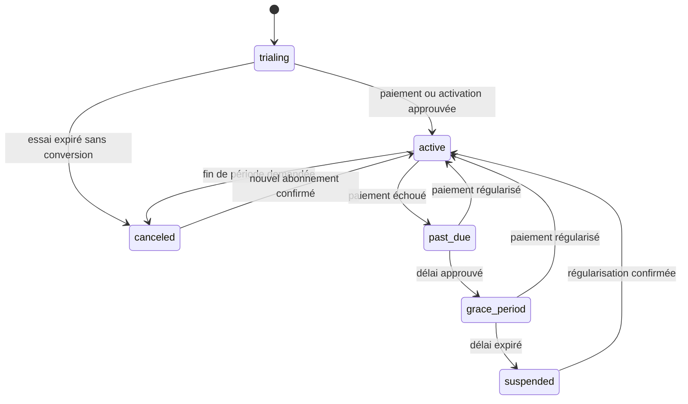

# Phase 5 — Préproduction, abonnements et déploiement progressif

| Métadonnée | Valeur |
| --- | --- |
| Produit | Marketteo CRM |
| Phase | 5 — Préproduction et déploiement |
| Version | 0.1 — proposition détaillée à valider |
| Statut | Cadrage prêt ; développement des artefacts P5.1 autorisé le 4 octobre 2026, activation toujours conditionnée par les preuves Azure et les réserves Porte 4 |
| Date | 30 septembre 2026 (UTC) |
| Prérequis | GO local 4.6, verrou local vert, commit de clôture et pipeline Azure sur la même révision |
| Source de périmètre | [`SPECIFICATION_CRM_V1.md`](SPECIFICATION_CRM_V1.md), Phase 5 et socle transversal d'abonnement |

## 1. Objectif et frontière de phase

La phase 5 transforme le produit validé localement en un service SaaS exploitable par une cohorte limitée
d'organisations. Elle fournit l'environnement de préproduction, le catalogue commercial, le cycle de vie des
abonnements, l'application serveur des droits, les preuves de sécurité et de restauration, les mesures de charge et
de coûts, puis un lancement progressif réversible.

La phase couvre :

1. une préproduction isolée construite depuis un artefact immuable ;
2. la mesure des coûts réels nécessaires aux décisions de prix et de quotas ;
3. les plans Freemium, Starter, Business et Sur mesure ;
4. un abonnement porté par l'organisation, avec sièges et droits calculés côté serveur ;
5. un paiement hébergé, un portail fournisseur et des webhooks signés et idempotents ;
6. les états de paiement, la période de grâce, les changements de plan et l'annulation ;
7. la validation sécurité, juridique, fiscale, bilingue et opérationnelle ;
8. les sauvegardes, restaurations, alertes, procédures et retours arrière ;
9. un lancement limité par cohortes, avec portes de décision explicites.

La phase ne transforme pas Marketteo en logiciel comptable. Elle ne facture pas les clients finaux des organisations,
ne calcule pas leur comptabilité, ne conserve aucune donnée bancaire brute et n'active aucun connecteur fournisseur
sans son autorisation propre.

La [Phase 4.7 — Réserve de stabilisation du socle](PHASE_4_7_RESERVE.md) est volontairement différée. Elle ne modifie
pas les prérequis de la présente phase et ne bloque pas la préparation `P4-Lite` de l'Automatisation ; tout sujet de
réserve devenu critique pour la sécurité ou la production devra toutefois être repris avant activation.

## 2. Constat sur les abonnements et le pricing

La spécification V1 définit déjà le contour du socle commercial : quatre plans, abonnement par organisation, sièges,
droits serveur, états d'abonnement, paiement hébergé, portail, factures du fournisseur et webhooks idempotents. Elle
ne fixe cependant ni les montants, ni les enveloppes de sièges, ni les quotas propres aux plans, ni le fournisseur de
paiement, ni les règles de remise, d'essai, de grâce, de remboursement ou de taxes.

La phase 5 ferme cet écart en séparant trois décisions :

- **modèle commercial** : ce qui est vendu et selon quelle unité ;
- **catalogue technique** : la version immuable des prix, droits, quotas et références fournisseur ;
- **valeurs commerciales** : montants et seuils approuvés après mesure des coûts et validation comptable/juridique.

Les compteurs d'usage de la phase 4 restent des compteurs techniques. Ils ne deviennent pas un registre financier et
ne peuvent pas générer une facture. Une éventuelle facturation à l'usage demandera un futur contrat distinct, un
registre financier opposable et une nouvelle recette.

## 3. Modèle commercial V1 proposé

### 3.1 Unité vendue

La V1 utilise un abonnement fixe par organisation :

- cycle mensuel ou annuel ;
- prix de base correspondant à une enveloppe de sièges actifs ;
- droits fonctionnels et quotas inclus dans le plan ;
- sièges supplémentaires uniquement si une référence de prix serveur les autorise ;
- aucune facturation automatique au dépassement d'un quota technique ;
- dépassement refusé par l'API avec une erreur explicite et une invitation à changer de plan ;
- plan Sur mesure géré par contrat, puis matérialisé par une version de catalogue et des dérogations bornées.

Le montant facturé est toujours obtenu depuis une référence de prix configurée côté serveur. Le client web soumet un
code de plan, un cycle et une version ; il ne soumet jamais un montant, une taxe, une remise ou une référence externe.

### 3.2 Positionnement des plans

| Plan | Public cible | Modèle | Contraintes V1 proposées |
| --- | --- | --- | --- |
| Freemium | Évaluation autonome et très petite organisation | Gratuit, sans carte | CRM manuel et import borné ; aucun appel Google payant par défaut ; sièges et volumes faibles à valider |
| Starter | Petite équipe commerciale | Prix fixe avec enveloppe de sièges | Fonctions CRM essentielles, quotas Google et exports bornés |
| Business | Équipe structurée | Prix fixe supérieur avec enveloppe plus large | Quotas supérieurs, connecteurs approuvés et capacités d'administration étendues |
| Sur mesure | Besoins contractuels | Contrat et référence fournisseur dédiée | Sièges, quotas et options explicitement approuvés ; aucune dérogation implicite |

Les montants, nombres de sièges, quotas Google, volumes d'import/export et options de chaque ligne restent
`À VALIDER`. Ils ne doivent pas être inventés pendant l'implémentation.

### 3.3 Méthode de fixation des prix

Le dossier de décision de chaque plan mesure au minimum :

- coût fixe mensuel alloué : calcul, PostgreSQL, Redis, stockage, sauvegardes, observabilité et courriels ;
- coût variable au percentile 95 : Google, trafic, stockage temporaire, worker et connecteurs ;
- coût attendu de soutien et d'exploitation ;
- frais du fournisseur de paiement et risque de remboursement ou d'impayé ;
- réserve de fraude et de dépassement ;
- marge brute cible approuvée par le responsable produit.

Le prix plancher hors taxes est calculé et documenté ainsi :

```text
prix_plancher = (coûts_fixes_alloués + coûts_variables_P95 + soutien + frais + réserve_risque)
                / (1 - marge_brute_cible)
```

Le dossier conserve les hypothèses, la fenêtre de mesure, la taille de cohorte et une analyse de sensibilité. Les taxes
ne sont jamais absorbées ou ajoutées implicitement : leur présentation et leur perception suivent la configuration
validée chez le fournisseur de paiement.

### 3.4 Devise, remises, essai et remboursement

La devise de lancement, la remise annuelle, la durée d'essai, l'exigence éventuelle d'un moyen de paiement, la période
de grâce et la politique de remboursement sont des décisions commerciales explicites. Chaque valeur est configurée
et versionnée ; aucune n'est codée en dur dans l'interface.

La recommandation V1 est de lancer dans une seule devise commerciale et sans coupon libre créé depuis Marketteo. Les
remises autorisées utilisent des références fournisseur approuvées. Les organisations restent provisionnées par un
administrateur de plateforme ; aucune inscription publique n'est ajoutée par la facturation.

## 4. Séquence d'implémentation

| Lot | Objet | Sortie démontrable |
| --- | --- | --- |
| **5.1 — Préproduction et mesure de référence** | Environnement isolé, artefact immuable, secrets, sauvegarde/restauration, télémétrie coûts | Déploiement reproductible, restauration prouvée et coûts de référence mesurés |
| **5.2 — Catalogue, pricing et droits** | Plans et prix versionnés, sièges, droits, quotas, dérogations contractuelles | Catalogue approuvé et calcul de droits déterministe sans paiement |
| **5.3 — Abonnement et fournisseur de paiement** | Checkout hébergé, portail, webhooks, états, renouvellement, annulation et réconciliation | Cycle de paiement simulé puis autorisé, idempotent et auditable |
| **5.4 — Application des droits et expérience bilingue** | Garde serveur, changement de plan, dépassement, déclassement, écrans Compte et Administration | Aucun contournement par API ; parcours `fr-CA` et `en-CA` accessibles |
| **5.5 — Sécurité, juridique, charge et exploitation** | Revue sécurité, taxes/contrats, charge/coûts, alertes, runbooks, retour arrière | Dossier de préproduction signé, vulnérabilités bloquantes fermées |
| **5.6 — Lancement progressif** | Cohortes, surveillance, arrêt d'urgence et promotion de l'artefact | Production limitée, mesurée et réversible, puis décision d'élargissement |

Un lot ne commence en implémentation qu'après validation de ses décisions et de ses critères d'acceptation. Les travaux
de documentation, d'évaluation fournisseur et de préparation de l'environnement peuvent avancer en parallèle sans
activer un paiement réel.

## 5. Lot 5.1 — Préproduction et mesure de référence

Le contrat détaillé, les écarts de l'environnement existant, les décisions à confirmer et les scénarios de validation
du lot sont définis dans [Phase 5.1 — Préproduction et mesure de référence](./PHASE_5_1_SPECIFICATIONS_DETAILLEES.md).
Les décisions de cadrage 5.1 sont confirmées le 4 octobre 2026 ; elles ne modifient pas les prérequis Azure de la
Phase 5 et ne valent pas un GO de développement.

### 5.1 Environnement

La préproduction possède ses propres :

- compte ou abonnement d'hébergement, réseau et noms DNS ;
- PostgreSQL, Redis, stockage d'artefacts temporaires et gestionnaire de secrets ;
- identités de service à privilèges minimaux ;
- clés de fournisseurs de test ou sandbox ;
- journaux, métriques, alertes et sauvegardes ;
- données synthétiques sans copie de production.

L'API, le worker et le client proviennent du même SHA et du même artefact signé. Le pipeline exécute migrations,
sondes, tests sans skip et inspection de l'artefact avant promotion. Aucun `latest`, montage du dépôt ou construction
manuelle sur le serveur n'est autorisé.

### 5.2 Migration et restauration

- chaque migration est testée sur une reconstruction vide et sur une copie synthétique de la version précédente ;
- la stratégie expand/migrate/contract est obligatoire pour les changements incompatibles ;
- une sauvegarde restaurée dans une base isolée doit produire une application `ready` et des contrôles de cohérence ;
- les objectifs RPO et RTO sont approuvés avant le GO 5.5 et vérifiés par chronométrage ;
- le retour arrière de l'application ne suppose jamais un downgrade destructif de base ;
- les secrets, jetons et fichiers temporaires sont exclus des sauvegardes applicatives ou traités selon leur contrat.

### 5.3 Mesures nécessaires au pricing

Les scénarios Phase 4 sont rejoués avec des profils de charge représentatifs. Les mesures distinguent coût fixe, coût
par organisation, coût par siège actif et coût par opération externe. Les appels Google et fournisseurs payants sont
simulés pour la charge ; un échantillon réel n'est autorisé qu'avec budget, clés et protocole approuvés.

## 6. Lot 5.2 — Catalogue, pricing et droits

### 6.1 Modèle de données

| Table | Responsabilité minimale |
| --- | --- |
| `plan_catalog` | Code stable `freemium`, `starter`, `business`, `custom`, état de publication et ordre d'affichage |
| `plan_versions` | Version immuable, dates d'effet, devise, cycle, montant hors taxes et référence de prix fournisseur opaque |
| `plan_entitlements` | Droit ou limite typée, valeur, unité, portée et version du plan |
| `subscriptions` | Organisation, version de plan, fournisseur, référence externe opaque, état, période, annulation et version optimiste |
| `subscription_overrides` | Dérogation contractuelle bornée, justification, approbateur, début et expiration |
| `billing_event_inbox` | Identifiant fournisseur unique, type, empreinte, état de traitement et dates, sans corps sensible durable |
| `billing_events` | Résultat métier audité d'un événement, entité et références techniques minimales |

Une version de prix publiée est immuable. Une modification crée une nouvelle version et une nouvelle référence
fournisseur. Une organisation existante conserve sa version jusqu'à une migration explicite, un renouvellement prévu
ou un changement accepté. L'historique ne dépend jamais du libellé traduit affiché.

### 6.2 Calcul des droits effectifs

Le droit effectif est l'intersection de quatre couches :

```text
capacité_du_rôle
∩ droit_du_plan
∩ dérogation_contractuelle_valide
∩ limite_de_sécurité_de_l'exploitant
```

Une dérogation peut augmenter ou réduire une valeur dans les bornes de sécurité, porte une échéance et est auditée.
La panne du catalogue ou l'impossibilité de déterminer l'abonnement ferme les opérations payantes et coûteuses. Les
lectures CRM nécessaires à la récupération des données restent disponibles selon la politique de suspension.

### 6.3 Sièges

- un membre actif consomme un siège ;
- une invitation non expirée réserve un siège pour empêcher la surallocation ;
- l'acceptation revalide atomiquement la disponibilité ;
- un administrateur ne peut pas auto-désactiver le dernier administrateur pour libérer un siège ;
- aucun membre n'est désactivé automatiquement lors d'un déclassement ;
- un déclassement sous l'usage courant doit d'abord réduire les sièges ou passer par une décision de soutien tracée.

## 7. Lot 5.3 — Abonnement et fournisseur de paiement

### 7.1 Critères de sélection du fournisseur

Le fournisseur est sélectionné après comparaison documentée de :

- prise en charge de l'entité vendeuse et des devises approuvées ;
- checkout et portail hébergés accessibles en français et en anglais ;
- abonnements mensuels/annuels, sièges, essais, prorata, annulation et remboursement ;
- taxes canadiennes, factures légales et rapports comptables requis ;
- webhooks signés, rejeu, ordre des événements et API de réconciliation ;
- résidence, sous-traitants, clauses contractuelles, export et suppression des données ;
- modes sandbox, observabilité, limites, disponibilité et procédure d'incident ;
- coûts fixes et variables intégrés au modèle de marge.

La sélection du fournisseur et la configuration fiscale exigent une validation comptable et juridique. La
spécification technique ne constitue pas un avis fiscal.

### 7.2 Cycle de vie



Les événements du navigateur ne changent jamais l'état d'abonnement. Seul un webhook vérifié ou une réconciliation
serveur autorisée produit la transition. Les événements dupliqués sont sans effet ; les événements retardés ne
régressent pas une période plus récente.

### 7.3 Paiement hébergé et portail

- le checkout est créé côté serveur depuis une version de prix publiée ;
- l'URL de retour ne vaut jamais confirmation de paiement ;
- les URL de checkout et de portail sont courtes, opaques, à usage limité et ne sont pas journalisées ;
- Marketteo ne reçoit ni numéro de carte, ni cryptogramme, ni donnée bancaire brute ;
- les factures affichées sont des liens ou références du fournisseur, jamais des factures reconstruites localement ;
- toute action sensible exige la capacité `billing:manage` et une session récente selon le contrat de sécurité.

### 7.4 Webhooks et réconciliation

- signature vérifiée sur le corps brut avant désérialisation métier ;
- taille, type de contenu, horodatage et tolérance de rejeu bornés ;
- identifiant fournisseur unique stocké avant effet métier ;
- accusé de réception seulement après admission durable ;
- traitement asynchrone idempotent avec tentatives bornées et file d'échec visible ;
- transaction atomique pour abonnement, droits dérivés et audit ;
- tâche de réconciliation périodique comparant les états locaux et fournisseur sans écraser silencieusement un conflit ;
- aucune donnée bancaire, URL de portail ou charge brute dans les journaux et audits.

## 8. Lot 5.4 — Application des droits et expérience

### 8.1 API

| Méthode et route | Contrat |
| --- | --- |
| `GET /api/billing/plans` | Plans publiés et localisés, prix serveur, cycles et droits résumés ; aucune référence fournisseur |
| `GET /api/billing/subscription` | Plan/version, état, période, sièges utilisés/autorisés, changement planifié et capacités de gestion |
| `POST /api/billing/checkout-session` | Plan, version et cycle approuvés avec clé d'idempotence ; retourne seulement une URL opaque |
| `POST /api/billing/portal-session` | Crée une session de portail opaque pour un administrateur autorisé |
| `POST /api/billing/webhooks/{provider}` | Route publique signée, sans cookie ni CSRF, avec admission durable idempotente |
| `POST /api/platform/organizations/{id}/subscription-overrides` | Dérogation contractuelle réservée à la plateforme, versionnée, justifiée et expirante |

Les réponses portent `Cache-Control: no-store`. Les mutations utilisateur utilisent CSRF, version optimiste et clés
d'idempotence. Les erreurs distinguent plan indisponible, prix périmé, siège insuffisant, paiement en attente,
abonnement suspendu et fournisseur temporairement indisponible sans révéler de référence externe.

### 8.2 Changements de plan

- une montée en gamme s'applique seulement après confirmation fournisseur ;
- un déclassement s'applique à la période suivante et ne supprime aucune donnée ;
- un déclassement incompatible avec les sièges actifs ou une fonction utilisée n'est pas programmé sans résolution ;
- l'annulation conserve l'accès jusqu'à la date confirmée, puis applique la politique `canceled` ;
- une suspension bloque les nouvelles opérations coûteuses et mutations commerciales définies par le plan ;
- les écrans de compte, le portail de paiement et les moyens de récupération/export autorisés restent accessibles ;
- une réactivation relit l'état fournisseur et recalcule les droits, sans réutiliser un état client périmé.

### 8.3 Interface

L'écran Compte affiche : plan courant, cycle, état compréhensible, prochaine échéance, sièges, consommation technique,
changement planifié et accès au portail. L'écran Administration explique les limites effectives sans confondre quota
technique et montant facturé. Toutes les vues, erreurs, courriels et retours fournisseur sont disponibles en `fr-CA`
et `en-CA`, utilisables au clavier, à 200 % et à partir de 320 px.

## 9. Lot 5.5 — Sécurité, juridique, charge et exploitation

### 9.1 Sécurité et conformité

- modèle de menace couvrant compte, organisation, fournisseur, webhook, portail, soutien et administrateur plateforme ;
- revue des privilèges PostgreSQL/RLS des nouvelles tables ;
- rotation des secrets et simulation d'une signature webhook compromise ;
- analyse des dépendances, images, configuration TLS, en-têtes, CSP et exposition réseau ;
- tests de rejeu, falsification de prix, accès inter-tenant, élévation de rôle et concurrence ;
- preuve d'absence de données bancaires dans schéma, journaux, audits, erreurs, sauvegardes et exports ;
- conditions d'abonnement, confidentialité, politique de remboursement et communications bilingues validées ;
- marque et domaines publics validés avant exposition commerciale.

### 9.2 Charge, coûts et SLO

Les objectifs de charge sont approuvés à partir de la cohorte de lancement. Les tests couvrent connexions, lecture du
pipeline, mutations CRM, worker, imports/exports, quotas, checkout simulé, webhooks et réconciliation. Le rapport
publie débit, latences P50/P95/P99, erreurs, files, saturation, coût par profil et marge projetée par plan.

Aucun seuil n'est déclaré conforme après une seule moyenne. Les pics, erreurs fournisseur, Redis/PostgreSQL
indisponibles et redémarrages sont exercés. Les seuils finaux deviennent des SLO et alertes versionnés avant le GO.

### 9.3 Exploitation

- tableaux de bord santé, disponibilité, erreurs, jobs, webhooks, abonnements, coûts et sauvegardes ;
- alertes avec propriétaire, sévérité, délai d'accusé et procédure ;
- runbooks de déploiement, migration, restauration, fournisseur de paiement, quota, webhook et incident sécurité ;
- arrêt d'urgence des checkouts et webhooks sortants sans bloquer la lecture CRM ;
- support capable d'expliquer un droit effectif sans modifier directement la base ;
- journal de décision pour les corrections d'abonnement et dérogations.

## 10. Lot 5.6 — Lancement progressif

Le lancement suit des cohortes explicitement approuvées : équipe interne, organisations pilotes, puis élargissement
borné. Chaque promotion utilise le même artefact validé et possède une fenêtre d'observation, des critères d'arrêt et
un responsable.

Une cohorte n'est élargie que si :

- les SLO, coûts et marges restent dans les bornes approuvées ;
- les sauvegardes et restaurations sont à jour ;
- aucun incident sécurité, fiscal ou de facturation bloquant n'est ouvert ;
- les erreurs de paiement, webhooks et soutien sont comprises ;
- la capacité de retour arrière a été conservée ;
- les quotas et plans observés correspondent au catalogue publié.

## 11. Scénarios d'acceptation minimaux

| Référence | Priorité | Scénario | Résultat attendu |
| --- | --- | --- | --- |
| `PRE-01` | P0 | Déployer le même artefact en préproduction et reconstruire la base | SHA, migrations, sondes et artefact concordent |
| `PRE-02` | P0 | Restaurer une sauvegarde dans une base isolée | Restauration cohérente, chronométrée et application prête |
| `PRICE-01` | P0 | Publier deux versions d'un plan | La première reste immuable et les abonnés existants conservent leur version |
| `PRICE-02` | P0 | Falsifier montant, devise ou référence externe depuis le client | Requête refusée ; aucun checkout ni événement métier |
| `SEAT-01` | P0 | Inviter et accepter concurremment au dernier siège | Une seule admission, aucune surallocation |
| `BILL-01` | P0 | Créer deux fois le même checkout idempotent | Une seule intention fournisseur et une seule trace métier |
| `BILL-02` | P0 | Recevoir deux fois le même webhook signé | Un seul effet, un seul audit métier |
| `BILL-03` | P0 | Recevoir un webhook falsifié, trop ancien ou hors ordre | Refus ou réconciliation sans régression d'état |
| `BILL-04` | P0 | Paiement échoué, grâce expirée, puis régularisation | Transitions et droits conformes, aucune donnée supprimée |
| `BILL-05` | P0 | Déclasser avec trop de sièges actifs | Déclassement non appliqué, action corrective explicite |
| `ENT-01` | P0 | Appeler directement une API non incluse dans le plan | Refus serveur même si l'interface est contournée |
| `ENT-02` | P0 | Redis ou catalogue indisponible pendant une opération coûteuse | Fermeture contrôlée sans appel fournisseur facturable |
| `TENANT-01` | P0 | Utiliser une référence d'abonnement d'une autre organisation | Refus indistinguable et aucune fuite |
| `SEC5-01` | P0 | Inspecter schéma, journaux, audits et sauvegarde | Aucune donnée bancaire brute, URL de portail ou payload sensible |
| `LOAD-01` | P0 | Exécuter le profil de charge de lancement | SLO, coûts et files dans les bornes approuvées |
| `ROLLBACK-01` | P0 | Interrompre une promotion et restaurer l'ancienne application | Service restauré sans downgrade destructif ni double effet |
| `A11Y5-01` | P1 | Parcourir compte, plans, checkout et erreurs en deux langues | Clavier, focus, zoom 200 %, axe et textes bilingues conformes |

Chaque scénario P0 possède une preuve automatisée ou une fiche manuelle reproductible. PostgreSQL, Redis et le faux
fournisseur de paiement sont réels ou déterministes selon le scénario. Aucun test critique n'est ignoré faute de
configuration.

## 12. Verrous de qualité et preuves

Chaque lot conserve les barrières Phase 4 et ajoute :

- migration reconstruite et `alembic check` ;
- tests RLS et concurrence des sièges/abonnements sur PostgreSQL réel ;
- webhooks signés, dupliqués, retardés et rejoués ;
- inspection automatique interdisant les données bancaires ;
- contrats API et fournisseur simulé déterministe ;
- tests frontend, axe, clavier et bilinguisme ;
- audit des dépendances et images sans vulnérabilité critique ou élevée ouverte ;
- rapport de charge, coût, sauvegarde/restauration et retour arrière ;
- pipeline préproduction sur le même SHA que l'artefact promu.

Le dossier de preuves contient le manifeste, les JUnit, les rapports de sécurité et accessibilité, les mesures de coût,
la restauration chronométrée, le catalogue approuvé, les décisions fiscales/juridiques et les liens de déploiement.

## 13. Décisions proposées à valider

| ID | Proposition | Paramètre restant |
| --- | --- | --- |
| `P5-01` | Découper la phase en lots 5.1 à 5.6 dans l'ordre défini | Validation de la séquence |
| `P5-02` | Utiliser un abonnement fixe par organisation avec enveloppe de sièges | Validation du modèle commercial |
| `P5-03` | Exclure la facturation à l'usage et les dépassements automatiques de la V1 | Validation produit |
| `P5-04` | Conserver Freemium, Starter, Business et Sur mesure | Montants, sièges et droits de chaque plan |
| `P5-05` | Garder le Freemium sans appel Google payant par défaut | Quotas gratuits exacts |
| `P5-06` | Versionner prix et droits ; aucune modification d'une version publiée | Politique de migration des anciens prix |
| `P5-07` | Lancer dans une seule devise commerciale | Devise choisie |
| `P5-08` | Utiliser checkout, portail, factures et taxes hébergés | Fournisseur de paiement et configuration fiscale |
| `P5-09` | Provisionnement d'organisation réservé à la plateforme, sans inscription publique | Validation du parcours commercial |
| `P5-10` | Compter membres actifs et invitations valides dans l'enveloppe de sièges | Quantités par plan |
| `P5-11` | Appliquer les déclassements à la période suivante sans suppression de données | Fonctions autorisées après suspension |
| `P5-12` | Fermer les opérations coûteuses si les droits ne peuvent pas être calculés | Liste exacte des opérations coûteuses |
| `P5-13` | Exiger validation comptable et juridique des taxes, factures, remboursements et conditions | Responsables et échéances |
| `P5-14` | Fixer les prix avec coûts P95, soutien, frais, risque et marge cible | Marge et hypothèses approuvées |
| `P5-15` | Lancer par cohortes avec arrêt d'urgence et retour arrière | Taille des cohortes et fenêtre d'observation |
| `P5-16` | Bloquer la production sans restauration, sécurité, charge/coûts et pipeline vert | RPO, RTO et SLO finaux |

Le GO d'implémentation d'un lot valide ses décisions propres. L'approbation de ce document ne vaut pas approbation
des montants, du fournisseur, des taxes ou des conditions commerciales tant que leurs paramètres restent ouverts.

## 14. Portes de sortie de la phase 5

La V1 peut recevoir un GO de production limité lorsque :

- le pipeline Azure du commit 4.6 et les lots 5.1 à 5.6 sont verts sur des artefacts identifiés ;
- le catalogue publié correspond aux prix et droits approuvés ;
- le fournisseur de paiement, les taxes et les documents contractuels sont validés ;
- les webhooks, changements de plan, sièges, suspensions et annulations sont idempotents et audités ;
- aucun droit commercial n'est appliqué uniquement par l'interface ;
- aucune donnée bancaire brute n'existe dans Marketteo ;
- les restaurations, SLO, alertes, coûts et retours arrière sont prouvés ;
- les parcours critiques sont conformes en français, en anglais, au clavier et à 200 % ;
- aucune vulnérabilité critique ou élevée ni anomalie P0/P1 bloquante n'est ouverte ;
- la cohorte, les responsables, les critères d'arrêt et le soutien sont prêts.

Le GO initial autorise seulement la cohorte approuvée. Toute extension de pays, devise, fournisseur, tarification à
l'usage, inscription publique ou connecteur réel supplémentaire exige une décision et une recette distinctes.
