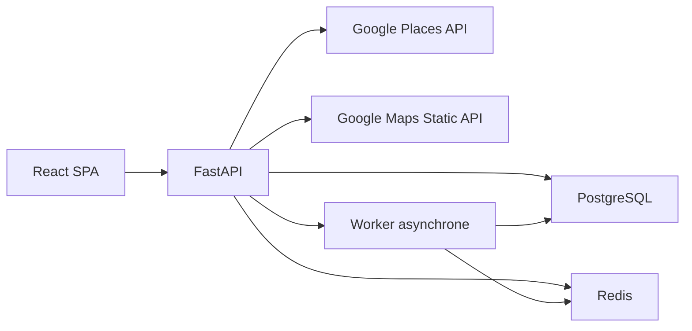

# Spécification fonctionnelle et technique — Prospect CRM V1

| Métadonnée | Valeur |
| --- | --- |
| Produit | Prospect CRM |
| Version du document | 1.2 |
| Statut | Périmètre V1 et spécification détaillée de la phase 2 validés |
| Date | 22 juillet 2026 |
| Marché initial | Canada |
| Langue initiale | Français canadien (`fr-CA`) |
| Compte de facturation Google | Canada, hors Espace économique européen |

## 1. Objet du document

Ce document définit la migration de l’application actuelle de génération de leads vers un petit CRM/ERP de gestion des prospects. Il constitue la référence fonctionnelle et technique pour la conception, l’implémentation, les tests d’acceptation et la préparation au déploiement de la V1.

La V1 doit apporter une valeur commerciale indépendante de Google Maps : organisation du travail, qualification, suivi, rappels, historique, opportunités et pilotage. Google Maps Platform reste un service de consultation ponctuelle et dynamique des établissements.

Ce document ne constitue pas un avis juridique. La conformité finale dépendra des conditions Google applicables au moment du déploiement, des contrats conclus avec les autres fournisseurs de données et des lois applicables à l’organisation cliente.

## 2. Décisions produit validées

1. Le produit devient **Prospect CRM** et n’est plus présenté comme un générateur ou un extracteur de leads.
2. La route d’export des données Google Places est supprimée ; pendant la migration, le bouton reste visible mais désactivé et inaccessible.
3. La recherche Google reste disponible, mais elle est limitée, explicite et sans pagination automatique.
4. Une recherche retourne au maximum 20 établissements.
5. Les résultats Google sont affichés temporairement et ne sont pas persistés dans la base CRM.
6. Le téléphone et le site Web Google sont récupérés uniquement à l’ouverture d’une fiche ou sur une action explicite.
7. Le seul champ Google conservé durablement pour un prospect est le `place_id`.
8. À la réouverture d’un prospect, ses informations Google sont rechargées en direct avec Place Details.
9. Les notes, tâches, statuts, opportunités, consentements et coordonnées obtenues indépendamment de Google sont des données CRM persistantes.
10. Les exports sont limités aux données internes, importées ou saisies par l’organisation, jamais aux contenus issus de Google Maps Platform.

## 3. Objectifs et exclusions

### 3.1 Objectifs V1

- permettre à une petite équipe commerciale de gérer son portefeuille de prospects ;
- rechercher ponctuellement un établissement avec Google Places ;
- transformer un résultat temporaire en prospect CRM par son `place_id` ;
- qualifier, attribuer et suivre les prospects dans un pipeline ;
- centraliser appels, notes, tâches, rappels et opportunités ;
- conserver la provenance et les préférences de contact ;
- fournir des indicateurs reposant sur l’activité CRM interne ;
- importer et exporter uniquement des données dont l’organisation dispose des droits nécessaires ;
- assurer l’isolation des données entre organisations.

### 3.2 Hors périmètre V1

- export de noms, adresses, téléphones, sites ou autres contenus Google ;
- extraction massive, recherche multi-zone ou pagination automatique Google ;
- constitution d’un annuaire d’entreprises ;
- facturation, comptabilité générale, paie, inventaire ou gestion de stock ;
- campagnes automatisées d’appels, de SMS ou de courriels ;
- synchronisation Gmail, Outlook ou calendrier ;
- devis et factures ;
- application mobile native ;
- intelligence artificielle de qualification ou de scoring ;
- fournisseur de données B2B supplémentaire.

Ces capacités pourront être évaluées après stabilisation et audit de la V1.

## 4. Principes de conformité Google

### 4.1 Séparation des données

Le système distingue obligatoirement trois catégories :

| Catégorie | Exemples | Persistance |
| --- | --- | --- |
| Contenu Google temporaire | nom Google, adresse, téléphone, site Web, statut, coordonnées, URL Maps | Mémoire de la requête et affichage uniquement ; aucune base, aucun fichier, aucun journal applicatif |
| Référence Google autorisée | `place_id` | Persistance autorisée dans le prospect |
| Données CRM de l’organisation | étape, responsable, priorité, notes, tâches, résultat d’appel, opportunité, coordonnées obtenues indépendamment | Persistance normale avec provenance et contrôles d’accès |

Une donnée CRM ne doit jamais être automatiquement préremplie à partir d’un champ Google. Une coordonnée saisie ou importée doit porter une provenance autre que `google_maps`.

### 4.2 Recherche Google limitée

- une recherche est lancée par une action explicite de l’utilisateur ;
- une seule requête Text Search est exécutée par action ;
- `pageSize` est limité à 20 ;
- aucun `nextPageToken` n’est suivi en V1 ;
- aucune génération de maillage géographique n’est exécutée ;
- les champs de contact ne sont pas inclus dans la liste de résultats ;
- le serveur applique `Cache-Control: no-store` aux réponses ;
- le navigateur ne place aucun résultat Google dans `localStorage`, `sessionStorage`, IndexedDB ou un cache de service worker ;
- les journaux techniques ne contiennent ni corps de réponse Google ni paramètres secrets.

### 4.3 Affichage et attribution

- tout contenu Google affiché sans carte porte l’attribution officielle `Google Maps` dans le même conteneur visuel ;
- l’attribution est toujours lisible, non traduite, non masquée et conforme aux dimensions officielles ;
- les cartes utilisent uniquement un fond Google ;
- la fiche distingue visuellement les données Google en direct des données internes ;
- les mentions légales publiques renvoient aux conditions Google Maps et à la politique de confidentialité Google.

### 4.4 Réaffichage d’un prospect

Lorsqu’un prospect possédant un `place_id` est ouvert :

1. le serveur lit les données CRM persistantes ;
2. le serveur appelle Place Details avec un masque de champs minimal ;
3. les données Google sont fusionnées uniquement dans la réponse HTTP ;
4. l’interface affiche les deux catégories dans des blocs distincts ;
5. aucune donnée Google n’est écrite en base ou dans un export.

Google recommande de rafraîchir les Place IDs âgés de plus de douze mois. Un traitement de maintenance devra vérifier les identifiants concernés sans enregistrer les détails retournés.

### 4.5 Sources d’acquisition et conservation

Le portefeuille CRM accepte les origines suivantes : référence Google, saisie manuelle, import appartenant au client, acquisition entrante, recommandation ou partenaire, fournisseur B2B licencié et source publique dont la licence autorise l’usage prévu.

Le référentiel validé des règles de provenance, autorisation de contact, déduplication, conservation, suppression et export est défini dans [`PHASE_1_1_ACQUISITION_CONSERVATION.md`](PHASE_1_1_ACQUISITION_CONSERVATION.md).

Principes structurants :

- une source inconnue ou sans preuve de droit d’utilisation est refusée ou mise en quarantaine ;
- la provenance du prospect et de chaque coordonnée persistante est obligatoire ;
- l’autorisation de contact est distincte de la provenance et gérée par canal ;
- un statut de canal inconnu bloque les actions automatisées jusqu’à justification ;
- les durées de conservation sont configurables, documentées et soumises à une revue ;
- l’import conforme est avancé après le socle des prospects internes pour accélérer la croissance du portefeuille ;
- la création groupée depuis Google accepte au maximum vingt `place_id` explicitement sélectionnés et aucun champ descriptif Google.

## 5. Utilisateurs et autorisations

### 5.1 Rôles

| Fonction | Administrateur | Gestionnaire | Commercial |
| --- | :---: | :---: | :---: |
| Gérer l’organisation et ses paramètres | Oui | Non | Non |
| Inviter, désactiver et attribuer des rôles | Oui | Non | Non |
| Configurer les étapes du pipeline | Oui | Oui | Non |
| Voir tous les prospects de l’organisation | Oui | Oui | Non |
| Voir ses prospects et les prospects non attribués | Oui | Oui | Oui |
| Créer ou modifier un prospect autorisé | Oui | Oui | Oui |
| Réattribuer un prospect | Oui | Oui | Non |
| Consulter les tableaux de bord d’équipe | Oui | Oui | Non |
| Importer ou exporter les données internes | Oui | Oui | Non |
| Consulter le journal d’audit | Oui | Oui | Non |

### 5.2 Règles d’accès

- chaque enregistrement métier porte un `organization_id` obligatoire ;
- aucune requête ne dépend d’un `organization_id` fourni librement par le navigateur ;
- l’organisation est déterminée à partir de la session authentifiée ;
- un commercial ne peut modifier que les prospects qu’il possède ou qui ne sont pas encore attribués ;
- toute opération sensible est vérifiée côté serveur, même si le bouton est masqué dans l’interface ;
- la désactivation d’un utilisateur invalide immédiatement ses sessions actives.

## 6. Spécification des neuf modules

### Module 1 — Comptes et équipes

#### Fonctions

- connexion et déconnexion ;
- création initiale d’une organisation par un administrateur ;
- invitation d’utilisateurs par adresse courriel ;
- rôles Administrateur, Gestionnaire et Commercial ;
- activation, désactivation et réattribution des éléments d’un utilisateur ;
- paramètres d’organisation : nom, fuseau horaire, langue et quotas Google.

#### Critères d’acceptation

- un utilisateur non authentifié ne peut accéder à aucune donnée CRM ;
- un utilisateur ne voit jamais les données d’une autre organisation ;
- une session est portée par un cookie `HttpOnly`, `Secure` en production et `SameSite=Lax` ;
- après désactivation, toutes les requêtes de l’utilisateur retournent une erreur d’autorisation ;
- la dernière organisation administratrice ne peut pas perdre son dernier administrateur actif.

### Module 2 — Fiche prospect

#### Fonctions

- création manuelle d’un prospect ;
- création depuis un résultat Google en conservant uniquement le `place_id` ;
- alias interne facultatif ;
- origine : référence Google, manuel, import client, entrant, partenaire, fournisseur autorisé ou source publique autorisée ;
- responsable, étape, priorité, étiquettes et prochaine action ;
- archivage et restauration ;
- détection des doublons de `place_id` dans une même organisation ;
- bloc de détails Google chargé en direct à l’ouverture.

#### Critères d’acceptation

- deux prospects actifs d’une même organisation ne peuvent partager le même `place_id` ;
- la création depuis Google n’enregistre ni nom, ni adresse, ni téléphone, ni site Google ;
- la fiche reste utilisable si Google est temporairement indisponible ;
- les données Google sont identifiées comme temporaires et portent l’attribution requise ;
- l’archivage conserve l’historique et exclut le prospect des vues actives.

### Module 3 — Pipeline Kanban

#### Étapes initiales

1. À qualifier
2. À contacter
3. Contacté
4. Relance planifiée
5. Rendez-vous
6. Proposition
7. Gagné
8. Perdu

#### Fonctions

- vue Kanban par étape ;
- déplacement d’un prospect autorisé entre étapes ;
- filtres par responsable, priorité, étiquette et prochaine action ;
- motif obligatoire lors du passage à Perdu ;
- création automatique d’un événement d’historique à chaque changement ;
- étapes configurables dans leur libellé, leur couleur et leur ordre, avec catégories système stables.

#### Critères d’acceptation

- chaque déplacement est validé et enregistré côté serveur ;
- un déplacement concurrent détecté retourne un conflit plutôt que d’écraser silencieusement la modification ;
- Gagné et Perdu sont des étapes terminales mais réversibles par un utilisateur autorisé ;
- les cartes Kanban n’affichent pas de contenu Google persistant : les détails visibles sont hydratés à la demande.

### Module 4 — Activités commerciales

#### Fonctions

- journaliser un appel, un rendez-vous, une note ou une interaction ;
- résultat d’appel : sans réponse, message laissé, intéressé, non intéressé, mauvais numéro, à rappeler ;
- tâches assignées avec échéance, priorité et statut ;
- rappels personnels ;
- fil chronologique consolidé ;
- modification contrôlée et suppression logique.

#### Critères d’acceptation

- chaque activité conserve son auteur et ses dates de création/modification ;
- une tâche en retard apparaît dans le tableau de bord ;
- une activité supprimée reste traçable dans le journal d’audit ;
- les notes sont du texte simple ou Markdown assaini, sans HTML exécutable ;
- aucune activité n’est créée automatiquement à partir de contenu Google.

### Module 5 — Actions intégrées

#### Fonctions

- ouvrir l’établissement dans Google Maps ;
- appeler via un lien `tel:` lorsque le téléphone Google est affiché en direct ;
- ouvrir le site Web dans un nouvel onglet sécurisé ;
- créer une note, une tâche ou un rappel depuis la fiche ;
- ajouter un résultat temporaire au CRM ;
- copier uniquement les données internes explicitement autorisées.

#### Critères d’acceptation

- l’action Appeler ne provoque aucune écriture du numéro Google en base ;
- les URL externes acceptées utilisent uniquement `http` ou `https` ;
- les nouveaux onglets utilisent `noopener` et `noreferrer` ;
- l’ajout au CRM est idempotent pour un même `place_id` et une même organisation ;
- toute action métier significative apparaît dans l’historique.

### Module 6 — Opportunités

#### Fonctions

- créer plusieurs opportunités pour un prospect ;
- nom interne, montant estimé, devise, probabilité, échéance et responsable ;
- étapes : Découverte, Qualification, Proposition, Négociation, Gagnée, Perdue ;
- motif de perte ;
- valeur pondérée calculée à partir du montant et de la probabilité ;
- conversion logique du prospect en client lorsque l’opportunité est gagnée.

#### Critères d’acceptation

- les montants utilisent un type décimal et non un nombre flottant ;
- la devise initiale est `CAD`, configurable par opportunité ;
- le montant et la probabilité sont des données internes exportables ;
- le passage à Perdue exige un motif ;
- les changements de montant, d’étape et de responsable sont audités.

### Module 7 — Conformité commerciale

#### Fonctions

- provenance obligatoire des coordonnées persistantes ;
- statut de contact : inconnu, autorisé, opposition, ne pas contacter ;
- date, motif et source du statut ;
- bannière de blocage pour les prospects à ne pas contacter ;
- registre des consentements et oppositions ;
- politique de conservation configurable ;
- export ou suppression des données internes d’un prospect selon les droits applicables.

#### Critères d’acceptation

- aucun champ de contact interne ne peut être enregistré sans provenance ;
- une opposition empêche les actions de contact dans l’interface ;
- seul un Administrateur ou un Gestionnaire peut lever une opposition, avec justification ;
- le journal d’audit enregistre la création et toute modification du statut ;
- les règles exactes de conservation sont validées avant la production.

### Module 8 — Tableau de bord

#### Indicateurs V1

- prospects actifs par étape ;
- tâches dues aujourd’hui et en retard ;
- appels, rendez-vous et activités par période ;
- taux de passage entre étapes ;
- opportunités ouvertes, gagnées et perdues ;
- valeur totale et valeur pondérée du pipeline ;
- performance par commercial pour les Gestionnaires et Administrateurs ;
- consommation Google par utilisateur et organisation.

#### Critères d’acceptation

- les indicateurs sont calculés uniquement à partir de données CRM internes et de compteurs techniques ;
- aucun agrégat n’est construit à partir des noms, catégories, adresses ou coordonnées Google ;
- les montants respectent la devise de l’opportunité ;
- les filtres de période utilisent le fuseau horaire de l’organisation ;
- un commercial ne voit que ses indicateurs personnels.

### Module 9 — Import et export conformes

#### Import

- fichiers CSV ou XLSX fournis par l’organisation ;
- aperçu et correspondance des colonnes avant validation ;
- origine et déclaration de provenance obligatoires ;
- détection des doublons internes ;
- rapport des lignes acceptées et rejetées ;
- suppression du fichier source temporaire après traitement.

#### Export

- prospects et coordonnées internes ;
- étapes, responsables, priorités et étiquettes ;
- activités, tâches et opportunités selon les permissions ;
- exclusion des champs Google affichés en direct ;
- neutralisation des formules Excel ;
- journalisation de l’auteur, de la date, des filtres et du volume exporté.

#### Critères d’acceptation

- un export ne contient jamais de champ provenant de Place Details ou Text Search ;
- le schéma d’export utilise une liste blanche explicite de colonnes ;
- le `place_id` n’est pas inclus dans les exports destinés aux utilisateurs en V1 ;
- seules les personnes autorisées peuvent lancer un import ou un export ;
- les fichiers temporaires sont supprimés après succès ou échec ;
- les valeurs susceptibles d’être interprétées comme des formules sont enregistrées comme texte.

## 7. Parcours utilisateur principaux

### 7.1 Rechercher puis ajouter un prospect

1. Le commercial ouvre Recherche d’établissements.
2. Il saisit un terme et une zone.
3. Le serveur applique les limites et interroge Text Search une fois.
4. L’interface affiche au maximum 20 résultats temporaires avec attribution Google Maps.
5. Le commercial ouvre un résultat pour obtenir les détails en direct.
6. Il clique sur Ajouter au CRM.
7. Le serveur enregistre le `place_id`, l’étape initiale, le responsable et les données internes saisies.
8. Les données Google disparaissent lorsque la réponse ou la vue est détruite.

### 7.2 Revenir sur un prospect enregistré

1. Le commercial ouvre le pipeline ou la liste de prospects.
2. La liste charge les détails Google uniquement pour les éléments visibles qui en ont besoin.
3. Il ouvre une fiche.
4. Le serveur retourne les données CRM et récupère les détails Google en direct.
5. Si Google échoue, les données CRM restent disponibles et un état indisponible est affiché.

### 7.3 Effectuer une relance

1. Le tableau de bord signale une tâche arrivée à échéance.
2. Le commercial ouvre le prospect.
3. Il consulte les informations Google en direct ou les coordonnées internes autorisées.
4. Il lance l’action de contact.
5. Il enregistre le résultat, la note et la prochaine action.
6. Le pipeline et les statistiques internes sont mis à jour.

## 8. Modèle de données cible

### 8.1 Entités principales

| Entité | Champs essentiels |
| --- | --- |
| `organizations` | `id`, `name`, `locale`, `timezone`, `status`, `google_search_daily_limit`, `created_at` |
| `users` | `id`, `email`, `password_hash`, `display_name`, `status`, `created_at`, `last_login_at` |
| `memberships` | `organization_id`, `user_id`, `role`, `created_at` |
| `pipeline_stages` | `id`, `organization_id`, `system_category`, `label`, `color`, `position`, `is_active` |
| `prospects` | `id`, `organization_id`, `google_place_id`, `internal_alias`, `origin`, `source_label`, `acquired_at`, `acquisition_record_id`, `owner_id`, `stage_id`, `priority`, `next_action_at`, `retention_review_at`, `version`, `created_at`, `updated_at`, `archived_at` |
| `acquisition_records` | déclaration ou événement d’acquisition, finalité, droits attestés, restrictions et références de preuve |
| `prospect_contacts` | `id`, `prospect_id`, `type`, `value`, `provenance`, `source_label`, `purpose`, `obtained_at`, `verified_at`, `created_by`, `archived_at` |
| `tags` / `prospect_tags` | étiquettes propres à l’organisation et association aux prospects |
| `activities` | `id`, `prospect_id`, `type`, `outcome`, `content`, `occurred_at`, `created_by`, `updated_at`, `deleted_at` |
| `tasks` | `id`, `prospect_id`, `assignee_id`, `title`, `due_at`, `priority`, `status`, `completed_at` |
| `opportunities` | `id`, `prospect_id`, `owner_id`, `name`, `amount`, `currency`, `probability`, `stage`, `expected_close_at`, `lost_reason`, `version` |
| `contact_permissions` | `prospect_id`, `channel`, `status`, `basis`, `evidence_reference`, `effective_at`, `expires_at`, `reason`, `updated_by` |
| `consent_evidence` | référence minimale vers la preuve, la finalité et la version d’avis applicable |
| `data_providers` / `provider_contract_rules` | fournisseur, territoires, champs, usages, restrictions et échéances contractuelles |
| `retention_policies` / `retention_holds` | politique configurable par catégorie et suspension motivée d’une purge |
| `audit_events` | `id`, `organization_id`, `actor_id`, `action`, `entity_type`, `entity_id`, `metadata`, `occurred_at` |
| `usage_counters` | `organization_id`, `user_id`, `service`, `period`, `count` |
| `import_jobs` / `export_jobs` | auteur, statut, statistiques, erreurs, dates et emplacement temporaire |

### 8.2 Contraintes structurantes

- clés primaires UUID ;
- dates enregistrées en UTC ;
- contrainte unique partielle sur `(organization_id, google_place_id)` pour les prospects actifs ;
- origine obligatoire et référence de provenance pour toute coordonnée persistante ;
- aucune fusion automatique sur une correspondance approximative ;
- montant d’opportunité en `NUMERIC`, devise ISO 4217 ;
- verrouillage optimiste avec `version` pour prospects et opportunités ;
- suppression logique pour les données métier ;
- suppression physique des fichiers d’import/export temporaires ;
- aucune colonne destinée aux noms, adresses, téléphones, sites ou catégories Google ;
- index sur organisation, responsable, étape, prochaine action et échéances ;
- métadonnées d’audit limitées aux données internes et identifiants techniques.

## 9. Architecture technique cible

### 9.1 Composants

- **React** : écrans CRM, état local des résultats Google et contrôle d’accès visuel ;
- **FastAPI** : authentification, autorisations, règles métier, appels Google et exports ;
- **PostgreSQL** : données CRM multi-organisations ;
- **Redis** : sessions ou révocation, limitations de débit, verrous, jetons courts et données éphémères ;
- **Worker** : imports, exports internes, rappels et maintenance des Place IDs ;
- **Google Places** : recherche limitée et détails à la demande ;
- **Maps Static** : aperçu cartographique Google lorsque nécessaire.

### 9.2 Choix recommandés

- SQLAlchemy 2 pour l’accès aux données ;
- Alembic pour les migrations ;
- sessions serveur par cookie sécurisé plutôt qu’un jeton stocké dans `localStorage` ;
- hachage des mots de passe avec Argon2id ;
- validation Pydantic de toutes les entrées et sorties ;
- tâches asynchrones avec une file compatible Redis ;
- liste blanche stricte des champs exportables ;
- adaptateur Google isolé derrière une interface de fournisseur de lieux.

L’interface de fournisseur permettra ultérieurement d’ajouter une source B2B disposant de droits explicites de stockage et d’export sans mélanger ses données avec le contenu Google.

## 10. API cible

### Authentification et organisation

- `POST /api/auth/login`
- `POST /api/auth/logout`
- `GET /api/auth/me`
- `GET /api/users`
- `POST /api/users/invitations`
- `PATCH /api/users/{user_id}`
- `GET /api/organization`
- `PATCH /api/organization`

### Recherche Google temporaire

- `POST /api/google/places/search`
- `GET /api/google/places/{place_id}`
- `POST /api/google/maps/snapshot`

Ces routes appliquent `no-store`, les quotas, les masques de champs et l’attribution. Elles ne créent aucune donnée CRM sans une requête distincte et explicite.

### Prospects et pipeline

- `GET /api/prospects`
- `POST /api/prospects`
- `GET /api/prospects/{prospect_id}`
- `PATCH /api/prospects/{prospect_id}`
- `POST /api/prospects/{prospect_id}/archive`
- `POST /api/prospects/{prospect_id}/restore`
- `GET /api/pipeline/stages`
- `PATCH /api/pipeline/stages`

La création depuis Google accepte un `google_place_id` mais aucun champ descriptif Google.

### Activités, tâches et opportunités

- `GET/POST /api/prospects/{prospect_id}/activities`
- `PATCH/DELETE /api/activities/{activity_id}`
- `GET/POST /api/tasks`
- `PATCH /api/tasks/{task_id}`
- `GET/POST /api/prospects/{prospect_id}/opportunities`
- `PATCH /api/opportunities/{opportunity_id}`
- `GET/PATCH /api/prospects/{prospect_id}/contact-permissions`

### Pilotage et échanges

- `GET /api/dashboard`
- `POST /api/imports`
- `GET /api/imports/{job_id}`
- `POST /api/exports`
- `GET /api/exports/{job_id}`
- `GET /api/audit-events`

### 10.1 Conventions API

- JSON UTF-8 ;
- erreurs au format uniforme avec `code`, `message` et `request_id` ;
- pagination par curseur pour les données CRM ;
- tri et filtres limités à une liste blanche ;
- statut `409` pour les conflits de version ou doublons ;
- statut `422` pour la validation ;
- statut `429` avec `Retry-After` pour les quotas ;
- identifiant de corrélation sur chaque requête ;
- aucun détail interne ou secret dans les erreurs publiques.

## 11. Écrans V1

1. Connexion
2. Tableau de bord
3. Recherche Google limitée
4. Pipeline Kanban
5. Liste des prospects
6. Fiche prospect avec onglets Résumé, Activités, Tâches, Opportunités et Conformité
7. Centre de tâches et rappels
8. Imports et exports
9. Administration : utilisateurs, pipeline, quotas et organisation

La navigation principale est centrée sur le pipeline et les tâches, pas sur la recherche Google.

## 12. Quotas et maîtrise des coûts

### Valeurs initiales recommandées

- 20 résultats maximum par recherche ;
- 1 recherche Google simultanée par utilisateur ;
- 20 recherches Google par utilisateur et par jour ;
- 100 recherches Google par organisation et par jour ;
- 120 consultations Place Details par utilisateur et par heure ;
- 1 génération de carte par recherche valide ;
- seuil d’alerte à 80 % du quota quotidien.

Ces valeurs sont configurables par l’Administrateur dans les bornes fixées par l’exploitant. Elles seront ajustées en préproduction après mesure des coûts et des usages réels.

## 13. Exigences non fonctionnelles

### Sécurité

- HTTPS obligatoire en production ;
- secrets injectés par un gestionnaire de secrets ;
- protection CSRF pour les opérations authentifiées par cookie ;
- limitation de débit par utilisateur, organisation et adresse IP ;
- mots de passe Argon2id et politique de longueur minimale ;
- validation des URL et neutralisation des contenus actifs ;
- sauvegardes chiffrées ;
- dépendances analysées dans la CI ;
- aucun secret, mot de passe, cookie ou contenu Google dans les journaux.

### Performance

- réponse interne au 95e percentile inférieure à 500 ms hors dépendance externe ;
- réponse avec Google au 95e percentile cible inférieure à 3 secondes ;
- pagination CRM par défaut de 25 éléments, maximum 100 ;
- chargement paresseux des détails Google pour les éléments visibles ;
- export traité en tâche de fond au-delà de 1 000 enregistrements.

### Disponibilité et reprise

- objectif initial de disponibilité : 99,5 % mensuel hors maintenance annoncée ;
- sauvegarde PostgreSQL quotidienne au minimum ;
- objectif de point de reprise : 24 heures ;
- objectif de temps de reprise : 4 heures ;
- procédure testée de restauration avant la production.

### Accessibilité et expérience

- cible WCAG 2.1 niveau AA ;
- navigation clavier complète ;
- focus visible et restauré après les dialogues ;
- messages d’erreur associés aux champs ;
- contrastes vérifiés ;
- interface responsive à partir de 320 px ;
- dates affichées dans le fuseau de l’organisation.

### Observabilité

- journaux structurés avec `request_id`, organisation, utilisateur et type d’opération ;
- métriques de latence, erreurs, quotas et coûts Google ;
- traces excluant les contenus et secrets Google ;
- alertes sur erreurs Google, saturation des quotas, échecs de tâches et sauvegardes ;
- journal d’audit distinct des journaux techniques.

## 14. Stratégie de migration du code actuel

### Phase 1 — Verrou de conformité

- désactiver et rendre inaccessible le bouton d’export Google, puis supprimer sa route ;
- supprimer l’objectif massif, les zones multiples et la pagination automatique ;
- renommer l’application et les libellés orientés « génération de leads » ;
- corriger l’attribution `Google Maps` sur la liste et la fiche ;
- mettre à jour README, conditions d’utilisation et confidentialité ;
- conserver les protections existantes sur les clés, jetons de carte et entrées.

### Phase 1.1 — Acquisition et conservation (validée)

Les huit décisions produit de cette phase ont été validées le 22 juillet 2026 et deviennent des contraintes de conception pour la phase 2.

- valider les sources autorisées et refusées ;
- séparer origine, provenance, permission de contact et conservation ;
- définir l’ajout groupé de références Google sélectionnées ;
- définir les règles d’import, fournisseur, déduplication, export et suppression ;
- préparer les contraintes que le modèle de données de la phase 2 devra supporter.

### Phase 2 — Fondations

La conception détaillée, le découpage testable et les dix décisions techniques validées sont décrits dans [`PHASE_2_SPECIFICATIONS_DETAILLEES.md`](PHASE_2_SPECIFICATIONS_DETAILLEES.md). Ils constituent la référence obligatoire de l’implémentation de la phase 2.

- PostgreSQL, SQLAlchemy et Alembic ;
- Redis ;
- organisations, utilisateurs, sessions et rôles ;
- isolation multi-organisation ;
- journal d’audit ;
- configuration et secrets par environnement ;
- tables et contraintes de provenance, permissions de contact, fournisseurs et rétention.

### Phase 3 — Cœur CRM

- prospects et provenance ;
- création manuelle et import client conforme ;
- pipeline ;
- activités, tâches et rappels ;
- opportunités ;
- permissions de contact par canal ;
- recherche Google limitée et hydratation en direct.

### Phase 4 — Pilotage et échanges

- tableau de bord ;
- exports internes et administration des imports ;
- quotas et rapports d’usage ;
- worker asynchrone ;
- tests de bout en bout.

### Phase 5 — Préproduction et déploiement

- environnement de préproduction isolé ;
- migration et restauration testées ;
- revue de sécurité ;
- validation juridique et Google ;
- tests de charge et de coûts ;
- supervision, alertes et procédures d’exploitation ;
- lancement progressif avec un nombre limité d’organisations.

## 15. Stratégie de tests

### Tests unitaires

- règles d’autorisation ;
- transitions du pipeline ;
- provenance et opposition au contact ;
- calculs d’opportunité et tableau de bord ;
- listes blanches d’import/export ;
- quotas et limitations ;
- normalisation et validation.

### Tests d’intégration

- PostgreSQL avec migrations réelles ;
- Redis pour sessions, verrous et quotas ;
- Google simulé avec `MockTransport` ;
- imports et exports temporaires ;
- isolation entre deux organisations ;
- indisponibilité de Google sans perte de données CRM.

### Tests de bout en bout

- connexion et changement de rôle ;
- recherche limitée puis ajout au CRM ;
- réouverture et hydratation en direct ;
- progression Kanban ;
- appel, note, tâche et relance ;
- opportunité gagnée/perdue ;
- opposition au contact ;
- import et export conformes ;
- navigation clavier des parcours essentiels.

### Tests de conformité automatisables

- inspection du schéma pour détecter toute colonne Google interdite ;
- vérification que les réponses Google portent `Cache-Control: no-store` ;
- recherche de contenus Google dans les journaux de test ;
- vérification que les exports n’acceptent que les colonnes autorisées ;
- test visuel de l’attribution Google Maps ;
- test d’absence de stockage navigateur des résultats ;
- test de suppression des fichiers temporaires.

## 16. Critères de sortie V1

La V1 est prête pour la production lorsque :

- les neuf modules satisfont leurs critères d’acceptation ;
- aucune fonction d’export ou de persistance de contenu Google ne subsiste ;
- l’attribution Google est validée sur toutes les vues concernées ;
- l’isolation multi-organisation est couverte par des tests d’intégration ;
- les sauvegardes et la restauration ont été testées ;
- les quotas Google et alertes budgétaires sont actifs ;
- les conditions d’utilisation et de confidentialité sont complètes ;
- la politique de conservation et les règles de contact sont validées ;
- les vulnérabilités critiques ou élevées sont corrigées ;
- la préproduction a passé les tests fonctionnels, de sécurité, de charge et de coûts ;
- le plan de retour arrière est documenté et testé.

## 17. Décisions confirmées et points restant ouverts

### 17.1 Phase 1.1 — Décisions confirmées

| Décision | Choix V1 validé |
| --- | --- |
| Sources autorisées | Les sept sources définies dans le référentiel ; toute source inconnue est refusée |
| Ajout depuis Google | Sélection explicite de vingt `place_id` maximum par action |
| Données Google conservées | `place_id` uniquement ; les détails sont réaffichés en direct |
| Ordre d’implémentation | Import conforme immédiatement après le module de prospects internes |
| Modèle de conformité | Provenance, permission de contact et conservation sont gérées séparément |
| Permission inconnue | Aucun envoi ni appel automatisé avant qualification du canal |
| Durées de conservation | Aucune durée universelle avant validation juridique ; politiques configurables et dates de revue |
| Opposition | Trace minimale conservée pendant la durée juridiquement nécessaire |

Ces huit décisions ont été validées le 22 juillet 2026. Le détail normatif figure dans [`PHASE_1_1_ACQUISITION_CONSERVATION.md`](PHASE_1_1_ACQUISITION_CONSERVATION.md).

### 17.2 Points restant ouverts avant la production

| Décision | Orientation actuelle |
| --- | --- |
| Mode d’authentification | Courriel et mot de passe avec sessions serveur |
| Création des organisations | Réservée à un administrateur de la plateforme |
| Inscriptions publiques | Désactivées en V1 |
| Personnalisation du pipeline | Libellé, couleur et ordre configurables ; catégories système fixes |
| Hébergement | À choisir pendant la conception de déploiement |
| Durée chiffrée de conservation des audits | À valider juridiquement et opérationnellement |
| Durée chiffrée de conservation des fichiers d’export | À valider juridiquement et opérationnellement |

Ces points n’empêchent pas de commencer la phase 2, à condition de conserver les durées configurables et de ne pas figer prématurément les choix d’infrastructure.

## 18. Références

- Google Maps Platform Terms of Service : https://cloud.google.com/maps-platform/terms
- Google Maps Platform Service Specific Terms : https://cloud.google.com/maps-platform/terms/maps-service-terms
- Places API Policies and Attributions : https://developers.google.com/maps/documentation/places/web-service/policies
- Place IDs : https://developers.google.com/maps/documentation/places/web-service/place-id
- Place Details (New) : https://developers.google.com/maps/documentation/places/web-service/place-details
- Documentation actuelle du projet : `README.md`
