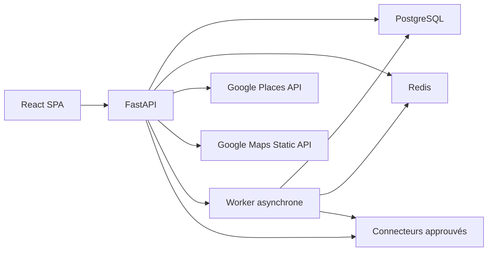

# Spécification fonctionnelle et technique — Marketteo CRM V1

| Métadonnée | Valeur |
| --- | --- |
| Produit | Marketteo CRM |
| Ancienne désignation | Prospect CRM ; `LeadGenerator` reste un identifiant technique transitoire |
| Version du document | 1.4 |
| Statut | Périmètre V1 enrichi, acquisition multicanale et ordre d’intégration validés |
| Date | 9 août 2026 |
| Marché initial | Canada |
| Langues V1 | Français canadien (`fr-CA`) et anglais canadien (`en-CA`) |
| Compte de facturation Google | Canada, hors Espace économique européen |

## 1. Objet du document

Ce document définit la migration de l’application actuelle vers **Marketteo CRM**, un petit CRM/ERP de gestion des prospects. Il constitue la référence fonctionnelle et technique pour la conception, l’implémentation, les tests d’acceptation et la préparation au déploiement de la V1.

La V1 doit apporter une valeur commerciale indépendante de Google Maps : organisation du travail, qualification, suivi, rappels, historique, opportunités et pilotage. Google Maps Platform reste un service de consultation ponctuelle et dynamique des établissements.

Ce document ne constitue pas un avis juridique. La conformité finale dépendra des conditions Google applicables au moment du déploiement, des contrats conclus avec les autres fournisseurs de données et des lois applicables à l’organisation cliente.

## 2. Décisions produit validées

1. Le produit devient **Marketteo CRM** et n’est plus présenté comme un générateur ou un extracteur de leads. La disponibilité juridique de la marque et des domaines doit être confirmée avant commercialisation.
2. La route d’export des données Google Places est supprimée ; pendant la migration, le bouton reste visible mais désactivé et inaccessible.
3. La recherche Google reste disponible, mais elle est limitée, explicite et sans pagination automatique.
4. Une recherche retourne au maximum 20 établissements.
5. Les résultats Google sont affichés temporairement et ne sont pas persistés dans la base CRM.
6. Le téléphone et le site Web Google sont récupérés uniquement à l’ouverture d’une fiche ou sur une action explicite.
7. Le seul champ Google conservé durablement pour un prospect est le `place_id`.
8. À la réouverture d’un prospect, ses informations Google sont rechargées en direct avec Place Details.
9. Les notes, tâches, statuts, opportunités, consentements et coordonnées obtenues indépendamment de Google sont des données CRM persistantes.
10. Les exports sont limités aux données internes, importées ou saisies par l’organisation, jamais aux contenus issus de Google Maps Platform.
11. La recherche accepte un lieu métier compréhensible — ville, région si nécessaire et pays — résolu côté serveur avant le Text Search ; latitude et longitude restent disponibles en mode avancé.
12. L’ajout d’un résultat Google au CRM reste explicite, individuel ou groupé dans la limite de vingt références, et ne persiste que le `place_id`.
13. Le pipeline représente des états commerciaux ; appels, courriels, rendez-vous et relances sont des activités ou prochaines actions distinctes.
14. L’interface, les courriels et les messages applicatifs sont disponibles en français canadien et en anglais canadien.
15. Marketteo prévoit des plans Freemium, Starter, Business et Sur mesure sous la forme d’abonnements SaaS et de droits d’usage ; il ne devient pas un logiciel de comptabilité.
16. Marketteo accepte des établissements et contacts provenant de sources autorisées — saisie manuelle, fichiers du client, acquisition entrante, Meta Lead Ads, partenaires, fournisseurs B2B et API publiques licenciées — sans scraping et avec provenance par donnée.

## 3. Objectifs et exclusions

### 3.1 Objectifs V1

- permettre à une petite équipe commerciale de gérer son portefeuille de prospects ;
- rechercher ponctuellement un établissement avec Google Places ;
- rechercher par ville, région éventuelle et pays sans saisir manuellement des coordonnées ;
- transformer un résultat temporaire en prospect CRM par son `place_id` ;
- qualifier, attribuer et suivre les prospects dans un pipeline ;
- centraliser appels, notes, tâches, rappels et opportunités ;
- distinguer les établissements prospects des personnes de contact qui leur sont rattachées ;
- conserver la provenance et les préférences de contact ;
- fournir des indicateurs reposant sur l’activité CRM interne ;
- importer et exporter uniquement des données dont l’organisation dispose des droits nécessaires ;
- assurer l’isolation des données entre organisations ;
- proposer une expérience bilingue français/anglais ;
- préparer une commercialisation par plans et quotas contrôlés côté serveur ;
- acquérir des établissements et contacts depuis des fichiers ou connecteurs explicitement autorisés.

### 3.2 Hors périmètre V1

- export de noms, adresses, téléphones, sites ou autres contenus Google ;
- extraction massive, recherche multi-zone ou pagination automatique Google ;
- constitution d’un annuaire d’entreprises ;
- scraping, crawling ou extraction automatisée de profils, pages, groupes ou résultats de réseaux sociaux ;
- connecteur générique capable d’aspirer une URL ou une API non approuvée ;
- comptabilité générale, paie, inventaire ou gestion de stock ;
- campagnes automatisées d’appels, de SMS ou de courriels ;
- synchronisation Gmail, Outlook ou calendrier ;
- devis et factures ;
- facturation des clients finaux ou gestion comptable des ventes de l’organisation ;
- application mobile native ;
- intelligence artificielle de qualification ou de scoring ;
- fournisseur de données B2B sans contrat autorisant les champs et usages concernés.

Ces capacités pourront être évaluées après stabilisation et audit de la V1.

## 4. Conformité Google et acquisition multicanale

### 4.1 Séparation des données

Le système distingue obligatoirement trois catégories :

| Catégorie | Exemples | Persistance |
| --- | --- | --- |
| Contenu Google temporaire | nom Google, adresse, téléphone, site Web, statut, coordonnées, URL Maps | Mémoire de la requête et affichage uniquement ; aucune base, aucun fichier, aucun journal applicatif |
| Référence Google autorisée | `place_id` | Persistance autorisée dans le prospect |
| Données CRM de l’organisation | étape, responsable, priorité, notes, tâches, résultat d’appel, opportunité, coordonnées obtenues indépendamment | Persistance normale avec provenance et contrôles d’accès |

Une donnée CRM ne doit jamais être automatiquement préremplie à partir d’un champ Google. Une coordonnée saisie ou importée doit porter une provenance autre que `google_maps`.

### 4.2 Recherche Google limitée

- une recherche est lancée par une action explicite de l’utilisateur ;
- une seule requête Text Search est exécutée par action ;
- `pageSize` est limité à 20 ;
- aucun `nextPageToken` n’est suivi en V1 ;
- aucune génération de maillage géographique n’est exécutée ;
- les champs de contact ne sont pas inclus dans la liste de résultats ;
- le serveur applique `Cache-Control: no-store` aux réponses ;
- le navigateur ne place aucun résultat Google dans `localStorage`, `sessionStorage`, IndexedDB ou un cache de service worker ;
- les journaux techniques ne contiennent ni corps de réponse Google ni paramètres secrets.

### 4.2.1 Résolution du lieu de recherche

Le formulaire principal demande une ville et un pays. Une région, province ou subdivision est affichée et demandée
lorsqu’elle est nécessaire pour lever une ambiguïté. Le parcours respecte les règles suivantes :

1. le serveur résout le lieu derrière un port applicatif `LocationResolver` ;
2. l’utilisateur sélectionne une proposition canonique et vérifie le centre sur la carte ;
3. la résolution fournit un contexte court lié à l’utilisateur et à l’organisation ;
4. le Text Search ne commence qu’après confirmation et reste limité à exactement un appel ;
5. les appels de résolution, d’autocomplétion, de Text Search et de carte sont comptés séparément ;
6. aucune requête fournisseur n’est déclenchée sans temporisation à chaque frappe ;
7. les libellés et coordonnées issus du fournisseur restent temporaires, sauf droit contractuel explicite de conservation ;
8. latitude et longitude restent accessibles dans un volet avancé et sont validées côté serveur.

La résolution de lieu ne doit jamais servir à générer automatiquement plusieurs zones, paginer les résultats ou
contourner la limite d’un Text Search par recherche confirmée.

### 4.3 Affichage et attribution

- tout contenu Google affiché sans carte porte l’attribution officielle `Google Maps` dans le même conteneur visuel ;
- l’attribution est toujours lisible, non traduite, non masquée et conforme aux dimensions officielles ;
- les cartes utilisent uniquement un fond Google ;
- la fiche distingue visuellement les données Google en direct des données internes ;
- les mentions légales publiques renvoient aux conditions Google Maps et à la politique de confidentialité Google.

### 4.4 Réaffichage d’un prospect

Lorsqu’un prospect possédant un `place_id` est ouvert :

1. le serveur lit les données CRM persistantes ;
2. le serveur appelle Place Details avec un masque de champs minimal ;
3. les données Google sont fusionnées uniquement dans la réponse HTTP ;
4. l’interface affiche les deux catégories dans des blocs distincts ;
5. aucune donnée Google n’est écrite en base ou dans un export.

Google recommande de rafraîchir les Place IDs âgés de plus de douze mois. Un traitement de maintenance devra vérifier les identifiants concernés sans enregistrer les détails retournés.

### 4.5 Sources d’acquisition et conservation

Le portefeuille CRM accepte les origines suivantes : référence Google, saisie manuelle, import appartenant au client, acquisition entrante, recommandation ou partenaire, fournisseur B2B licencié et source publique dont la licence autorise l’usage prévu.

Le référentiel validé des règles de provenance, autorisation de contact, déduplication, conservation, suppression et export est défini dans [`PHASE_1_1_ACQUISITION_CONSERVATION.md`](PHASE_1_1_ACQUISITION_CONSERVATION.md).

Principes structurants :

- une source inconnue ou sans preuve de droit d’utilisation est refusée ou mise en quarantaine ;
- la provenance du prospect et de chaque coordonnée persistante est obligatoire ;
- l’autorisation de contact est distincte de la provenance et gérée par canal ;
- un statut de canal inconnu bloque les actions automatisées jusqu’à justification ;
- les durées de conservation sont configurables, documentées et soumises à une revue ;
- l’import conforme est avancé après le socle des prospects internes pour accélérer la croissance du portefeuille ;
- la création groupée depuis Google accepte au maximum vingt `place_id` explicitement sélectionnés et aucun champ descriptif Google.

### 4.6 Acquisition multicanale

Marketteo distingue obligatoirement :

- le **prospect établissement**, entreprise ou compte commercial suivi dans le pipeline ;
- le **contact**, personne physique éventuellement rattachée à cet établissement ;
- le **canal de contact**, par exemple courriel ou téléphone, avec sa provenance et son autorisation propres.

Une source techniquement accessible n’est pas automatiquement autorisée pour le stockage, l’export ou la
prospection. Toute source externe passe par une liste blanche et un registre contractuel indiquant au minimum le
propriétaire, la licence, les territoires, les champs permis, les usages, l’attribution, les durées, l’export, la
date de révision et les obligations de suppression.

#### Fichiers appartenant à l’organisation

- le CSV constitue le premier format d’acquisition multicanale de la V1 ;
- l’organisation déclare la provenance, la finalité et son droit d’utiliser les données avant l’aperçu ;
- le serveur produit un aperçu, une correspondance des colonnes et un rapport de validation avant toute écriture ;
- chaque ligne distingue établissement, personne et canaux ;
- les lignes invalides ou de source inconnue sont rejetées ou mises en quarantaine ;
- aucune correspondance approximative n’est fusionnée automatiquement ;
- sans preuve recevable, la permission initiale de chaque canal vaut `unknown` ;
- le fichier brut est supprimé selon la politique temporaire après succès ou échec.

#### Meta, LinkedIn et réseaux sociaux

- Meta est autorisé uniquement pour les prospects soumis à l’organisation par ses formulaires Lead Ads au moyen
  d’une intégration officielle, authentifiée et auditée ;
- les profils, abonnés, groupes, pages et résultats Facebook ou Instagram ne sont jamais aspirés ;
- LinkedIn reste désactivé tant que Marketteo ne dispose pas d’un programme partenaire et d’un contrat autorisant
  explicitement les données, leur conservation et leur usage CRM ;
- aucune donnée LinkedIn obtenue par scraping, extension de navigateur ou fournisseur indirect non autorisé n’est
  acceptée ;
- une saisie manuelle déclarée ne permet pas de contourner ces interdictions ni de requalifier une extraction.

#### API publiques et fournisseurs B2B

- seules les sources approuvées dans le registre peuvent être activées ;
- « API ouverte » ne signifie pas « usage commercial et prospection autorisés » ;
- les connecteurs sont isolés derrière un port `AcquisitionSourceGateway` ;
- les appels sont bornés, observables, idempotents et sans secret dans les journaux ;
- toute expiration de contrat ou de licence bloque les nouvelles acquisitions sans supprimer silencieusement les
  données déjà soumises à une politique de conservation ou à une opposition.

L’importation et la conservation d’une coordonnée ne constituent jamais, à elles seules, une autorisation de
contacter la personne. Les règles canadiennes et provinciales applicables, notamment celles relatives aux messages
électroniques commerciaux, restent évaluées séparément et doivent être validées avant la production.

## 5. Utilisateurs et autorisations

### 5.1 Rôles

| Fonction | Administrateur | Gestionnaire | Commercial |
| --- | :---: | :---: | :---: |
| Gérer l’organisation et ses paramètres | Oui | Non | Non |
| Inviter, désactiver et attribuer des rôles | Oui | Non | Non |
| Configurer les étapes du pipeline | Oui | Oui | Non |
| Voir tous les prospects de l’organisation | Oui | Oui | Non |
| Voir ses prospects et les prospects non attribués | Oui | Oui | Oui |
| Créer ou modifier un prospect autorisé | Oui | Oui | Oui |
| Réattribuer un prospect | Oui | Oui | Non |
| Consulter les tableaux de bord d’équipe | Oui | Oui | Non |
| Importer ou exporter les données internes | Oui | Oui | Non |
| Configurer un connecteur d’acquisition approuvé | Oui | Non | Non |
| Consulter le journal d’audit | Oui | Oui | Non |

### 5.2 Règles d’accès

- chaque enregistrement métier porte un `organization_id` obligatoire ;
- aucune requête ne dépend d’un `organization_id` fourni librement par le navigateur ;
- l’organisation est déterminée à partir de la session authentifiée ;
- un commercial ne peut modifier que les prospects qu’il possède ou qui ne sont pas encore attribués ;
- toute opération sensible est vérifiée côté serveur, même si le bouton est masqué dans l’interface ;
- la désactivation d’un utilisateur invalide immédiatement ses sessions actives.

## 6. Spécification des neuf modules

### Module 1 — Comptes et équipes

#### Fonctions

- connexion et déconnexion ;
- création initiale d’une organisation par un administrateur ;
- invitation d’utilisateurs par adresse courriel ;
- rôles Administrateur, Gestionnaire et Commercial ;
- activation, désactivation et réattribution des éléments d’un utilisateur ;
- paramètres d’organisation : nom, fuseau horaire, langue par défaut et quotas Google ;
- préférence de langue personnelle français canadien ou anglais canadien.

#### Critères d’acceptation

- un utilisateur non authentifié ne peut accéder à aucune donnée CRM ;
- un utilisateur ne voit jamais les données d’une autre organisation ;
- une session est portée par un cookie `HttpOnly`, `Secure` en production et `SameSite=Lax` ;
- après désactivation, toutes les requêtes de l’utilisateur retournent une erreur d’autorisation ;
- la dernière organisation administratrice ne peut pas perdre son dernier administrateur actif ;
- la préférence utilisateur prévaut sur la langue de l’organisation, avec `fr-CA` comme repli.

### Module 2 — Établissements prospects et contacts

#### Fonctions

- création manuelle d’un prospect ;
- création depuis un résultat Google en conservant uniquement le `place_id` ;
- création depuis un import ou un connecteur approuvé avec un dossier d’acquisition ;
- alias interne facultatif ;
- origine : référence Google, manuel, import client, entrant, partenaire, fournisseur autorisé ou source publique autorisée ;
- rattachement de zéro à plusieurs personnes de contact à un établissement ;
- canaux professionnels propres à l’établissement ou à une personne, avec provenance et permission distinctes ;
- responsable, étape, priorité, étiquettes et prochaine action ;
- archivage et restauration ;
- détection des doublons de `place_id` dans une même organisation ;
- bloc de détails Google chargé en direct à l’ouverture.

#### Critères d’acceptation

- deux prospects actifs d’une même organisation ne peuvent partager le même `place_id` ;
- la création depuis Google n’enregistre ni nom, ni adresse, ni téléphone, ni site Google ;
- une personne de contact n’est jamais confondue avec l’établissement auquel elle est rattachée ;
- chaque canal persistant possède une provenance et un statut de permission, initialisé à `unknown` sans preuve ;
- l’import répété d’une même acquisition est idempotent et les rapprochements approximatifs exigent une décision humaine ;
- la fiche reste utilisable si Google est temporairement indisponible ;
- les données Google sont identifiées comme temporaires et portent l’attribution requise ;
- l’archivage conserve l’historique et exclut le prospect des vues actives.

### Module 3 — Pipeline Kanban

#### Étapes initiales

1. Nouveau
2. À qualifier
3. Qualifié
4. Contact établi
5. Opportunité
6. Proposition envoyée
7. Négociation
8. Gagné
9. Perdu

#### Fonctions

- vue Kanban par étape ;
- déplacement d’un prospect autorisé entre étapes ;
- filtres par responsable, priorité, étiquette et prochaine action ;
- motif obligatoire lors du passage à Perdu ;
- création automatique d’un événement d’historique à chaque changement ;
- étapes configurables dans leur libellé, leur couleur et leur ordre, avec catégories système stables ;
- séparation stricte entre l’étape commerciale et les appels, courriels, rendez-vous, relances ou tâches.

#### Critères d’acceptation

- chaque déplacement est validé et enregistré côté serveur ;
- un déplacement concurrent détecté retourne un conflit plutôt que d’écraser silencieusement la modification ;
- Gagné et Perdu sont des étapes terminales mais réversibles par un utilisateur autorisé ;
- les cartes Kanban n’affichent pas de contenu Google persistant : elles utilisent d’abord l’alias, le responsable,
  la priorité, la prochaine action et la dernière activité internes ;
- les détails Google sont hydratés uniquement à la demande et leur indisponibilité ne rend pas le pipeline inutilisable.

### Module 4 — Activités commerciales

#### Fonctions

- journaliser un appel, un courriel, un rendez-vous, une note ou une interaction ;
- résultat d’appel : sans réponse, message laissé, intéressé, non intéressé, mauvais numéro, à rappeler ;
- tâches assignées avec échéance, priorité et statut ;
- rappels personnels ;
- fil chronologique consolidé ;
- modification contrôlée et suppression logique.

#### Critères d’acceptation

- chaque activité conserve son auteur et ses dates de création/modification ;
- une tâche en retard apparaît dans le tableau de bord ;
- une activité supprimée reste traçable dans le journal d’audit ;
- les notes sont du texte simple ou Markdown assaini, sans HTML exécutable ;
- aucune activité n’est créée automatiquement à partir de contenu Google.

### Module 5 — Actions intégrées

#### Fonctions

- ouvrir l’établissement dans Google Maps ;
- appeler via un lien `tel:` lorsque le téléphone Google est affiché en direct ;
- ouvrir le site Web dans un nouvel onglet sécurisé ;
- créer une note, une tâche ou un rappel depuis la fiche ;
- ajouter un résultat temporaire au CRM ;
- copier uniquement les données internes explicitement autorisées.

#### Critères d’acceptation

- l’action Appeler ne provoque aucune écriture du numéro Google en base ;
- les URL externes acceptées utilisent uniquement `http` ou `https` ;
- les nouveaux onglets utilisent `noopener` et `noreferrer` ;
- l’ajout au CRM est idempotent pour un même `place_id` et une même organisation ;
- toute action métier significative apparaît dans l’historique.

### Module 6 — Opportunités

#### Fonctions

- créer plusieurs opportunités pour un prospect ;
- nom interne, montant estimé, devise, probabilité, échéance et responsable ;
- étapes : Découverte, Qualification, Proposition, Négociation, Gagnée, Perdue ;
- motif de perte ;
- valeur pondérée calculée à partir du montant et de la probabilité ;
- conversion logique du prospect en client lorsque l’opportunité est gagnée.

#### Critères d’acceptation

- les montants utilisent un type décimal et non un nombre flottant ;
- la devise initiale est `CAD`, configurable par opportunité ;
- le montant et la probabilité sont des données internes exportables ;
- le passage à Perdue exige un motif ;
- les changements de montant, d’étape et de responsable sont audités.

### Module 7 — Conformité commerciale

#### Fonctions

- provenance obligatoire des coordonnées persistantes ;
- statut de contact : inconnu, autorisé, opposition, ne pas contacter ;
- date, motif et source du statut ;
- bannière de blocage pour les prospects à ne pas contacter ;
- registre des consentements et oppositions ;
- politique de conservation configurable ;
- export ou suppression des données internes d’un prospect selon les droits applicables.

#### Critères d’acceptation

- aucun champ de contact interne ne peut être enregistré sans provenance ;
- une opposition empêche les actions de contact dans l’interface ;
- seul un Administrateur ou un Gestionnaire peut lever une opposition, avec justification ;
- le journal d’audit enregistre la création et toute modification du statut ;
- les règles exactes de conservation sont validées avant la production.

### Module 8 — Tableau de bord

#### Indicateurs V1

- prospects actifs par étape ;
- tâches dues aujourd’hui et en retard ;
- appels, rendez-vous et activités par période ;
- taux de passage entre étapes ;
- opportunités ouvertes, gagnées et perdues ;
- valeur totale et valeur pondérée du pipeline ;
- performance par commercial pour les Gestionnaires et Administrateurs ;
- consommation Google par utilisateur et organisation.

#### Critères d’acceptation

- les indicateurs sont calculés uniquement à partir de données CRM internes et de compteurs techniques ;
- aucun agrégat n’est construit à partir des noms, catégories, adresses ou coordonnées Google ;
- les montants respectent la devise de l’opportunité ;
- les filtres de période utilisent le fuseau horaire de l’organisation ;
- un commercial ne voit que ses indicateurs personnels.

### Module 9 — Import et export conformes

#### Import

- fichiers CSV fournis par l’organisation en première livraison ; XLSX reste un format ultérieur contrôlé ;
- import séparé des établissements, personnes de contact et canaux ;
- aperçu et correspondance des colonnes avant validation ;
- origine, déclaration de provenance, finalité et attestation de droits obligatoires ;
- statut de permission explicite par canal, avec `unknown` par défaut ;
- détection des doublons internes ;
- mise en quarantaine des lignes invalides, ambiguës ou liées à une source non approuvée ;
- clé d’idempotence pour éviter le rejeu involontaire d’un même import ;
- rapport des lignes acceptées et rejetées ;
- suppression du fichier source temporaire après traitement.

#### Connecteurs

- Meta Lead Ads officiel pour les formulaires appartenant à l’organisation, après revue de l’application ;
- API publiques ou fournisseurs B2B exclusivement depuis une liste blanche et un contrat actif ;
- webhooks signés, secrets chiffrés, rotation des jetons et révocation immédiate ;
- synchronisation incrémentale idempotente avec reprise contrôlée ;
- LinkedIn et tout connecteur social général désactivés sans autorisation partenaire explicite.

#### Export

- prospects et coordonnées internes ;
- étapes, responsables, priorités et étiquettes ;
- activités, tâches et opportunités selon les permissions ;
- exclusion des champs Google affichés en direct ;
- neutralisation des formules Excel ;
- journalisation de l’auteur, de la date, des filtres et du volume exporté.

#### Critères d’acceptation

- un export ne contient jamais de champ provenant de Place Details ou Text Search ;
- le schéma d’export utilise une liste blanche explicite de colonnes ;
- le `place_id` n’est pas inclus dans les exports destinés aux utilisateurs en V1 ;
- seules les personnes autorisées peuvent lancer un import ou un export ;
- seules les personnes autorisées peuvent configurer ou révoquer un connecteur ;
- aucun contact provenant d’un réseau social n’entre par scraping ou par fournisseur indirect non autorisé ;
- une licence expirée bloque les nouvelles synchronisations ;
- les fichiers temporaires sont supprimés après succès ou échec ;
- les valeurs susceptibles d’être interprétées comme des formules sont enregistrées comme texte.

### Socle transversal — Abonnements SaaS et droits commerciaux

Ce socle soutient la commercialisation de Marketteo sans constituer un dixième module métier. Il couvre :

- les plans Freemium, Starter, Business et Sur mesure ;
- l’abonnement porté par l’organisation et le nombre de sièges autorisés ;
- les droits fonctionnels et quotas calculés côté serveur ;
- les états d’abonnement `trialing`, `active`, `past_due`, `grace_period`, `suspended` et `canceled` ;
- les changements de plan, renouvellements et événements de paiement reçus par webhooks idempotents ;
- la consultation des factures d’abonnement émises par le fournisseur de paiement.

Principes obligatoires :

- le Freemium possède un quota Google nul ou strictement borné afin d’éviter une dépense non maîtrisée ;
- une restriction de plan est appliquée par l’API, jamais uniquement par l’interface ;
- un déclassement ne supprime aucune donnée et bloque uniquement les nouvelles opérations dépassant les droits ;
- chaque changement de plan, suspension et réactivation est audité ;
- Marketteo ne stocke aucun numéro de carte, cryptogramme ou donnée bancaire brute ;
- les prix, taxes canadiennes, remboursements et factures légales sont délégués à un fournisseur conforme et validés
  avec les conseillers comptables et juridiques appropriés ;
- les seuils précis de chaque plan restent à fixer après mesure des coûts Google et de l’infrastructure.

## 7. Parcours utilisateur principaux

### 7.1 Rechercher puis ajouter un prospect

1. Le commercial ouvre Recherche d’établissements.
2. Il saisit un type d’entreprise, une ville et un pays, puis choisit le lieu canonique proposé.
3. Il vérifie le centre et le rayon sur la carte ; les coordonnées manuelles restent disponibles en mode avancé.
4. Le serveur applique les limites et interroge Text Search exactement une fois après confirmation.
5. L’interface affiche au maximum 20 résultats temporaires avec attribution Google Maps.
6. Le commercial sélectionne un ou plusieurs résultats et choisit explicitement Ajouter au CRM.
7. Il complète au besoin l’alias et les données CRM internes, puis confirme.
8. Le serveur enregistre uniquement le `place_id`, l’étape Nouveau, le responsable et les données internes saisies.
9. Les doublons sont signalés sans créer une seconde fiche active.
10. Les données Google disparaissent lorsque la réponse ou la vue est détruite.

### 7.2 Revenir sur un prospect enregistré

1. Le commercial ouvre le pipeline ou la liste de prospects.
2. La liste affiche d’abord les données CRM internes et ne charge les détails Google qu’après une action explicite
   pour les éléments qui en ont besoin.
3. Il ouvre une fiche.
4. Le serveur retourne les données CRM et récupère les détails Google en direct.
5. Si Google échoue, les données CRM restent disponibles et un état indisponible est affiché.

### 7.3 Effectuer une relance

1. Le tableau de bord signale une tâche arrivée à échéance.
2. Le commercial ouvre le prospect.
3. Il consulte les informations Google en direct ou les coordonnées internes autorisées.
4. Il lance l’action de contact.
5. Il enregistre le résultat, la note et la prochaine action.
6. Le pipeline et les statistiques internes sont mis à jour.

### 7.4 Importer des établissements et contacts

1. Un Administrateur ou un Gestionnaire choisit Import CSV.
2. Il déclare la source, la finalité, le droit d’utilisation et les éventuelles restrictions.
3. Le fichier est téléversé dans un stockage temporaire isolé et contrôlé.
4. L’interface affiche un aperçu et permet d’associer les colonnes aux établissements, contacts et canaux.
5. Le serveur normalise les valeurs, détecte les doublons exacts et met les ambiguïtés en quarantaine.
6. L’utilisateur corrige ou exclut les lignes problématiques puis confirme le lot.
7. Le serveur écrit les acquisitions valides de manière idempotente et initialise les permissions manquantes à
   `unknown`.
8. Un rapport présente les créations, rattachements, doublons, quarantaines et rejets sans exposer de secret.
9. L’événement métier et le résumé de l’import sont audités dans les mêmes transactions que les écritures concernées.
10. Le fichier brut est supprimé conformément à la politique temporaire.

## 8. Modèle de données cible

### 8.1 Entités principales

| Entité | Champs essentiels |
| --- | --- |
| `organizations` | `id`, `name`, `default_locale`, `timezone`, `status`, `google_search_daily_limit`, `created_at` |
| `users` | `id`, `email`, `password_hash`, `display_name`, `preferred_locale`, `status`, `created_at`, `last_login_at` |
| `memberships` | `organization_id`, `user_id`, `role`, `created_at` |
| `pipeline_stages` | `id`, `organization_id`, `system_category`, `label`, `color`, `position`, `is_active` |
| `prospects` | `id`, `organization_id`, `google_place_id`, `internal_alias`, `origin`, `source_label`, `acquired_at`, `acquisition_record_id`, `owner_id`, `stage_id`, `priority`, `next_action_at`, `retention_review_at`, `version`, `created_at`, `updated_at`, `archived_at` |
| `acquisition_records` | déclaration ou événement d’acquisition, fournisseur, référence externe idempotente, finalité, droits attestés, restrictions et références de preuve |
| `contacts` | `id`, `organization_id`, `prospect_id`, `display_name`, `job_title`, `acquisition_record_id`, `version`, `created_at`, `updated_at`, `archived_at` |
| `contact_channels` | `id`, `organization_id`, `prospect_id` ou `contact_id`, `type`, `value`, `value_normalized`, `provenance`, `source_label`, `purpose`, `obtained_at`, `verified_at`, `created_by`, `archived_at` |
| `tags` / `prospect_tags` | étiquettes propres à l’organisation et association aux prospects |
| `activities` | `id`, `prospect_id`, `contact_id` facultatif, `type`, `outcome`, `content`, `occurred_at`, `created_by`, `updated_at`, `deleted_at` |
| `tasks` | `id`, `prospect_id`, `contact_id` facultatif, `assignee_id`, `title`, `due_at`, `priority`, `status`, `completed_at` |
| `opportunities` | `id`, `prospect_id`, `owner_id`, `name`, `amount`, `currency`, `probability`, `stage`, `expected_close_at`, `lost_reason`, `version` |
| `contact_permissions` | `contact_channel_id`, `status`, `basis`, `evidence_reference`, `effective_at`, `expires_at`, `reason`, `updated_by` |
| `consent_evidence` | référence minimale vers la preuve, la finalité et la version d’avis applicable |
| `data_providers` / `provider_contract_rules` | fournisseur, licence, territoires, champs, usages, export, attribution, restrictions et échéances contractuelles |
| `source_connectors` | organisation, fournisseur approuvé, type, état, configuration chiffrée, dernière synchronisation et version |
| `retention_policies` / `retention_holds` | politique configurable par catégorie et suspension motivée d’une purge |
| `audit_events` | `id`, `organization_id`, `actor_id`, `action`, `entity_type`, `entity_id`, `metadata`, `occurred_at` |
| `usage_counters` | `organization_id`, `user_id`, `service`, `period`, `count` |
| `import_jobs` / `import_rows` / `export_jobs` | auteur, clé d’idempotence, déclaration, statut, correspondance, quarantaine, statistiques, erreurs, dates et emplacement temporaire |
| `plan_catalog` / `plan_entitlements` | code stable du plan, droits, limites, version et période de validité |
| `subscriptions` | organisation, plan, fournisseur, référence externe opaque, état, sièges, période et version |
| `billing_events` | identifiant fournisseur idempotent, type, résultat technique et dates, sans donnée bancaire brute |

### 8.2 Contraintes structurantes

- clés primaires UUID ;
- dates enregistrées en UTC ;
- contrainte unique partielle sur `(organization_id, google_place_id)` pour les prospects actifs ;
- origine obligatoire et référence de provenance pour toute coordonnée persistante ;
- séparation référentielle entre établissement, personne de contact et canal ;
- un canal appartient soit à un établissement, soit à une personne, jamais aux deux simultanément ;
- valeur normalisée unique selon les règles de déduplication de l’organisation, sans fusion approximative automatique ;
- aucune fusion automatique sur une correspondance approximative ;
- montant d’opportunité en `NUMERIC`, devise ISO 4217 ;
- verrouillage optimiste avec `version` pour prospects et opportunités ;
- suppression logique pour les données métier ;
- suppression physique des fichiers d’import/export temporaires ;
- aucune colonne destinée aux noms, adresses, téléphones, sites ou catégories Google ;
- secrets et jetons des connecteurs chiffrés hors des tables métier et exclus des audits ;
- index sur organisation, responsable, étape, prochaine action et échéances ;
- métadonnées d’audit limitées aux données internes et identifiants techniques.

## 9. Architecture technique cible

### 9.1 Composants

- **React** : écrans CRM, état local des résultats Google et contrôle d’accès visuel ;
- **FastAPI** : authentification, autorisations, règles métier, appels Google et exports ;
- **PostgreSQL** : données CRM multi-organisations ;
- **Redis** : sessions ou révocation, limitations de débit, verrous, jetons courts et données éphémères ;
- **Worker** : imports, exports internes, rappels et maintenance des Place IDs ;
- **Registre des sources** : licences, contrats, champs, territoires, usages et échéances ;
- **Connecteurs approuvés** : Meta Lead Ads, API publiques licenciées et fournisseurs B2B contractuels ;
- **Google Places** : recherche limitée et détails à la demande ;
- **Maps Static** : aperçu cartographique Google lorsque nécessaire ;
- **Résolveur de lieux** : ville, région et pays derrière un port fournisseur dédié ;
- **Fournisseur d’abonnement** : paiement hébergé, factures d’abonnement et webhooks, sans donnée bancaire dans Marketteo.

### 9.2 Choix recommandés

- SQLAlchemy 2 pour l’accès aux données ;
- Alembic pour les migrations ;
- sessions serveur par cookie sécurisé plutôt qu’un jeton stocké dans `localStorage` ;
- hachage des mots de passe avec Argon2id ;
- validation Pydantic de toutes les entrées et sorties ;
- tâches asynchrones avec une file compatible Redis ;
- liste blanche stricte des champs exportables ;
- adaptateur Google isolé derrière une interface de fournisseur de lieux ;
- adaptateurs d’acquisition isolés derrière `AcquisitionSourceGateway`, sans connecteur arbitraire ;
- secrets de connecteurs chiffrés, webhooks signés et synchronisations idempotentes ;
- catalogues de traduction versionnés pour `fr-CA` et `en-CA`, sans libellés métier persistés dans les contrats API ;
- adaptateur de facturation isolé derrière un port applicatif et webhooks idempotents.

L’interface de fournisseur permet d’ajouter uniquement une source dont les droits explicites de collecte, stockage,
usage, export et suppression ont été enregistrés, sans mélanger ses données avec le contenu Google.

## 10. API cible

### Authentification et organisation

- `POST /api/auth/login`
- `POST /api/auth/logout`
- `GET /api/auth/me`
- `GET /api/users`
- `POST /api/users/invitations`
- `PATCH /api/users/{user_id}`
- `GET /api/organization`
- `PATCH /api/organization`

### Recherche Google temporaire

- `POST /api/locations/resolve`
- `POST /api/google/places/search`
- `GET /api/google/places/{place_id}`
- `POST /api/google/maps/snapshot`

Ces routes appliquent `no-store`, les quotas, les masques de champs et l’attribution. Elles ne créent aucune donnée CRM sans une requête distincte et explicite.

La résolution de lieu est une opération distincte du Text Search. Sa réponse temporaire permet à l’utilisateur de
confirmer une ville non ambiguë sans autoriser une recherche multi-zone.

### Prospects et pipeline

- `GET /api/prospects`
- `POST /api/prospects`
- `GET /api/prospects/{prospect_id}`
- `PATCH /api/prospects/{prospect_id}`
- `POST /api/prospects/{prospect_id}/archive`
- `POST /api/prospects/{prospect_id}/restore`
- `GET/POST /api/prospects/{prospect_id}/contacts`
- `GET/PATCH /api/contacts/{contact_id}`
- `POST /api/contacts/{contact_id}/archive`
- `GET/POST /api/contacts/{contact_id}/channels`
- `PATCH /api/contact-channels/{channel_id}`
- `GET /api/pipeline/stages`
- `PATCH /api/pipeline/stages`

La création depuis Google accepte un `google_place_id` mais aucun champ descriptif Google.

### Activités, tâches et opportunités

- `GET/POST /api/prospects/{prospect_id}/activities`
- `PATCH/DELETE /api/activities/{activity_id}`
- `GET/POST /api/tasks`
- `PATCH /api/tasks/{task_id}`
- `GET/POST /api/prospects/{prospect_id}/opportunities`
- `PATCH /api/opportunities/{opportunity_id}`
- `GET /api/prospects/{prospect_id}/contact-permissions`
- `GET/PATCH /api/contact-channels/{channel_id}/permission`

### Pilotage et échanges

- `GET /api/dashboard`
- `POST /api/imports`
- `POST /api/imports/{job_id}/preview`
- `POST /api/imports/{job_id}/confirm`
- `GET /api/imports/{job_id}`
- `GET /api/imports/{job_id}/report`
- `POST /api/exports`
- `GET /api/exports/{job_id}`
- `GET /api/audit-events`

### Sources et connecteurs d’acquisition

- `GET /api/acquisition/sources`
- `GET/POST /api/acquisition/connectors`
- `POST /api/acquisition/connectors/{connector_id}/revoke`
- `POST /api/acquisition/webhooks/meta/lead-ads`

La plateforme expose uniquement les types de connecteurs approuvés. Les webhooks vérifient leur signature avant
toute lecture métier, refusent les événements rejoués et ne placent ni jeton fournisseur ni donnée personnelle dans
les journaux techniques. Aucun endpoint LinkedIn n’est monté sans autorisation partenaire formelle.

### Préférences et abonnement

- `PATCH /api/account/preferences`
- `GET /api/billing/subscription`
- `GET /api/billing/plans`
- `POST /api/billing/checkout-session`
- `POST /api/billing/portal-session`
- `POST /api/billing/webhooks/{provider}`

Les routes de portail et de paiement retournent uniquement des redirections ou références opaques. Les webhooks
vérifient leur signature, sont idempotents et écrivent leurs changements métier et leur audit dans la même
transaction lorsque cela est applicable.

### 10.1 Conventions API

- JSON UTF-8 ;
- erreurs au format uniforme avec `code`, `message` et `request_id` ;
- pagination par curseur pour les données CRM ;
- tri et filtres limités à une liste blanche ;
- statut `409` pour les conflits de version ou doublons ;
- statut `422` pour la validation ;
- statut `429` avec `Retry-After` pour les quotas ;
- identifiant de corrélation sur chaque requête ;
- aucun détail interne ou secret dans les erreurs publiques.

## 11. Écrans V1

1. Connexion
2. Tableau de bord
3. Recherche Google limitée
4. Pipeline Kanban
5. Liste des prospects
6. Fiche établissement avec onglets Résumé, Contacts, Activités, Tâches, Opportunités et Conformité
7. Centre de tâches et rappels
8. Imports, quarantaine, rapports et exports
9. Administration : utilisateurs, pipeline, sources, connecteurs, quotas et organisation
10. Compte : langue personnelle, plan courant, utilisation, sièges et accès au portail de facturation

La navigation principale est centrée sur le pipeline et les tâches, pas sur la recherche Google.

## 12. Quotas et maîtrise des coûts

### Valeurs initiales recommandées

- 20 résultats maximum par recherche ;
- 1 recherche Google simultanée par utilisateur ;
- 20 recherches Google par utilisateur et par jour ;
- 100 recherches Google par organisation et par jour ;
- 120 consultations Place Details par utilisateur et par heure ;
- 1 génération de carte par recherche valide ;
- quotas distincts pour la résolution de lieux et l’autocomplétion ;
- seuil d’alerte à 80 % du quota quotidien.

Ces valeurs sont configurables dans les bornes du plan et de l’exploitant. Les droits effectifs sont calculés côté
serveur à partir du plan, des éventuelles dérogations contractuelles et des limites de sécurité. Ils seront ajustés
en préproduction après mesure des coûts et des usages réels.

## 13. Exigences non fonctionnelles

### Sécurité

- HTTPS obligatoire en production ;
- secrets injectés par un gestionnaire de secrets ;
- protection CSRF pour les opérations authentifiées par cookie ;
- limitation de débit par utilisateur, organisation et adresse IP ;
- mots de passe Argon2id et politique de longueur minimale ;
- validation des URL et neutralisation des contenus actifs ;
- fichiers d’import limités en taille et en volume, type et encodage contrôlés, contenu actif jamais exécuté ;
- jetons de connecteurs chiffrés, à portée minimale, révocables et jamais retournés après enregistrement ;
- signatures, horodatages et protection anti-rejeu obligatoires pour les webhooks externes ;
- sauvegardes chiffrées ;
- dépendances analysées dans la CI ;
- aucun secret, mot de passe, cookie ou contenu Google dans les journaux.

### Performance

- réponse interne au 95e percentile inférieure à 500 ms hors dépendance externe ;
- réponse avec Google au 95e percentile cible inférieure à 3 secondes ;
- pagination CRM par défaut de 25 éléments, maximum 100 ;
- chargement paresseux des détails Google pour les éléments visibles ;
- export traité en tâche de fond au-delà de 1 000 enregistrements.

### Disponibilité et reprise

- objectif initial de disponibilité : 99,5 % mensuel hors maintenance annoncée ;
- sauvegarde PostgreSQL quotidienne au minimum ;
- objectif de point de reprise : 24 heures ;
- objectif de temps de reprise : 4 heures ;
- procédure testée de restauration avant la production.

### Accessibilité et expérience

- cible WCAG 2.2 niveau AA ;
- navigation clavier complète ;
- focus visible et restauré après les dialogues ;
- messages d’erreur associés aux champs ;
- contrastes vérifiés ;
- interface responsive à partir de 320 px ;
- dates affichées dans le fuseau de l’organisation ;
- interface, erreurs, validations et courriels disponibles en `fr-CA` et `en-CA` ;
- préférence utilisateur prioritaire sur la langue par défaut de l’organisation, puis repli sur `fr-CA` ;
- formats de dates, nombres et devises localisés sans modifier les valeurs stockées ni les codes API ;
- attribution `Google Maps`, codes techniques et identifiants non traduits ;
- aucun texte fonctionnel nouveau codé en dur hors des catalogues de traduction.

### Observabilité

- journaux structurés avec `request_id`, organisation, utilisateur et type d’opération ;
- métriques de latence, erreurs, quotas et coûts Google ;
- métriques d’import et de connecteurs limitées aux volumes, états, fournisseurs et codes d’erreur ;
- traces excluant les contenus et secrets Google ;
- traces excluant fichiers bruts, coordonnées, contenus sociaux et secrets de connecteurs ;
- alertes sur erreurs Google, saturation des quotas, échecs de tâches et sauvegardes ;
- journal d’audit distinct des journaux techniques.

## 14. Stratégie de migration du code actuel

### Phase 1 — Verrou de conformité

- désactiver et rendre inaccessible le bouton d’export Google, puis supprimer sa route ;
- supprimer l’objectif massif, les zones multiples et la pagination automatique ;
- renommer l’application et les libellés orientés « génération de leads » ;
- corriger l’attribution `Google Maps` sur la liste et la fiche ;
- mettre à jour README, conditions d’utilisation et confidentialité ;
- conserver les protections existantes sur les clés, jetons de carte et entrées.

### Phase 1.1 — Acquisition et conservation (validée)

Les huit décisions produit de cette phase ont été validées le 22 juillet 2026 et deviennent des contraintes de conception pour la phase 2.

- valider les sources autorisées et refusées ;
- séparer origine, provenance, permission de contact et conservation ;
- définir l’ajout groupé de références Google sélectionnées ;
- définir les règles d’import, fournisseur, déduplication, export et suppression ;
- préparer les contraintes que le modèle de données de la phase 2 devra supporter.

### Phase 2 — Fondations

La conception détaillée, le découpage testable et les dix décisions techniques validées sont décrits dans [`PHASE_2_SPECIFICATIONS_DETAILLEES.md`](PHASE_2_SPECIFICATIONS_DETAILLEES.md). Ils constituent la référence obligatoire de l’implémentation de la phase 2.

- PostgreSQL, SQLAlchemy et Alembic ;
- Redis ;
- organisations, utilisateurs, sessions et rôles ;
- isolation multi-organisation ;
- journal d’audit ;
- configuration et secrets par environnement ;
- tables et contraintes de provenance, permissions de contact, fournisseurs et rétention.

Ordre détaillé restant validé après la clôture de 2.3.5-E :

1. **2.4 — Audit transactionnel** avant toute nouvelle écriture CRM ou d’abonnement ;
2. **2.5 — Socle de conformité et de conservation**, établissements, contacts, canaux, registre des sources et ajout
   explicite des références Google ;
3. **2.6 — Redis partagé, quotas et durcissement**, en préparant les droits liés aux plans.

La proposition détaillée de 2.4 est disponible dans
[`PHASE_2_4_SPECIFICATIONS_DETAILLEES.md`](PHASE_2_4_SPECIFICATIONS_DETAILLEES.md). Ses seize décisions ont été
validées le 9 août 2026. Le code de 2.4.1 est implémenté sous `20260809_0006` ; ses preuves PostgreSQL réelles sont
intégrées au verrou automatisé de l’implémentation 2.4.2.

La recette manuelle des lots 2.4.1 et 2.4.2 est regroupée à la fin de 2.4.3 afin de tester également la consultation.
Les seize décisions de 2.4.2 ont été validées le 9 août 2026 et sont implémentées sous `20260809_0007`. Le contrat et
les preuves sont disponibles dans
[`PHASE_2_4_2_SPECIFICATIONS_DETAILLEES.md`](PHASE_2_4_2_SPECIFICATIONS_DETAILLEES.md) et
[`PHASE_2_4_2_RAPPORT_IMPLEMENTATION.md`](PHASE_2_4_2_RAPPORT_IMPLEMENTATION.md). Les tests automatisés et
PostgreSQL restent exécutés à chaque implémentation et ne sont pas reportés.

Les spécifications détaillées de la consultation 2.4.3 sont validées et implémentées dans
[`PHASE_2_4_3_SPECIFICATIONS_DETAILLEES.md`](PHASE_2_4_3_SPECIFICATIONS_DETAILLEES.md). Elles fixent les deux
périmètres de lecture, les curseurs et filtres, les écrans accessibles, la correction prospective de la cible
organisation des événements plateforme et la recette fonctionnelle cumulée. Leurs seize décisions ont été validées
le 9 août 2026. La recette utilisateur cumulée 2.4.1–2.4.3 a été déclarée conforme le même jour. Par décision
produit, le passage Azure est reporté à la clôture globale de la phase 2.4 et le GO de 2.4.4 est autorisé.

### Phase 3 — Cœur CRM

- établissements prospects, personnes de contact, canaux et provenance par donnée ;
- création manuelle puis import CSV conforme immédiatement après le socle prospect ;
- pipeline ;
- activités, tâches et rappels ;
- opportunités ;
- permissions de contact par canal ;
- recherche Google limitée et hydratation en direct ;
- résolution contrôlée Ville + région éventuelle + Pays ;
- ajout individuel ou groupé des références sélectionnées ;
- quarantaine, déduplication humaine et rapports d’import ;
- fondation bilingue et écrans `fr-CA` / `en-CA`.

### Phase 4 — Pilotage et échanges

- tableau de bord ;
- exports internes et administration des imports ;
- quotas et rapports d’usage ;
- worker asynchrone ;
- registre des fournisseurs et premiers connecteurs approuvés, Meta Lead Ads en priorité après revue ;
- tests de bout en bout.

### Phase 5 — Préproduction et déploiement

- environnement de préproduction isolé ;
- migration et restauration testées ;
- revue de sécurité ;
- validation juridique et Google ;
- tests de charge et de coûts ;
- supervision, alertes et procédures d’exploitation ;
- migration complète de la marque publique vers Marketteo après validation juridique ;
- abonnement SaaS, catalogue de plans, paiement hébergé, webhooks et portail de facturation ;
- validation des prix, taxes canadiennes, quotas Freemium et conditions commerciales ;
- lancement progressif avec un nombre limité d’organisations.

## 15. Stratégie de tests

### Tests unitaires

- règles d’autorisation ;
- transitions du pipeline ;
- provenance et opposition au contact ;
- séparation établissement, personne, canal et permission ;
- règles du registre de sources et expiration contractuelle ;
- déduplication exacte, quarantaine et interdiction de fusion approximative automatique ;
- calculs d’opportunité et tableau de bord ;
- listes blanches d’import/export ;
- quotas et limitations ;
- calcul des droits par plan et comportement de déclassement ;
- sélection de langue et résolution des traductions ;
- normalisation et validation.

### Tests d’intégration

- PostgreSQL avec migrations réelles ;
- Redis pour sessions, verrous et quotas ;
- Google simulé avec `MockTransport` ;
- résolveur de lieux simulé, ambiguïtés Ville/Pays et absence d’appel à chaque frappe ;
- webhooks de facturation signés, idempotents et rejouables ;
- imports et exports temporaires ;
- import CSV réel avec aperçu, confirmation, rejet, quarantaine, idempotence et suppression du fichier ;
- webhooks Meta simulés avec signature valide, invalide et événement rejoué ;
- connecteur refusé lorsque la source ou le contrat n’est pas actif ;
- isolation entre deux organisations ;
- indisponibilité de Google sans perte de données CRM.

### Tests de bout en bout

- connexion et changement de rôle ;
- recherche limitée puis ajout au CRM ;
- recherche Ville + Pays avec confirmation du centre et un seul Text Search ;
- réouverture et hydratation en direct ;
- progression Kanban ;
- appel, note, tâche et relance ;
- opportunité gagnée/perdue ;
- opposition au contact ;
- import et export conformes ;
- import d’un établissement avec plusieurs contacts et permissions initiales `unknown` ;
- révocation d’un connecteur sans perte silencieuse des données CRM autorisées ;
- changement français/anglais sur interface, erreurs et courriels ;
- consultation du plan, passage au portail hébergé et restrictions de droits ;
- navigation clavier des parcours essentiels.

### Tests de conformité automatisables

- inspection du schéma pour détecter toute colonne Google interdite ;
- vérification que les réponses Google portent `Cache-Control: no-store` ;
- recherche de contenus Google dans les journaux de test ;
- vérification que les exports n’acceptent que les colonnes autorisées ;
- test visuel de l’attribution Google Maps ;
- test d’absence de stockage navigateur des résultats ;
- test de suppression des fichiers temporaires ;
- test garantissant que la résolution d’un lieu ne déclenche ni maillage ni Text Search supplémentaire ;
- test d’absence de données bancaires dans la base, les journaux et les réponses ;
- test automatisé interdisant les nouvelles chaînes fonctionnelles non cataloguées pour `fr-CA` et `en-CA` ;
- test interdisant tout endpoint ou adaptateur de scraping social ;
- test garantissant qu’un import ou une API publique ne transforme jamais une provenance en autorisation de contact ;
- inspection des journaux et audits pour exclure fichiers bruts, jetons, contenus sociaux et coordonnées non prévues.

## 16. Critères de sortie V1

La V1 est prête pour la production lorsque :

- les neuf modules satisfont leurs critères d’acceptation ;
- le socle transversal d’abonnement applique les droits et quotas côté serveur ;
- aucune fonction d’export ou de persistance de contenu Google ne subsiste ;
- l’attribution Google est validée sur toutes les vues concernées ;
- l’isolation multi-organisation est couverte par des tests d’intégration ;
- les sauvegardes et la restauration ont été testées ;
- les quotas Google et alertes budgétaires sont actifs ;
- l’import CSV, la quarantaine, l’idempotence et la suppression des fichiers ont été validés ;
- chaque connecteur actif possède une source approuvée, un contrat ou une licence à jour et une procédure de révocation ;
- aucun scraping de réseau social ou connecteur LinkedIn non approuvé n’est présent ;
- les conditions d’utilisation et de confidentialité sont complètes ;
- la marque Marketteo et les domaines publics ont reçu la validation juridique/commerciale nécessaire ;
- les parcours critiques, courriels et pages légales sont validés en français et en anglais ;
- le fournisseur de paiement, les taxes canadiennes et les conditions d’abonnement sont validés ;
- la politique de conservation et les règles de contact sont validées ;
- les vulnérabilités critiques ou élevées sont corrigées ;
- la préproduction a passé les tests fonctionnels, de sécurité, de charge et de coûts ;
- le plan de retour arrière est documenté et testé.

## 17. Décisions confirmées et points restant ouverts

### 17.1 Phase 1.1 — Décisions confirmées

| Décision | Choix V1 validé |
| --- | --- |
| Sources autorisées | Les sept sources définies dans le référentiel ; toute source inconnue est refusée |
| Ajout depuis Google | Sélection explicite de vingt `place_id` maximum par action |
| Données Google conservées | `place_id` uniquement ; les détails sont réaffichés en direct |
| Ordre d’implémentation | Import conforme immédiatement après le module de prospects internes |
| Modèle de conformité | Provenance, permission de contact et conservation sont gérées séparément |
| Permission inconnue | Aucun envoi ni appel automatisé avant qualification du canal |
| Durées de conservation | Aucune durée universelle avant validation juridique ; politiques configurables et dates de revue |
| Opposition | Trace minimale conservée pendant la durée juridiquement nécessaire |

Ces huit décisions ont été validées le 22 juillet 2026. Le détail normatif figure dans [`PHASE_1_1_ACQUISITION_CONSERVATION.md`](PHASE_1_1_ACQUISITION_CONSERVATION.md).

### 17.2 Repositionnement commercial validé le 9 août 2026

| Décision | Choix validé |
| --- | --- |
| Marque produit | Marketteo CRM ; migration progressive des identifiants techniques et validation de disponibilité avant commercialisation |
| Recherche géographique | Ville, région éventuelle et pays, résolus côté serveur ; coordonnées manuelles conservées en mode avancé |
| Ajout au CRM | Sélection explicite, maximum vingt `place_id`, aucune donnée descriptive Google persistée |
| Pipeline | États commerciaux séparés des activités ; neuf étapes initiales de Nouveau à Perdu |
| Langues | `fr-CA` et `en-CA`, préférence utilisateur puis langue de l’organisation puis repli français |
| Commercialisation | Plans Freemium, Starter, Business et Sur mesure, appliqués par droits et quotas backend |
| Facturation | Abonnement SaaS uniquement ; comptabilité et facturation des clients de l’organisation exclues |
| Ordre | 2.4 audit, 2.5 prospects/conformité, Kanban et acquisition, i18n, 2.6 quotas, puis abonnement avant déploiement |

### 17.3 Acquisition multicanale validée le 9 août 2026

| Décision | Choix validé |
| --- | --- |
| Modèle métier | Établissement prospect, personne de contact et canal sont trois concepts distincts |
| Première source externe | CSV appartenant à l’organisation, avec aperçu, déclaration, correspondance et confirmation |
| Provenance | Obligatoire pour chaque acquisition et chaque canal persistant |
| Permission | `unknown` par défaut sans preuve ; l’import ne vaut jamais autorisation de prospection |
| Meta | Lead Ads officiels de l’organisation uniquement, après revue et via webhooks authentifiés |
| LinkedIn | Aucun connecteur avant partenariat et contrat explicites ; tout scraping est interdit |
| API publiques | Liste blanche après examen de la licence, des champs, usages, territoires, export et conservation |
| Fournisseurs B2B | Contrat actif obligatoire et règles machine lisibles par fournisseur |
| Déduplication | Exacte et idempotente ; toute fusion approximative exige une décision humaine |
| Fichiers | Stockage temporaire isolé et suppression documentée après succès ou échec |
| Audit | Configuration, import, confirmation, rejet, quarantaine, synchronisation et révocation audités |
| Ordre | 2.4 audit d’abord, modèle multicanal en 2.5, import CSV puis connecteurs approuvés |

### 17.4 Points restant ouverts avant la production

| Décision | Orientation actuelle |
| --- | --- |
| Mode d’authentification | Courriel et mot de passe avec sessions serveur |
| Création des organisations | Réservée à un administrateur de la plateforme |
| Inscriptions publiques | Désactivées en V1 |
| Personnalisation du pipeline | Libellé, couleur et ordre configurables ; catégories système fixes |
| Disponibilité de Marketteo | Recherche de marque, domaines et dénominations sociales à finaliser |
| Résolveur de lieux | Fournisseur et droits de conservation à sélectionner |
| Prix et limites des plans | À fixer après mesure des coûts Google, infrastructure, soutien et fraude |
| Fournisseur de paiement | À sélectionner après analyse des taxes, devises, webhooks, portail et résidence des données |
| Revue Meta | Application, permissions Lead Ads, suppression des données et conditions développeur à valider |
| LinkedIn | Aucun développement prévu sans acceptation dans un programme partenaire adapté |
| API et fournisseurs initiaux | Liste blanche, licences, contrats, territoires et champs à sélectionner |
| Politique d’import | Taille, volume, encodages, durée temporaire et procédure de quarantaine à chiffrer |
| Hébergement | Recette temporaire Oracle Always Free validée pour QA ; hébergement production à choisir séparément |
| Durée chiffrée de conservation des audits | À valider juridiquement et opérationnellement |
| Durée chiffrée de conservation des fichiers d’export | À valider juridiquement et opérationnellement |

Ces points n’empêchent pas de commencer 2.4. Ils bloquent en revanche l’activation en production du connecteur ou
du traitement auquel ils se rapportent.

## 18. Références

- Google Maps Platform Terms of Service : https://cloud.google.com/maps-platform/terms
- Google Maps Platform Service Specific Terms : https://cloud.google.com/maps-platform/terms/maps-service-terms
- Places API Policies and Attributions : https://developers.google.com/maps/documentation/places/web-service/policies
- Place IDs : https://developers.google.com/maps/documentation/places/web-service/place-id
- Place Details (New) : https://developers.google.com/maps/documentation/places/web-service/place-details
- Meta Lead Ads et intégration CRM : https://www.facebook.com/business/ads/ad-objectives/lead-generation/lead-ads-with-messaging
- LinkedIn — accès aux API : https://learn.microsoft.com/en-us/linkedin/shared/authentication/getting-access
- LinkedIn Contacts API : https://learn.microsoft.com/en-us/linkedin/shared/integrations/people/contacts-api
- LinkedIn API Terms of Use : https://www.linkedin.com/legal/l/api-terms-of-use
- CRTC — consentement implicite sous la LCAP/CASL : https://crtc.gc.ca/eng/com500/guide.htm
- CRTC — loi, règlements et exigences principales : https://crtc.gc.ca/eng/internet/anti/reg.htm
- Commissariat à la protection de la vie privée du Canada — exigences LPRPDE : https://www.priv.gc.ca/en/privacy-topics/privacy-laws-in-canada/the-personal-information-protection-and-electronic-documents-act-pipeda/pipeda_brief
- Documentation actuelle du projet : `README.md`
- Recette QA Oracle Always Free : `PHASE_2_4_QA_SPECIFICATIONS_DETAILLEES.md`
