# Boussole d’évolution — Automatisation Marketteo

| Élément | Valeur |
| --- | --- |
| Produit | Marketteo CRM |
| Programme | Automatisation commerciale assistée par l’IA |
| Rôle du document | Boussole de cadrage, de livraison, de validation et d’évolution |
| Document source | [Volet Automatisation Marketteo](./VOLET_AUTOMATISATION_MARKETTEO.md) |
| État actuel | Étape 1 validée — préparation de l’étape 2 |
| Prochaine porte | Validation de la conception fonctionnelle et UX |
| Public | Produit, design, ingénierie, données, sécurité, conformité, ventes, succès client et direction |
| Mise à jour | À chaque porte de décision ou changement matériel de portée |

## 1. Rôle de cette boussole

Ce document encadre l’évolution complète du volet Automatisation Marketteo, depuis la vision produit jusqu’à une exploitation fiable et à l’extension progressive de l’autonomie.

Il poursuit cinq objectifs :

1. maintenir une direction produit stable malgré la taille de la fonctionnalité ;
2. empêcher l’élargissement silencieux du noyau Lite ;
3. rendre chaque passage d’étape dépendant de preuves observables ;
4. coordonner les décisions produit, UX, techniques, commerciales et de confiance ;
5. conserver la capacité de ralentir, rétrograder ou arrêter une automatisation risquée.

Cette boussole ne remplace pas les spécifications fonctionnelles, les décisions d’architecture, les maquettes, le backlog ou les plans de test. Elle précise quand ces artefacts doivent exister, ce qu’ils doivent démontrer et qui doit les approuver.

### 1.1 Hiérarchie des documents

En cas d’ambiguïté, l’ordre de référence est le suivant :

1. les obligations légales, contractuelles et de sécurité applicables ;
2. les décisions formellement approuvées dans le journal de décision ;
3. le [document de vision produit](./VOLET_AUTOMATISATION_MARKETTEO.md) ;
4. la présente boussole d’évolution ;
5. les spécifications fonctionnelles et techniques de l’étape active ;
6. le backlog de réalisation.

Une tâche du backlog ne peut pas élargir la portée définie par les documents supérieurs sans décision explicite.

### 1.2 Mode d’utilisation

Au début de chaque étape :

- confirmer les critères d’entrée ;
- nommer un responsable de l’étape ;
- ouvrir ou mettre à jour les risques concernés ;
- identifier les preuves qui seront présentées à la porte de sortie ;
- geler les éléments hors portée.

À la fin de chaque étape :

- présenter les livrables obligatoires ;
- mesurer les critères de sortie ;
- documenter les écarts et les dettes acceptées ;
- rendre une décision `GO`, `GO avec réserves` ou `NO-GO` ;
- mettre à jour l’état de la boussole et le journal de décision.

## 2. Étoile polaire du produit

### 2.1 Promesse

> **Chaque prospect pris en charge. Chaque suivi maîtrisé.**

### 2.2 Résultat attendu pour la PME

Une PME doit pouvoir connecter ou importer une source, attribuer un prospect, obtenir une prochaine action utile et comprendre ce que Marketteo a fait ou recommande, sans construire un workflow complexe.

### 2.3 Parcours de valeur

> **Capturer → Attribuer → Agir → Prouver**

Le produit doit réduire les pertes de prospects et les oublis de suivi. L’IA améliore la compréhension et la préparation ; elle ne remplace pas les règles de permission ni le contrôle humain lorsque le risque l’exige.

### 2.4 Principes non négociables

- La valeur initiale ne dépend pas d’un connecteur social ni d’une approbation externe.
- Le noyau Lite reste limité à cinq capacités visibles.
- Le lancement ne contient aucun constructeur visuel de workflows.
- Les permissions, oppositions et limites de fréquence sont déterministes.
- Une donnée absente ou contradictoire ne devient jamais une autorisation.
- L’IA ne peut pas augmenter son propre niveau d’autonomie.
- Toute nouvelle version d’un playbook repasse par le Prévol.
- Les communications externes restent soumises à une approbation humaine en V1.
- Les actions et décisions importantes sont traçables et explicables.
- Les automatisations peuvent être suspendues globalement, par organisation ou par playbook.
- Le produit ne promet jamais une conformité juridique absolue.
- L’expérience doit rester utile dès le premier prospect, sans historique d’apprentissage.

## 3. Référence du noyau Lite

### 3.1 Utilisateurs principaux

| Rôle | Besoin principal | Pouvoir attendu | Limite importante |
| --- | --- | --- | --- |
| Propriétaire ou dirigeant de PME | Savoir que les prospects sont pris en charge | Voir la couverture, les retards et les résultats | Ne doit pas configurer une architecture d’automatisation |
| Administrateur Marketteo | Connecter les sources et encadrer l’autonomie | Définir les règles, responsables et limites | Ne peut pas contourner les oppositions déterministes |
| Responsable commercial | Distribuer et suivre le travail | Ajuster attribution, priorités et délais | Ne modifie pas silencieusement les preuves de permission |
| Commercial | Savoir quoi faire maintenant | Exécuter, préparer ou reporter une action | Ne reçoit pas une recommandation sans explication utile |
| Responsable conformité ou sécurité | Contrôler les règles et incidents | Auditer, suspendre et exporter les preuves | Ne devient pas un passage obligatoire pour chaque action faible risque |
| Succès client Marketteo | Aider à l’adoption et diagnostiquer | Voir la santé des connecteurs et parcours autorisés | Respecte strictement l’isolation entre organisations |

### 3.2 Cinq capacités visibles

1. **Boîte d’entrée prospects** — collecte, normalisation, provenance et déduplication contrôlée.
2. **Copilote « Aujourd’hui »** — cinq actions prioritaires au maximum, avec raison et résultat attendu.
3. **Trois playbooks guidés** — Nouveau prospect, Proposition en attente et Occasion oubliée.
4. **Feu relationnel** — Vert, Jaune ou Rouge selon les preuves et règles disponibles.
5. **Prévol et autonomie progressive** — Essayer, Préparer puis Agir uniquement pour les actions autorisées.

Le Passeport de prise en charge est intégré à ces capacités et n’est pas présenté comme un module supplémentaire.

### 3.3 Sources de lancement

- formulaire Web ;
- import CSV contrôlé ;
- webhook générique authentifié ;
- prospect test intégré à l’onboarding ;
- Meta uniquement lorsque l’accès et le cas d’usage sont approuvés.

LinkedIn, TikTok, Google Ads et les autres partenaires restent des extensions conditionnelles.

### 3.4 Hors portée du noyau Lite

- prospection sortante autonome ;
- envoi externe sans approbation humaine ;
- constructeur de workflows ;
- apprentissage automatique des recettes sur de faibles volumes ;
- fusion approximative automatique ;
- changement silencieux d’étape ou de responsable ;
- collecte par scraping de profils ou de coordonnées ;
- orchestration de plusieurs agents visible par l’utilisateur ;
- prévision avancée des revenus ;
- tarification fondée sur des crédits techniques opaques.

## 4. Vue d’ensemble du parcours

```mermaid
flowchart LR
    S1["1. Cadrage produit<br/>VALIDÉ"] --> G1{"Porte 1<br/>Vision"}
    G1 --> S2["2. Conception<br/>fonctionnelle et UX"]
    S2 --> G2{"Porte 2<br/>Désirabilité et clarté"}
    G2 --> S3["3. Architecture, données<br/>et sécurité"]
    S3 --> G3{"Porte 3<br/>Faisabilité et maîtrise"}
    G3 --> S4["4. Plan de livraison<br/>et protocole de validation"]
    S4 --> G4{"Porte 4<br/>Prêt à construire"}
    G4 --> S5["5. Fondations<br/>du MVP"]
    S5 --> G5{"Porte 5<br/>Socle fiable"}
    G5 --> S6["6. Expérience<br/>Lite complète"]
    S6 --> G6{"Porte 6<br/>MVP intégré"}
    G6 --> S7["7. Validation<br/>de bout en bout"]
    S7 --> G7{"Porte 7<br/>Prêt pour pilote"}
    G7 --> S8["8. Pilote fermé<br/>avec des PME"]
    S8 --> G8{"Porte 8<br/>Valeur démontrée"}
    G8 --> S9["9. Préparation<br/>au lancement"]
    S9 --> G9{"Porte 9<br/>Prêt à opérer"}
    G9 --> S10["10. Lancement<br/>progressif"]
    S10 --> G10{"Porte 10<br/>Stabilité"}
    G10 --> S11["11. Optimisation<br/>produit-marché"]
    S11 --> G11{"Porte 11<br/>Adoption durable"}
    G11 --> S12["12. Extension<br/>contrôlée"]
```



| Étape | État | Résultat central | Porte suivante |
| --- | --- | --- | --- |
| 1. Cadrage produit | Validée | Vision Lite et limites d’autonomie | Vision approuvée |
| 2. Conception fonctionnelle et UX | Prochaine | Parcours testable et spécifications fonctionnelles | Désirabilité et clarté |
| 3. Architecture, données et sécurité | À venir | Architecture réalisable et contrôlable | Faisabilité et maîtrise des risques |
| 4. Plan de livraison et validation | À venir | Backlog vertical, estimations et stratégie de test | Prêt à construire |
| 5. Fondations du MVP | À venir | Ingestion, règles, audit et contrôle opérationnels | Socle fiable |
| 6. Expérience Lite complète | À venir | Parcours utilisable de bout en bout | MVP intégré |
| 7. Validation de bout en bout | À venir | Qualité, sécurité et résilience démontrées | Prêt pour pilote |
| 8. Pilote fermé PME | À venir | Valeur et adoption observées en conditions réelles | Valeur démontrée |
| 9. Préparation au lancement | À venir | Exploitation, soutien et offre prêts | Prêt à opérer |
| 10. Lancement progressif | À venir | Mise en marché maîtrisée | Stabilité confirmée |
| 11. Optimisation produit-marché | À venir | Adoption et résultats durables | Base saine pour extension |
| 12. Extension contrôlée | À venir | Connecteurs et autonomie ajoutés par preuves | Décision par extension |

## 5. Modèle des portes de décision

### 5.1 Décisions possibles

| Décision | Signification | Conséquence |
| --- | --- | --- |
| `GO` | Tous les critères obligatoires sont satisfaits avec preuves | Passage à l’étape suivante |
| `GO avec réserves` | Écarts non critiques, responsables et échéances documentés | Passage limité avec suivi obligatoire |
| `NO-GO` | Risque critique, preuve absente ou résultat insuffisant | Correction, réduction de portée ou arrêt |

### 5.2 Preuves acceptables

- prototype observé avec des utilisateurs représentatifs ;
- scénario automatisé reproductible ;
- résultat de test signé ou archivé ;
- métrique issue de la télémétrie produit ;
- décision d’architecture documentée ;
- revue sécurité, confidentialité ou conformité ;
- retour structuré du pilote ;
- rapport d’incident et preuve de correction ;
- décision commerciale chiffrée.

Une opinion, une démonstration préparée sans données réalistes ou une tâche marquée « terminée » ne constitue pas seule une preuve suffisante.

### 5.3 Questions obligatoires à chaque porte

1. Le résultat attendu de l’étape est-il démontré ?
2. La proposition reste-t-elle simple pour une PME ?
3. Les permissions et limites d’autonomie sont-elles intactes ?
4. Les échecs sont-ils visibles, récupérables et auditables ?
5. Les métriques nécessaires existent-elles réellement ?
6. Une nouvelle dépendance externe est-elle devenue critique ?
7. Quel risque augmente si nous passons à l’étape suivante ?
8. Quelle fonction peut encore être retirée sans affaiblir la promesse ?

## 6. Étape 1 — Cadrage produit

**État : validée.**

### 6.1 Objectif

Définir une proposition vendable, légère et différenciante, ainsi que les limites initiales de l’automatisation et de l’IA.

### 6.2 Livrables obtenus

- promesse et parcours de valeur ;
- cinq capacités Lite ;
- trois playbooks initiaux ;
- matrice d’autonomie V1 ;
- Feu relationnel et Prévol ;
- onboarding en moins de dix minutes comme cible ;
- principes de confiance et protections ;
- packaging initial ;
- indicateurs de succès ;
- feuille de route différée ;
- schéma de conception produit.

### 6.3 Décisions gelées

- aucune communication externe autonome en V1 ;
- aucune dépendance obligatoire à LinkedIn, Meta ou une autre plateforme sociale ;
- aucun constructeur de workflows au lancement ;
- règles déterministes pour les permissions et oppositions ;
- l’IA résume, prépare, classe et suggère dans des limites explicites.

### 6.4 Condition de réouverture

Une décision gelée ne peut être réouverte que si une preuve nouvelle modifie matériellement la valeur, le risque, la faisabilité ou l’économie du produit. La demande d’un seul prospect commercial ne suffit pas.

## 7. Étape 2 — Conception fonctionnelle et UX

**Objectif :** transformer la vision en une expérience testable, compréhensible et suffisamment précise pour guider l’architecture et le backlog.

### 7.1 Critères d’entrée

- vision et noyau Lite approuvés ;
- utilisateurs cibles identifiés ;
- limites V1 confirmées ;
- responsable produit et responsable design nommés ;
- accès à des utilisateurs ou représentants de PME pour les tests.

### 7.2 Parcours à concevoir

#### Onboarding

- choisir un prospect test, un CSV, un formulaire Web ou un webhook ;
- vérifier la source et afficher les erreurs de connexion ;
- choisir un responsable par défaut ;
- fixer le délai de prise en charge ;
- sélectionner le playbook recommandé ;
- lancer le Prévol ;
- comprendre les résultats simulés ;
- activer le mode `Préparer` ;
- voir la première preuve de valeur.

#### Traitement quotidien

- ouvrir le Copilote « Aujourd’hui » ;
- comprendre pourquoi une action apparaît ;
- consulter le Passeport sans changer de contexte ;
- exécuter manuellement, préparer ou reporter ;
- corriger une donnée ou demander une vérification ;
- confirmer que l’action attendue a été enregistrée.

#### Administration des playbooks

- choisir un playbook ;
- régler seulement les paramètres nécessaires ;
- prévisualiser les règles et actions ;
- exécuter un Prévol ;
- activer, suspendre ou reprendre ;
- consulter les exécutions et raisons de blocage ;
- modifier une version et repasser par le Prévol.

#### Gestion des exceptions

- source non authentifiée ;
- champ obligatoire absent ;
- doublon exact ;
- correspondance ambiguë ;
- permission inconnue ou expirée ;
- opposition explicite ;
- dépassement d’une limite ;
- connecteur indisponible ;
- action déjà réalisée ;
- automatisation suspendue ;
- conflit entre deux playbooks.

### 7.3 États UX obligatoires

Chaque écran important doit couvrir :

- état initial ou vide ;
- chargement ;
- succès ;
- avertissement récupérable ;
- blocage déterministe ;
- erreur technique ;
- permission insuffisante ;
- donnée partielle ;
- source déconnectée ;
- reprise après interruption ;
- accessibilité clavier et lecteur d’écran ;
- affichage étroit ou mobile lorsque pertinent.

### 7.4 Spécifications fonctionnelles attendues

Pour chaque capacité et action :

- acteur autorisé ;
- déclencheur ;
- préconditions ;
- données lues ;
- règles évaluées ;
- résultat normal ;
- comportement Vert, Jaune et Rouge ;
- résultat en mode Essayer, Préparer et Agir ;
- approbation éventuelle ;
- événement d’audit ;
- notification éventuelle ;
- gestion des erreurs et répétitions ;
- métrique produite ;
- critères d’acceptation testables.

### 7.5 Livrables obligatoires

- carte des parcours utilisateurs ;
- architecture de l’information ;
- prototype basse fidélité puis prototype cliquable ;
- inventaire des écrans et composants ;
- spécification des trois playbooks ;
- matrice détaillée des rôles et permissions ;
- matrice Feu relationnel par action et canal ;
- contrat fonctionnel du Prévol ;
- dictionnaire des termes affichés ;
- catalogue des messages d’erreur et explications ;
- scénarios d’acceptation en langage métier ;
- plan initial de télémétrie ;
- rapport de tests utilisateurs et décisions associées.

### 7.6 Questions de test utilisateur

- L’utilisateur comprend-il la promesse sans explication technique ?
- Peut-il obtenir une première valeur en moins de dix minutes ?
- Distingue-t-il `Exécuter maintenant`, `Préparer` et `Reporter` ?
- Comprend-il la différence entre Vert et une garantie juridique ?
- Sait-il pourquoi une action est bloquée ou demande une approbation ?
- Peut-il suspendre un playbook sans assistance ?
- Peut-il retrouver l’origine d’un prospect et la prochaine action ?
- Le nombre de décisions demandées crée-t-il une fatigue d’approbation ?

### 7.7 Critères de sortie — Porte 2

- le parcours principal est réalisable dans le prototype sans accompagnement ;
- les cinq capacités Lite forment une expérience cohérente ;
- tous les états critiques et d’exception sont représentés ;
- les trois playbooks possèdent des critères d’acceptation ;
- aucune interface ne suggère un envoi externe autonome en V1 ;
- le vocabulaire est compris par les utilisateurs ciblés ;
- les tests confirment que les utilisateurs comprennent le Feu relationnel et le Prévol ;
- les problèmes critiques de compréhension sont corrigés ou explicitement bloquants ;
- produit, design, ingénierie et confiance approuvent le passage.

### 7.8 Hors portée de l’étape 2

- choix définitif de chaque technologie ;
- développement complet ;
- intégration de tous les réseaux sociaux ;
- tarification finale ;
- optimisation prédictive ;
- autonomie externe avancée.

## 8. Étape 3 — Architecture, données et sécurité

**Objectif :** définir un système réalisable, isolé, observable et sûr, capable d’exécuter exactement les règles et niveaux d’autonomie conçus.

### 8.1 Critères d’entrée

- prototype et spécifications fonctionnelles approuvés ;
- actions, rôles, états et exceptions inventoriés ;
- exigences de télémétrie et d’audit disponibles.

### 8.2 Chantiers techniques

#### Architecture fonctionnelle

- limites des domaines : ingestion, prospects, permissions, playbooks, tâches, approbations, audit et notifications ;
- responsabilités de chaque service ou module ;
- flux synchrones et asynchrones ;
- stratégie de reprise et d’idempotence ;
- gestion des versions de règles et playbooks.

#### Modèle de données

- organisation et isolation locative ;
- prospect, contact, occasion et responsable ;
- source, campagne et identifiant externe ;
- preuve de permission, finalité, canal et échéance ;
- opposition ;
- prochaine action et délai ;
- playbook, version et paramètres ;
- simulation, exécution et résultat ;
- approbation et identité de l’approbateur ;
- événement d’audit immuable ;
- rétention et suppression.

#### Moteur de règles

- ordre d’évaluation ;
- priorité des blocages ;
- gestion des données inconnues ;
- plafonds de fréquence, volume, coût et tentatives ;
- règles d’attribution ;
- transitions autorisées ;
- suspension et arrêt général ;
- reproductibilité d’une décision à partir des données et versions.

#### IA

- cas d’usage autorisés et interdits ;
- entrées minimales et données masquées ;
- sorties structurées et validation ;
- prévention des instructions non fiables issues des données ;
- seuils de confiance et voie de repli ;
- version des invites, modèles et outils ;
- évaluation hors ligne ;
- suivi de coût et latence ;
- conservation limitée des contenus.

#### Sécurité et confidentialité

- modèle de menace ;
- authentification et autorisation ;
- moindre privilège pour les connecteurs ;
- chiffrement en transit et au repos ;
- rotation et révocation des secrets ;
- journalisation sans exposition inutile de données personnelles ;
- export, correction et suppression ;
- séparation des environnements ;
- réponse aux incidents.

### 8.3 Décisions d’architecture à documenter

- mécanisme d’orchestration des playbooks ;
- format des événements métier ;
- stratégie de file, reprise et messages morts ;
- garantie d’idempotence ;
- stockage des preuves et de l’audit ;
- calcul du Feu relationnel ;
- exécution fidèle du Prévol ;
- mécanisme d’approbation ;
- stratégie de connecteurs ;
- observabilité et corrélation ;
- politique de rétention ;
- frontières du fournisseur d’IA.

### 8.4 Livrables obligatoires

- diagrammes de contexte, conteneurs et séquences critiques ;
- modèle de données et dictionnaire ;
- catalogue d’événements ;
- contrats d’API et de webhook ;
- modèle d’autorisation ;
- modèle de menace et traitements ;
- décisions d’architecture ;
- stratégie d’audit et d’observabilité ;
- stratégie de tests techniques ;
- estimation initiale de coût par organisation et par playbook ;
- plan de dégradation sans IA ou sans connecteur.

### 8.5 Critères de sortie — Porte 3

- chaque action du prototype est reliée à un flux technique ;
- le Prévol utilise les mêmes règles que l’exécution réelle ;
- une exécution peut être rejouée et expliquée ;
- les frontières d’organisation sont testables ;
- les secrets et permissions des connecteurs sont révocables ;
- aucune sortie IA ne contourne une règle déterministe ;
- les pannes et répétitions ont une stratégie de récupération ;
- les risques critiques ont un traitement accepté ;
- le coût projeté reste compatible avec une offre PME.

## 9. Étape 4 — Plan de livraison et protocole de validation

**Objectif :** convertir la conception en lots verticaux démontrables, estimés et contrôlables.

### 9.1 Découpage recommandé

1. **Tranche 0 — Squelette observable** : authentification, organisation, journalisation, corrélation et drapeaux de fonctionnalité.
2. **Tranche 1 — Prospect test** : créer un prospect, afficher provenance, responsable et prochaine action.
3. **Tranche 2 — Ingestion réelle** : Web, CSV et webhook avec validation et idempotence.
4. **Tranche 3 — Feu relationnel** : calcul, raisons et blocages.
5. **Tranche 4 — Nouveau prospect** : premier playbook de bout en bout.
6. **Tranche 5 — Prévol** : simulation fidèle et comparaison avec l’exécution.
7. **Tranche 6 — Copilote** : priorités, explications et actions manuelles.
8. **Tranche 7 — Deux autres playbooks** : Proposition en attente et Occasion oubliée.
9. **Tranche 8 — Administration et audit** : versions, suspension, historique et export.
10. **Tranche 9 — Pilote** : instrumentation, limites et accompagnement.

### 9.2 Règles de découpage

- chaque tranche produit une valeur démontrable de bout en bout ;
- aucune tranche ne dépend d’un faux service non planifié pour être déclarée terminée ;
- la sécurité, l’audit et la télémétrie font partie de la tranche ;
- les migrations et stratégies de retour arrière sont incluses ;
- les drapeaux de fonctionnalité protègent les capacités incomplètes ;
- les dépendances externes possèdent une solution de repli.

### 9.3 Livrables obligatoires

- carte des dépendances ;
- backlog hiérarchisé ;
- critères de préparation et de finition ;
- estimations et hypothèses ;
- capacité d’équipe ;
- plan des environnements ;
- matrice de tests ;
- jeux de données synthétiques et cas limites ;
- stratégie de déploiement et de retour arrière ;
- registre des risques mis à jour.

### 9.4 Critères de sortie — Porte 4

- les tranches couvrent le parcours MVP complet ;
- chaque élément prioritaire possède des critères d’acceptation ;
- les dépendances, propriétaires et séquences sont explicites ;
- l’environnement et les données de test sont prévus ;
- aucune fonction hors portée n’est nécessaire au MVP ;
- l’équipe peut expliquer comment démontrer et tester chaque tranche.

## 10. Étape 5 — Construction des fondations du MVP

**Objectif :** rendre fiables les capacités invisibles sur lesquelles reposera toute l’expérience.

### 10.1 Portée

- ingestion Web, CSV, webhook et prospect test ;
- validation, normalisation et déduplication exacte ;
- quarantaine des ambiguïtés ;
- provenance et preuve de permission ;
- attribution et prochaines actions ;
- moteur de règles déterministes ;
- versionnement des playbooks ;
- exécution idempotente ;
- audit corrélé ;
- limites et arrêt général ;
- télémétrie technique minimale.

### 10.2 Exigences de qualité

- tests unitaires pour les règles ;
- tests de contrat pour les API et webhooks ;
- tests d’intégration avec stockage et file réels lorsque requis ;
- tests d’isolation entre organisations ;
- tests de répétition et d’ordre des événements ;
- tests de migrations ascendantes et retour arrière prévu ;
- tests de révocation des secrets ;
- traces et alertes pour les échecs critiques.

### 10.3 Critères de sortie — Porte 5

- un prospect est capturé sans duplication lors d’une répétition ;
- la provenance et les permissions sont conservées ;
- une donnée inconnue produit un état prudent ;
- les actions interdites sont bloquées avant écriture ;
- les limites arrêtent réellement l’exécution ;
- une exécution peut être expliquée depuis l’audit ;
- les tests de séparation des organisations sont verts ;
- les erreurs critiques sont observables et récupérables.

## 11. Étape 6 — Construction de l’expérience Lite

**Objectif :** assembler les fondations en un produit utilisable couvrant la promesse complète.

### 11.1 Portée

- onboarding guidé ;
- Boîte d’entrée prospects ;
- Passeport intégré ;
- Copilote « Aujourd’hui » ;
- trois playbooks ;
- Feu relationnel ;
- Prévol ;
- actions `Exécuter maintenant`, `Préparer` et `Reporter` ;
- approbation humaine des communications externes ;
- administration, suspension et historique.

### 11.2 Exigences UX

- cinq priorités quotidiennes au maximum ;
- langage métier plutôt que vocabulaire d’orchestration ;
- raison visible pour toute recommandation ou tout blocage ;
- action principale évidente ;
- récupération guidée après erreur ;
- accessibilité vérifiée ;
- performances compatibles avec un usage quotidien ;
- aucun état trompeur lorsque les données sont incomplètes.

### 11.3 Critères de sortie — Porte 6

- le parcours du prospect test fonctionne de bout en bout ;
- les trois playbooks respectent leurs critères d’acceptation ;
- le Prévol et l’exécution partagent la même logique ;
- aucune communication externe n’est envoyée sans approbation ;
- l’utilisateur peut suspendre et reprendre un playbook ;
- les événements produit nécessaires sont émis ;
- les erreurs prévues possèdent une expérience de récupération ;
- une démonstration réaliste ne nécessite pas d’intervention technique cachée.

## 12. Étape 7 — Validation de bout en bout

**Objectif :** prouver que le MVP est fonctionnel, sûr, observable et exploitable avant toute exposition à des PME pilotes.

### 12.1 Matrice minimale de validation

| Domaine | Vérifications |
| --- | --- |
| Fonctionnel | parcours nominal, variantes, limites et erreurs de chaque playbook |
| Données | migrations, intégrité, déduplication, rétention et suppression |
| Sécurité | autorisations, isolation, secrets, abus, journaux et dépendances |
| IA | qualité, sorties structurées, injection, contenu inattendu, coût et latence |
| Automatisation | idempotence, reprises, concurrence, délais, suspension et arrêt général |
| Prévol | absence d’effets réels et fidélité avec le mode actif |
| UX | compréhension, accessibilité, clavier, écrans étroits et messages d’erreur |
| Performance | temps de réponse, débit, tâches longues et charge raisonnable |
| Résilience | panne de fournisseur, webhook répété, événement en retard et reprise |
| Observabilité | traces, métriques, alertes, corrélation et diagnostic |
| Exploitation | déploiement, retour arrière, sauvegarde, restauration et intervention |

### 12.2 Scénarios sentinelles obligatoires

- permission inconnue ;
- opposition explicite ;
- deux livraisons identiques d’un webhook ;
- prospect correspondant à plusieurs fiches ;
- utilisateur sans droit d’approbation ;
- action devenue obsolète pendant l’attente ;
- modification d’un playbook actif ;
- fournisseur IA indisponible ;
- connecteur révoqué ;
- limite de fréquence atteinte ;
- organisation suspendue ;
- demande de suppression de données ;
- tentative d’accès croisé entre organisations.

### 12.3 Critères de sortie — Porte 7

- verrou qualité complet vert ;
- aucun défaut critique ou élevé non accepté ;
- aucun scénario sentinelle sans comportement défini ;
- tableaux de bord et alertes opérationnels ;
- retour arrière et arrêt général vérifiés ;
- guide d’incident disponible ;
- limites du pilote configurables ;
- risques résiduels signés par leurs propriétaires.

## 13. Étape 8 — Pilote fermé avec des PME

**Objectif :** vérifier la valeur, la compréhension et la fiabilité dans des contextes réels à faible risque.

### 13.1 Sélection des pilotes

Rechercher un petit groupe diversifié, sans multiplier les cas particuliers :

- PME avec volume de prospects suffisant pour observer le suivi ;
- processus commercial compréhensible ;
- responsable disponible pour les retours ;
- consentement explicite au programme pilote ;
- données et canaux compatibles avec la portée Lite ;
- absence de dépendance vitale immédiate au système pilote.

### 13.2 Cadre du pilote

- activation par organisation ;
- limites de volume réduites ;
- mode `Préparer` par défaut ;
- actions internes autonomes seulement après validation ;
- communications externes toujours approuvées ;
- canal de soutien identifié ;
- revue régulière des incidents et incompréhensions ;
- capacité d’arrêt immédiat.

### 13.3 Mesures prioritaires

- temps jusqu’à la première valeur ;
- taux d’activation d’un playbook ;
- délai médian de prise en charge ;
- prospects avec responsable ;
- prospects actifs avec prochaine action ;
- recommandations acceptées, préparées ou reportées ;
- approbations demandées et refusées ;
- communications bloquées ;
- doublons évités ;
- erreurs de connecteur ;
- fréquence d’utilisation hebdomadaire ;
- compréhension perçue et confiance ;
- temps de soutien requis par organisation.

### 13.4 Critères de sortie — Porte 8

Les seuils chiffrés définitifs sont fixés avant le pilote. La décision doit au minimum démontrer :

- première valeur atteignable sans intervention lourde ;
- usage répété par une proportion significative des pilotes ;
- amélioration observable de la prise en charge ;
- absence d’envoi externe non approuvé ;
- aucun incident critique d’isolation ou de permission ;
- coût de soutien compatible avec une offre PME ;
- bénéfice compris sans expliquer l’architecture IA ;
- liste priorisée des problèmes à corriger avant lancement.

Un pilote ne devient pas automatiquement un lancement. La satisfaction déclarée doit être accompagnée de comportements et résultats observables.

## 14. Étape 9 — Préparation au lancement

**Objectif :** préparer l’entreprise à vendre, activer, soutenir et opérer le produit de façon cohérente.

### 14.1 Produit et exploitation

- corriger les problèmes bloquants du pilote ;
- fixer les limites par forfait ;
- préparer les drapeaux de déploiement ;
- documenter sauvegarde, restauration et retour arrière ;
- définir objectifs de service et alertes ;
- former le soutien ;
- créer les guides de diagnostic ;
- finaliser rétention, export et suppression.

### 14.2 Offre et commercialisation

- valider les forfaits Découvrir, Suivi intelligent et Pilotage contrôlé ;
- confirmer les unités tarifaires compréhensibles ;
- documenter les coûts variables ;
- créer démonstration, argumentaire et FAQ ;
- expliquer clairement les limites de l’IA ;
- éviter toute promesse de conformité absolue ;
- préparer les attentes relatives aux connecteurs sociaux.

### 14.3 Succès client

- guide d’onboarding ;
- critères de santé d’une organisation ;
- séquence d’accompagnement ;
- procédures de connexion et révocation ;
- mécanisme de collecte des retours ;
- escalade produit, sécurité et facturation.

### 14.4 Critères de sortie — Porte 9

- offre et limites publiables ;
- documentation utilisateur disponible ;
- soutien formé avec environnement de démonstration ;
- surveillance et procédures d’incident actives ;
- capacité de déploiement progressif et de retour arrière démontrée ;
- responsabilités commerciales et opérationnelles explicites ;
- décision de lancement signée par Produit, Ingénierie, Sécurité et Opérations.

## 15. Étape 10 — Lancement progressif

**Objectif :** augmenter l’exposition sans dépasser la capacité d’observation, de soutien et de correction.

### 15.1 Vagues recommandées

1. organisations internes et comptes de démonstration ;
2. liste contrôlée de nouveaux clients ;
3. pourcentage limité des organisations admissibles ;
4. disponibilité générale du forfait retenu ;
5. élargissement des volumes après stabilité.

### 15.2 Conditions d’augmentation

- taux d’erreur sous le seuil défini ;
- aucune violation critique de permission ;
- files et délais stables ;
- coûts observés compatibles avec les hypothèses ;
- soutien capable de traiter la charge ;
- signaux d’adoption conformes ou expliqués ;
- mécanisme de retour arrière prêt.

### 15.3 Conditions de pause ou recul

- envoi externe non approuvé ;
- défaut d’isolation ;
- perte ou duplication non maîtrisée de données ;
- écart important entre Prévol et exécution ;
- hausse inexpliquée des coûts ;
- volume d’incidents supérieur à la capacité de traitement ;
- incompréhension récurrente menant à des actions risquées.

### 15.4 Critères de sortie — Porte 10

- stabilité confirmée sur une période définie avant lancement ;
- indicateurs de sécurité et confiance dans les seuils ;
- coûts réels documentés ;
- taux d’activation et usage récurrent mesurables ;
- aucun problème critique ouvert ;
- décision de poursuivre l’optimisation plutôt que d’élargir prématurément la portée.

## 16. Étape 11 — Optimisation produit-marché

**Objectif :** améliorer adoption, résultats et économie du noyau avant d’ajouter des capacités majeures.

### 16.1 Axes d’optimisation

- réduire le temps jusqu’à la première valeur ;
- augmenter l’activation du premier playbook ;
- améliorer la pertinence des cinq priorités ;
- réduire les approbations inutiles ;
- améliorer les explications et corrections ;
- diminuer les erreurs de configuration ;
- réduire le coût par organisation ;
- améliorer la reprise après déconnexion ;
- optimiser les limites sans augmenter le risque ;
- identifier les playbooks réellement utilisés.

### 16.2 Méthode d’expérimentation

- hypothèse explicite ;
- métrique primaire et garde-fous ;
- population et durée suffisantes ;
- changement limité et réversible ;
- comparaison avec une référence ;
- décision documentée : adopter, ajuster ou abandonner.

### 16.3 Critères de sortie — Porte 11

- adoption répétée et rétention satisfaisantes selon les cibles approuvées ;
- amélioration mesurable de la prise en charge commerciale ;
- économie du produit soutenable ;
- incidents et besoins de soutien stabilisés ;
- demandes d’extension récurrentes et quantifiées ;
- noyau Lite toujours compréhensible après les optimisations.

## 17. Étape 12 — Extension contrôlée

**Objectif :** ajouter un connecteur, un playbook ou un niveau d’autonomie uniquement lorsque sa valeur et sa maîtrise sont démontrées.

### 17.1 Ordre de considération recommandé

1. connecteur Meta si l’accès est approuvé et la demande confirmée ;
2. LinkedIn Lead Sync après approbation et validation du cas d’usage ;
3. Google Ads et TikTok selon la demande et les volumes ;
4. connecteurs partenaires supplémentaires ;
5. playbooks additionnels issus de comportements récurrents ;
6. relance adaptative et recettes apprenantes ;
7. autonomie externe plus avancée, soumise à une nouvelle décision de risque.

### 17.2 Dossier obligatoire pour chaque extension

- problème client quantifié ;
- segment concerné ;
- fréquence de la demande ;
- contribution attendue à l’adoption ou au revenu ;
- coût de construction et d’exploitation ;
- dépendances et conditions d’accès ;
- données collectées et droits associés ;
- nouveaux scénarios de risque ;
- stratégie de repli ;
- métriques de succès et d’arrêt ;
- plan pilote ;
- responsable de cycle de vie.

### 17.3 Règle spéciale pour l’autonomie

Une extension d’autonomie doit être décidée par type d’action, jamais globalement. Elle exige :

- un historique suffisant d’exécutions correctes ;
- des règles déterministes stables ;
- un Prévol fidèle ;
- un faible taux de correction ou d’annulation ;
- une explication exploitable ;
- des limites configurées ;
- un arrêt général testé ;
- une activation explicite par un administrateur autorisé ;
- une surveillance renforcée après activation.

### 17.4 Critères de sortie

Chaque extension possède sa propre porte de décision. L’échec d’une extension ne doit pas dégrader le noyau Lite ni empêcher les autres sources de fonctionner.

## 18. Gouvernance du programme

### 18.1 Responsabilités

| Responsabilité | Produit | Design | Ingénierie | Données/IA | Sécurité/Confiance | Ventes/Succès | Direction |
| --- | --- | --- | --- | --- | --- | --- | --- |
| Promesse, portée et priorités | Responsable | Consulté | Consulté | Consulté | Consulté | Consulté | Approbateur |
| Parcours et utilisabilité | Approbateur | Responsable | Consulté | Consulté | Consulté | Consulté | Informé |
| Architecture et fiabilité | Consulté | Consulté | Responsable et approbateur | Consulté | Consulté | Informé | Informé |
| Capacités IA et évaluations | Approbateur | Consulté | Consulté | Responsable | Consulté | Informé | Informé |
| Permissions, sécurité et risques | Consulté | Consulté | Responsable technique | Consulté | Approbateur | Informé | Informé |
| Pilote et adoption | Responsable | Consulté | Consulté | Consulté | Consulté | Responsable terrain | Informé |
| Offre, prix et lancement | Responsable | Consulté | Consulté | Consulté | Consulté | Responsable commercial | Approbateur |
| Incident critique | Consulté | Informé | Responsable technique | Consulté | Responsable décision risque | Informé | Informé |

Les personnes réelles doivent être inscrites dans le plan d’étape. Une responsabilité partagée sans décideur nommé est considérée comme non attribuée.

### 18.2 Forums de décision

- **Revue produit hebdomadaire** : portée, apprentissages, décisions UX et priorités.
- **Revue technique** : architecture, qualité, performance et dépendances.
- **Revue confiance** : permissions, données, sécurité, incidents et changements d’autonomie.
- **Revue de porte** : décision formelle de passage entre étapes.
- **Revue pilote ou lancement** : adoption, valeur, économie et capacité opérationnelle.

### 18.3 Journal de décision

Chaque décision importante contient :

- identifiant et date ;
- problème ;
- options considérées ;
- décision et justification ;
- preuves utilisées ;
- conséquences et risques ;
- responsable ;
- date ou condition de révision.

## 19. Maîtrise de la portée

### 19.1 Test d’admission d’une nouvelle idée

Une idée n’entre dans l’étape active que si toutes les réponses sont favorables :

1. contribue-t-elle directement à la promesse du noyau ?
2. est-elle nécessaire pour réussir la porte actuelle ?
3. peut-elle être expliquée sans augmenter fortement la charge cognitive ?
4. ses risques et données sont-ils compris ?
5. remplace-t-elle une fonction plutôt que d’en ajouter une sixième ?
6. possède-t-elle un critère de succès mesurable ?

Sinon, elle rejoint la feuille de route différée avec son contexte, sans entrer dans le MVP.

### 19.2 Catégories de priorité

- **Obligatoire maintenant** : indispensable à la porte active.
- **Important ensuite** : utile, mais non bloquant pour la preuve actuelle.
- **Expérience** : hypothèse à tester sans engagement de généralisation.
- **Différé** : valeur possible après adoption du noyau.
- **Refusé** : contraire aux principes ou sans valeur démontrée.

### 19.3 Règle de remplacement

Après le gel d’une étape, toute fonction ajoutée doit :

- remplacer une fonction de taille ou complexité comparable ; ou
- faire l’objet d’une décision de portée avec impact sur délai, coût et risque.

## 20. Système de mesure

### 20.1 Indicateur directeur

Le programme doit mesurer la proportion de prospects admissibles qui reçoivent, dans le délai configuré :

- un responsable ;
- une prochaine action ;
- une échéance ;
- une preuve d’origine et de permission suffisante pour l’action proposée.

### 20.2 Indicateurs d’adoption

- temps jusqu’à la première valeur ;
- connexion ou import réussi d’une première source ;
- activation du premier playbook ;
- organisations actives après une et quatre semaines ;
- utilisateurs consultant le Copilote ;
- recommandations exécutées, préparées ou reportées ;
- suspensions volontaires ;
- fréquence de consultation de l’historique.

### 20.3 Indicateurs de résultat

- délai médian de prise en charge ;
- prospects sans responsable ;
- prospects sans prochaine action ;
- tâches en retard ;
- propositions récupérées après silence ;
- occasions réactivées ou proprement fermées ;
- conversion par source lorsque mesurable sans confusion causale.

### 20.4 Indicateurs de confiance

- communications bloquées par permission insuffisante ;
- envois externes non approuvés, cible de zéro en V1 ;
- recommandations contestées ;
- corrections après approbation ;
- divergences entre Prévol et exécution ;
- suspensions automatiques ou manuelles ;
- incidents de connecteur ;
- accès refusés ;
- demandes de suppression ou rectification traitées.

### 20.5 Indicateurs techniques et économiques

- latence par étape d’un playbook ;
- taux d’échec et de reprise ;
- événements en attente ou en erreur ;
- duplication évitée ;
- disponibilité des connecteurs ;
- coût IA par résumé ou brouillon ;
- coût d’infrastructure par organisation active ;
- temps de soutien par organisation ;
- marge estimée par forfait.

### 20.6 Événements produit minimaux

Le nom exact sera fixé dans la conception technique, mais les événements conceptuels suivants doivent exister :

- source commencée, connectée, rejetée ou déconnectée ;
- prospect reçu, normalisé, mis en quarantaine ou dédupliqué ;
- passeport complété ou incomplet ;
- feu calculé avec résultat et raisons ;
- recommandation affichée, acceptée, préparée, reportée ou contestée ;
- Prévol commencé et terminé ;
- playbook activé, suspendu, repris ou modifié ;
- action créée, exécutée, bloquée, échouée ou annulée ;
- approbation demandée, accordée, refusée ou expirée ;
- limite atteinte ;
- incident détecté et résolu.

Les événements ne doivent pas contenir plus de données personnelles que nécessaire.

## 21. Validation de l’IA

### 21.1 Jeux d’évaluation

Constituer des cas représentatifs et contrôlés pour :

- résumé fidèle d’une chronologie ;
- brouillon adapté au contexte et au canal ;
- classification d’une réponse ;
- suggestion de prochaine action ;
- explication fondée sur les règles réellement évaluées ;
- refus ou abstention lorsque le contexte est insuffisant ;
- résistance aux instructions malveillantes contenues dans les données.

### 21.2 Dimensions de qualité

- fidélité aux données ;
- absence d’invention ;
- utilité commerciale ;
- ton et lisibilité ;
- respect des permissions ;
- format structuré valide ;
- sécurité du contenu ;
- stabilité entre versions ;
- coût et latence.

### 21.3 Garde-fous d’exécution

- l’IA propose, mais les règles autorisent ou bloquent ;
- les sorties sont validées avant toute écriture ;
- les données externes sont traitées comme non fiables ;
- une sortie invalide suit une voie de repli ;
- le modèle, l’invite et les outils sont versionnés ;
- les changements passent par évaluation et Prévol ;
- les journaux permettent de reconstituer la décision sans exposer inutilement les données.

## 22. Registre initial des risques

| Risque | Signal précoce | Prévention | Réponse |
| --- | --- | --- | --- |
| Portée trop large | Plus de cinq capacités visibles, nouvelles dépendances | Gel du noyau et test d’admission | Retirer ou différer |
| Produit trop complexe | Onboarding long, nombreuses demandes d’aide | Prototype et tests PME | Simplifier vocabulaire et choix |
| Fatigue d’approbation | Refus, abandon ou contournement | Approbation seulement pour risque réel | Ajuster granularité et règles |
| Envoi externe indu | Écart entre règle et exécution | Blocage déterministe et tests sentinelles | Arrêt général, incident et correction |
| Permission mal interprétée | Trop de verts sur données partielles | Inconnu vers Jaune | Recalcul, audit et correction |
| Prévol infidèle | Résultats différents du mode actif | Même moteur et mêmes versions | Bloquer l’activation |
| Doublons | Webhooks répétés ou imports multiples | Idempotence et déduplication exacte | Quarantaine et fusion manuelle |
| Dépendance à un réseau | Retard d’approbation ou changement d’API | Valeur autonome Web/CSV/webhook | Désactiver le connecteur sans bloquer le noyau |
| IA non fidèle | Résumés inventés ou actions risquées | Données sourcées, évaluations et validation | Repli déterministe et suspension |
| Coût imprévisible | Hausse tokens, files ou soutien | Budgets et mesure par organisation | Limiter, mettre en cache ou dégrader |
| Défaut d’isolation | Donnée visible entre organisations | Contrôles d’accès et tests dédiés | Incident critique et arrêt |
| Faible adoption | Playbooks non activés ou Copilote ignoré | Première valeur rapide et instrumentation | Corriger le parcours avant extension |
| Mesure trompeuse | Activité sans résultat commercial | Indicateurs de résultat et groupes de comparaison | Revoir hypothèse et métriques |
| Surpromesse commerciale | Attentes d’autonomie ou conformité absolue | Argumentaire et formation | Corriger message et contrat |
| Soutien non soutenable | Interventions manuelles fréquentes | Diagnostic et santé des connecteurs | Automatiser le diagnostic ou réduire la portée |

Chaque risque doit recevoir un propriétaire, une probabilité, un impact, un statut et une date de revue dans le registre opérationnel.

## 23. Définitions de préparation et de finition

### 23.1 Une fonctionnalité est prête à construire lorsque

- le problème et l’utilisateur sont identifiés ;
- la valeur attendue est mesurable ;
- les parcours et états sont conçus ;
- les règles et permissions sont explicites ;
- les critères d’acceptation sont testables ;
- les données nécessaires sont connues ;
- les dépendances et risques sont évalués ;
- la télémétrie est prévue ;
- le responsable produit accepte la portée.

### 23.2 Une fonctionnalité est terminée lorsque

- les critères fonctionnels sont satisfaits ;
- les tests requis sont verts ;
- sécurité, accessibilité et observabilité sont couvertes ;
- migrations et retour arrière sont prévus ;
- documentation utilisateur et opérationnelle est mise à jour ;
- événements produit et tableaux de bord sont disponibles ;
- drapeau de fonctionnalité et limites sont configurés ;
- aucun défaut critique n’est ouvert ;
- la preuve est démontrable dans un environnement représentatif.

### 23.3 Une étape est terminée lorsque

- tous ses livrables obligatoires existent ;
- les critères de sortie sont évalués ;
- les risques résiduels sont acceptés par leurs propriétaires ;
- la décision de porte est enregistrée ;
- la boussole reflète le nouvel état.

## 24. Artefacts à maintenir

| Artefact | Création au plus tard | Responsable principal | Mise à jour |
| --- | --- | --- | --- |
| Vision produit | Étape 1 | Produit | Changement majeur de stratégie |
| Boussole d’évolution | Étape 1 | Produit | Chaque porte |
| Parcours et prototype | Étape 2 | Design | Changement fonctionnel |
| Spécifications fonctionnelles | Étape 2 | Produit | Chaque modification de comportement |
| Matrice rôles/permissions | Étape 2 | Produit et confiance | Nouveau rôle ou action |
| Modèle de données | Étape 3 | Ingénierie | Migration ou nouveau domaine |
| Catalogue d’événements | Étape 3 | Ingénierie | Nouveau flux ou métrique |
| Modèle de menace | Étape 3 | Sécurité | Nouvelle surface ou intégration |
| Décisions d’architecture | Étape 3 | Ingénierie | Décision structurante |
| Backlog et dépendances | Étape 4 | Produit et ingénierie | En continu |
| Matrice de tests | Étape 4 | Qualité/ingénierie | Nouvelle règle ou scénario |
| Jeux d’évaluation IA | Étape 4 | Données/IA | Changement de modèle ou invite |
| Tableaux de bord | Étape 5 à 8 | Produit et ingénierie | Nouvelle métrique ou seuil |
| Guides d’exploitation | Étape 7 | Ingénierie/opérations | Incident ou changement d’architecture |
| Documentation utilisateur | Étape 9 | Produit/succès client | Changement visible |
| Registre des risques | Dès maintenant | Propriétaires de risque | Revue régulière |
| Journal de décision | Dès maintenant | Responsable de la décision | Chaque décision matérielle |

## 25. Cadence recommandée

La cadence doit suivre les preuves plutôt qu’un calendrier arbitraire :

- démonstration fréquente de tranches verticales ;
- revue hebdomadaire de la portée et des risques ;
- mesure continue des indicateurs disponibles ;
- revue de confiance avant tout changement d’autonomie ;
- revue de porte formelle lorsqu’un ensemble de critères est satisfait ;
- rétrospective après chaque incident ou retour arrière ;
- mise à jour de cette boussole après chaque décision importante.

Une échéance commerciale ne transforme pas un critère de sécurité ou de permission non satisfait en critère facultatif.

## 26. Prochaine séquence immédiate

La prochaine étape autorisée est l’**Étape 2 — Conception fonctionnelle et UX**.

Ordre de travail recommandé :

1. nommer les responsables Produit, Design, Ingénierie et Confiance ;
2. créer l’inventaire des parcours et états ;
3. détailler le playbook Nouveau prospect comme parcours de référence ;
4. concevoir Passeport, Feu relationnel et Prévol dans ce même parcours ;
5. prototyper l’onboarding et le Copilote « Aujourd’hui » ;
6. décliner Proposition en attente et Occasion oubliée ;
7. produire la matrice rôles, permissions et autonomie ;
8. écrire les scénarios d’acceptation et d’exception ;
9. tester le prototype avec des représentants de PME ;
10. corriger les incompréhensions critiques ;
11. présenter les preuves à la Porte 2 ;
12. ne lancer l’architecture détaillée qu’après décision `GO`.

### 26.1 Résultat attendu de cette séquence

À la fin de l’étape 2, l’équipe doit pouvoir montrer, sans code de production, comment un prospect entre, est qualifié par les règles, reçoit un responsable et une prochaine action, passe par le Prévol, puis produit une action interne ou une demande d’approbation entièrement traçable.

## 27. Modèle de revue de porte

À copier pour chaque décision :

```text
Porte :
Date :
Responsable de l’étape :
Participants :

Résultat attendu :
Preuves présentées :
Critères satisfaits :
Critères non satisfaits :
Risques résiduels :
Réserves et responsables :

Décision : GO / GO avec réserves / NO-GO
Justification :
Prochaine étape autorisée :
Date ou condition de révision :
```

## 28. Règle finale d’évolution

Marketteo doit gagner en autonomie uniquement après avoir gagné en clarté, en preuves et en confiance.

Le programme suit donc cet ordre :

> **Comprendre → Simuler → Préparer → Autoriser → Mesurer → Étendre**

Toute évolution qui inverse cet ordre doit être considérée comme un risque de produit, même si elle est techniquement réalisable.
