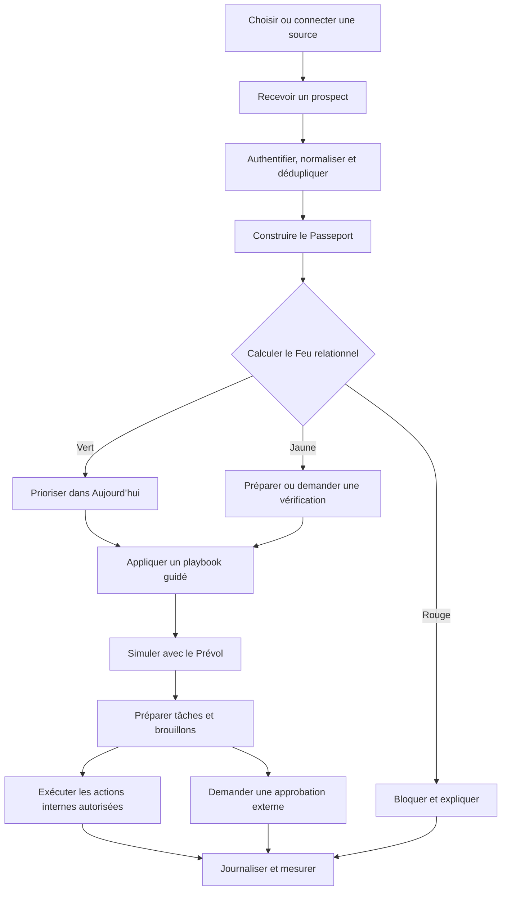
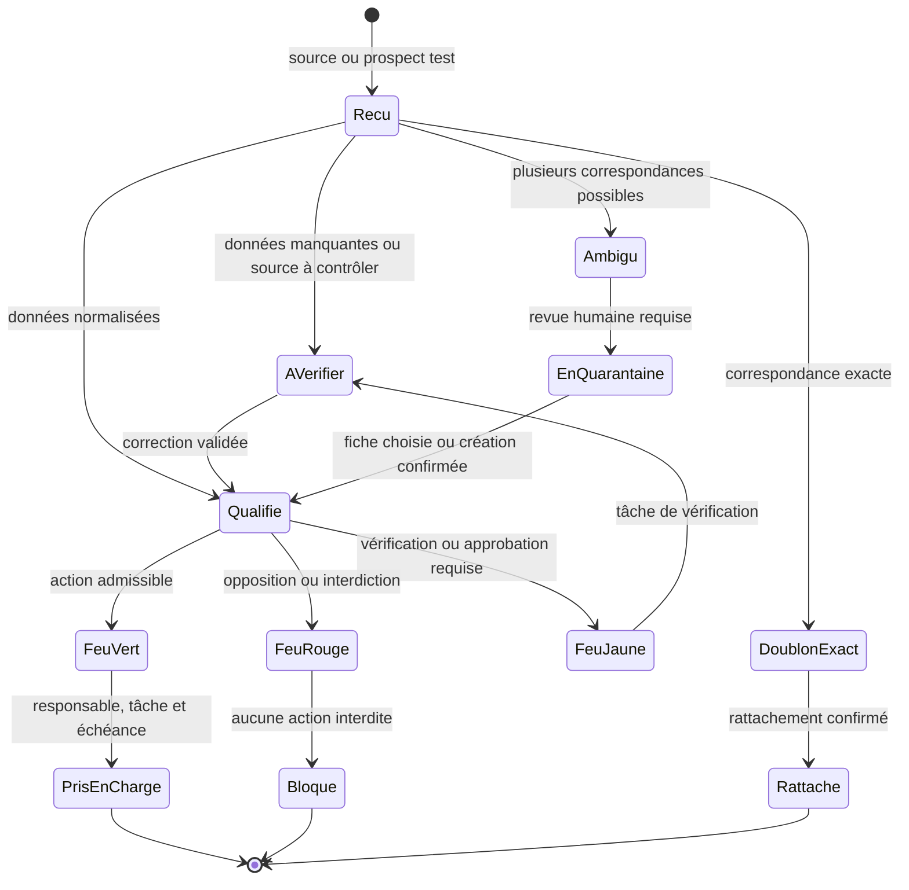

# Étape 2 — Conception fonctionnelle et UX de l’Automatisation Marketteo

| Élément | Valeur |
| --- | --- |
| Produit | Marketteo CRM |
| Programme | Automatisation commerciale assistée par l’IA |
| Phase programme | Pré-Phase 5 — Automatisation |
| Étape | 2 — Conception fonctionnelle et UX |
| Statut | **Clôturée — Porte 2 : GO avec réserves le 1er octobre 2026** |
| Autorisation d’étape | GO reçu le 23 septembre 2026 |
| Lancement de l’élaboration | GO reçu le 30 septembre 2026 |
| Alignement du socle | Traçabilité explicite avec la Phase 4.6 intégrée le 30 septembre 2026 |
| Porte de sortie | Porte 2 — Désirabilité et clarté |
| Document principal | [Boussole d’évolution](./BOUSSOLE_EVOLUTION_AUTOMATISATION_MARKETTEO.md) |
| Vision produit | [Volet Automatisation Marketteo](./VOLET_AUTOMATISATION_MARKETTEO.md) |
| Prototype cliquable | [Ouvrir le prototype du parcours Nouveau prospect](./PROTOTYPE_CLIQUABLE_ETAPE_2.html) |
| Analyse croisée | [Cohérence avec les Phases 1 à 4 et plan d’actions avant l’Étape 3](./ANALYSE_CROISEE_ETAPE_2_PHASES_1_A_4.md) |
| Dossier Vague A | [Traçabilité, navigation, sources, Feu relationnel et capacités](./VAGUE_A_FONDATIONS_DECISION.md) |
| Contre-validations | [Avis, preuves, réserves et vingt scénarios testables](./CONTRE_VALIDATIONS_VAGUE_A.md) |
| Dossier Vague B | [Cycles de vie, récupération, prototype V2, playbooks, acceptation et télémétrie](./VAGUE_B_PRODUIT_TESTABLE.md) |
| Prototype V2 | [Ouvrir le prototype intégré](./PROTOTYPE_CLIQUABLE_ETAPE_2_V2.html) |
| Revue Vague B | [Rapport de validation Produit du prototype V2](./RAPPORT_VALIDATION_VAGUE_B.md) |
| Recette et recherche | [Recette Vague B et protocole des sessions PME — Vague C](./RECETTE_ET_RECHERCHE_VAGUE_C.md) |
| Décision de sortie | [Porte 2 — GO avec réserves ; Étape 3 autorisée](./PORTE_2_GO_AVEC_RESERVES.md) |
| Référence figée | [`RF-AUT-2.1` — contrat fonctionnel transmis à l’architecture](./REFERENCE_FONCTIONNELLE_AUTOMATISATION_V2_1.md) |
| Étape suivante | [Étape 3 — Architecture, données et sécurité](./ETAPE_3_ARCHITECTURE_DONNEES_SECURITE.md) |
| Nature | Document de travail vivant de l’étape 2 |

## 1. Mission de l’étape 2

L’étape 2 transforme la vision validée en une expérience observable, testable et suffisamment précise pour guider ensuite l’architecture, le backlog et les critères de qualité.

Elle doit répondre à trois questions :

1. une PME comprend-elle rapidement la valeur proposée ?
2. peut-elle utiliser le noyau Lite sans maîtriser les workflows ni l’IA ?
3. l’expérience rend-elle les permissions, blocages et niveaux d’autonomie compréhensibles sans créer une charge administrative excessive ?

Cette étape produit des parcours, des spécifications fonctionnelles, des prototypes et des preuves issues de tests utilisateurs. Elle ne produit pas encore l’architecture détaillée ni le développement complet du MVP.

Dans la nomenclature globale de Marketteo, cette étape est l’**étape interne 2 de la Pré-Phase 5 — Automatisation**.

### 1.1 Résultat attendu

À la fin de l’étape, l’équipe doit pouvoir démontrer dans un prototype comment :

- un prospect entre dans Marketteo ;
- son origine et ses permissions sont représentées ;
- un responsable et une prochaine action lui sont attribués ;
- un playbook est simulé par le Prévol ;
- une action interne est préparée ou exécutée selon son niveau d’autonomie ;
- une communication externe demande une approbation humaine ;
- une opposition ou une donnée inconnue bloque ou suspend correctement l’action ;
- chaque recommandation et chaque blocage sont expliqués.

## 2. Sources et autorité

La présente conception doit respecter :

1. les obligations légales, contractuelles et de sécurité applicables ;
2. le socle fonctionnel et technique livré jusqu’à la [Phase 4.6](../PHASE_4_6_SPECIFICATIONS_DETAILLEES.md) et son [rapport d’implémentation](../PHASE_4_6_RAPPORT_IMPLEMENTATION.md) ;
3. les décisions validées dans le [Volet Automatisation Marketteo](./VOLET_AUTOMATISATION_MARKETTEO.md) ;
4. les étapes et portes définies dans la [Boussole d’évolution](./BOUSSOLE_EVOLUTION_AUTOMATISATION_MARKETTEO.md) ;
5. les décisions enregistrées pendant l’étape 2.

En cas de divergence, la conception est corrigée plutôt que la vision, sauf décision formelle de réouverture du cadrage.

### 2.1 Socle de référence — Phase 4.6

La Pré-Phase 5 — Automatisation est une extension du CRM existant. Elle ne recrée ni les prospects, ni les contacts, ni les tâches, ni les opportunités, ni l’audit dans un modèle parallèle.

La Phase 4.6 possède un GO de clôture locale et un verrou local vert. La preuve Azure reste requise pour le verdict global. Par décision produit du 30 septembre 2026, elle est reportée à la clôture de la Phase 5 : elle ne bloque plus l’Étape 3, mais reste une condition obligatoire du verdict final de la Phase 5. La révision locale 4.6 demeure la référence du socle pendant les travaux intermédiaires.

#### 2.1.1 Matrice de traçabilité fonctionnelle

| Capacité proposée | Ancrage dans le socle 4.6 | Décision de conception | Nature du travail restant |
| --- | --- | --- | --- |
| Boîte d’entrée prospects | Prospects, contacts, imports, quarantaine, provenance et état des sources | Construire une vue de travail sur les objets existants ; aucun second registre de prospects | Nouvelle projection UX et nouveaux états d’ingestion |
| Passeport de prise en charge | Origine, provenance, permission par canal, responsable et prochaine action | Agréger les preuves existantes dans la fiche prospect, le Copilote et le détail du playbook | Nouvel agrégat de lecture et règles d’explication |
| Copilote « Aujourd’hui » | Tâches, rappels, prochaines actions, priorités, pipeline et tableau de bord | Réutiliser les tâches et prochaines actions existantes ; ne pas créer une seconde liste de tâches | Nouvelle priorisation explicable et nouvelle surface UX |
| Playbook Nouveau prospect | Création de prospect, affectation à un membre, tâche, échéance et idempotence | Produire des commandes compatibles avec les cas d’usage CRM existants | Nouveau moteur de playbooks et nouvelles règles d’admission |
| Proposition en attente | Opportunités avec étape `proposal`, responsable, date de clôture et événements | Utiliser l’opportunité comme objet canonique ; l’alignement du pipeline prospect demeure explicite | Nouvelles règles de détection et de suivi |
| Occasion oubliée | Opportunités ouvertes, activités, tâches et échéances | Détecter l’inactivité sur l’opportunité sans changer silencieusement son étape ni celle du prospect | Nouvelle lecture croisée et nouveau playbook |
| Feu relationnel | Permissions `unknown`, `allowed`, `do_not_contact`, `opted_out`, dates de validité et provenance | Calculer un indicateur dérivé par action et par canal ; ne pas stocker une autorisation inventée | Nouveau moteur de règles déterministes et nouvelles explications |
| Sources sociales | Facebook et LinkedIn existent comme types de source et de canal ; Meta possède un pilote simulé | Meta réel reste conditionnel ; LinkedIn et les autres connecteurs ne sont pas considérés comme livrés | Adaptateurs et autorisations externes ultérieurs |
| Web et webhook générique | La provenance `api`, les fournisseurs, acquisitions et traitements durables sont réutilisables ; seul le webhook Meta spécialisé existe | Représenter une source Web V1 par un fournisseur/acquisition de type `api` tant qu’un besoin de sous-type distinct n’est pas validé | Formulaire Web, contrat webhook générique et authentification à créer |
| Prévol, versions et suspension | Worker durable, idempotence, audit et arrêt du binding Meta fournissent des patrons | Réutiliser ces garanties sans assimiler le Prévol à une exécution réelle | Nouveaux objets playbook, version, exécution, simulation et suspension |
| Brouillons et approbations | Activités courriel et permissions existent ; aucun service général de brouillon ou d’envoi externe n’est livré | Les brouillons sont des objets nouveaux ; aucun envoi externe autonome en V1 | Nouveau contrat de brouillon, approbation et éventuel fournisseur d’envoi |
| Assistance IA | Aucun moteur IA métier n’est requis par le socle 4.6 | Garder l’IA facultative : résumer, rédiger ou expliquer sans décider des permissions | Nouveau service borné, évalué et désactivable |
| Rôles et affectation | Rôles `admin`, `manager`, `sales` et affectation à une appartenance active | Conserver ces trois rôles ; traiter Confiance/Sécurité comme un mandat de capacités, non comme un quatrième rôle V1 | Capacités Automatisation à définir à l’étape 3 |

#### 2.1.2 Règles d’intégration au socle

- Toute commande d’automatisation utilise les cas d’usage CRM existants ou une extension explicitement versionnée de ceux-ci.
- L’organisation active, les capacités, la RLS, les versions optimistes et les clés d’idempotence restent obligatoires.
- Une tâche produite par un playbook est une tâche CRM existante, enrichie par une référence de déclencheur ; elle n’est pas copiée dans un stockage concurrent.
- Le propriétaire d’un prospect, le responsable d’une tâche et le responsable d’une opportunité demeurent des appartenances actives de l’organisation.
- Le pipeline prospect et le cycle d’opportunité restent deux objets distincts. Un playbook peut proposer leur alignement, jamais l’effectuer silencieusement.
- La provenance d’une entrée et la permission de contacter restent deux preuves séparées.
- Un type de source reconnu par le modèle ne constitue pas la preuve qu’un connecteur réel est disponible ou autorisé.
- Le worker durable, l’audit et les registres d’usage sont étendus par de nouveaux contrats fermés ; ils ne sont pas contournés.

## 3. Statut des éléments de conception

Chaque élément du présent document doit utiliser l’un des statuts suivants :

| Statut | Signification |
| --- | --- |
| `Validé` | Décision approuvée et utilisable comme entrée de l’étape 3 |
| `À tester` | Hypothèse à vérifier dans un prototype ou auprès d’utilisateurs |
| `À décider` | Choix fonctionnel nécessitant une décision explicite |
| `Bloqué` | Dépendance ou risque empêchant la finalisation |
| `Différé` | Élément volontairement déplacé après le noyau Lite |

Les règles issues directement du cadrage validé sont considérées comme `Validé`. Les choix d’interaction, de hiérarchie visuelle et de formulation restent `À tester` jusqu’aux recherches utilisateurs.

## 4. Contraintes non négociables

- Cinq capacités visibles au maximum dans le noyau Lite.
- Aucun constructeur de workflows au lancement.
- Aucune communication externe autonome en V1.
- Les communications externes peuvent être préparées, mais exigent une approbation humaine avant envoi.
- Les permissions, oppositions et limites de fréquence sont décidées par des règles déterministes.
- Une donnée absente, expirée ou contradictoire produit un état Jaune, jamais Vert.
- Une opposition explicite produit un état Rouge et bloque l’action.
- L’IA ne peut pas accorder une permission, lever une opposition ni augmenter son autonomie.
- Toute nouvelle version d’un playbook repasse par le Prévol.
- La valeur principale doit fonctionner avec Web, CSV, webhook ou prospect test.
- Les réseaux sociaux ne sont pas requis pour démontrer la valeur du noyau.
- La Boîte d’entrée, le Copilote et le Passeport sont des vues et agrégats sur les objets CRM existants, jamais des référentiels parallèles.
- L’affectation V1 vise un membre actif de l’organisation ; la gestion d’équipes structurées est différée.
- Les rôles V1 restent `admin`, `manager` et `sales` ; les responsabilités de confiance sont portées par des capacités et un mandat explicites.
- La disponibilité d’un type Facebook ou LinkedIn dans le modèle ne signifie pas qu’un connecteur réel est activé.
- Une source Web et un webhook générique sont des capacités nouvelles, même lorsqu’ils réutilisent la provenance `api` et le worker durable.
- L’IA reste facultative et ne doit pas être nécessaire au fonctionnement des règles Lite.
- Le système doit être utile dès le premier prospect.
- Le vocabulaire d’agent, d’orchestration ou de gouvernance technique ne doit pas être imposé à la PME.

## 5. Utilisateurs et besoins

### 5.1 Dirigeant ou propriétaire de PME

**Besoin :** savoir que les nouveaux prospects et suivis importants sont traités à temps.

**Questions principales :**

- Avons-nous oublié un prospect ?
- Qui en est responsable ?
- Quelle est la prochaine action ?
- Qu’est-ce qui est en retard ou bloqué ?
- Le système agit-il dans les limites autorisées ?

**Critère UX :** obtenir une compréhension de la situation sans ouvrir les détails techniques des playbooks.

### 5.2 Administrateur Marketteo

**Besoin :** connecter les sources, choisir les responsables, encadrer l’autonomie et diagnostiquer les erreurs.

**Questions principales :**

- La source fonctionne-t-elle ?
- Les champs sont-ils correctement associés ?
- Quelles actions seront créées ?
- Pourquoi une action est-elle bloquée ?
- Comment suspendre ou reprendre le système ?

**Critère UX :** configurer un playbook recommandé sans construire un diagramme logique.

### 5.3 Responsable commercial

**Besoin :** répartir les prospects et maintenir une discipline de suivi.

**Questions principales :**

- Quels prospects ne sont pas pris en charge ?
- Quels suivis risquent d’être oubliés ?
- Les délais convenus sont-ils respectés ?
- Les recommandations sont-elles utiles à l’équipe ?

**Critère UX :** comprendre les exceptions et réattribuer une action sans altérer les preuves de permission.

### 5.4 Commercial

**Besoin :** savoir quoi faire maintenant avec le moins de friction possible.

**Questions principales :**

- Pourquoi cette action est-elle prioritaire ?
- Que dois-je faire maintenant ?
- Puis-je contacter cette personne ?
- Que se passera-t-il si je reporte ?

**Critère UX :** décider depuis une carte synthétique sans reconstruire manuellement tout le contexte.

### 5.5 Mandat confiance, conformité ou sécurité

**Besoin :** vérifier les permissions, les blocages, les approbations et l’historique.

**Questions principales :**

- Quelle preuve a conduit à cette décision ?
- Qui a approuvé l’action ?
- Quelle version des règles a été utilisée ?
- Peut-on suspendre rapidement une automatisation ?

**Critère UX :** auditer un incident sans accéder à des données sans rapport avec son mandat.

Ce profil est un persona métier. Dans le socle 4.6, il ne correspond pas à un quatrième rôle technique : ses actions sont accordées à un `admin` ou un `manager` au moyen de capacités explicites. La création éventuelle d’un rôle spécialisé est différée jusqu’à ce qu’un besoin d’usage et de séparation des fonctions le justifie.

## 6. Architecture fonctionnelle de l’expérience



Les blocs « Boîte d’entrée », « Passeport », « Copilote » et « Historique » sont des projections de lecture et des surfaces de commande sur le CRM 4.6. Ils ne possèdent pas leur propre copie maîtresse des prospects, contacts, tâches ou opportunités.

### 6.1 Règle de navigation

L’utilisateur doit pouvoir passer de toute recommandation aux quatre preuves du Passeport :

- origine ;
- permission ;
- responsable ;
- prochaine action.

Il doit pouvoir revenir à son contexte précédent sans perdre son travail ni son filtre.

### 6.2 Règle d’explication

Une explication utile répond à quatre questions :

1. que recommande ou bloque Marketteo ?
2. pourquoi maintenant ?
3. quelles données et règles ont été utilisées ?
4. que peut faire l’utilisateur ensuite ?

## 7. Parcours de référence — Nouveau prospect

Le parcours « Nouveau prospect » sert de tranche fonctionnelle de référence. Les autres parcours seront déclinés après validation de ses mécanismes communs.

### 7.1 Scénario nominal

1. L’administrateur choisit un prospect test ou connecte une source.
2. Marketteo valide la source et la correspondance des champs.
3. Un prospect est reçu avec un identifiant d’origine.
4. Le système normalise les données et cherche un doublon exact.
5. Le Passeport affiche l’origine et l’état de permission.
6. Un membre actif par défaut est proposé ou attribué selon une règle explicite.
7. Le Feu relationnel est calculé.
8. Le playbook Nouveau prospect simule les actions au Prévol.
9. L’utilisateur voit la tâche, l’échéance, le brouillon éventuel et les blocages.
10. Le playbook démarre en mode `Préparer`.
11. Une tâche interne et une échéance sont créées.
12. Un brouillon peut être préparé si le canal est admissible.
13. Tout envoi externe exige une approbation humaine.
14. L’historique enregistre les données, règles, versions et résultats.

### 7.2 Résultat visible

Le prospect doit afficher :

- son origine ;
- son état Vert, Jaune ou Rouge ;
- son responsable ;
- sa prochaine action ;
- son échéance ;
- l’état du playbook ;
- les actions préparées, exécutées ou bloquées ;
- un accès à l’explication.

### 7.3 Variantes obligatoires

- responsable par défaut absent ;
- permission inconnue ;
- opposition explicite ;
- doublon exact ;
- correspondance ambiguë ;
- prospect sans adresse électronique ;
- délai de prise en charge déjà dépassé ;
- source déconnectée après réception ;
- règle modifiée pendant le Prévol ;
- tâche équivalente déjà existante ;
- utilisateur sans droit d’approbation.

### 7.4 Critères d’acceptation fonctionnels

| Identifiant | Critère |
| --- | --- |
| `FUX-NP-001` | Un prospect test permet de parcourir tout le scénario sans connecteur externe |
| `FUX-NP-002` | Une répétition de la même entrée n’affiche pas deux nouveaux prospects sans avertissement |
| `FUX-NP-003` | L’origine reste visible depuis la fiche et le Copilote |
| `FUX-NP-004` | Une permission inconnue produit un état Jaune |
| `FUX-NP-005` | Une opposition produit un état Rouge et bloque la préparation du contact concerné |
| `FUX-NP-006` | L’attribution et la tâche sont compréhensibles dans le Prévol |
| `FUX-NP-007` | Le mode actif commence en `Préparer` |
| `FUX-NP-008` | Aucun envoi externe ne peut être exécuté sans approbation humaine |
| `FUX-NP-009` | L’utilisateur peut suspendre le playbook depuis son détail |
| `FUX-NP-010` | L’historique explique les décisions avec les données et règles utilisées |

## 8. Onboarding PME

### 8.1 Objectif

Faire obtenir une première preuve de valeur en moins de dix minutes, sans dépendre d’un connecteur social.

### 8.2 Étapes proposées — à tester

| Étape UX | Question posée | Résultat attendu |
| --- | --- | --- |
| 1. Point de départ | « Comment voulez-vous essayer Marketteo ? » | Prospect test, CSV, Web ou webhook |
| 2. Responsable | « Qui reçoit les nouveaux prospects ? » | Membre actif par défaut |
| 3. Délai | « Sous combien de temps faut-il agir ? » | Échéance par défaut |
| 4. Objectif | « Que voulez-vous sécuriser en premier ? » | Playbook Nouveau prospect recommandé |
| 5. Prévol | « Voici ce qui se serait passé » | Tâches, brouillons et blocages simulés |
| 6. Activation | « Commencer en mode Préparer » | Playbook actif sans envoi autonome |
| 7. Preuve | « Votre premier prospect est pris en charge » | Passeport et prochaine action visibles |

### 8.3 Exigences fonctionnelles

- `FUX-ONB-001` — le prospect test est toujours disponible dans un environnement admissible ;
- `FUX-ONB-002` — l’utilisateur peut quitter et reprendre l’onboarding ;
- `FUX-ONB-003` — les données déjà saisies sont conservées après une erreur récupérable ;
- `FUX-ONB-004` — chaque choix explique son effet immédiat ;
- `FUX-ONB-005` — le Prévol précède toute activation ;
- `FUX-ONB-006` — l’activation démarre en mode `Préparer` ;
- `FUX-ONB-007` — une source en erreur n’empêche pas l’essai avec le prospect test ;
- `FUX-ONB-008` — le succès est défini par une prise en charge visible, pas par la seule connexion d’une source.

### 8.4 Points à tester

- nombre d’étapes perçu ;
- compréhension du terme Prévol ;
- valeur du prospect test ;
- valeur par défaut du délai ;
- moment opportun pour expliquer le Feu relationnel ;
- utilité d’un indicateur de progression ;
- nécessité d’une aide contextuelle.

## 9. Boîte d’entrée prospects

### 9.1 Objectif

Présenter les nouvelles entrées et les exceptions à résoudre sans devenir une seconde boîte de courriels.

La Boîte d’entrée est une projection de travail sur les prospects, résultats d’ingestion, imports et quarantaines du socle 4.6. Elle n’introduit ni un second identifiant de prospect ni un cycle de vie CRM concurrent. Une entrée non encore convertie conserve une référence d’ingestion ; dès sa création ou son rattachement, la fiche prospect existante devient la source de vérité.

### 9.2 Catégories fonctionnelles

- nouveaux prospects prêts à être pris en charge ;
- prospects nécessitant une vérification ;
- doublons exacts déjà traités ;
- correspondances ambiguës en quarantaine ;
- erreurs de source ou de champ ;
- entrées ignorées avec raison explicite.

### 9.3 Informations minimales par ligne

- identité disponible ;
- entreprise, si connue ;
- source et date ;
- état du Feu relationnel ;
- responsable ou absence de responsable ;
- prochaine action ou exception ;
- état de traitement.

### 9.4 Actions autorisées

- ouvrir le Passeport ;
- attribuer ou réattribuer ;
- créer une tâche ;
- corriger un champ autorisé ;
- confirmer qu’il s’agit d’un doublon ;
- conserver les fiches séparées ;
- demander une vérification ;
- ignorer avec une raison ;
- ouvrir le diagnostic contextuel ou les réglages d’intégration existants.

### 9.5 Exigences

- `FUX-INB-001` — une ambiguïté ne déclenche aucune fusion automatique ;
- `FUX-INB-002` — chaque entrée ignorée conserve une raison auditable ;
- `FUX-INB-003` — les filtres distinguent travail normal et exceptions ;
- `FUX-INB-004` — l’utilisateur peut comprendre l’état sans ouvrir chaque fiche ;
- `FUX-INB-005` — une action en masse ne contourne pas le Feu relationnel ni les permissions.

## 10. Passeport de prise en charge

### 10.1 Objectif

Rassembler les preuves nécessaires à une prise en charge fiable sans créer un écran administratif séparé.

### 10.2 Structure

| Bloc | Contenu minimal | Action possible |
| --- | --- | --- |
| Origine | Source, date, campagne, identifiant externe | Voir les détails de réception |
| Permission | Canal, finalité, preuve, échéance et Feu | Corriger ou demander une vérification selon les droits |
| Responsable | Membre actif, règle d’attribution | Réattribuer avec trace |
| Prochaine action | Type, échéance, état et playbook | Exécuter, préparer, reporter ou ouvrir |

### 10.3 Principes UX

- visible dans la fiche prospect ;
- accessible depuis une carte du Copilote ;
- résumé dans le détail d’une automatisation ;
- éléments manquants clairement signalés ;
- raisons et sources accessibles sans jargon ;
- historique séparé du résumé courant.

### 10.4 Exigences

- `FUX-PAS-001` — les quatre blocs distinguent information connue, inconnue et contestée ;
- `FUX-PAS-002` — une correction n’efface pas la valeur antérieure de l’historique ;
- `FUX-PAS-003` — la provenance de chaque fait utilisé par l’IA est accessible ;
- `FUX-PAS-004` — l’absence de prochaine action est visible comme exception ;
- `FUX-PAS-005` — la réattribution affiche son effet avant confirmation.

## 11. Feu relationnel

### 11.1 Objectif

Rendre une décision complexe compréhensible en indiquant si une action peut être exécutée, doit être vérifiée ou doit être bloquée.

### 11.2 États

| État | Sens fonctionnel | Comportement UX |
| --- | --- | --- |
| Vert | Action admissible selon les données et règles configurées | Préparation ou action interne selon l’autonomie autorisée |
| Jaune | Donnée absente, contradictoire, expirée ou approbation nécessaire | Préparer, demander ou créer une tâche de vérification |
| Rouge | Opposition ou interdiction déterministe | Bloquer, expliquer et journaliser |

### 11.3 Explication minimale

L’explication doit afficher :

- l’état ;
- l’action évaluée ;
- la règle principale ;
- les données déterminantes ;
- la date du calcul ;
- l’étape suivante possible ;
- une mention claire que Vert n’est pas une garantie juridique.

### 11.4 Priorité des règles — à confirmer à l’étape 3

Ordre fonctionnel attendu :

1. opposition ou interdiction explicite ;
2. permission et finalité ;
3. expiration ou absence de preuve ;
4. fréquence et attente convenue ;
5. conflit ou doublon d’automatisation ;
6. niveau d’autonomie ;
7. limites de volume ou de coût.

### 11.5 Exigences

- `FUX-FEU-001` — l’état est calculé pour une action et un canal précis ;
- `FUX-FEU-002` — l’inconnu ne produit jamais Vert ;
- `FUX-FEU-003` — Rouge bloque avant toute préparation interdite ;
- `FUX-FEU-004` — la raison principale et les raisons secondaires sont accessibles ;
- `FUX-FEU-005` — une modification des données déclenche un nouveau calcul ;
- `FUX-FEU-006` — l’utilisateur autorisé peut signaler une erreur sans modifier directement une preuve protégée.

## 12. Prévol et autonomie progressive

### 12.1 Objectif

Permettre d’observer les conséquences d’un playbook avant son activation et de limiter son autonomie par type d’action.

### 12.2 Modes

| Mode | Effet réel | Résultat présenté |
| --- | --- | --- |
| Essayer | Aucun | Simulation des actions, blocages et volumes |
| Préparer | Tâches et brouillons autorisés | Éléments prêts pour intervention humaine |
| Agir | Actions internes explicitement autorisées | Exécution, historique et possibilité de suspension |

Les communications externes restent hors du mode `Agir` en V1.

### 12.3 Résumé de Prévol

Le résumé doit présenter :

- période ou données simulées ;
- nombre de prospects concernés ;
- tâches qui seraient créées ;
- brouillons qui seraient préparés ;
- actions internes qui seraient exécutées ;
- actions demandant une approbation ;
- actions bloquées, regroupées par raison ;
- conflits ou doublons détectés ;
- estimation de volume et, si disponible, de coût ;
- version des règles et du playbook.

### 12.4 Exigences

- `FUX-PRE-001` — le Prévol ne produit aucun effet métier réel ;
- `FUX-PRE-002` — il utilise les mêmes règles fonctionnelles que le mode actif ;
- `FUX-PRE-003` — une modification crée une nouvelle version nécessitant un nouveau Prévol ;
- `FUX-PRE-004` — le niveau d’autonomie est défini par playbook et type d’action ;
- `FUX-PRE-005` — Marketteo ne promeut jamais automatiquement vers `Agir` ;
- `FUX-PRE-006` — une anomalie peut rétrograder ou suspendre ;
- `FUX-PRE-007` — l’utilisateur voit clairement ce qui changera lors de l’activation.

## 13. Copilote « Aujourd’hui »

### 13.1 Objectif

Présenter les actions commerciales les plus importantes sans devenir un tableau de bord analytique complexe.

### 13.2 Limites

- cinq cartes au maximum par utilisateur ;
- priorisation initiale par règles explicites ;
- l’IA peut résumer, mais ne décide pas seule des permissions ;
- une carte retirée ou reportée doit conserver une trace ;
- une recommandation ne doit pas masquer une opposition.

### 13.3 Anatomie d’une carte

- type de situation ;
- prospect ou occasion ;
- raison de la priorité ;
- prochaine action proposée ;
- résultat attendu ;
- Feu relationnel ;
- échéance ou retard ;
- accès au Passeport ;
- actions `Exécuter maintenant`, `Préparer` et `Reporter` selon le contexte.

### 13.4 Règles initiales de priorité — à tester

1. nouveau prospect non pris en charge dans le délai ;
2. opposition, permission ou conflit demandant une intervention ;
3. tâche critique ou en retard ;
4. proposition sans réponse après le délai ;
5. occasion sans prochaine action ;
6. autres recommandations selon valeur, ancienneté et charge.

Les règles exactes et leurs poids seront décidés avant la Porte 2 et détaillés techniquement à l’étape 3.

### 13.5 Exigences

- `FUX-COP-001` — chaque carte indique « pourquoi maintenant » ;
- `FUX-COP-002` — le Passeport est accessible sans perdre la liste ;
- `FUX-COP-003` — Reporter demande une durée ou une date pertinente ;
- `FUX-COP-004` — une action obsolète disparaît ou se met à jour sans duplication ;
- `FUX-COP-005` — une recommandation bloquée n’offre pas une action interdite ;
- `FUX-COP-006` — le nombre de cartes ne dépasse pas cinq.

### 13.6 Point d’entrée utilisateur unique « Demander à l’IA »

L’entrée conversationnelle se trouve en tête de `Aujourd’hui`, avant les indicateurs et les cartes. Elle est également disponible sur mobile via un bouton fixe `Demander à l’IA` qui ramène vers ce même champ. Elle constitue l’unique point où un utilisateur formule une **nouvelle intention métier**, par exemple : « Combien de prospects sont en cours ? », « Répartis les prospects en cours entre mon équipe » ou « Montre-moi les prospects sans activité depuis 14 jours ».

Les écrans `Playbooks` et `Entrées et exceptions` restent directement consultables, mais leur fonction est secondaire : contrôler une recette existante, consulter un Prévol, suspendre/reprendre ou résoudre un blocage. Ils ne proposent ni champ libre, ni bouton générique « créer une automatisation ».

Ce n’est ni un constructeur libre de workflows, ni un accès direct aux effets CRM. À la soumission, le produit reformule la demande sous forme d’un **plan à prévisualiser** :

1. demande d’origine et interprétation proposée ;
2. périmètre et volume estimés sur les objets CRM canoniques ;
3. règles, playbooks et exceptions mobilisés ;
4. Feu relationnel et limites applicables ;
5. actions éventuellement préparables, capacités requises et approbations futures.

Une demande ambiguë appelle une précision ; une demande non compatible est refusée avec une explication. Le clic `Préparer ce plan` ne crée aucun prospect, tâche, réattribution, changement de pipeline ou communication externe : ces effets restent soumis aux écrans existants, aux capacités et aux contrôles correspondants.

Application `IMP-A5` confirmée le 3 octobre 2026 : le plan affiché est strictement temporaire et disparaît au
rechargement. Dans cette tranche, `Préparer ce plan` confirme localement l'absence d'effet ; il ne crée pas encore de
Prévol durable. La saisie reste exclusivement sur `/app/automation/today`, accessible depuis `Automatisation` après
`Tableau de bord`.

Le point d’entrée unique est un principe UX, pas un déclencheur technique exclusif. Les événements déjà configurés — nouveau prospect admis, proposition silencieuse, occasion inactive — continuent d’alimenter les playbooks et les cartes sans saisie préalable. Si la génération IA est indisponible, le même composant se replie sur des intentions guidées et des filtres déterministes ; l’utilisateur ne doit pas chercher un autre écran.

Exigences complémentaires :

- `FUX-IA-001` — le champ explique qu’il prépare un plan et non une action automatique ;
- `FUX-IA-002` — le résultat conserve la demande d’origine et expose son interprétation ;
- `FUX-IA-003` — le plan indique son périmètre, les données concernées et les limites ;
- `FUX-IA-004` — le Feu relationnel, les exceptions et les capacités ne peuvent jamais être contournés par le langage naturel ;
- `FUX-IA-005` — les réponses se limitent aux recettes, objets et actions autorisés ; elles ne créent pas de workflow libre ;
- `FUX-IA-006` — sur mobile, le point d’entrée reste atteignable sans masquer le contenu ni la navigation ;
- `FUX-IA-007` — aucun autre écran ne propose une création générique ou un second champ d’intention ;
- `FUX-IA-008` — en indisponibilité du modèle IA, le même point d’entrée présente des intentions guidées déterministes ;
- `FUX-IA-009` — une entrée technique déjà configurée peut déclencher une évaluation sans demander une phrase à l’utilisateur.

### 13.7 Décision de simplification — aucune surface « Sources »

La navigation Automatisation est limitée à trois surfaces : `Aujourd’hui`, `Playbooks` et `Entrées et exceptions`. Le menu autonome `Sources` est retiré : il n’aide pas directement un commercial à prendre en charge un prospect et alourdit inutilement l’adoption PME.

La santé d’un connecteur reste une information nécessaire, mais uniquement dans son contexte : une source déconnectée apparaît dans `Entrées et exceptions`, avec son diagnostic, puis dirige si nécessaire vers les réglages d’intégration existants hors du module Automatisation. Les sources, contrats d’entrée, provenances et permissions demeurent donc dans le domaine fonctionnel, sans devenir une destination de navigation quotidienne.

## 14. Playbook — Nouveau prospect

### 14.1 Déclencheur

Prospect admissible reçu depuis une source autorisée et non résolu comme doublon exact.

### 14.2 Paramètres visibles

- membre actif responsable par défaut ;
- délai de prise en charge ;
- création ou non d’un brouillon admissible.

### 14.3 Actions

- attribuer un responsable ;
- créer une tâche ;
- fixer une échéance ;
- préparer un brouillon si permis ;
- mesurer le délai de prise en charge.

### 14.4 Arrêts et exceptions

- opposition ;
- source non authentifiée ;
- correspondance ambiguë ;
- absence de responsable disponible ;
- limite de volume ;
- playbook suspendu ;
- prospect déjà pris en charge.

### 14.5 Résultat attendu

Tout prospect admissible possède un responsable et une prochaine action, ou une exception explicite à résoudre.

## 15. Playbook — Proposition en attente

### 15.1 Déclencheur

Opportunité ouverte à l’étape canonique `proposal`, sans réponse ni activité pertinente après le délai configuré.

L’opportunité est l’objet métier de référence de ce playbook. L’étape `proposal_sent` du pipeline prospect peut être affichée pour contexte ou proposée comme alignement, mais elle ne déclenche pas seule une relance et n’est jamais modifiée silencieusement.

### 15.2 Paramètres visibles

- délai avant rappel ;
- responsable de la tâche ;
- création ou non d’un brouillon.

### 15.3 Actions

- vérifier le Feu relationnel ;
- créer une tâche de suivi ;
- préparer un rappel admissible ;
- demander une vérification si nécessaire ;
- arrêter lorsque la réponse ou l’état change.

### 15.4 Arrêts et exceptions

- réponse reçue ;
- proposition fermée ;
- opposition ;
- attente explicitement convenue ;
- autre tâche équivalente active ;
- limite de fréquence atteinte.

### 15.5 Résultat attendu

Les propositions silencieuses deviennent une action explicite sans produire une relance inappropriée ou dupliquée.

## 16. Playbook — Occasion oubliée

### 16.1 Déclencheur

Opportunité active dans une étape ouverte (`discovery`, `qualification`, `proposal` ou `negotiation`), sans activité récente, prochaine action ou échéance selon les règles configurées.

Le playbook observe l’opportunité, ses activités CRM associées, son responsable, sa date de clôture attendue et les tâches ouvertes du prospect. Il peut proposer un alignement du pipeline prospect, mais ne l’exécute pas automatiquement.

### 16.2 Paramètres visibles

- durée d’inactivité ;
- étapes concernées ;
- responsable de la revue.

### 16.3 Actions

- créer une tâche de revue ;
- proposer une relance, une révision ou une fermeture ;
- afficher le contexte et la dernière activité ;
- demander une décision humaine.

### 16.4 Arrêts et exceptions

- occasion déjà fermée ;
- activité récente non encore synchronisée ;
- prochaine action existante ;
- attente explicite ;
- playbook suspendu.

### 16.5 Résultat attendu

Aucune occasion active ne reste durablement sans prochaine action ou décision explicite.

## 17. Rôles, permissions et approbations

### 17.1 Matrice fonctionnelle initiale

| Action | Commercial (`sales`) | Responsable (`manager`) | Administrateur (`admin`) | Mandat Confiance/Sécurité |
| --- | --- | --- | --- | --- |
| Voir ses recommandations | Oui, périmètre personnel | Oui, périmètre autorisé | Oui, organisation | Selon capacités du rôle porteur |
| Exécuter une action manuelle autorisée | Oui | Oui | Oui | Non nécessaire |
| Réattribuer un prospect | Selon règle | Oui | Oui | Non nécessaire |
| Modifier les paramètres d’un playbook | Non | Selon délégation | Oui | Consultation si risque |
| Lancer un Prévol | Lecture ou demande | Oui | Oui | Oui |
| Activer en mode Préparer | Non | Selon délégation | Oui | Selon politique |
| Autoriser une action interne autonome | Non | Selon délégation | Oui | Revue pour action sensible |
| Approuver une communication externe | Selon droit | Oui | Oui | Selon politique |
| Suspendre un playbook | Demande | Oui | Oui | Oui |
| Lever une opposition | Jamais directement | Jamais directement | Jamais directement | Processus séparé et preuve requise |
| Consulter l’audit | Non dans le socle 4.6 | Organisation selon capacité | Organisation | Selon capacités du rôle porteur |

Cette matrice reste une hypothèse pour les nouvelles actions d’Automatisation. Elle part toutefois d’une contrainte validée : les rôles techniques du socle 4.6 demeurent `admin`, `manager` et `sales`. « Confiance/Sécurité » désigne un mandat exercé par un rôle existant disposant des capacités nécessaires ; ce n’est pas un quatrième rôle V1.

### 17.2 Règles d’affectation compatibles avec le socle

- Le propriétaire d’un prospect, le responsable d’une tâche et le responsable d’une opportunité sont des appartenances actives de l’organisation.
- Une « équipe commerciale » peut rester un libellé de contexte UX, mais elle ne constitue pas une cible d’affectation V1 tant qu’aucune entité équipe n’existe.
- L’onboarding choisit un membre actif par défaut. Si ce membre devient inactif, le playbook crée une exception à résoudre et n’effectue aucune attribution aléatoire.
- Une future distribution par équipe, territoire, rotation ou charge exigera un modèle et des règles propres, validés à l’étape 3 ou dans une évolution ultérieure.
- Les nouvelles capacités envisagées — consulter, configurer, prévisualiser, activer, suspendre et approuver — seront ajoutées à la matrice de capacités existante ; elles ne seront pas déduites du seul affichage d’un bouton.

### 17.3 Principes d’approbation

- l’approbation porte sur une action précise et un contenu précis ;
- une modification importante après approbation peut l’invalider ;
- une approbation expire si l’action devient obsolète ;
- l’approbateur voit le destinataire, le canal, le contenu, la raison et le Feu relationnel ;
- le refus demande une raison courte facultative ou structurée ;
- une approbation ne peut pas contourner une opposition déterministe.

## 18. Inventaire initial des écrans

| Identifiant | Écran ou surface | Utilisateur principal | Objectif |
| --- | --- | --- | --- |
| `UX-01` | Assistant IA dans Aujourd’hui | Tous selon droits | Formuler une intention et obtenir un plan explicable |
| `UX-02` | Connexion/import de source | Administrateur | Configurer et valider l’entrée après identification du besoin |
| `UX-03` | Responsable et délai | Administrateur | Définir la prise en charge |
| `UX-04` | Confirmation du playbook proposé | Administrateur | Confirmer la recette guidée rattachée à l’intention |
| `UX-05` | Résultat du Prévol | Administrateur/Responsable | Comprendre les effets simulés |
| `UX-06` | Confirmation d’activation | Administrateur | Activer en mode Préparer |
| `UX-07` | Copilote Aujourd’hui | Commercial/Responsable | Voir les priorités |
| `UX-08` | Boîte d’entrée prospects | Commercial/Responsable | Traiter entrées et exceptions |
| `UX-09` | Fiche prospect et Passeport | Tous selon droits | Comprendre la prise en charge |
| `UX-10` | Détail du Feu relationnel | Tous selon droits | Comprendre permission ou blocage |
| `UX-11` | Catalogue des trois playbooks | Administrateur | Choisir et comparer |
| `UX-12` | Configuration guidée d’un playbook | Administrateur | Régler peu de paramètres |
| `UX-13` | Détail d’un playbook actif | Administrateur/Responsable | Voir état, résultats et actions |
| `UX-14` | Historique d’exécution | Responsable/Confiance | Auditer les résultats |
| `UX-15` | Approbation d’une communication | Utilisateur autorisé | Examiner et décider |
| `UX-16` | Centre des exceptions | Administrateur/Responsable | Résoudre les blocages récupérables |
| `UX-17` | Diagnostic de source contextuel | Administrateur/Soutien | Comprendre une panne et ouvrir les réglages d’intégration existants |
| `UX-18` | Paramètres d’autonomie | Administrateur | Voir les droits par action |

La nécessité de chaque écran séparé doit être testée. Plusieurs surfaces peuvent être regroupées si cela réduit la charge cognitive sans masquer les contrôles.

## 19. États UX et récupération

### 19.1 États communs

Chaque surface critique doit définir :

- initial ou vide ;
- chargement ;
- succès ;
- avertissement ;
- erreur récupérable ;
- blocage déterministe ;
- droit insuffisant ;
- donnée partielle ;
- source déconnectée ;
- traitement long ;
- reprise après interruption ;
- résultat obsolète.

### 19.2 Structure d’un message utile

Un message doit indiquer :

1. ce qui s’est passé ;
2. ce qui a été ou n’a pas été modifié ;
3. ce que l’utilisateur peut faire ;
4. où obtenir davantage de détails ;
5. un identifiant de diagnostic si le soutien en a besoin.

### 19.3 Principes de récupération

- ne jamais demander de recommencer l’ensemble du parcours si une reprise locale est possible ;
- conserver les paramètres valides ;
- éviter les boutons « Réessayer » qui peuvent dupliquer une action ;
- rendre les actions irréversibles rares et explicitement confirmées ;
- permettre la suspension avant la résolution complète d’un incident ;
- distinguer une erreur technique d’un blocage de permission.

## 20. Langage, contenu et accessibilité

### 20.1 Vocabulaire recommandé

| Utiliser | Éviter dans l’expérience Lite |
| --- | --- |
| Playbook ou recette guidée | Orchestration d’agents |
| Prévol | Bac à sable d’exécution autonome |
| Préparer | Semi-autonomie |
| Feu relationnel | Moteur de conformité décisionnel |
| Responsable | Propriétaire d’entité |
| Prochaine action | Nœud d’exécution |
| Suspendre | Désactiver l’agent |
| Pourquoi maintenant | Score de priorité opaque |

### 20.2 Principes de rédaction

- commencer par le résultat ou le problème ;
- utiliser des verbes d’action ;
- expliquer la raison en langage métier ;
- distinguer recommandation, permission et garantie ;
- éviter les formulations culpabilisantes ;
- afficher les conséquences avant confirmation ;
- ne pas attribuer une intention humaine à l’IA.

### 20.3 Accessibilité

- navigation clavier complète ;
- ordre de focus logique ;
- étiquettes accessibles pour les contrôles ;
- états annoncés aux technologies d’assistance ;
- contraste suffisant ;
- information non transmise uniquement par la couleur ;
- texte redimensionnable ;
- messages d’erreur reliés aux champs ;
- cibles d’interaction adaptées ;
- tests avec lecteurs d’écran sur les parcours critiques.

## 21. Télémétrie fonctionnelle

### 21.1 Principes

- mesurer les résultats, pas seulement les clics ;
- limiter les données personnelles ;
- distinguer comportement utilisateur et action automatique ;
- relier Prévol, activation et exécution sans exposer le contenu sensible ;
- versionner les événements ;
- prévoir les propriétés nécessaires avant le prototype final.

### 21.2 Événements conceptuels

| Événement | Propriétés minimales |
| --- | --- |
| Onboarding commencé | méthode choisie, rôle, version |
| Source validée ou rejetée | type, résultat, catégorie d’erreur |
| Prévol terminé | playbook, version, volumes simulés, blocages |
| Playbook activé | mode, paramètres non sensibles, acteur |
| Recommandation affichée | type, règle principale, position |
| Recommandation décidée | exécuter, préparer, reporter ou contester |
| Feu calculé | état, action, canal, catégories de raisons |
| Approbation décidée | accord, refus ou expiration |
| Action terminée | type, mode, résultat et durée |
| Playbook suspendu | acteur et catégorie de raison |
| Exception résolue | type, résolution et délai |

### 21.3 Indicateurs de l’étape 2

- taux de réussite du prototype sans aide ;
- temps jusqu’à la première preuve de valeur simulée ;
- taux de compréhension du Feu relationnel ;
- taux de compréhension du Prévol ;
- erreurs de distinction entre action manuelle, préparation et autonomie ;
- capacité à trouver origine, responsable et prochaine action ;
- nombre d’hésitations ou retours dans le parcours ;
- confiance déclarée avant et après l’explication ;
- termes mal compris ;
- approbations perçues comme inutiles.

## 22. Recherche utilisateur

### 22.1 Objectifs

- vérifier la compréhension de la promesse ;
- tester l’onboarding en moins de dix minutes ;
- observer la capacité à interpréter le Feu relationnel ;
- vérifier la distinction entre Prévol, Préparer et Agir ;
- identifier la fatigue d’approbation ;
- valider la valeur des trois playbooks ;
- détecter les attentes implicites envers les réseaux sociaux ou l’IA.

### 22.2 Profils à recruter

- dirigeants de petites entreprises ;
- administrateurs ou responsables des ventes ;
- commerciaux utilisant un CRM ;
- PME structurées et PME peu matures en automatisation ;
- au moins quelques participants ayant déjà utilisé un outil d’automatisation.

Le nombre exact de participants dépendra du protocole, mais la diversité des contextes ne doit pas conduire à concevoir plusieurs produits en parallèle.

### 22.3 Tâches de test

1. essayer Marketteo avec un prospect test ;
2. configurer un délai et un responsable ;
3. comprendre un résultat de Prévol ;
4. activer le mode Préparer ;
5. traiter une carte du Copilote ;
6. expliquer le Passeport d’un prospect ;
7. résoudre un état Jaune ;
8. comprendre pourquoi un état Rouge bloque ;
9. approuver ou refuser un brouillon externe ;
10. suspendre un playbook.

### 22.4 Questions de débrief

- Que pensez-vous que Marketteo fera ensuite ?
- Qu’est-ce qui vous rassure ou vous inquiète ?
- Quelle information manque pour décider ?
- Quelle différence voyez-vous entre Vert et « légalement garanti » ?
- Où iriez-vous pour arrêter l’automatisation ?
- Quel playbook utiliseriez-vous en premier ?
- Payeriez-vous pour le résultat présenté, et pourquoi ?

### 22.5 Gravité des constats

| Gravité | Définition | Traitement |
| --- | --- | --- |
| Critique | Conduit à une action risquée ou empêche le parcours | Corriger avant la Porte 2 |
| Élevée | Crée une incompréhension majeure ou un abandon | Corriger ou présenter comme réserve bloquante |
| Moyenne | Ralentit ou nécessite une aide | Prioriser selon fréquence et impact |
| Faible | Préférence ou amélioration cosmétique | Consigner pour itération |

## 23. Scénarios d’acceptation transversaux

### 23.1 Permission inconnue

**Étant donné** un prospect sans preuve suffisante pour le canal, **quand** une communication est évaluée, **alors** le Feu est Jaune, le système peut préparer une tâche de vérification et aucun envoi autonome n’est proposé.

### 23.2 Opposition explicite

**Étant donné** une opposition enregistrée, **quand** un playbook tente une communication concernée, **alors** le Feu est Rouge, l’action est bloquée et la raison est journalisée.

### 23.3 Approbation externe

**Étant donné** un brouillon admissible, **quand** l’utilisateur veut l’envoyer, **alors** une approbation humaine valide le destinataire, le canal, le contenu et le contexte avant toute exécution.

### 23.4 Événement répété

**Étant donné** une entrée déjà reçue, **quand** le même événement est livré à nouveau, **alors** l’expérience ne crée pas silencieusement un second prospect ni une seconde tâche.

### 23.5 Modification du playbook

**Étant donné** un playbook actif, **quand** un paramètre matériel change, **alors** une nouvelle version est créée et un nouveau Prévol est requis avant activation.

### 23.6 Suspension

**Étant donné** une anomalie, **quand** un utilisateur autorisé suspend le playbook, **alors** aucune nouvelle action n’est engagée et les éléments déjà préparés restent identifiables.

### 23.7 Source déconnectée

**Étant donné** une source révoquée, **quand** l’utilisateur consulte sa santé, **alors** le produit distingue les données déjà reçues des nouvelles entrées non reçues et propose une reconnexion.

### 23.8 Recommandation obsolète

**Étant donné** une carte affichée, **quand** la situation est résolue ailleurs, **alors** l’action est rafraîchie ou retirée avant une nouvelle exécution.

## 24. Plan de réalisation de l’étape 2

### 24.1 Lot A — Fondations fonctionnelles

- confirmer utilisateurs et responsabilités ;
- valider les termes ;
- figer les règles non négociables ;
- créer la matrice rôles et actions ;
- recenser les événements et états.

**Sortie :** langage commun et inventaire fonctionnel.

### 24.2 Lot B — Parcours de référence

- cartographier Nouveau prospect ;
- concevoir onboarding, Passeport, Feu et Prévol ;
- écrire les scénarios nominaux et d’exception ;
- produire les premiers wireframes.

**Sortie :** parcours complet basse fidélité.

### 24.3 Lot C — Expérience quotidienne

- concevoir Copilote et Boîte d’entrée ;
- relier recommandations, Passeport et actions ;
- définir les états de récupération ;
- tester la limite de cinq cartes.

**Sortie :** traitement quotidien cohérent.

### 24.4 Lot D — Playbooks et administration

- décliner les trois playbooks ;
- concevoir configuration, Prévol, activation et suspension ;
- concevoir historique et approbation ;
- vérifier la cohérence de l’autonomie.

**Sortie :** administration complète sans constructeur de workflows.

### 24.5 Lot E — Prototype et recherche

- assembler le prototype cliquable ;
- préparer le protocole ;
- recruter les participants ;
- conduire et analyser les tests ;
- corriger les problèmes critiques et élevés.

**Sortie :** preuves de compréhension et d’utilisabilité.

### 24.6 Lot F — Dossier de Porte 2

- finaliser les spécifications ;
- documenter les décisions et risques ;
- consolider les métriques et résultats ;
- identifier les entrées de l’étape 3 ;
- préparer la décision `GO`, `GO avec réserves` ou `NO-GO`.

**Sortie :** dossier de passage vers l’architecture.

## 25. Livrables obligatoires

| Livrable | Statut initial | Responsable attendu |
| --- | --- | --- |
| Carte des parcours | À produire | Design/Produit |
| Architecture de l’information | Contre-validée ; règle mobile transférée au prototype V2 | Design |
| Wireframes basse fidélité | Prototype autonome créé | Design/Produit |
| Prototype cliquable | Créé — validation fonctionnelle statique effectuée | Design/Produit |
| Inventaire des écrans et composants | Ébauche dans ce document | Design/Ingénierie |
| Spécification des trois playbooks | Ébauche dans ce document | Produit |
| Matrice rôles et permissions | Contre-validée ; contrôles d’effet transférés à l’Étape 3 | Produit/Confiance |
| Matrice de traçabilité Phase 4.6 | Intégrée à la section 2.1 | Produit/Ingénierie/Qualité |
| Matrice détaillée du Feu | Contre-validée après séparation du Feu relationnel et de l’opérationnel | Produit/Confiance |
| Contrat fonctionnel du Prévol | Ébauche dans ce document | Produit/Ingénierie |
| Catalogue des erreurs et explications | Élaboré dans le dossier Vague B | Produit/Design |
| Scénarios d’acceptation | Élaborés dans le dossier Vague B | Produit/Qualité |
| Plan de télémétrie | Élaboré dans le dossier Vague B | Produit/Données |
| Rapport de recherche utilisateur | Différé après la mise en production — réserve explicite | Design/Produit |
| Journal de décision de l’étape | À maintenir | Produit |
| Dossier de Porte 2 | [Approuvé — GO avec réserves](./PORTE_2_GO_AVEC_RESERVES.md) | Responsable de l’étape |

## 26. Critères de sortie — Porte 2

La Porte 2 peut recevoir un `GO` lorsque :

- le parcours principal est réalisable dans le prototype sans accompagnement ;
- la première preuve de valeur peut être atteinte dans la cible de dix minutes ;
- les cinq capacités Lite forment une expérience cohérente ;
- les états critiques et les exceptions principales sont représentés ;
- les trois playbooks possèdent des critères d’acceptation ;
- aucune interface ne suggère un envoi externe autonome en V1 ;
- le vocabulaire est compris par les utilisateurs ciblés ;
- les participants comprennent le Feu relationnel et le Prévol ;
- l’arrêt et la suspension sont trouvables ;
- les problèmes critiques de compréhension sont corrigés ;
- les risques résiduels sont documentés ;
- chaque surface et action indique si elle réutilise le socle 4.6 ou exige une nouvelle capacité ;
- aucun objet fonctionnel ne duplique prospects, tâches, opportunités, permissions ou audit ;
- Produit, Design, Ingénierie et Confiance approuvent le passage.

Par décision Produit du 1er octobre 2026, les critères dépendant des sessions PME ne seront pas prouvés avant la mise en production. Une décision `GO avec réserves` peut ouvrir l’Étape 3 uniquement si elle nomme cette absence de preuve, conserve le mode `Préparer`, interdit l’envoi externe autonome, impose un lancement contrôlé avec suspension possible et fixe les sessions PME post-production. La réserve n’est levée qu’après observation des utilisateurs et correction des défauts critiques ou élevés.

Cette condition est satisfaite par la [décision de Porte 2](./PORTE_2_GO_AVEC_RESERVES.md) du 1er octobre 2026. L’Étape 3 est ouverte dans son seul périmètre de conception technique ; les réserves ne sont pas levées et aucun GO de production n’est accordé.

### 26.1 Éléments remis à l’étape 3

- parcours et prototypes approuvés ;
- actions, rôles et permissions ;
- états et exceptions ;
- règles fonctionnelles ;
- exigences d’audit et d’explication ;
- événements de télémétrie ;
- critères d’acceptation ;
- hypothèses de performance ;
- risques et décisions ouvertes nécessitant une réponse technique.

## 27. Hors portée

- architecture technique définitive ;
- choix final de moteur d’orchestration ;
- schéma physique de base de données ;
- développement complet du MVP ;
- intégration de tous les réseaux sociaux ;
- autonomie externe avancée ;
- tarification finale ;
- recettes apprenantes ;
- prévision avancée ;
- automatisations interéquipes ;
- garantie juridique de conformité.

## 28. Risques propres à l’étape 2

| Risque | Prévention pendant la conception |
| --- | --- |
| Prototype trop séduisant mais incomplet | Tester erreurs, blocages et récupération, pas seulement le scénario nominal |
| Charge cognitive excessive | Limiter choix, cartes et paramètres visibles |
| Confusion entre Vert et conformité garantie | Tester la formulation et afficher la limite clairement |
| Confusion entre Préparer et Agir | Employer des verbes distincts et montrer les effets |
| Fatigue d’approbation | Mesurer les demandes et réserver l’approbation au risque réel |
| Retour du constructeur de workflows | Concevoir trois recettes guidées avec peu de paramètres |
| Dépendance à Meta ou LinkedIn | Toujours démontrer avec prospect test, Web, CSV ou webhook |
| Type de source confondu avec connecteur disponible | Afficher séparément type reconnu, connexion configurée et autorisation externe |
| Second registre de prospects ou de tâches | Concevoir Boîte d’entrée, Copilote et Passeport comme projections sur le CRM 4.6 |
| Confusion entre pipeline prospect et cycle d’opportunité | Utiliser l’opportunité comme objet canonique des playbooks 15 et 16 ; proposer l’alignement séparément |
| Affectation à une équipe inexistante dans le socle | Affecter un membre actif en V1 et différer le modèle d’équipe |
| Assistance IA perçue comme autorité | Garantir un fonctionnement déterministe sans IA et identifier chaque contenu généré |
| Écran d’audit trop technique | Séparer résumé métier et détail expert |
| Priorité opaque | Afficher « pourquoi maintenant » et les règles principales |
| Accessibilité tardive | Inclure accessibilité dans les wireframes, contenus et tests |
| Cas limites reportés | Utiliser les scénarios sentinelles dès les premiers prototypes |
| Conception dictée par une seule PME | Rechercher des motifs communs et documenter les variantes |

## 29. Décisions ouvertes

Les décisions suivantes doivent être résolues ou explicitement transférées à l’étape 3 :

- emplacement principal de la Boîte d’entrée et articulation avec les pages Prospects, Tâches et Imports existantes ;
- distinction visuelle entre tâche créée et recommandation ;
- niveau de détail affiché par défaut dans l’explication du Feu ;
- droits exacts d’activation pour un responsable commercial ;
- durée par défaut d’un report ;
- comportement lorsque plus de cinq urgences existent ;
- regroupement ou séparation des écrans Playbook et Prévol ;
- expiration fonctionnelle d’une approbation ;
- canaux couverts par la première version des brouillons ;
- contrat fonctionnel du formulaire Web et du webhook générique, tous deux nouveaux par rapport au socle 4.6 ;
- sous quelles capacités `admin` ou `manager` exerce le mandat Confiance/Sécurité ;
- nécessité éventuelle d’un modèle d’équipe après la V1 Lite ;
- visibilité du coût ou du volume estimé dans le Prévol ;
- comportement mobile prioritaire ;
- seuils de succès de la recherche utilisateur.

## 30. Journal d’avancement

| Date | Décision ou événement | Effet |
| --- | --- | --- |
| 23 septembre 2026 | GO pour l’étape 2 | Ouverture de la conception fonctionnelle, du prototypage et de la validation utilisateur |
| 30 septembre 2026 | GO pour l’élaboration de l’étape 2 | Démarrage du Lot A/B : parcours Nouveau prospect et wireframes basse fidélité |
| 30 septembre 2026 | Prototype cliquable créé | Parcours autonome à tester avant prototype haute fidélité ou développement |
| 1er octobre 2026 | Assistant IA déclaré point d’entrée utilisateur unique | Toute nouvelle intention humaine démarre dans Aujourd’hui ; Playbooks et Exceptions deviennent des surfaces de contrôle/résolution ; les déclencheurs système restent autonomes |
| 30 septembre 2026 | Traçabilité avec le socle 4.6 figée | Réutilisation explicite des domaines CRM ; moteur de playbooks, Prévol, Web/webhook générique, brouillons, approbations et IA identifiés comme capacités nouvelles |
| 30 septembre 2026 | `GO` reçu pour la Vague A pré-Étape 3 | Traçabilité détaillée, navigation, sources/déclencheurs, Feu relationnel et capacités autorisés |
| 30 septembre 2026 | Preuve Azure 4.6 reportée à la clôture de la Phase 5 | Réserve non bloquante pour l’Étape 3 ; preuve obligatoire avant le verdict final de la Phase 5 |
| 30 septembre 2026 | Dossier de la Vague A élaboré | Cinq livrables fonctionnels prêts pour validation croisée ; dix décisions `VA-DEC-01` à `VA-DEC-10` soumises à approbation |
| 30 septembre 2026 | `VA-DEC-01` à `VA-DEC-10` approuvées | Navigation, déclencheur commun, Feu et capacités gelés au niveau Produit ; contre-validations transversales encore requises |
| 30 septembre 2026 | Cinq contre-validations terminées | Vague A fermée avec réserves explicites ; vingt scénarios Qualité et contrôles techniques transférés à la Vague B/Étape 3 |
| 30 septembre 2026 | `GO` Produit pour la Vague B | Cycles de vie, récupération, prototype V2, playbooks complémentaires, acceptation et télémétrie élaborés ; validation statique et test utilisateur à réaliser |
| 1er octobre 2026 | Revue Produit du prototype V2 | Avis favorable ; aucun ajustement immédiat ; validation clavier/mobile et sessions PME restent requises |
| 1er octobre 2026 | Recette prototype V2.1 validée | Parcours fonctionnel approuvé ; sessions PME différées après la mise en production et réserve de désirabilité explicitement conservée |
| 1er octobre 2026 | Porte 2 prononcée `GO avec réserves` | Étape 2 clôturée ; Étape 3 de conception technique autorisée ; aucun GO de production |
| 1er octobre 2026 | Référence fonctionnelle `RF-AUT-2.1` figée | Prototype et comportements normatifs verrouillés ; toute modification matérielle exige une nouvelle version |

Les prochaines entrées doivent enregistrer les changements matériels de portée, de vocabulaire, de règles ou de critères de la Porte 2.

## 31. Lot A/B actif — Parcours Nouveau prospect

Le Lot A/B est la première production de l’étape 2. Il détaille le parcours de référence « Nouveau prospect », suivi des wireframes basse fidélité de :

1. l’entrée dans l’onboarding ;
2. la sélection du prospect test ou d’une source ;
3. l’attribution et du délai ;
4. le résultat de Prévol ;
5. l’activation en mode Préparer ;
6. la carte du Copilote ;
7. la fiche prospect avec Passeport et Feu relationnel.

Cette tranche doit être testée avant de détailler les deux autres playbooks afin de valider les mécanismes communs.

Les sections 32 à 36 constituent l’élaboration initiale de ce lot. Elles sont suffisamment précises pour construire un prototype basse fidélité, mais ne figent pas encore l’architecture technique.

## 32. Parcours détaillé — Nouveau prospect

### 32.1 Objectif et périmètre du lot

**Objectif :** permettre à une PME de transformer une nouvelle entrée en prospect pris en charge, avec une preuve d’origine, un état de permission, un responsable, une prochaine action et une explication accessible.

**Inclus dans ce lot :**

- prospect test ;
- entrée Web, CSV ou webhook au niveau fonctionnel ; CSV réutilise le socle, Web et webhook générique restent de nouvelles capacités ;
- normalisation et déduplication exacte ;
- quarantaine des correspondances ambiguës ;
- Passeport de prise en charge ;
- Feu relationnel ;
- attribution, tâche et échéance ;
- Prévol ;
- activation en mode `Préparer` ;
- Copilote « Aujourd’hui » ;
- approbation d’un brouillon externe ;
- suspension et historique de base.

**Exclus de ce lot :**

- écrans définitifs haute fidélité ;
- logique technique de synchronisation avec un connecteur réel ;
- envoi de communication externe ;
- connecteur Meta, LinkedIn ou autre réseau ;
- apprentissage des règles à partir des usages ;
- automatisation d’un changement de pipeline.

Le Lot A/B ne présume donc ni qu’un formulaire Web, ni qu’un webhook générique, ni qu’un service de brouillon externe existe déjà. Il valide leur expérience et leurs contrats fonctionnels afin que l’étape 3 puisse les concevoir sur les ports, l’idempotence, la provenance et le worker du socle 4.6.

### 32.2 Préconditions fonctionnelles

Le scénario de référence démarre lorsque :

- l’utilisateur est dans une organisation active ;
- un administrateur ou responsable autorisé peut configurer le playbook ;
- un membre actif responsable par défaut est disponible ;
- un délai de prise en charge est défini ;
- une source est choisie ou le prospect test est disponible ;
- le playbook Nouveau prospect est accessible.

L’absence d’une précondition ne doit pas créer une impasse silencieuse. L’expérience doit soit proposer une correction immédiate, soit permettre d’essayer le parcours avec le prospect test.

### 32.3 États du prospect dans le parcours



Les états `DoublonExact`, `Ambigu`, `FeuJaune` et `FeuRouge` ne sont pas des erreurs techniques. Ce sont des résultats métier qui doivent être expliqués et traitables.

### 32.4 Séquence fonctionnelle détaillée

| # | Acteur | Surface | Action ou décision | Résultat visible | Preuve à conserver |
| --- | --- | --- | --- | --- | --- |
| 1 | Administrateur | Assistant IA dans Aujourd’hui | Exprime le résultat souhaité | Intention reformulée et plan proposé | Catégorie d’intention, jamais la phrase brute en télémétrie |
| 2 | Administrateur | Plan proposé | Confirme le prospect test ou ouvre la configuration Web, CSV ou webhook | Point de départ et progression | Méthode choisie |
| 3 | Système | Validation de source | Contrôle l’accès, le format et les champs minimaux | Source prête ou erreur récupérable | Résultat de validation |
| 4 | Système | Boîte d’entrée | Reçoit et normalise le prospect | Identité disponible et provenance | Source, date, identifiant externe |
| 5 | Système | Boîte d’entrée | Recherche une correspondance exacte | Nouveau, rattaché ou à revoir | Critère de correspondance |
| 6 | Administrateur/Responsable | Quarantaine si nécessaire | Confirme le rattachement ou la création | Décision explicitée | Acteur et justification |
| 7 | Système | Passeport | Construit Origine, Permission, Responsable, Prochaine action | Résumé de prise en charge | Valeurs et sources |
| 8 | Système | Feu relationnel | Évalue l’action et le canal | Vert, Jaune ou Rouge avec raison | Règles et données évaluées |
| 9 | Administrateur | Configuration guidée | Confirme responsable, délai et paramètres limités | Aperçu du playbook | Paramètres et version |
| 10 | Système | Prévol | Simule attribution, tâche, brouillon, blocage et volume | Résultat « ce qui se serait passé » | Version, période et résultats |
| 11 | Administrateur | Activation | Active le playbook en `Préparer` | Confirmation des limites actives | Acteur, mode et horodatage |
| 12 | Système | Fiche prospect/Copilote | Crée la tâche et l’échéance autorisées | Prospect pris en charge | Action, responsable, échéance |
| 13 | Commercial | Copilote | Exécute une action manuelle, prépare ou reporte | Carte mise à jour | Décision et raison de report |
| 14 | Approbateur | Approbation | Examine un brouillon externe, s’il existe | Accord, refus ou expiration | Identité, contenu et décision |
| 15 | Système | Historique | Affiche le déroulement et les exceptions | Explication reconstruisible | Événements corrélés |

### 32.5 Règles fonctionnelles prioritaires

| Identifiant | Règle | Conséquence UX |
| --- | --- | --- |
| `FUX-NP-011` | Un prospect ne peut pas être marqué « pris en charge » sans responsable et prochaine action | L’état reste incomplet et le Copilote conserve la priorité |
| `FUX-NP-012` | Un doublon exact ne crée pas automatiquement une seconde tâche identique | Le rattachement est visible et l’utilisateur peut consulter la fiche existante |
| `FUX-NP-013` | Une correspondance ambiguë ne fusionne jamais automatiquement les données | L’entrée est mise en quarantaine avec une décision humaine guidée |
| `FUX-NP-014` | Toute absence de preuve de permission produit Jaune pour le canal concerné | Le produit propose vérification ou brouillon, pas une action interdite |
| `FUX-NP-015` | Une opposition explicite produit Rouge, quel que soit le niveau du playbook | Les actions de contact sont bloquées et la raison est visible |
| `FUX-NP-016` | Le playbook ne commence pas en `Agir` | L’activation initiale affiche et applique `Préparer` |
| `FUX-NP-017` | Le Prévol et le mode actif évaluent la même version fonctionnelle | Le résultat du Prévol identifie version et paramètres |
| `FUX-NP-018` | Une modification matérielle après Prévol impose un nouveau Prévol | Le bouton d’activation est indisponible jusqu’à la simulation mise à jour |
| `FUX-NP-019` | L’envoi externe est hors autonomie V1 | L’interface n’affiche jamais un envoi direct sans approbation |
| `FUX-NP-020` | Un utilisateur peut suspendre un playbook autorisé sans perdre l’historique | L’état devient Suspendu et les effets déjà réalisés restent visibles |
| `FUX-NP-021` | Une tâche ou carte devenue obsolète ne peut pas être exécutée deux fois | Le produit rafraîchit l’état et explique l’obsolescence |
| `FUX-NP-022` | Une source indisponible n’empêche pas la consultation des données déjà reçues | La santé de source est séparée de la fiche prospect |
| `FUX-NP-023` | Une erreur technique distingue clairement absence d’action et action incertaine | Le message indique si une reprise, une vérification ou une investigation est nécessaire |
| `FUX-NP-024` | Toute action visible doit être attribuable à un utilisateur, une règle ou un playbook | L’historique affiche le déclencheur et la version utilisée |

### 32.6 Matrice des résultats d’exception

| Situation | Feu / état | Action système | Action utilisateur proposée | À ne jamais faire |
| --- | --- | --- | --- | --- |
| Source non authentifiée | À vérifier | Rejeter l’entrée ou la mettre en attente | Reconnecter ou essayer avec prospect test | Créer un prospect silencieusement |
| Champ essentiel absent | À vérifier | Marquer incomplet | Corriger ou compléter | Deviner une donnée critique |
| Doublon exact | Rattaché | Ne pas créer de fiche dupliquée | Ouvrir la fiche existante | Créer une seconde tâche identique |
| Correspondance ambiguë | Quarantaine | Demander une revue | Choisir rattacher ou créer | Fusionner automatiquement |
| Permission inconnue | Jaune | Préparer une vérification | Consulter/compléter la preuve | Afficher comme admissible |
| Opposition explicite | Rouge | Bloquer l’action concernée | Consulter la raison et le processus applicable | Lever l’opposition depuis le playbook |
| Limite de fréquence | Jaune ou blocage | Ne pas préparer l’action concernée | Reporter ou revoir le contexte | Multiplier les tentatives |
| Responsable absent | Incomplet | Ne pas déclarer prise en charge | Choisir un membre actif | Assigner au hasard |
| Action déjà réalisée | Obsolète | Rafraîchir et annuler la carte | Consulter l’historique | Exécuter à nouveau |
| Playbook suspendu | Suspendu | Cesser les nouvelles actions | Reprendre après vérification | Continuer en arrière-plan |

## 33. Wireframes basse fidélité — parcours Nouveau prospect

Les wireframes décrivent une hiérarchie d’information et des interactions. Ils ne fixent ni la charte visuelle ni les composants techniques définitifs.

### 33.1 UX-01 — Point d’entrée unique de l’onboarding

```text
┌─────────────────────────────────────────────────────────────────┐
│ AUJOURD’HUI — ASSISTANT IA ENCADRÉ                              │
│ Que souhaitez-vous préparer ?                                   │
├─────────────────────────────────────────────────────────────────┤
│ [ Ex. Prends en charge chaque nouveau prospect en 15 minutes ]  │
│                                           [Préparer un plan]     │
│                                                                 │
│ Suggestions :                                                   │
│ [Prospects en cours] [Répartir la charge] [Repérer les relances]│
│                                                                 │
│ Plan proposé : Nouveau prospect                                 │
│ Données : prospect test ou source déjà configurée               │
│ Effet : tâches préparées, aucun envoi externe                   │
│                                                                 │
│ [Essayer avec un prospect test]              [Examiner le plan] │
└─────────────────────────────────────────────────────────────────┘
```

**Décision UX à tester :** vérifier que l’utilisateur commence spontanément dans ce champ et comprend que le choix éventuel d’une source vient après l’intention. Aucun autre écran ne propose de création générique.

### 33.2 UX-03 — Responsable et délai de prise en charge

```text
┌─────────────────────────────────────────────────────────────────┐
│ Nouveau prospect — règles de prise en charge        Étape 2 sur 6│
├─────────────────────────────────────────────────────────────────┤
│ Qui doit recevoir les nouveaux prospects ?                      │
│ [ Alex Martel — membre actif ▼ ]                                │
│                                                                 │
│ Si aucun responsable n'est disponible :                         │
│ ( ) Créer une exception pour un administrateur                  │
│ ( ) Mettre le prospect à vérifier                               │
│                                                                 │
│ Sous quel délai faut-il agir ?                                  │
│ [ 15 ] minutes                                                  │
│                                                                 │
│ Le playbook créera une tâche et une échéance.                   │
│                                     [Retour] [Voir le Prévol]   │
└─────────────────────────────────────────────────────────────────┘
```

**Règle visible :** aucune attribution aléatoire. La cible V1 est un membre actif de l’organisation. En l’absence de responsable admissible, le prospect devient une exception à résoudre ; la distribution à une équipe est différée.

### 33.3 UX-05 — Résultat du Prévol

```text
┌─────────────────────────────────────────────────────────────────┐
│ Prévol — Nouveau prospect                         Version 1      │
├─────────────────────────────────────────────────────────────────┤
│ Avec les règles actuelles, voici ce qui se serait passé :        │
│                                                                 │
│  18  tâches de prise en charge                                  │
│   7  brouillons préparés                                        │
│   3  communications bloquées ou à vérifier                      │
│   0  communication externe envoyée                              │
│                                                                 │
│ Principales raisons de blocage :                                │
│  • Permission inconnue (2)  [Voir les prospects]                │
│  • Opposition explicite (1) [Voir la règle]                     │
│                                                                 │
│ [Modifier les paramètres]              [Activer en Préparer]    │
└─────────────────────────────────────────────────────────────────┘
```

**Point de confiance :** la phrase « 0 communication externe envoyée » doit être explicite et invariable en V1.

### 33.4 UX-06 — Confirmation d’activation

```text
┌─────────────────────────────────────────────────────────────────┐
│ Activer le playbook Nouveau prospect                             │
├─────────────────────────────────────────────────────────────────┤
│ Mode sélectionné :  PRÉPARER                                    │
│                                                                 │
│ Marketteo pourra :                                               │
│  ✓ créer des tâches et échéances                                │
│  ✓ préparer des brouillons admissibles                          │
│  ✓ bloquer les actions non permises                             │
│                                                                 │
│ Marketteo ne pourra pas :                                       │
│  ✕ envoyer de communication externe sans approbation humaine    │
│  ✕ modifier silencieusement votre pipeline                      │
│                                                                 │
│ [Annuler]                              [Activer le playbook]    │
└─────────────────────────────────────────────────────────────────┘
```

### 33.5 UX-07 — Carte du Copilote « Aujourd’hui »

```text
┌─────────────────────────────────────────────────────────────────┐
│ NOUVEAU PROSPECT                                    FEU : JAUNE │
│ Acme Équipements · Reçu il y a 12 min                           │
├─────────────────────────────────────────────────────────────────┤
│ Pourquoi maintenant ?                                           │
│ Aucun responsable ni prochaine action avant l'échéance.          │
│                                                                 │
│ Proposition                                                       │
│ Attribuer à Alex Martel et créer une tâche aujourd'hui.         │
│                                                                 │
│ À vérifier avant contact                                         │
│ Permission de courriel absente.                                 │
│                                                                 │
│ [Ouvrir le Passeport] [Préparer la tâche] [Reporter ▼]          │
└─────────────────────────────────────────────────────────────────┘
```

**Règle de contenu :** sur une carte Jaune, l’action primaire ne peut pas être « Envoyer ». Les actions visibles sont adaptées au risque réel.

### 33.6 UX-09 — Passeport sur la fiche prospect

```text
┌─────────────────────────────────────────────────────────────────┐
│ Acme Équipements                                  Prospect       │
├─────────────────────────────────────────────────────────────────┤
│ PASSEPORT DE PRISE EN CHARGE                                    │
│                                                                 │
│ Origine        Formulaire « Demande de démo » · aujourd'hui      │
│ Permission     JAUNE · Courriel à vérifier              [Détails]│
│ Responsable    Alex Martel · membre actif               [Modifier]│
│ Prochaine action Tâche : appeler avant 15:00             [Ouvrir]│
│                                                                 │
│ Playbook       Nouveau prospect · Préparer · actif               │
│ Dernière action Tâche créée par la règle v1 · il y a 2 min       │
│                                                                 │
│ [Voir l'historique]                        [Suspendre le playbook]│
└─────────────────────────────────────────────────────────────────┘
```

### 33.7 UX-15 — Approbation d’un brouillon externe

```text
┌─────────────────────────────────────────────────────────────────┐
│ Approbation requise — aucune communication n'est encore envoyée │
├─────────────────────────────────────────────────────────────────┤
│ Prospect : Acme Équipements                                     │
│ Canal : Courriel                                                 │
│ Feu relationnel : VERT · preuve disponible                       │
│ Raison : Réponse à une demande de démo                           │
│                                                                 │
│ Brouillon                                                        │
│ [ Bonjour…                                                     ] │
│                                                                 │
│ [Refuser] [Modifier le brouillon]                  [Approuver]  │
│                                                                 │
│ L'approbation sera enregistrée avec le contenu et le contexte.  │
└─────────────────────────────────────────────────────────────────┘
```

**Hypothèse à tester :** l’approbateur peut modifier le brouillon, mais une modification importante doit exiger une nouvelle lecture avant confirmation.

## 34. Contrat d’interaction et contenu

### 34.1 Actions principales par état

| État | Action principale | Actions secondaires | Interdictions UX |
| --- | --- | --- | --- |
| Vert + prospect complet | Préparer ou exécuter l’action interne autorisée | Voir Passeport, Reporter | Ne pas masquer les règles utilisées |
| Jaune | Préparer une vérification | Ouvrir détails, Reporter | Ne pas proposer un contact direct |
| Rouge | Voir la raison du blocage | Ouvrir historique | Ne pas offrir de contournement |
| Ambigu | Examiner la correspondance | Rattacher, créer séparément | Ne pas fusionner par défaut |
| Source en erreur | Reconnecter ou essayer le prospect test | Voir diagnostic | Ne pas faire croire que les données entrent encore |
| Playbook suspendu | Voir la raison et reprendre si autorisé | Consulter historique | Ne pas lancer de nouvelles actions |
| Approbation requise | Examiner puis approuver/refuser | Modifier brouillon | Ne pas afficher « Envoyer » comme action autonome |

### 34.2 Libellés normatifs

| Situation | Libellé recommandé | Libellé à éviter |
| --- | --- | --- |
| Travail manuel | `Exécuter maintenant` | `Faire` |
| Création sans envoi | `Préparer` | `Envoyer plus tard automatiquement` |
| Simulation | `Prévol` | `Mode test sans conséquences` seul |
| Permission insuffisante | `À vérifier avant contact` | `Erreur de conformité` sans action possible |
| Blocage | `Contact bloqué — opposition enregistrée` | `Impossible` sans raison |
| Suspension | `Playbook suspendu` | `Agent désactivé` |
| État Vert | `Action permise selon les données disponibles` | `Conforme à 100 %` |

### 34.3 Exigences supplémentaires

| Identifiant | Exigence |
| --- | --- |
| `FUX-NP-025` | Les états Vert, Jaune et Rouge comportent un libellé textuel en plus de la couleur |
| `FUX-NP-026` | Une explication de blocage désigne une prochaine action ou indique clairement l’absence de contournement |
| `FUX-NP-027` | Le prospect test utilise des données identifiables comme fictives dans l’interface |
| `FUX-NP-028` | Le résultat d’un Prévol distingue actions internes, brouillons, approbations et blocages |
| `FUX-NP-029` | Une confirmation d’activation énonce ce que le playbook fera et ne fera pas |
| `FUX-NP-030` | Les demandes de permission ne cachent pas les tâches internes encore possibles |
| `FUX-NP-031` | Un report exige une durée, une date ou une raison sélectionnée |
| `FUX-NP-032` | La suspension est accessible depuis le détail du playbook et la fiche prospect selon les droits |

## 35. Protocole de validation du prototype

### 35.1 Hypothèses à vérifier

| Hypothèse | Signal de validation | Signal d’échec |
| --- | --- | --- |
| Le prospect test réduit la peur de connecter une vraie source | Les participants choisissent ou comprennent l’essai sans aide | Ils cherchent une intégration réelle avant de comprendre la valeur |
| Le Prévol est compris comme une simulation fiable | Les participants expliquent qu’aucune action réelle n’a encore été produite | Ils pensent que des courriels ou tâches ont déjà été envoyés |
| Le Feu relationnel aide à décider | Les participants distinguent Vert, Jaune et Rouge | Ils assimilent Vert à une garantie juridique ou ignorent Jaune |
| `Préparer` est compris | Les participants savent qu’une tâche/brouillon peut être créé sans contact externe | Ils pensent que le message sera envoyé automatiquement |
| Cinq cartes suffisent | Les participants trouvent leur première action sans surcharge | Ils demandent une liste exhaustive avant de pouvoir agir |
| L’approbation externe rassure sans trop ralentir | Les participants comprennent quand elle est requise | Ils veulent approuver chaque action interne ou la contourner |

### 35.2 Déroulé d’une session

1. Présenter Marketteo sans expliquer la solution.
2. Demander au participant de sécuriser un nouveau prospect.
3. Observer le choix du point de départ et les hésitations.
4. Demander d’expliquer le résultat du Prévol avec ses mots.
5. Demander d’activer le playbook.
6. Présenter un prospect Jaune puis un prospect Rouge.
7. Demander de trouver ce qui est permis, bloqué et à vérifier.
8. Présenter un brouillon externe et demander comment il serait envoyé.
9. Demander de suspendre le playbook.
10. Recueillir la perception de confiance, de valeur et de complexité.

### 35.3 Mesures de session

- réussite sans aide ;
- temps par tâche ;
- erreurs de compréhension ;
- retours en arrière ;
- vocabulaire mal interprété ;
- confiance déclarée ;
- valeur perçue ;
- demandes de capacité hors périmètre ;
- raison d’abandon éventuelle.

### 35.4 Décision après tests

Les problèmes de gravité critique ou élevée qui touchent la permission, l’envoi externe, le Prévol, la suspension ou l’interprétation du Feu doivent être corrigés avant de détailler les autres playbooks.

## 36. Tableau de pilotage du Lot A/B

| Élément | État au 30 septembre 2026 | Prochaine preuve attendue |
| --- | --- | --- |
| Parcours Nouveau prospect | Élaboré fonctionnellement | Revue Produit/Design/Confiance |
| États et exceptions | Élaborés | Validation des libellés et décisions ouvertes |
| Wireframes basse fidélité | Convertis en prototype autonome | Revue visuelle et test utilisateur |
| Passeport | Structure définie | Test de compréhension utilisateur |
| Feu relationnel | Comportements et explications définis | Test Vert/Jaune/Rouge |
| Prévol | Résumé et règles fonctionnelles définis | Test de distinction simulation/exécution |
| Copilote | Carte de référence définie | Test de priorité et de surcharge |
| Approbation externe | Surface de référence définie | Test du flux d’accord, refus et modification |
| Rôles et permissions | Rôles 4.6 alignés ; capacités Automatisation à préciser | Décision Produit/Confiance |
| Traçabilité Phase 4.6 | Matrice intégrée | Revue Ingénierie/Qualité à l’entrée de l’étape 3 |
| Prototype cliquable | Créé — validation statique effectuée | Session utilisateur observée |

### 36.1 Décisions à prendre avant les sessions de test

- confirmer que l’Assistant d’Aujourd’hui est trouvé sans indice comme unique point de départ d’une nouvelle intention ;
- définir le comportement de report par défaut ;
- confirmer le responsable qui peut activer un playbook en `Préparer` ;
- confirmer les capacités Automatisation portées par `admin` et `manager`, sans créer un quatrième rôle V1 ;
- préciser ce qui invalide une approbation modifiée ;
- choisir le niveau de détails affiché par défaut dans le Passeport ;
- établir les critères de gravité pour les retours utilisateurs ;
- définir le comportement lorsque plus de cinq actions sont simultanément critiques.

### 36.2 Suite autorisée du Lot A/B

Après revue interne de cette première version, la suite consiste à conduire les sessions de recherche sur le prototype, consolider les retours, puis corriger les problèmes critiques ou élevés. Les playbooks Proposition en attente et Occasion oubliée ne seront détaillés qu’après vérification des mécanismes communs du présent parcours.
