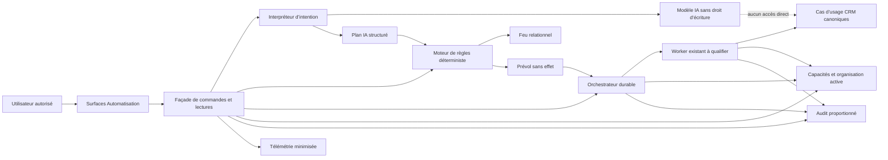

# Étape interne 3 — Architecture, données et sécurité

| Élément | Valeur |
| --- | --- |
| Produit | Marketteo CRM |
| Programme | Pré-Phase 5 — Automatisation |
| Étape | 3 — Architecture, données et sécurité |
| Statut | **CONCEPTION CLÔTURÉE — Porte 3 `GO conditionnel` ; Étape 4 autorisée** |
| Date d’ouverture | 1er octobre 2026 |
| Autorité d’ouverture | [Porte 2 — GO avec réserves](./PORTE_2_GO_AVEC_RESERVES.md) |
| Contrat fonctionnel | [`RF-AUT-2.1` — référence figée](./REFERENCE_FONCTIONNELLE_AUTOMATISATION_V2_1.md) |
| État des vagues | T1 contre-validée ; T2 → T3 autorisée ; T3 → T4 autorisée ; [T4 — Estimation et Porte 3](./VAGUE_T4_ESTIMATION_PORTE_3.md) contre-validée `GO sous prescriptions` |
| Contre-validation T1 | [GO sous prescriptions obligatoires](./CONTRE_VALIDATION_VAGUE_T1.md) |
| Dossier T2 | [Modèle logique, ADR, Feu, Prévol, API et séquences](./VAGUE_T2_DONNEES_REGLES_CONTRATS.md) |
| Dossier T3 | [Matrice d’autorisation, IA, menace, résilience et retour arrière](./VAGUE_T3_SECURITE_IA_RESILIENCE.md) |
| Dossier T4 | [Capacité, coûts, tranches, ADR consolidées et risques](./VAGUE_T4_ESTIMATION_PORTE_3.md) |
| Contre-validation T4 | [Avis croisés, preuves, réserves et verdict](./CONTRE_VALIDATION_VAGUE_T4.md) |
| Porte 3 | [Faisabilité et maîtrise — `GO conditionnel` vers l’Étape 4](./PORTE_3_FAISABILITE_MAITRISE.md) |
| Étape 4 | [Plan de livraison et protocole de validation](./ETAPE_4_PLAN_LIVRAISON_VALIDATION.md) |
| Porte suivante | [Porte 4 — Prêt à construire](./PORTE_4_PRET_A_CONSTRUIRE.md) |
| Boussole | [Parcours complet de réalisation et de validation](./BOUSSOLE_EVOLUTION_AUTOMATISATION_MARKETTEO.md) |
| Porte de sortie | Porte 3 — Faisabilité et maîtrise |
| Autorise | Architecture, modèles, contrats, analyses, prototypes techniques isolés et estimations |
| N’autorise pas | Développement branché au produit actif, migration, connecteur réel, envoi externe ou production |

## 1. Décision d’ouverture

L’Étape interne 3 est officiellement ouverte.

Elle répond à la question centrale suivante :

> **Comment traduire fidèlement `RF-AUT-2.1` en un système réalisable, isolé, durable, explicable, récupérable et économiquement compatible avec une PME, sans créer un second CRM ni permettre un effet externe autonome ?**

L’objectif n’est pas encore d’écrire la fonctionnalité de production. Il est de retirer les ambiguïtés techniques, de démontrer que les effets peuvent être maîtrisés et de constituer le dossier permettant à la Porte 3 de rendre un verdict de faisabilité et de maîtrise.

## 2. Résultats attendus

À la fin de l’étape, l’équipe doit pouvoir répondre précisément :

- où résident les données et quelles sources restent canoniques ;
- comment une intention devient un plan structuré puis une décision déterministe ;
- comment Prévol et exécution partagent les mêmes règles ;
- comment chaque commande est autorisée, versionnée, auditée et rendue idempotente ;
- comment une exécution différée est arrêtée lorsque le contexte ou les droits ont changé ;
- comment le système récupère sans créer de doublon lorsque le résultat est incertain ;
- comment l’IA reste sans pouvoir direct sur les effets CRM ou externes ;
- comment suspendre, rétrograder et restaurer la fonctionnalité ;
- quel coût, quelle complexité et quels risques précèdent le développement.

## 3. Entrées obligatoires et invariants

### 3.1 Entrées

- [Référence fonctionnelle `RF-AUT-2.1`](./REFERENCE_FONCTIONNELLE_AUTOMATISATION_V2_1.md) ;
- [décision Porte 2](./PORTE_2_GO_AVEC_RESERVES.md) ;
- [analyse croisée avec le socle des Phases 1 à 4](./ANALYSE_CROISEE_ETAPE_2_PHASES_1_A_4.md) ;
- [fondations de décision de la Vague A](./VAGUE_A_FONDATIONS_DECISION.md) ;
- [cycles, erreurs et scénarios de la Vague B](./VAGUE_B_PRODUIT_TESTABLE.md) ;
- [recette fonctionnelle V2.1](./RECETTE_ET_RECHERCHE_VAGUE_C.md).

### 3.2 Invariants non négociables

1. Les prospects, tâches, opportunités, permissions, membres et journaux CRM existants restent canoniques.
2. Aucun registre métier parallèle n’est créé pour simplifier l’Automatisation.
3. Le mode V1 actif reste `Préparer` ; aucun envoi externe autonome n’est permis.
4. Le Prévol ne produit aucun effet et utilise les mêmes règles fonctionnelles que l’exécution.
5. Le Feu est déterministe, versionné et calculé par action et par canal.
6. Une sortie IA ne constitue jamais une permission, une commande d’effet ou une preuve.
7. Les capacités sont vérifiées à la demande puis juste avant chaque effet différé.
8. Une incertitude après effet possible ne déclenche jamais une répétition automatique.
9. L’isolation par organisation s’applique aux données, files, caches, journaux et métriques.
10. Toute modification matérielle de ces comportements exige une nouvelle version fonctionnelle.

### 3.3 Réserves maintenues

| Réserve | Jalon | Effet sur l’Étape 3 |
| --- | --- | --- |
| `P2-RSV-01` — sessions PME | Après une production autorisée et avant élargissement | Ne bloque pas la conception ; interdit de présenter la désirabilité comme prouvée |
| `P2-RSV-02` — preuve Azure 4.6 | Fin de la Phase 5 | Ne bloque pas la conception ; bloque le verdict final de la Phase 5 |

## 4. Carte initiale de l’architecture à instruire

Le schéma suivant représente les responsabilités à confirmer. Il ne décide pas encore du nombre de services ou de leur déploiement physique.

Principes à préserver dans toute proposition :

- l’IA ne possède aucun chemin direct vers le CRM ;
- les règles déterministes entourent le Prévol et l’exécution ;
- l’orchestrateur ne contourne pas les cas d’usage CRM ;
- l’autorisation est réévaluée aux frontières où un effet peut se produire ;
- audit et télémétrie restent deux flux distincts.

## 5. Chantiers de conception

### 5.1 `S3-01` — Modèle de données

**Objectif :** définir les nouveaux objets strictement nécessaires, leurs identités, leur organisation propriétaire, leurs versions, leurs transitions et leurs liens avec le CRM canonique.

#### Objets à définir

| Objet conceptuel | Responsabilité | Liens obligatoires | Interdits |
| --- | --- | --- | --- |
| Playbook | Identité stable d’une recette guidée | Organisation, type de recette, état courant | Copier prospects ou permissions |
| Version de Playbook | Configuration immuable prête au Prévol | Playbook, auteur, paramètres, version de règles | Modification en place après activation |
| Prévol | Résultat sans effet d’une simulation | Version exacte, périmètre, règles, compteurs et blocages | Être interprété comme une exécution |
| Plan IA | Interprétation structurée d’une intention | Organisation, acteur, intention classifiée, périmètre et expiration | Stocker inutilement la phrase sensible ou déclencher un effet |
| Exécution | Suivi d’une admission et de ses effets | Playbook/version, objet CRM canonique, corrélation, idempotence | Créer un doublon métier au rejeu |
| Brouillon | Contenu préparé pour intervention humaine | Objet CRM, version, auteur et empreinte de contenu | Être envoyé directement par l’IA |
| Approbation | Décision humaine liée à un contenu exact | Brouillon, approbateur, canal, empreinte, expiration | Valoir permission ou déroger au Rouge |
| Exception | Blocage opérationnel explicable et résoluble | Cause, objet canonique, responsable, état et corrélation | Masquer une erreur dans le Feu |

#### Décisions attendues

- clés et contraintes d’organisation ;
- relations, cardinalités et propriétaires de cycle de vie ;
- immutabilité des versions et empreintes ;
- stratégie d’idempotence et de corrélation ;
- rétention, archivage, suppression et export ;
- données personnelles autorisées et données interdites ;
- concurrence, verrouillage optimiste et transitions atomiques ;
- réutilisation ou extension du journal d’audit existant.

**Preuve de clôture :** modèle logique, dictionnaire de données, diagramme entité-relation et matrice objet nouveau/réutilisé, sans duplication du CRM.

### 5.2 `S3-02` — Moteur de règles

**Objectif :** produire une décision reproductible à partir des données, des règles et de leurs versions.

Le flux de référence à concevoir est :

`Intention structurée ou déclencheur système` → `Périmètre canonique` → `Capacités de lecture` → `Règles métier` → `Feu` → `Prévol ou décision d’admission` → `Plan explicable`.

Le moteur devra préciser :

- format et version des règles ;
- priorité `Rouge > Jaune > Vert` ;
- séparation stricte entre Feu relationnel et exception opérationnelle ;
- gestion de l’inconnu, des preuves contradictoires et de l’expiration ;
- plafonds de fréquence, volume, coût et tentatives ;
- règles d’attribution et de prochaine action ;
- reproduction d’une décision historique ;
- comparaison entre résultat du Prévol et exécution ;
- politique de rétrogradation, suspension et arrêt général.

**Preuve de clôture :** table de décision versionnée, contrat d’évaluation et démonstration que Prévol et exécution utilisent le même noyau de règles.

### 5.3 `S3-03` — Contrats API et événements

**Objectif :** définir des commandes explicites, bornées, autorisables et idempotentes.

#### Commandes fonctionnelles à contractualiser

| Commande | Intention | Garanties minimales |
| --- | --- | --- |
| Prévisualiser une intention | Produire un plan structuré sans effet | Périmètre, expiration, aucun write CRM |
| Lancer un Prévol | Simuler une version exacte | Idempotence, compteurs, blocages, aucune action métier |
| Activer en `Préparer` | Admettre les futurs déclencheurs | Capacité, version courante, Prévol valide |
| Préparer une action | Créer un effet interne ou brouillon permis | Feu, droits, idempotence, audit |
| Soumettre une approbation | Demander une décision humaine | Empreinte exacte et expiration |
| Approuver ou refuser | Enregistrer une décision | Approbateur autorisé, contexte revérifié |
| Suspendre ou reprendre | Contrôler les nouvelles admissions | Effet atomique, raison, historique conservé |
| Résoudre une exception | Corriger puis réévaluer | Même corrélation, aucun rejeu aveugle |

Chaque contrat devra spécifier : acteur, organisation, capacités, préconditions, version attendue, clé d’idempotence, réponse, erreurs, audit, événements, concurrence et effet nul garanti en cas de refus.

Les noms de routes HTTP ne sont pas figés à l’ouverture. Ils seront décidés après comparaison avec les conventions actuelles du backend afin d’éviter une API parallèle.

**Preuve de clôture :** spécification OpenAPI ou contrat équivalent, catalogue d’événements versionnés et matrice commande → capacité → effet → audit.

### 5.4 `S3-04` — Exécution durable

**Objectif :** réutiliser les patrons du worker existant et garantir qu’un événement rejoué ne crée pas un second effet métier.

Décisions et preuves attendues :

- aptitude réelle du worker actuel et écarts à combler ;
- modèle de livraison, file, reprise, délais et messages morts ;
- identité d’exécution et clé d’idempotence métier ;
- écriture atomique ou patron outbox lorsque nécessaire ;
- verrouillage des transitions et prévention de concurrence ;
- contrôle de suspension avant admission et avant effet ;
- traitement `À vérifier` lorsque le résultat externe ou différé est incertain ;
- reprise manuelle sûre et conservation de la corrélation ;
- politique empêchant toute répétition automatique non prouvée ;
- charge, débit, backpressure et quotas par organisation.

**Preuve de clôture :** diagrammes de séquence, stratégie de reprise, matrice des pannes et scénarios de rejeu/concurrence.

### 5.5 `S3-05` — Sécurité et capacités

**Objectif :** empêcher qu’une commande valide à un instant produise plus tard un effet devenu non autorisé.

Le modèle doit vérifier au minimum :

1. identité et session de l’acteur à la demande ;
2. organisation active et appartenance ;
3. capacité Automatisation ;
4. capacité CRM requise par l’effet ;
5. portée sur l’objet concerné ;
6. état actuel du Feu et des permissions ;
7. version et approbation applicables ;
8. les mêmes conditions juste avant l’effet différé.

L’acteur système doit être défini comme un principal limité, traçable et incapable d’élargir la décision initiale. Une perte de droit, d’appartenance, de permission ou de validité bascule vers `Exception` ou `Bloquée`.

**Preuve de clôture :** matrice d’autorisation complète, règles de double contrôle, tests négatifs et frontières de confiance.

### 5.6 `S3-06` — Encadrement de l’IA

**Objectif :** utiliser l’IA comme interprète et explicateur, jamais comme autorité d’effet.

Le contrat IA doit imposer :

- entrées minimisées et données CRM traitées comme contenu non fiable ;
- sortie structurée validée par schéma ;
- liste fermée d’intentions, objets, Playbooks et actions ;
- impossibilité d’appeler directement un outil d’écriture CRM ;
- résolution déterministe du périmètre et des capacités après l’IA ;
- rejet ou clarification des demandes ambiguës ;
- repli sur des intentions guidées si le modèle est indisponible ;
- version des invites, modèle, schéma et politiques ;
- évaluations contre hallucination, injection et élargissement de portée ;
- budgets de coût, latence, taille et rétention.

Le plan IA est une proposition expirante. Il doit être relu contre l’état courant avant toute préparation.

**Preuve de clôture :** schéma d’intention, frontière d’outils, politique de données, jeu d’évaluations et comportement de repli.

### 5.7 `S3-07` — Audit et télémétrie

**Objectif :** expliquer les décisions et mesurer le produit sans accumuler de contenu sensible.

#### Audit

L’audit conserve les faits nécessaires à la preuve : acteur, organisation, commande, objet canonique, versions, capacité, décision, corrélation, résultat et raison codifiée. Les lectures d’audit réutilisent les capacités existantes.

#### Télémétrie produit

La télémétrie conserve des catégories et compteurs agrégés. Elle exclut :

- phrase libre saisie dans l’Assistant ;
- contenu d’un brouillon ;
- destinataire ou coordonnées ;
- preuve brute de permission ;
- message fournisseur ou donnée personnelle non nécessaire.

Les événements doivent être versionnés, limités à l’organisation, documentés dans un registre fermé et distincts des journaux techniques.

**Preuve de clôture :** catalogue audit/télémétrie, politique de minimisation, rétention, accès et corrélation.

### 5.8 `S3-08` — Sécurité de lancement

**Objectif :** rendre tout lancement futur progressif, suspendable et réversible.

Le dispositif à concevoir comprend :

- feature flag principal et drapeaux par organisation, Playbook et type d’effet ;
- mode `Préparer` imposé côté serveur ;
- suspension par Playbook et arrêt général ;
- quotas et limites configurables ;
- liste pilote et montée progressive ;
- seuils d’alerte et critères de pause ;
- compatibilité ascendante et stratégie de migration ;
- procédure de retour arrière sans perte de preuve ;
- mode dégradé sans IA et sans connecteur ;
- runbook d’incident et responsables de décision.

**Preuve de clôture :** plan de lancement contrôlé, matrice des drapeaux, procédure de suspension et stratégie de retour arrière testable.

### 5.9 `S3-09` — Modèle de menace

**Objectif :** identifier les chemins d’abus avant qu’ils deviennent des choix d’architecture coûteux à corriger.

| Menace initiale | Exemple | Traitement à concevoir | Preuve attendue |
| --- | --- | --- | --- |
| Injection dans les données CRM | Une note demande à l’IA d’ignorer les règles | Données non fiables, schéma fermé, aucun outil d’écriture | Évaluation adversariale |
| Contournement des capacités | Une commande est rejouée avec un rôle inférieur | Double contrôle serveur et portée objet | Tests négatifs |
| Confusion de locataire | Un identifiant d’une autre organisation est injecté | Organisation dérivée du contexte, RLS et filtrage | Tests d’isolation |
| Rejeu | Le même événement est livré plusieurs fois | Idempotence métier et transition atomique | Tests de répétition |
| TOCTOU | Permission retirée après approbation | Réévaluation juste avant effet | Scénario différé |
| Approbation altérée | Brouillon changé après accord | Empreinte et invalidation | Test d’intégrité |
| Effet incertain | Réponse perdue après une écriture | État `À vérifier`, aucune répétition aveugle | Simulation de panne |
| Webhook forgé | Source externe non authentifiée | Signature, fraîcheur, rejeu et quarantaine | Tests de contrat |
| Abus de masse | Une intention cible trop d’objets | Prévol, seuils, quota et approbation | Test de volume |
| Fuite par journaux | Phrase ou brouillon dans la télémétrie | Schéma fermé, redaction et revue | Inspection des sorties |
| Secret compromis | Jeton de connecteur exposé | Coffre, portée minimale, rotation et révocation | Procédure testable |
| Arrêt inefficace | Travail déjà en file après suspension | Contrôle avant effet et génération de suspension | Test kill switch |

Le modèle complet précisera les actifs, acteurs, frontières de confiance, hypothèses, scénarios, vraisemblance, impact, traitements et risques résiduels.

**Preuve de clôture :** modèle de menace approuvé, aucun risque critique sans traitement et responsabilités attribuées.

## 6. Diagrammes techniques obligatoires

Le dossier de Porte 3 devra inclure :

1. diagramme de contexte du système ;
2. diagramme des conteneurs ou modules logiques ;
3. diagramme de données et relations canoniques ;
4. séquence Assistant → plan structuré → Prévol ;
5. séquence déclencheur système → admission → préparation ;
6. séquence brouillon → approbation → invalidation ;
7. séquence suspension générale et travail déjà en file ;
8. séquence erreur incertaine → vérification → reprise ;
9. frontières de confiance et flux de données sensibles ;
10. parcours de dégradation sans IA ou sans connecteur.

Chaque diagramme doit indiquer l’organisation, l’acteur, les contrôles d’autorisation, la corrélation et l’endroit où un effet métier peut survenir.

## 7. Décisions d’architecture à consigner

Chaque décision structurante reçoit un identifiant `ADR-AUT-###` et contient : contexte, options, décision, conséquences, risques, preuve et condition de réouverture.

Premières décisions attendues :

| ID provisoire | Décision à prendre |
| --- | --- |
| `ADR-AUT-001` | Frontière du domaine Automatisation par rapport aux domaines CRM existants |
| `ADR-AUT-002` | Modèle d’orchestration et aptitude du worker existant |
| `ADR-AUT-003` | Stockage des Playbooks, versions et résultats de Prévol |
| `ADR-AUT-004` | Identité d’exécution, idempotence et corrélation |
| `ADR-AUT-005` | Versionnement et exécution du moteur de règles |
| `ADR-AUT-006` | Frontière de l’IA, schéma d’intention et absence d’outils d’écriture |
| `ADR-AUT-007` | Approbation liée au contenu et réévaluation avant effet |
| `ADR-AUT-008` | Audit, télémétrie et rétention |
| `ADR-AUT-009` | Suspension générale, feature flags et retour arrière |
| `ADR-AUT-010` | Stratégie de coûts, quotas et limites PME |

## 8. Ordonnancement des travaux

### Vague T1 — Cartographier le socle et les frontières

**État : contre-validée le 1er octobre 2026 avec un GO sous prescriptions obligatoires. T2 n’est pas encore ouverte.**

> **[Ouvrir le dossier de cartographie T1](./VAGUE_T1_CARTOGRAPHIE_SOCLE_FRONTIERES.md)**
>
> **[Ouvrir le rapport de contre-validation T1](./CONTRE_VALIDATION_VAGUE_T1.md)**

- inventorier worker, cas d’usage CRM, capacités, audit, événements et isolation existants ;
- produire le diagramme `as-is` ;
- classer chaque besoin comme réutilisé, étendu ou nouveau ;
- confirmer les invariants de `RF-AUT-2.1`.

### Vague T2 — Concevoir données, règles et contrats

**État : conception réalisée le 1er octobre 2026 ; passage T2 → T3 explicitement autorisé par le commanditaire.**

> **[Ouvrir le dossier T2 — Données, règles et contrats](./VAGUE_T2_DONNEES_REGLES_CONTRATS.md)**

- élaborer le modèle logique ;
- définir le moteur de règles et la fidélité Prévol/exécution ;
- écrire les contrats de commandes et d’événements ;
- établir idempotence, concurrence et cycles différés.

### Vague T3 — Fermer sécurité, IA et résilience

**État : conception réalisée le 1er octobre 2026 ; le commanditaire a explicitement autorisé le passage T3 → T4. La contre-validation de sûreté reste une réserve de la Porte 3.**

> **[Ouvrir le dossier T3 — Sécurité, IA et résilience](./VAGUE_T3_SECURITE_IA_RESILIENCE.md)**

- produire le modèle d’autorisation et le modèle de menace ;
- définir la frontière IA et les évaluations adversariales ;
- concevoir audit, télémétrie, suspension et retour arrière ;
- tester sur papier les scénarios de panne et d’abus.

### Vague T4 — Estimer et assembler la Porte 3

**État : contre-validation réalisée le 1er octobre 2026 ; `GO sous prescriptions`.**

> **[Ouvrir le dossier T4 — Estimation, capacité, découpage et Porte 3](./VAGUE_T4_ESTIMATION_PORTE_3.md)**
>
> **[Ouvrir le dossier préparatoire de Porte 3](./PORTE_3_FAISABILITE_MAITRISE.md)**
>
> **[Ouvrir la contre-validation T4 et le verdict de Porte 3](./CONTRE_VALIDATION_VAGUE_T4.md)**

- estimer charge, coût, latence et exploitation ;
- découper une future implémentation en tranches réversibles ;
- consolider les ADR et risques résiduels ;
- faire les revues Produit, Ingénierie, Sécurité, Confiance, Qualité et Données ;
- préparer le verdict de Porte 3.

## 9. Livrables de l’Étape 3

| ID | Livrable | Contenu minimal | Responsable principal attendu |
| --- | --- | --- | --- |
| `S3-LIV-01` | Architecture cible | Contexte, modules, responsabilités, flux et frontières | Ingénierie |
| `S3-LIV-02` | Diagrammes techniques | Dix vues obligatoires et séquences critiques | Ingénierie / Sécurité |
| `S3-LIV-03` | Modèle de données | Modèle logique, dictionnaire, rétention et ownership | Ingénierie / Données |
| `S3-LIV-04` | Contrats API et événements | Commandes, erreurs, idempotence, événements et versions | Ingénierie |
| `S3-LIV-05` | Matrice d’autorisation | Rôles, capacités, portée, double contrôle et acteur système | Sécurité / Confiance |
| `S3-LIV-06` | Modèle de menace | Actifs, frontières, abus, traitements et risques résiduels | Sécurité |
| `S3-LIV-07` | Observabilité | Audit, télémétrie, journaux, métriques, alertes et rétention | Ingénierie / Données |
| `S3-LIV-08` | Découpage d’implémentation | Tranches, dépendances, critères et retour arrière | Ingénierie / Produit |
| `S3-LIV-09` | Estimation coûts et risques | Construction, exploitation, IA, stockage, files et soutien | Ingénierie / Produit |
| `S3-LIV-10` | Dossier de Porte 3 | Preuves, ADR, réserves, avis et recommandation | Responsable de l’étape |

## 10. Estimation à produire

L’estimation distinguera :

- coût initial de construction par chantier ;
- coût récurrent par organisation et par Playbook ;
- appels IA, jetons, latence et taux de repli déterministe ;
- stockage des versions, Prévols, exécutions et audits ;
- volume de tâches du worker et besoins de file ;
- observabilité, alertes et soutien opérationnel ;
- coût des contrôles de sécurité et des évaluations ;
- marge liée aux risques et dépendances non prouvées.

Les hypothèses seront exprimées en fourchettes et reliées à des volumes. Une estimation sans hypothèses mesurables ne satisfait pas la Porte 3.

## 11. Critères de sortie — Porte 3

La Porte 3 a reçu un `GO conditionnel`. Les critères de conception sont considérés comme couverts par les dossiers T1 à T4 ; les preuves d’implémentation restent dans l’Étape 4 et ne sont pas inventées ici.

- [x] chaque comportement de `RF-AUT-2.1` est relié à un composant et un contrat technique ;
- [x] le modèle de données ne duplique aucun objet CRM canonique ;
- [x] Prévol et exécution partagent le même moteur de règles versionné ;
- [x] chaque commande possède préconditions, capacité, idempotence, audit et erreurs ;
- [x] les contrôles d’organisation et de capacités sont spécifiés avant chaque effet ;
- [x] les scénarios de rejeu, concurrence et résultat incertain ont une stratégie sûre ;
- [x] l’IA n’a aucun chemin d’écriture et ses sorties sont validées par schéma ;
- [x] le modèle de menace ne conserve aucun risque critique sans traitement accepté ;
- [x] feature flags, suspension générale et retour arrière sont conçus et testables ;
- [x] audit et télémétrie respectent la minimisation des données ;
- [x] les coûts projetés sont paramétrés et compatibles avec le positionnement PME ;
- [x] les ADR structurantes sont consolidées dans T4 et soumises aux conditions de Porte 3 ;
- [x] les risques résiduels possèdent un responsable et un jalon ;
- [x] le découpage d’implémentation est réversible et vérifiable ;
- [x] les avis Produit, Ingénierie, Sécurité, Confiance, Qualité et Données sont consignés.

## 12. Verdict prononcé de Porte 3

La [contre-validation T4](./CONTRE_VALIDATION_VAGUE_T4.md) a choisi explicitement :

- `GO conditionnel` — planification de l’Étape 4 autorisée, avec réserves datées et propriétaires.

Ce verdict ne vaut pas automatiquement développement, déploiement ou production. Les limites sont précisées dans le dossier de contre-validation et la référence fonctionnelle reste inchangée.

## 13. Journal de l’étape

| Date | Décision ou événement | Effet |
| --- | --- | --- |
| 1er octobre 2026 | Porte 2 prononcée `GO avec réserves` | Conception technique autorisée ; aucun GO de développement ou de production |
| 1er octobre 2026 | Référence `RF-AUT-2.1` figée | Contrat fonctionnel d’entrée versionné |
| 1er octobre 2026 | Étape interne 3 officiellement ouverte | Neuf chantiers et dix livrables engagés en vue de la Porte 3 |
| 1er octobre 2026 | Cartographie de la Vague T1 réalisée | Socle et frontières classés ; dix décisions proposées à contre-validation |
| 1er octobre 2026 | Contre-validation T1 prononcée `GO sous prescriptions` | Dix décisions acceptées ; dix prescriptions transférées à T2, T3 et T4 |
| 1er octobre 2026 | GO utilisateur pour la Vague T2 | Conception données, règles et contrats autorisée |
| 1er octobre 2026 | Dossier T2 rédigé | ADR-AUT-001/002, modèle, contrats et séquences prêts à contre-validation |
| 1er octobre 2026 | GO utilisateur pour la Vague T3 | Passage T2 → T3 autorisé ; revue des contrats T2 intégrée à la sécurité T3 |
| 1er octobre 2026 | Dossier T3 rédigé | Matrice d’autorisation, garde d’effet, modèle IA, menace et résilience prêts à contre-validation |
| 1er octobre 2026 | GO utilisateur pour la Vague T4 | Passage T3 → T4 autorisé ; les réserves de sûreté restent à conclure à la Porte 3 |
| 1er octobre 2026 | Dossiers T4 et Porte 3 préparés | Estimation paramétrée, plan de preuve, tranches, ADR, risques et checklist de verdict assemblés |
| 1er octobre 2026 | T4 contre-validée `GO sous prescriptions` | Les réserves capacité, sécurité, IA, coûts et qualité deviennent des conditions formelles |
| 1er octobre 2026 | Porte 3 prononcée `GO conditionnel` | Étape 4 — Plan de livraison et protocole de validation autorisée ; construction et production exclues |

## 14. Première séquence autorisée

La première séquence de travail est la **Vague T1 — Cartographier le socle et les frontières**. Elle peut examiner le code, les schémas et les contrats actuels, produire des diagrammes et documenter les écarts. Elle ne doit créer ni migration, ni endpoint actif, ni worker de production.

La cartographie est réalisée et contre-validée. Elle recommande un module Automatisation dans le monolithe modulaire, la réutilisation encadrée de PostgreSQL/RLS et du worker, ainsi que l’interdiction des écritures CRM directes depuis l’Automatisation. Les prescriptions de contre-validation sont obligatoires pour T2 à T4 :

> **[Examiner la Vague T1 — Cartographie du socle et des frontières](./VAGUE_T1_CARTOGRAPHIE_SOCLE_FRONTIERES.md)**
>
> **[Examiner la contre-validation T1 et les vagues restantes](./CONTRE_VALIDATION_VAGUE_T1.md)**

La Vague T4 est contre-validée `GO sous prescriptions`. La Porte 3 est prononcée `GO conditionnel` et ouvre l’**Étape 4 — Plan de livraison et protocole de validation**. La construction reste subordonnée aux preuves de capacité, de sécurité, d’IA, de coût et de qualité consignées dans la [contre-validation T4](./CONTRE_VALIDATION_VAGUE_T4.md).
