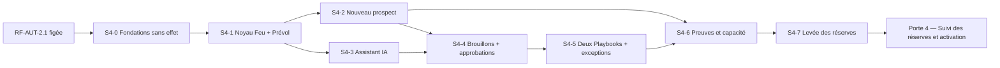

# Étape 4 — Plan de livraison et protocole de validation

> **Statut : S4-0 clôturée ; S4-1 runtime isolé réalisé ; S4-2, S4-3, S4-4, S4-5 et S4-6 clôturées pour définition ; S4-7 active sous réserves ; OpenAI choisi pour AUT-4706 ; Porte 4 clôturée avec GO avec réserves pour `P4-Lite`.**  
> **Date d’ouverture :** 1er octobre 2026.  
> **Nature :** préparation du backlog, des preuves et des critères de la Porte 4.  
> **N’autorise pas :** appel IA réel, effet externe, connecteur social, changement silencieux du pipeline, activation client ou production.

## 1. Décision d’entrée

La Porte 3 a établi une faisabilité de conception suffisante pour planifier l’implémentation. Elle n’a pas établi les
preuves d’exécution, de charge ou de fournisseur nécessaires à une mise en service. Cette étape transforme donc les
conceptions T1–T4 en unités de travail vérifiables, sans les réaliser dans le produit actif.

La référence fonctionnelle reste [RF-AUT-2.1](./REFERENCE_FONCTIONNELLE_AUTOMATISATION_V2_1.md). Toute modification
matérielle doit produire une nouvelle version fonctionnelle et repasser par une décision de porte.

Dossiers opérationnels :

- [Backlog détaillé `BL-AUT-4.1`](./BACKLOG_DETAILLE_ETAPE_4.md) ;
- [Protocole et registre des preuves `PV-AUT-4.1`](./PREUVES_VALIDATION_ETAPE_4.md) ;
- [Porte 4 — Prêt à construire](./PORTE_4_PRET_A_CONSTRUIRE.md).
- [S4-7 — Levée des réserves et réouverture de la Porte 4](./S4_7_LEVEE_RESERVES_PORTE_4.md).
- [Propositions pour la réouverture de Porte 4](./PROPOSITIONS_PORTE_4_REOUVERTURE.md).
- [Pré-Phase 5 — Préparation de l'implémentation](./PRE_PHASE_5_IMPLEMENTATION_AUTOMATISATION.md).

La première tranche est ouverte dans le dossier [S4-0 — Fondations sans effet](./S4_0_FONDATIONS_SANS_EFFET.md). Son
autorisation couvre uniquement la préparation isolée et les preuves de conception ; elle ne constitue pas un GO de
construction active.

La contre-validation de cette ouverture est documentée dans [CONTRE-VALIDATION-S4-0](./CONTRE_VALIDATION_S4_0.md) : la
réalisation documentaire/statique est acceptée avec un `GO conditionnel` pour les preuves runtime, sans passage
automatique à S4-1 ni à la construction.

La définition de la tranche suivante est documentée dans [S4-1 — Noyau déterministe et Prévol](./S4_1_NOYAU_DETERMINISTE_PREVOL.md).
Son noyau runtime isolé est réalisé et contre-validé dans [CONTRE-VALIDATION-S4-1](./CONTRE_VALIDATION_S4_1.md) ; son
intégration API/persistance/worker reste soumise à une décision distincte.

La tranche suivante [S4-2 — Nouveau prospect et tâche interne](./S4_2_NOUVEAU_PROSPECT_TACHE_INTERNE.md) est désormais
définie et clôturée pour son périmètre documentaire sur la base de S4-1. Elle couvre le déclencheur après admission
canonique, l’idempotence, la double garde, le Passeport, la tâche CRM interne et les exceptions. Son intégration est
autorisée uniquement dans `P4-Lite`, sous flags désactivés et sans effet externe.
Sa contre-validation est consignée dans [CONTRE-VALIDATION-S4-2](./CONTRE_VALIDATION_S4_2.md) : la définition est
clôturée avec un `GO sous prescriptions` ; son ancien `NO-GO` d'intégration est remplacé par le `GO avec réserves` de Porte 4 limité à `P4-Lite`.

La tranche [S4-3 — Assistant IA encadré](./S4_3_ASSISTANT_IA_ENCADRE.md) est clôturée pour sa définition. Elle fige le point d’entrée unique,
le schéma fermé d’intention, l’absence d’outil, la minimisation des données, les replis, quotas et évaluations
adversariales ; aucun modèle réel, outil IA ou effet externe n'est autorisé. Le faux fournisseur est utilisable dans `P4-Lite`, sous flags désactivés.
Sa contre-validation est consignée dans [CONTRE-VALIDATION-S4-3](./CONTRE_VALIDATION_S4_3.md) : les prescriptions
`CV-S4-3-01..07` sont appliquées au niveau contractuel ; l'intégration par faux fournisseur est permise dans `P4-Lite`, sans appel OpenAI réel.

La vérification consolidée des Étapes internes 1 à 4 et du raccordement aux Phases 1 à 4 est tenue dans le [contrôle
final de préparation](./CONTROLE_FINAL_ETAPES_1_A_4_PHASES_1_A_4.md). Elle confirme que le chantier peut être préparé,
mais que la construction active reste subordonnée au verdict de Porte 4.

## 2. Périmètre gelé

### Inclus

- le point d’entrée IA unique dans `Aujourd’hui` ;
- les trois Playbooks : Nouveau prospect, Proposition en attente, Occasion oubliée ;
- Feu relationnel, Prévol et mode Préparer ;
- tâches internes, brouillons, approbations et exceptions ;
- ingestion et rattachement contrôlé aux objets CRM canoniques ;
- audit minimal, télémétrie, suspension et reprise sûre ;
- tests de sécurité, idempotence, concurrence, capacité et compréhension UX.

### Exclu

- constructeur libre de workflow ;
- second CRM ou registre métier parallèle ;
- attribution aléatoire ou changement silencieux du pipeline ;
- envoi externe autonome ;
- appel d’un fournisseur IA avec des données réelles ;
- sessions PME avant la mise en production ;
- preuve Azure 4.6 avant la fin de la Phase 5.

## 3. Livrables de l’étape

| ID | Livrable | Responsable principal | Preuve de fin |
|---|---|---|---|
| `S4-LIV-01` | Backlog vertical et dépendances | Produit / ingénierie | Items ordonnés, propriétaires et liens RF-AUT-2.1. |
| `S4-LIV-02` | Estimation actualisée | Ingénierie / produit | Fourchettes T4 révisées, hypothèses et marge. |
| `S4-LIV-03` | Matrice de préparation/finition | Produit / QA | Chaque tranche a un DoR et un DoD testables. |
| `S4-LIV-04` | Matrice de validation | QA / sécurité | Scénarios, données, oracle et artefact attendus. |
| `S4-LIV-05` | Jeux de données synthétiques | Données / QA | Fixtures sans PII, multi-tenant et cas ambigus. |
| `S4-LIV-06` | Plan d’environnement | Plateforme | Local, test isolé, staging et flags décrits. |
| `S4-LIV-07` | Plan de déploiement et retour arrière | Exploitation / ingénierie | Séquence, arrêt, réconciliation et restauration. |
| `S4-LIV-08` | Registre des risques à jour | Responsable d’étape | Risques, propriétaires, dates et critères d’arrêt. |
| `S4-LIV-09` | Dossier Porte 4 | Responsable d’étape | Checklist complète et décision `GO`, `GO avec réserves` ou `NO-GO`. |

## 4. Backlog vertical proposé

### Tranche S4-0 — Préparer le chantier sans effet

| Élément | Contenu | Critère d’acceptation de planification |
|---|---|---|
| `S4-0-01` | Définir les flags global, organisation et Playbook | Chaque flag possède une valeur sûre par défaut et une procédure d’arrêt. |
| `S4-0-02` | Définir les capabilities et le principal technique | Matrice T3 reliée aux rôles CRM et aux origines autorisées. |
| `S4-0-03` | Définir corrélation, audit et événements | Chaque commande Automation a un identifiant de décision et un événement terminal. |
| `S4-0-04` | Définir migrations isolées et rollback | Migration réversible sur un schéma de test, sans toucher aux données client. |

### Tranche S4-1 — Noyau déterministe et Prévol

| Élément | Contenu | Critère d’acceptation de planification |
|---|---|---|
| `S4-1-01` | Version de Playbook et snapshot de règles | Une version active est immuable et référencée par le Prévol. |
| `S4-1-02` | Évaluation Feu | Vert, Jaune, Rouge et `to_verify` ont des raisons structurées. |
| `S4-1-03` | Prévol sans effet | Le même noyau produit un résultat comparable à l’exécution. |
| `S4-1-04` | Repli sans IA | Une intention non interprétable donne une clarification, jamais un effet. |

### Tranche S4-2 — Nouveau prospect et tâche interne

| Élément | Contenu | Critère d’acceptation de planification |
|---|---|---|
| `S4-2-01` | Nouveau prospect | Admission unique, provenance, responsable et prochaine tâche interne. |
| `S4-2-02` | Garde avant effet | Tenant, rôle, capacité, version, Feu, suspension et état CRM revérifiés. |
| `S4-2-03` | Idempotence et incertitude | Rejeu sans doublon ; timeout ambigu vers `to_verify`. |
| `S4-2-04` | Passeport explicable | Origine, permission, responsable, prochaine action et historique sont consultables. |

### Tranche S4-3 — Assistant IA et plan lisible

| Élément | Contenu | Critère d’acceptation de planification |
|---|---|---|
| `S4-3-01` | Intention structurée | Schéma fermé : objet, objectif, périmètre, volume et clarification. |
| `S4-3-02` | Plan à prévisualiser | L’IA explique ; elle ne choisit ni droit, ni canal, ni effet. |
| `S4-3-03` | Limites et repli | Latence, coût, indisponibilité ou injection déclenchent un repli sûr. |
| `S4-3-04` | Données minimales | Phrase libre non persistée par défaut ; sortie et audit minimisés. |

### Tranche S4-4 — Brouillons, approbations et cycles

La définition [S4-4 — Brouillons, approbations et cycles de vie](./S4_4_BROUILLONS_APPROBATIONS_CYCLES.md) est clôturée
pour sa définition. Sa [contre-validation](./CONTRE_VALIDATION_S4_4.md) applique CV-S4-4-01..07 au niveau contractuel ;
elle n’autorise aucun envoi, connecteur, API, persistance, worker ou effet CRM Automation.

| Élément | Contenu | Critère d’acceptation de planification |
|---|---|---|
| `S4-4-01` | Brouillon externe non envoyé | Contenu lié au destinataire, canal, Playbook et version. |
| `S4-4-02` | Approbation humaine | Une modification matérielle invalide l’approbation précédente. |
| `S4-4-03` | Suspension et reprise | Suspension globale, organisation et Playbook sont ordonnées et auditables. |
| `S4-4-04` | Expiration | Un brouillon ou une approbation obsolète devient non exécutable. |

### Tranche S4-5 — Deux Playbooks et exceptions

La définition [S4-5 — Playbooks complémentaires et exceptions](./S4_5_PLAYBOOKS_COMPLEMENTAIRES_EXCEPTIONS.md) est
clôturée pour définition après application des prescriptions CV-S4-5-01 à CV-S4-5-07, documentée dans
[CONTRE-VALIDATION-S4-5](./CONTRE_VALIDATION_S4_5.md). Elle ne modifie pas le pipeline, ne ferme aucune opportunité
et n’autorise aucun contact, connecteur, worker ou effet CRM Automation.

| Élément | Contenu | Critère d’acceptation de planification |
|---|---|---|
| `S4-5-01` | Proposition en attente | Détection silencieuse, plan de suivi, aucune modification de pipeline automatique. |
| `S4-5-02` | Occasion oubliée | Inactivité observable, revue humaine et aucune fermeture automatique. |
| `S4-5-03` | Entrées ambiguës | Quarantaine, fusion interdite par défaut, résolution explicitement auditée. |
| `S4-5-04` | Responsable indisponible | Aucun transfert aléatoire ; choix d’un membre actif ou exception. |

### Tranche S4-6 — Preuves, pilote et Porte 4

La définition [S4-6 — Preuves, résilience et préparation de la Porte 4](./S4_6_PREUVES_RESILIENCE_PORTE_4.md) est
clôturée après application des prescriptions CV-S4-6-01 à CV-S4-6-07, documentée dans
[CONTRE-VALIDATION-S4-6](./CONTRE_VALIDATION_S4_6.md). Elle prépare les fixtures, oracles, mesures de capacité,
scénarios de panne, observabilité, rollback et dossier de Porte 4 ; aucune construction intégrée n'est autorisée.

| Élément | Contenu | Critère d’acceptation de planification |
|---|---|---|
| `S4-6-01` | Charge et latence | Scénarios `T4-CAP-01..05`, seuils et mesures p95 définis. |
| `S4-6-02` | Sécurité adversariale | Menaces T3, injection et isolation multi-tenant couvertes. |
| `S4-6-03` | Observabilité | Dashboard, alertes, corrélation et rétention définis sans PII inutile. |
| `S4-6-04` | Dossier Porte 4 | Preuves, réserves et décision finale assemblées. |

### Tranche S4-7 — Levée des réserves et réouverture de la Porte 4

La phase [S4-7 — Levée des réserves et réouverture de la Porte 4](./S4_7_LEVEE_RESERVES_PORTE_4.md) est active sous
réserves pendant la préparation de `P4-Lite`. OpenAI est choisi pour `AUT-4706`; les owners, la capacité,
l'environnement, les preuves D2/D3, la rétention, les quotas contractuels OpenAI et le rollback restent à confirmer.
Le faux fournisseur et les limites locales IMP-A5 sont confirmés depuis le 3 octobre 2026. Les migrations
réversibles, routes et worker contrôlé sont autorisés sous flags désactivés ; communication externe et activation IA
réelle restent interdites.

## 5. Dépendances et chemin critique

Le chemin critique est `S4-0 → S4-1 → S4-2 → S4-4 → S4-6`. L’Assistant IA (`S4-3`) peut être préparé en parallèle,
mais ne peut jamais débloquer un effet métier. Les deux autres Playbooks attendent les invariants du noyau et du premier
Playbook pour éviter trois implémentations divergentes.

## 6. Definition of Ready et Definition of Done

### Prêt à planifier (`DoR`)

- comportement lié à `RF-AUT-2.1` et à un rôle ;
- données lues, version de règle et capacité identifiées ;
- résultat Vert/Jaune/Rouge et `to_verify` décrit ;
- absence d’effet externe autonome confirmée ;
- test positif, négatif, rejeu et multi-tenant nommé ;
- propriétaire, estimation, dépendances et retour arrière indiqués.

### Prêt à valider (`DoD` de l’Étape 4)

- scénario reproductible sur données synthétiques ;
- oracle d’acceptation indépendant de l’implémentation ;
- audit et métriques attendus définis ;
- erreur, timeout, suspension et reprise décrits ;
- critère de non-régression du socle CRM présent ;
- preuve et emplacement d’artefact nommés ;
- réserve ou dérogation approuvée par la porte concernée.

## 7. Protocole de validation

### 7.1 Familles de tests

| Famille | IDs | Objet | Sortie attendue |
|---|---|---|---|
| Fonctionnel | `VAL-F-01..12` | Trois Playbooks, Prévol, Feu, cycles et exceptions | Résultats métier déterministes et explicables. |
| Autorisation | `VAL-S-01..10` | Rôles, capacités, révocation, TenantContext, principal technique | Refus fermé et audit du refus. |
| Idempotence | `VAL-I-01..06` | Rejeu de commande, événement, worker et timeout ambigu | Aucun double prospect, tâche, brouillon ou approbation. |
| Concurrence | `VAL-C-01..06` | Deux demandes, suspension pendant exécution, version concurrente | Une transition gagnante, conflit explicite ou exception. |
| IA adversariale | `VAL-AI-01..10` | Injection, sortie hors schéma, coût, indisponibilité et données sensibles | Rejet, clarification ou repli déterministe. |
| Capacité | `VAL-CAP-01..05` | File 100, lots 25, 25 organisations, p95 et redémarrage | Seuils T4 mesurés ou capacité refusée sans perte. |
| UX/PME | `VAL-U-01..08` | Phrase libre, plan, Prévol, approbation, exception et reprise | Compréhension et prochaine action identifiables. |
| Exploitation | `VAL-O-01..08` | Flags, arrêt, alertes, rétention, restauration et rollback | Retour à l’état sûr, traces exploitables. |

### 7.2 Règle d’oracle

Un test n’est accepté que si l’oracle vérifie l’état CRM, le statut de la décision, le Feu, l’audit et l’absence d’effet
interdit. Un écran correct sans preuve serveur ne suffit pas. Un statut de succès sans événement corrélé ne suffit pas.

### 7.3 Scénarios critiques obligatoires

1. Le même nouveau prospect arrive deux fois avec deux clés d’idempotence équivalentes.
2. Le responsable devient inactif entre le Prévol et la préparation.
3. Une permission de courriel passe de connue à inconnue avant l’effet.
4. Le worker tombe après la commande CRM mais avant la confirmation.
5. Une note CRM contient une instruction d’injection visant à contourner le Feu.
6. Deux organisations soumettent le même identifiant externe.
7. Un manager modifie un brouillon après approbation.
8. Une suspension globale survient pendant un lot de 25 entrées.
9. Le fournisseur IA dépasse la latence ou le quota prévu.
10. Une proposition silencieuse devient active entre détection et Prévol.

## 8. Données et environnements

| Environnement | Données | Effets autorisés | Preuve conservée |
|---|---|---|---|
| Conception | Exemples documentaires | Aucun | Diagrammes et contrats. |
| Test isolé | Fixtures synthétiques multi-tenant | CRM simulé ou transaction annulée | Rapports de tests et événements. |
| Staging | Données anonymisées ou générées | Tâches internes explicitement contrôlées après autorisation ultérieure | Rapport de recette, métriques et audit. |
| Production progressive | Données réelles sous flags | Seulement le périmètre effectivement approuvé | Journal, alertes, rollback et décision de porte. |

Le passage entre environnements exige une version de schéma, de règles, de Playbook et de configuration. Aucun secret,
phrase libre, brouillon ou donnée personnelle réelle ne doit entrer dans les fixtures.

## 9. Estimation et capacité d’équipe

L’estimation T4 de `72–110 j.h.` d’ingénierie et `25–40 j.h.` Produit/QA/Sécurité est reconduite comme enveloppe de
planification. Chaque tranche doit réviser cette fourchette après découverte, sans convertir une hypothèse en engagement.

| Rôle | Responsabilité Étape 4 | Capacité à confirmer |
|---|---|---|
| Produit | Arbitrage portée, critères et portes | Responsable disponible à chaque revue de tranche. |
| Ingénierie | Contrats, implémentation future, idempotence et migration | Capacité backend/worker et revue de code. |
| QA | Oracle, jeux de tests, non-régression et preuves | Enveloppe de tests par tranche. |
| Sécurité/Confiance | Menaces, capacités, données et IA | Revue avant toute tranche à effet. |
| Plateforme | Environnements, flags, observabilité et rollback | Services de test et budgets de charge. |
| Design/Succès PME | Compréhension et accompagnement | Sessions PME maintenues après production. |

## 10. Gestion des changements et des réserves

Toute demande qui modifie un Playbook, le Feu, le Prévol, le destinataire, le canal, le rôle ou la persistance crée une
fiche de changement. Elle doit préciser : version impactée, risque, coût, test, migration, rollback et porte requise.

Les réserves héritées restent visibles :

- `P3-SEC-01`, `P3-SEC-02` et `P3-RES-01` avant tout effet CRM ;
- `P3-IA-01` et `P3-DATA-01` avant tout appel IA réel ;
- `P3-ARC-01` avant tout seuil de capacité annoncé ;
- Azure 4.6 à la fin de la Phase 5 ;
- sessions PME après production ;
- verrou complet écarté uniquement pour la présente consolidation documentaire, sans dérogation automatique pour la construction ou la production.

## 11. Critères de sortie de l’Étape 4 — Porte 4

La Porte 4 pourra être sollicitée lorsque :

- le backlog vertical couvre le parcours V2.1 sans fonctionnalité hors portée ;
- chaque item possède un propriétaire, une estimation, des dépendances et un `DoD` ;
- les tranches S4-0 à S4-7 ont un protocole et un retour arrière ;
- les scénarios critiques, données synthétiques et oracles sont prêts ;
- les conditions de sécurité et d’IA ont une preuve ou une réserve acceptée ;
- l’environnement de test et la stratégie d’observabilité sont disponibles ;
- les coûts et la capacité ont été révisés à partir des découvertes ;
- aucune autorisation de production n’est déduite par défaut ;
- le dossier [Porte 4 — Prêt à construire](./PORTE_4_PRET_A_CONSTRUIRE.md) est complet.

## 12. Journal

| Date | Décision | Effet |
|---|---|---|
| 1er octobre 2026 | GO utilisateur pour l’Étape 4 | Plan de livraison et protocole de validation autorisés. |
| 1er octobre 2026 | Verrou complet maintenu écarté | Dérogation limitée à la consolidation documentaire ; aucun effet sur les exigences futures. |
| 1er octobre 2026 | GO utilisateur pour compléter backlog et preuves | `BL-AUT-4.1` et `PV-AUT-4.1` produits ; preuves D2–D4 non revendiquées. |
| 1er octobre 2026 | GO utilisateur pour S4-0 | Préparation des fondations sans effet autorisée ; Porte 4 toujours non prononcée. |
| 1er octobre 2026 | Réalisation et contre-validation S4-0 | Artefacts statiques D2 validés ; preuves runtime et construction restent conditionnelles. |
| 1er octobre 2026 | GO utilisateur pour clôturer S4-0 et définir S4-1 | S4-0 clôturée pour préparation ; dossier S4-1 produit, sans autorisation d’exécution runtime. |
| 1er octobre 2026 | Réalisation runtime isolée et contre-validation S4-1 | Noyau déterministe et Prévol validés ; intégration applicative, worker et effets CRM exclus. |
| 1er octobre 2026 | GO utilisateur pour définir S4-2 | Parcours Nouveau prospect/tâche interne, idempotence, double garde, Passeport et exceptions définis ; construction non autorisée. |
| 1er octobre 2026 | Contre-validation S4-2 | Définition acceptée sous prescriptions `CV-S4-2-01..07` ; preuves D1, construction et intégration non autorisées. |
| 1er octobre 2026 | Application des prescriptions et clôture S4-2 | Contrats, outbox, séparation tâche/Feu, garde, idempotence et oracles consolidés ; runtime D2/D3 et intégration restent à produire après Porte 4. |
| 1er octobre 2026 | GO utilisateur pour définir S4-3 | Contrat de l’Assistant IA encadré, catalogue d’intentions, repli, données et évaluations adversariales définis ; aucun modèle réel ni intégration autorisé. |
| 1er octobre 2026 | Contre-validation S4-3 | Définition acceptée sous prescriptions `CV-S4-3-01..07` ; preuves D1, fournisseur réel et intégration non autorisés. |
| 1er octobre 2026 | Application des prescriptions et clôture S4-3 | Schéma fermé, port sans outil, non-persistance, repli, fournisseur, corpus adversarial et invariant UX consolidés ; preuves D2/D3 et intégration restent à produire après Porte 4. |
| 1er octobre 2026 | GO utilisateur pour définir S4-4 | Brouillon, révision, approbation, invalidation, expiration, suspension et absence d’envoi définis ; contre-validation requise. |
| 1er octobre 2026 | Contre-validation, prescriptions et clôture S4-4 | États alignés RF-AUT-2.1, absence d’envoi, empreinte, double garde, séparation PME, concurrence et minimisation consolidées ; preuves D2/D3 et intégration restent à produire après Porte 4. |
| 1er octobre 2026 | GO utilisateur pour définir S4-5 | Proposition en attente, Occasion oubliée, quatre exceptions, Prévols, gardes, cycles et preuves D1 définis ; contre-validation requise. |
| 1er octobre 2026 | Contre-validation initiale S4-5 | Verdict GO sous prescriptions CV-S4-5-01..07 ; D1 conforme sous réserves ; aucune intégration, aucun effet CRM et définition alors non clôturée. |
| 1er octobre 2026 | Application des prescriptions et clôture S4-5 | CV-S4-5-01..07 appliquées au niveau contractuel ; définition clôturée ; preuves D2/D3 et intégration restent subordonnées à la Porte 4. |
| 1er octobre 2026 | GO utilisateur pour définir S4-6 | Fixtures, niveaux de preuve, charge, sécurité adversariale, observabilité, résilience, rollback et dossier Porte 4 cadrés ; contre-validation requise. |
| 1er octobre 2026 | Contre-validation S4-6 | Verdict GO sous prescriptions CV-S4-6-01..07 ; D1 conforme sous réserves ; aucune intégration, preuve D2/D3 ou Porte 4 prononcée. |
| 1er octobre 2026 | Application des prescriptions et clôture S4-6 | CV-S4-6-01..07 appliquées au niveau contractuel ; définition clôturée ; preuves D2/D3 et intégration restent subordonnées à la Porte 4. |
| 1er octobre 2026 | Préparation finale et verdict Porte 4 initial | Dossier final assemblé ; capacité, environnement, rollback et preuves D2/D3 manquants ; verdict initial remplacé ensuite par le `GO avec réserves` limité à `P4-Lite`. |
| 1er octobre 2026 | GO avec réserves et clôture Porte 4 | `P4-Lite` autorisée pour préparation d'implémentation sous flags désactivés ; S4-7 active ; OpenAI réel, effets externes et production interdits. |

## 13. État d’avancement vers Porte 4

| Élément | État |
|---|---|
| Backlog vertical | Complété et versionné `BL-AUT-4.1` |
| Critères d’acceptation | Reliés aux preuves `PV-*` |
| Scénarios et oracles | Spécifiés au niveau D1 |
| Jeux de données | Catalogue défini ; fixtures exécutables non produites |
| Capacité d’équipe | À confirmer |
| Fournisseur IA et rétention | Fake et limites locales IMP-A5 confirmés ; quotas, contrat et rétention OpenAI à confirmer |
| Environnement isolé | À confirmer |
| Preuves D2/D3 | À produire pendant l'implémentation contrôlée avant activation |
| Verdict Porte 4 | `GO avec réserves` ; `P4-Lite` seulement, sous flags désactivés |
| S4-0 | Clôturée pour préparation ; preuves runtime à produire pendant l'implémentation contrôlée `P4-Lite` |
| S4-1 | Noyau runtime isolé réalisé ; intégration limitée autorisée dans `P4-Lite` |
| S4-2 | Clôturée pour définition ; intégration limitée admission/tâche interne autorisée dans `P4-Lite` |
| S4-3 | Clôturée pour définition ; faux fournisseur autorisé, OpenAI réel interdit |
| S4-4 | Clôturée pour définition ; prescriptions contractuelles appliquées ; aucune intégration de brouillon, d’approbation ou d’envoi autorisée |
| S4-5 | Clôturée pour définition ; CV-S4-5-01..07 appliquées ; aucun Playbook complémentaire ni traitement d’exception intégré autorisé |
| S4-6 | Clôturée pour définition ; CV-S4-6-01..07 appliquées ; preuves D2/D3 restantes suivies par S4-7 |
| S4-7 | Active sous réserves ; OpenAI choisi pour `AUT-4706` ; `AUT-4701..4705`, `AUT-4707..4708` et preuves `PV-S47-*` restent à traiter |
| Porte 4 | Clôturée avec `GO avec réserves` ; préparation `P4-Lite` autorisée, activation soumise aux preuves |
