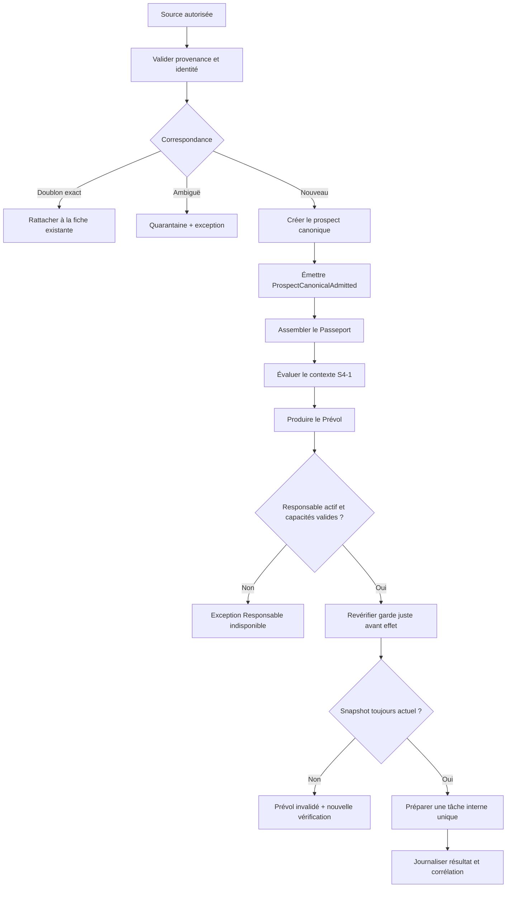
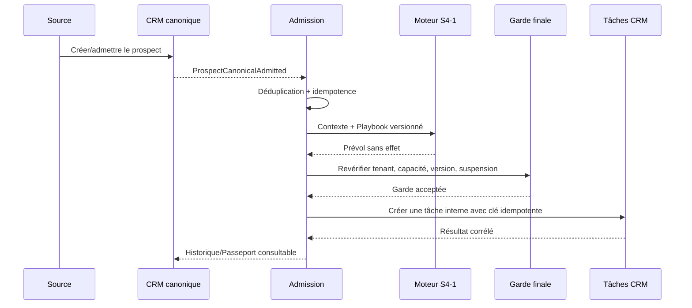
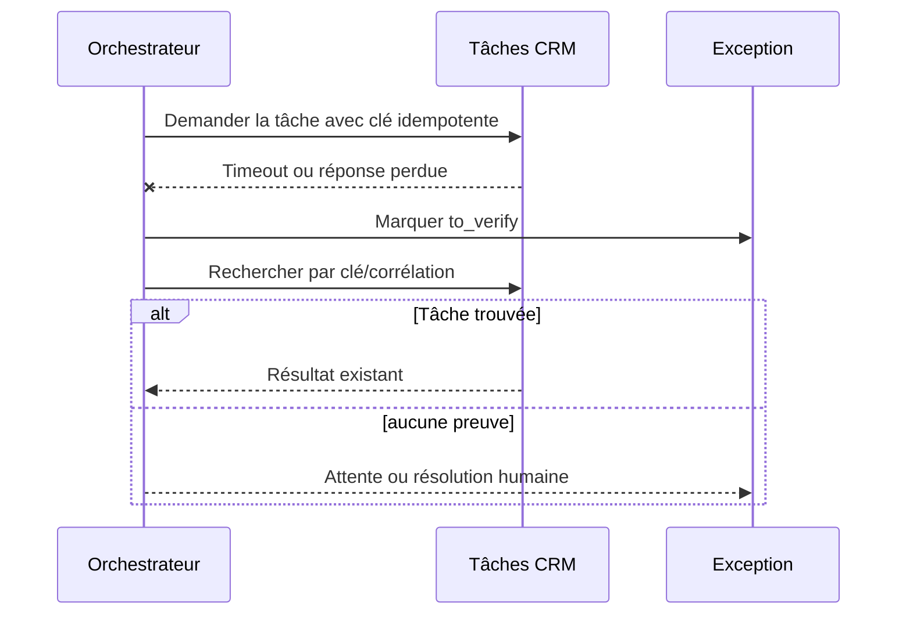

# S4-2 — Nouveau prospect et tâche interne

> **Statut : CLÔTURÉE POUR DÉFINITION — prescriptions contractuelles appliquées ; runtime non intégré**  
> **Date d’ouverture :** 1er octobre 2026  
> **Dépendance :** [S4-1 — Noyau déterministe et Prévol](./S4_1_NOYAU_DETERMINISTE_PREVOL.md)  
> **Backlog :** `AUT-4201` à `AUT-4206` dans [BL-AUT-4.1](./BACKLOG_DETAILLE_ETAPE_4.md)  
> **Décision de porte :** Porte 4 `GO avec réserves` ; admission et tâche interne `P4-Lite` autorisées sous flags désactivés, sans effet externe ni production.

## 1. Objet de la tranche

S4-2 définit le premier parcours vertical utile de l’Automatisation Marketteo : lorsqu’un prospect admissible est créé
dans le CRM canonique, Marketteo peut préparer une tâche interne unique, attribuée à un membre actif, avec une
explication consultable dans le Passeport.

La tranche répond à une promesse simple pour une PME :

> **Un nouveau prospect ne reste pas sans responsable ni prochaine action.**

Le parcours est indépendant de la source. Il doit pouvoir recevoir une admission issue du manuel, de Google, du CSV,
du pilote Meta/Facebook conditionnel ou d’un futur Web/API autorisé, sans créer un traitement différent pour chaque
origine.

Cette fiche est une définition de tranche. Elle ne constitue ni une autorisation de développement actif, ni une
autorisation de migration, ni un GO de production.

## 2. Décision de cadrage

Le GO donné pour S4-2 autorise :

- la formalisation du parcours `admission → Passeport → Prévol → tâche interne` ;
- les contrats conceptuels d’admission, d’idempotence, de garde et de résultat ;
- la matrice des cas nominaux, des doublons et des exceptions ;
- les scénarios de preuve et leurs oracles ;
- la préparation des fixtures synthétiques et de l’intégration future.

Il n’autorise pas :

- une route API Automation active ;
- une migration appliquée à une base client ;
- un branchement du worker existant ;
- une création réelle de prospect ou de tâche ;
- une décision d’attribution aléatoire ;
- un envoi de courriel, appel, message social ou autre communication externe ;
- l’appel d’un fournisseur IA réel ;
- la modification silencieuse du pipeline, d’une permission ou d’un responsable.

## 3. Dépendances et réutilisation du socle

S4-2 ne crée pas de nouveaux objets métier parallèles. Elle réutilisera, après autorisation de construction, les objets et
contrats déjà présents dans le socle :

| Besoin | Socle à réutiliser | Règle S4-2 |
|---|---|---|
| Prospect canonique | `ProspectDraft`, `ProspectView`, cas d’usage de création manuel/Google/CSV | Le Playbook intervient après l’écriture canonique réussie. |
| Tâche interne | `ProspectTaskDraft`, `ProspectTaskView`, `CreateTaskUseCase` | Une tâche CRM existante, jamais une table Automation parallèle. |
| Responsable | appartenance et capacité CRM existantes | Membre actif de la même organisation, vérifié au dernier moment. |
| Idempotence | clé d’idempotence et empreinte de commande des tâches | Même identité fonctionnelle et même charge = même résultat ; charge différente = conflit. |
| File durable | worker et file PostgreSQL existants | Réutilisation future seulement, avec garde dédiée et résultat incertain. |
| Passeport | agrégat de lectures CRM | Vue explicable, sans copie concurrente des données. |
| Feu et Prévol | noyau S4-1 | Le Prévol est recalculé avant toute préparation et ne donne aucun droit. |

Les noms techniques définitifs, les migrations et les événements seront arrêtés lors de l’ouverture de la construction
après la Porte 4.

## 4. Invariants fonctionnels

1. Le prospect existe dans le tenant courant avant toute admission au Playbook.
2. Une entrée rejetée, en quarantaine ou reconnue comme doublon exact ne déclenche pas un nouveau traitement.
3. Le Playbook `Nouveau prospect` est versionné, actif pour l’organisation et non suspendu.
4. L’admission est émise après la réussite de la création canonique, jamais avant.
5. Une admission possède une identité fonctionnelle stable et une clé d’idempotence.
6. Le même événement rejoué ne crée ni second prospect ni seconde tâche.
7. Une correspondance ambiguë bloque la tâche et ouvre une exception ; aucune fusion silencieuse n’est faite.
8. Une permission de contact inconnue ne bloque pas une tâche purement interne et ne l’autorise pas à contacter le prospect.
9. L’absence de responsable actif ouvre une exception ; aucune attribution aléatoire n’est permise.
10. Le responsable, la capacité, l’organisation, le Playbook, la suspension et le snapshot CRM sont revérifiés juste avant
    tout effet.
11. Un timeout après effet potentiel devient `to_verify` ; il n’est jamais rejoué aveuglément.
12. Une modification du contexte entre Prévol et effet invalide le Prévol.
13. La tâche est une tâche CRM existante, avec une seule prochaine action explicite et sans communication externe.
14. Chaque décision observable conserve sa corrélation, sa version et son résultat minimal dans l’audit.
15. Aucun changement silencieux de pipeline, de permission, de propriétaire ou de source n’est autorisé.

## 5. Déclencheur et périmètre des sources

### 5.1 Événement fonctionnel commun

Le déclencheur conceptuel est :

> `ProspectCanonicalAdmitted` — un prospect vient d’être admis dans le CRM de l’organisation après validation de sa
> source, de sa provenance et de son identité exacte.

Le contrat minimal de l’événement comporte :

```text
ProspectCanonicalAdmitted {
  event_id,
  organization_id,
  prospect_id,
  origin,
  source_reference,
  acquisition_reference?,
  admitted_at,
  admitted_by,              // acteur ou origine système bornée
  external_reference?,
  functional_identity,
  crm_version,
  schema_version
}
```

L’événement ne transporte pas de phrase libre, de secret, de charge utile sociale inutile ou de permission inventée.

### 5.3 Décision d’atomicité appliquée

La prescription `CV-S4-2-02` est fermée au niveau de la conception : l’admission et un job de la file PostgreSQL
existante seront écrits dans la même transaction que le prospect canonique. Aucun outbox générique n’est créé pour
`P4-Lite`. La séquence contractuelle est donc :

1. valider le tenant, la source, la provenance et l’identité exacte ;
2. écrire le prospect canonique, l’admission Automation et le job idempotent dans la même transaction ;
3. rendre le job réclamable seulement après le commit ;
4. consommer le job avec `event_id`, `functional_identity` et clé d’idempotence ;
5. marquer l’admission et le job terminés ou en échec sans réémettre une nouvelle identité fonctionnelle.

Un rejet, un doublon ou une quarantaine ne crée ni admission exécutable ni job. La technologie et la migration restent
à réaliser après la Porte 4 ; la décision de frontière, elle, est désormais figée.

### 5.2 Matrice de source

| Source | Point d’admission | Comportement S4-2 | État de lancement |
|---|---|---|---|
| Manuel | création réussie du prospect | Déclenchement standard | Premier raccordement IMP-A4, sous flags désactivés par défaut |
| Google | création idempotente depuis `place_id` | Tâche interne possible ; permission externe inconnue par défaut | Même contrat, raccordement différé après la preuve IMP-A4 |
| CSV | confirmation atomique d’une création | Uniquement les lignes créées et admises ; doublons/quarantaines exclues | Même contrat, raccordement différé après la preuve IMP-A4 |
| Meta/Facebook | résultat d’ingestion conforme au contrat | Conditionné au binding, à la provenance et à l’organisation actifs | Pilote conditionnel |
| Web/API | admission authentifiée future | Même parcours après signature, fraîcheur et idempotence | Capacité à contractualiser |
| LinkedIn | connecteur non livré | Aucun parcours réel ni dépendance de lancement | Différé |

Les sources ne choisissent pas la tâche et ne donnent aucun droit. Elles alimentent uniquement l’admission canonique et le
Passeport.

### 5.4 Application `P4-Lite` — décisions IMP-A4 confirmées le 3 octobre 2026

La matrice ci-dessus définit le contrat commun ; elle ne force pas le branchement simultané de toutes les sources. Pour
la première preuve runtime, seule la source **Manuel** est raccordée par `POST /api/prospects`, avec une demande
Automation explicite. Les sources Google, CSV, Meta/Facebook et Web/API ne créent donc aucun job Automation dans
IMP-A4.

L'exécution différée conserve l'identité de l'utilisateur humain qui a demandé l'admission. `prospect_worker` est le
processus technique ; juste avant l'effet, il revérifie l'appartenance active ainsi que les capacités Automation et CRM
de cet utilisateur. Le principal `automation-system` est réservé aux futurs déclencheurs réellement automatiques et
reste hors périmètre.

Le worker dispose uniquement des lectures RLS nécessaires et d'une commande d'effet tenantisée, idempotente et bornée
au parcours `Nouveau prospect → tâche interne`. Il ne reçoit pas de droit général pour modifier des tâches CRM. Après
une reprise, il recherche toujours l'effet par sa clé ; si le résultat du commit ne peut pas être établi, l'admission
passe à `to_verify` sans nouvelle tentative automatique.

**Réalisation IMP-A4 (3 octobre 2026).** Cette application est portée par `automation_new_prospect_prepare:1` et par
deux commandes PostgreSQL séparées : l'API admet atomiquement le prospect, le Prévol, la décision et le job ; le worker
relit les gardes et crée la seule tâche interne possible. Le rôle courant de l'initiateur est relu : la matrice actuelle
accorde `automation:prepare:self` et `tasks:create` aux rôles actifs admissibles. Les admissions IMP-A3 antérieures,
sans responsable historisé, restent consultables mais ne peuvent pas être préparées.

## 6. Parcours nominal complet



### 6.1 Admission

L’admission est acceptée uniquement si :

- l’organisation est active et le contexte de tenant est présent ;
- le prospect canonique n’est pas archivé ;
- la source et la provenance sont admises pour cette organisation ;
- le résultat de déduplication est `new` ou `existing` explicitement résolu ;
- le Playbook et sa version sont actifs ;
- le flag global, le flag organisation et le flag Playbook autorisent l’admission ;
- aucune suspension pertinente n’est active ;
- l’identité fonctionnelle n’a pas déjà produit un résultat terminal.

Un doublon exact peut être simplement rattaché à la fiche existante et ne redéclenche pas le Playbook. Une entrée ambiguë
reste en quarantaine.

### 6.2 Passeport

Le Passeport consultable doit montrer, sans créer de copie métier :

- l’origine et la provenance ;
- l’instant et l’auteur de l’admission ;
- la fiche prospect canonique ;
- le responsable actuel et son état actif/inactif ;
- la prochaine action proposée ;
- le statut de permission par canal, lorsqu’un canal externe est concerné ;
- le Feu et ses raisons pour les actions de contact ;
- le Prévol et sa date d’expiration ;
- la clé de corrélation, la version du Playbook et l’historique minimal ;
- l’exception ou le blocage, s’il y en a un.

### 6.3 Tâche interne

La tâche proposée est strictement interne. Elle doit contenir au minimum :

```text
ProspectTaskDraft {
  prospect_id,
  title,
  description,
  due_at,
  assigned_membership_id,
  priority,
  idempotency_key,
  command_fingerprint
}
```

La corrélation, la version du Playbook et la référence du Prévol appartiennent à l’admission Automation, qui référence la
tâche CRM ; ces métadonnées ne sont pas recopiées dans `prospect_tasks`.

La tâche ne doit pas :

- envoyer ou préparer automatiquement un courriel, un appel ou un message social ;
- copier une permission comme si elle était démontrée ;
- modifier le stage, la valeur ou le pipeline ;
- inventer un responsable ;
- remplacer la fiche prospect canonique ;
- contenir la phrase libre de l’utilisateur dans la télémétrie.

Le titre et la description doivent rester courts, factuels et compréhensibles, par exemple :

> **Prendre en charge le prospect Acme Équipements** — vérifier le contexte disponible et définir la prochaine action.

Pour `P4-Lite`, la règle confirmée est : responsable désigné explicitement par un utilisateur autorisé, échéance à
`admitted_at + 24 h` dans le fuseau de l’organisation, priorité `normal`, titre et description normalisés. Sans
responsable actif, la préparation ouvre `owner_unavailable` ; elle n’attribue jamais la tâche automatiquement.

## 7. Feu, capacité et garde avant effet

### 7.1 Distinction action interne / contact externe

Une tâche interne n’est pas une communication. Elle ne requiert donc pas une permission de courriel ou de téléphone et
ne reçoit pas de couleur relationnelle pour son seul caractère interne.

Le moteur doit toutefois vérifier :

- l’existence et l’état du prospect ;
- le droit CRM de créer une tâche ;
- la capacité Automation requise ;
- le responsable actif et appartenant au même tenant ;
- la suspension et les flags ;
- la fraîcheur et l’empreinte du Prévol.

Le Feu par canal reste affiché séparément dans le Passeport. Ainsi, un courriel `unknown` peut bloquer un contact externe
mais laisser la tâche de prise en charge permise.

La prescription `CV-S4-2-01` est appliquée par deux contrats distincts :

```text
InternalTaskEligibility {
  organization_active,
  prospect_writable,
  actor_has_automation_prepare,
  actor_has_crm_task_create,
  assignee_active_and_in_tenant,
  playbook_active,
  suspension_clear,
  snapshot_current
}

ContactFireDecision {
  channel,
  permission,
  provenance,
  opposition,
  fire_level,
  next_action
}
```

`InternalTaskEligibility` ne lit pas une permission de contact pour autoriser une tâche. `ContactFireDecision` ne peut
jamais accorder un droit CRM interne. Cette séparation est obligatoire dans toute future implémentation.

### 7.2 Double garde

La commande future devra effectuer deux contrôles :

1. **À l’admission :** vérifier tenant, source, Playbook, capacité de demande, doublon et suspension.
2. **Juste avant l’effet interne :** relire tenant, membre, capacité CRM, Playbook/ruleset, Feu applicable, suspension,
   version CRM, empreinte et clé d’idempotence.

Une révocation entre ces deux instants gagne toujours. Une erreur de lecture ou un timeout devient un état incertain, pas
une réussite implicite.

## 8. Idempotence, concurrence et résultats incertains

### 8.1 Identité d’idempotence

La clé est dérivée d’une identité fonctionnelle stable, et non d’un horodatage aléatoire :

```text
automation:new-prospect:<organization_id>:<prospect_id>:<playbook_id>:<playbook_version>:<admission_identity>
```

La charge canonique est empreintée. Les règles sont :

| Situation | Résultat attendu |
|---|---|
| Même clé, même empreinte, aucun effet final | Reprendre le même résultat ou l’exécution en cours. |
| Même clé, empreinte différente | Conflit d’idempotence explicite, aucune nouvelle tâche. |
| Livraison d’événement en double | Un seul traitement terminal. |
| Deux admissions concurrentes du même prospect | Une admission gagnante ; l’autre est rattachée ou signalée. |
| Timeout avant preuve de création | `to_verify`, recherche par clé avant toute reprise. |
| Timeout après effet potentiel | `to_verify`, aucune seconde création automatique. |
| Responsable désactivé pendant le traitement | Refus/exception ; aucune réattribution aléatoire. |

### 8.2 Concurrence et verrou logique

Le traitement devra garantir au plus une préparation terminale pour la combinaison organisation/prospect/Playbook/version/
identité d’admission. Cette garantie repose sur une contrainte d’unicité d’admission et un job PostgreSQL idempotent,
écrits transactionnellement avec l’admission. Les détails de migration et d’intégration restent à réaliser ; l’oracle est
fixé ici : zéro doublon métier et corrélation conservée.

## 9. Exceptions et récupération

| Cas | État | Action proposée | Interdit |
|---|---|---|---|
| Source refusée | Rejetée | Afficher la cause et conserver l’audit minimal | Déclencher le Playbook |
| Doublon exact | Rattachée | Ouvrir la fiche existante | Créer un second prospect ou une tâche automatique |
| Correspondance ambiguë | Quarantaine | Examiner la correspondance | Fusionner ou créer une tâche |
| Prospect archivé | Bloquée | Demander une décision explicite | Réactiver silencieusement |
| Responsable absent | Exception ouverte | Choisir un membre actif ou reporter | Choisir au hasard |
| Capacité révoquée | Refusée | Relecture des droits | Continuer avec l’ancien Prévol |
| Playbook suspendu | Suspendue | Conserver l’entrée consultable | Nouvelle admission automatique |
| Prévol expiré | À recalculer | Produire un nouveau Prévol | Réutiliser l’ancien |
| Données modifiées | Invalidée | Réévaluer | Exécuter l’ancien plan |
| Timeout ambigu | À vérifier | Rechercher par clé et corrélation | Réessayer aveuglément |
| Erreur technique | En erreur | Diagnostic et reprise contrôlée | Présenter un succès |

Chaque exception doit exposer : ce qui s’est passé, ce qui n’a pas été fait, la prochaine action permise, une référence de
diagnostic et l’état cible.

## 10. Audit et télémétrie

Chaque admission et préparation future doit être corrélée au minimum par :

- `organization_id` et acteur ou origine système borné ;
- `prospect_id` et type d’objet canonique ;
- Playbook, version et ruleset ;
- `admission_identity`, `idempotency_key` protégée et empreinte de commande ;
- décision du Prévol, garde finale et résultat ;
- responsable retenu ou motif d’exception ;
- timestamps et version CRM ;
- statut terminal et code de diagnostic.

Les journaux ne doivent pas contenir la phrase libre, les secrets de source, les coordonnées complètes, le brouillon d’un
message ou une copie de la charge utile sociale. Les métriques doivent rester agrégées et sans PII : admissions acceptées,
doublons, quarantaines, exceptions, tâches préparées, conflits d’idempotence, `to_verify`, latence et suspension.

## 11. Contrats conceptuels à préparer

Ces contrats seront implémentés seulement après le verdict de Porte 4 :

| Commande/événement | Entrée minimale | Sortie | Effet avant Porte 4 |
|---|---|---|---|
| `admit_new_prospect` | admission canonique + clé d’idempotence | admission, quarantaine, doublon ou exception | Aucun |
| `preview_new_prospect` | admission + snapshot S4-1 | Prévol lisible et expirant | Aucun |
| `prepare_internal_task` | Prévol actuel + responsable + empreinte | tâche préparée/créée ou exception | Aucun |
| `ProspectCanonicalAdmitted` | prospect canonique + provenance | événement corrélé | Aucun |
| `NewProspectHandled` | résultat terminal minimal | audit/télémétrie | Aucun |

Les contrats doivent refuser les champs inconnus, porter une version de schéma et imposer un `organization_id` issu du
contexte serveur, jamais d’une valeur libre fiable côté client.

## 12. Séquences de référence

### 12.1 Cas nominal



### 12.2 Échec après effet possible



## 13. Preuves et critères d’acceptation

| Preuve | Cas | Oracle obligatoire | Niveau cible |
|---|---|---|---|
| `PV-IDEM-01` | Même admission rejouée | Zéro second prospect et zéro seconde tâche | D2 puis D3 |
| `PV-IDEM-02` | Timeout après effet potentiel | `to_verify`, recherche par clé, aucun retry aveugle | D2 puis D3 |
| `PV-SEC-03` | Révocation avant effet | Refus fermé, corrélation et audit, aucun effet | D2 puis D3 |
| `PV-FUN-01` | Nouveau prospect admissible | Une tâche interne, responsable actif, prochaine action explicite | D2 puis D3 |
| `PV-FUN-02` | Passeport | Origine, permission, responsable et historique issus du CRM canonique | D2 puis D3 |
| `PV-FUN-03` | Doublon exact/ambigu | Rattachement exact ; quarantaine ambiguë ; aucune fusion silencieuse | D2 puis D3 |
| `PV-EXC-01` | Responsable inactif | Exception ouverte, aucun transfert aléatoire | D2 puis D3 |
| `PV-OBS-01` | Télémétrie minimale | Corrélation sans phrase libre ni PII excessive | D2 puis D3 |

Scénarios sentinelles obligatoires :

1. deux livraisons identiques du même événement ;
2. deux prospects de tenants différents portant la même référence externe ;
3. permission courriel `unknown` mais tâche interne admissible ;
4. opposition courriel et tâche interne indépendante ;
5. responsable désactivé entre Prévol et garde finale ;
6. changement CRM entre Prévol et préparation ;
7. doublon exact issu d’un CSV confirmé ;
8. correspondance ambiguë issue d’une source sociale conditionnelle ;
9. suspension du Playbook pendant une admission ;
10. timeout après écriture potentielle de la tâche.

## 14. Definition of Ready et Definition of Done

### Definition of Ready

- `RF-AUT-2.1`, S4-1 et les contrats CRM du prospect/tâche accessibles ;
- propriétaires Produit, Backend, QA, Sécurité, Données et Plateforme nommés ;
- fixtures multi-tenant et cas doublon disponibles ;
- événement d’admission, clé d’idempotence et empreinte approuvés ;
- stratégie de responsable actif et d’exception arrêtée ;
- environnement isolé PostgreSQL/Redis/worker disponible pour la future preuve ;
- aucun connecteur externe ni fournisseur IA réel requis pour le premier parcours.

### Definition of Done de la définition

- `AUT-4201` à `AUT-4206` sont reliés à un comportement, un oracle et une preuve ;
- le déclencheur après écriture canonique est explicitement décrit ;
- le mapping vers les objets CRM existants est établi sans registre parallèle ;
- la distinction tâche interne / Feu de contact est documentée ;
- la double garde, l’idempotence et les timeouts sont testables ;
- les exceptions et leur récupération sont fermées ;
- les données interdites dans l’audit et la télémétrie sont listées ;
- la Porte 4 et le verdict de construction restent explicitement requis.

## 15. Prescriptions appliquées et risques résiduels

| Prescription | Application dans la définition | Preuve runtime restante |
|---|---|---|
| `CV-S4-2-01` | Contrats `InternalTaskEligibility` et `ContactFireDecision` séparés | `PV-FUN-01`, `PV-QA-07` |
| `CV-S4-2-02` | Transaction admission + job PostgreSQL arrêtée après commit canonique | `PV-IDEM-01` et panne avant/après commit |
| `CV-S4-2-03` | Double garde et révocation gagnante explicitement requises | `PV-SEC-03` |
| `CV-S4-2-04` | Clé fonctionnelle, empreinte et recherche avant rejeu | `PV-IDEM-01`, `PV-IDEM-02` |
| `CV-S4-2-05` | Doublon exact rattaché ; ambigu en quarantaine | `PV-FUN-03` |
| `CV-S4-2-06` | Responsable indisponible traité par exception humaine | `PV-EXC-01` |
| `CV-S4-2-07` | Audit/télémétrie minimisés et sans phrase libre | `PV-OBS-01` |

Les prescriptions sont donc fermées au niveau contractuel. Les preuves indiquées restent à exécuter sur l’environnement
d’intégration ; elles ne sont pas revendiquées par la clôture de définition.

## 16. Décision et suite

La tranche S4-2 est **clôturée pour sa définition**. Les prescriptions `CV-S4-2-01` à `CV-S4-2-07` sont appliquées
dans les contrats, les séquences, les oracles et le dossier de preuves. La contre-validation est enregistrée dans
[CONTRE-VALIDATION-S4-2](./CONTRE_VALIDATION_S4_2.md).

Cette clôture ne vaut pas clôture runtime : l’API, la persistance de l’admission, le job transactionnel, le worker, la
garde serveur et la création réelle de tâche restent fermés jusqu’au verdict de Porte 4 et à l’exécution des preuves
D2/D3.
