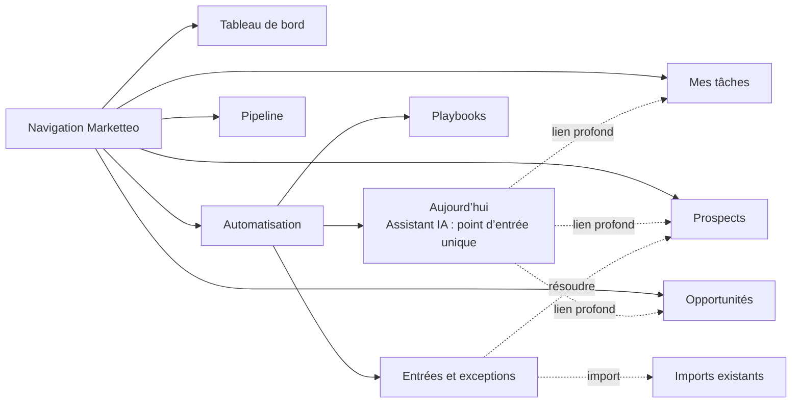
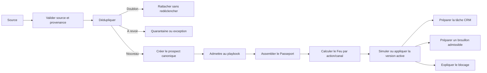
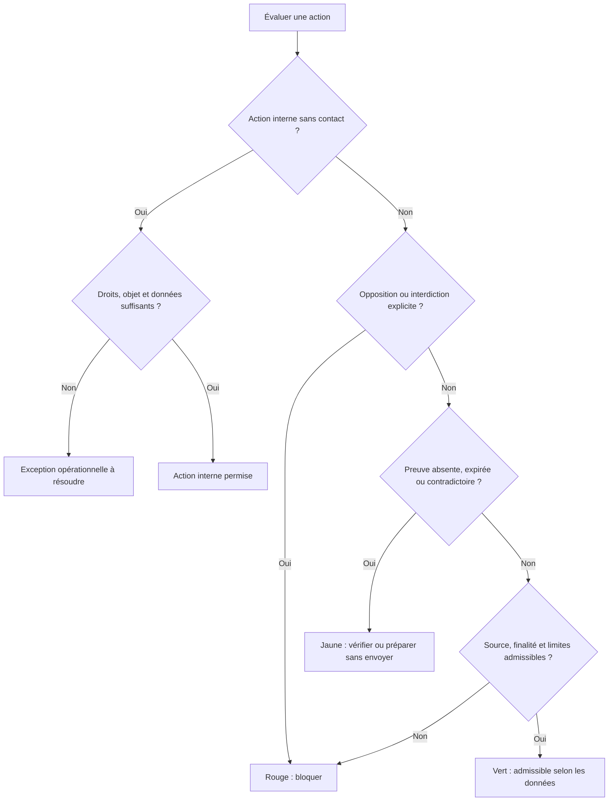

# Vague A — Fondations de décision avant l’Étape interne 3

| Élément | Valeur |
| --- | --- |
| Produit | Marketteo CRM |
| Programme | Pré-Phase 5 — Automatisation |
| Étape | Étape interne 2 — Conception fonctionnelle et UX |
| Vague | A — Sécuriser les fondations de décision |
| Autorisation | `GO` produit reçu le 30 septembre 2026 |
| Statut du dossier | **Clôturé — contre-validé et intégré à `RF-AUT-2.1`** |
| Approbation produit | `VA-DEC-01` à `VA-DEC-10` approuvées le 30 septembre 2026 |
| Contre-validations | Design, Ingénierie, Confiance, Sécurité et Qualité réalisées le 30 septembre 2026 |
| Réserve | Preuve Azure 4.6 reportée à la clôture de la Phase 5 |
| Analyse de référence | [Analyse croisée Phases 1 à 4](./ANALYSE_CROISEE_ETAPE_2_PHASES_1_A_4.md) |
| Conception fonctionnelle | [Étape 2 — Conception fonctionnelle et UX](./ETAPE_2_CONCEPTION_FONCTIONNELLE_UX.md) |
| Rapport de contre-validation | [Avis, preuves, réserves et scénarios](./CONTRE_VALIDATIONS_VAGUE_A.md) |
| Décision de sortie | [Porte 2 — GO avec réserves](./PORTE_2_GO_AVEC_RESERVES.md) |
| Référence active | [`RF-AUT-2.1` — référence fonctionnelle figée](./REFERENCE_FONCTIONNELLE_AUTOMATISATION_V2_1.md) |

## 1. Objet et résultat attendu

La Vague A transforme les principes de l’Étape 2 en décisions suffisamment précises pour construire un prototype V2 intégré et, après la Porte 2, guider l’architecture sans réinventer les objets du CRM.

Elle produit cinq livrables :

1. `P2-PRE3-02` — traçabilité détaillée entre l’expérience et le socle ;
2. `P2-PRE3-03` — navigation fonctionnelle cible ;
3. `P2-PRE3-04` — contrat fonctionnel des sources et déclencheurs ;
4. `P2-PRE3-05` — matrice du Feu relationnel ;
5. `P2-PRE3-07` — matrice des capacités Automatisation.

Ces décisions restent fonctionnelles. Elles nomment les responsabilités, invariants et preuves attendues sans imposer un schéma physique, un moteur d’orchestration ou un format définitif d’événement.

### 1.1 `P2-PRE3-01` — Référence locale et réserve Azure

La preuve Azure étant reportée, la référence observée au lancement de la Vague A est consignée sans la présenter comme une preuve CI :

| Élément | Référence observée |
| --- | --- |
| Branche Git | `codex/phase-2.4.3-audit` |
| HEAD Git au 30 septembre 2026 | `bd8d30d0b0d55758b657bdba3c2d6012d6071473` |
| Tête Alembic du verrou 4.6 | `20260929_0030` |
| Verdict local documenté | 345 tests backend, 216 tests frontend, 44 parcours navigateur Axe, zéro échec et zéro skip |
| Preuve Azure | Reportée à la clôture de la Phase 5 |

Le dossier local disponible ne contient pas de manifeste permettant de relier de façon probante l’exécution 4.6 à un SHA Git précis. Cette absence est acceptée pendant les travaux intermédiaires, mais elle ne doit pas être masquée. À la clôture de la Phase 5, le pipeline devra :

1. s’exécuter sur la révision finale identifiée ;
2. reconstruire les migrations jusqu’à la tête attendue de cette révision ;
3. rejouer la non-régression 4.6 et les contrôles de la Phase 5 ;
4. publier les JUnit, les rapports navigateur/accessibilité et un manifeste contenant le SHA Git ;
5. être vert avant le verdict final.

La consignation ci-dessus clôt l’action de décision `P2-PRE3-01`, pas l’obligation future de preuve.

## 2. Décisions transversales approuvées par Produit

Les propositions suivantes forment la base commune des cinq livrables :

- Automatisation est une extension du CRM existant ;
- aucun prospect, contact, tâche, opportunité, permission ou audit n’est dupliqué ;
- Nouveau prospect est un playbook unique et indépendant de la source ;
- un type de source reconnu ne signifie pas qu’un connecteur est disponible ;
- le Feu est calculé pour une action et, lorsqu’il y a contact, pour un canal ;
- le Feu ne remplace ni l’approbation humaine ni un avis juridique ;
- une tâche interne peut être permise même si un contact externe est Jaune ou Rouge ;
- le mode de départ du noyau Lite demeure `Préparer` ;
- l’IA est facultative et ne prend aucune décision de permission, de rôle ou d’autonomie ;
- les capacités Automatisation s’ajoutent aux capacités CRM existantes ; elles ne les contournent pas.

## 3. `P2-PRE3-02` — Traçabilité détaillée

### 3.1 Références techniques actuelles

- navigation et capacités de route : [`client/src/app/routes.js`](../../client/src/app/routes.js) ;
- réservation de la position Automatisation : [`client/src/app/navigationModel.js`](../../client/src/app/navigationModel.js) ;
- rôles et capacités actuels : [`backend/app/domain/identity.py`](../../backend/app/domain/identity.py) ;
- origines, provenances, canaux et permissions : [`backend/app/domain/prospect.py`](../../backend/app/domain/prospect.py) ;
- prospects, pipeline, tâches et activités : [`backend/app/presentation/api/routers/prospects.py`](../../backend/app/presentation/api/routers/prospects.py) ;
- opportunités : [`backend/app/presentation/api/routers/opportunities.py`](../../backend/app/presentation/api/routers/opportunities.py) ;
- connecteur Meta : [`backend/app/presentation/api/routers/connectors.py`](../../backend/app/presentation/api/routers/connectors.py).

### 3.2 Matrice Surface → Action → Ancrage

| Surface ou action Automatisation | Surface CRM existante | Objet maître | Cas d’usage, route ou capacité existante | Travail nouveau | Audit attendu |
| --- | --- | --- | --- | --- | --- |
| Ouvrir Automatisation | Coque authentifiée | Organisation active et appartenance | Nouvelle route protégée ; position réservée après Tableau de bord | Page et capacité de lecture Automatisation | Ouverture non auditée par défaut ; métrique produit minimisée |
| Essayer un prospect test | Aucun registre client | Scénario éphémère | Aucun cas d’usage CRM en écriture | Bac à sable isolé et réinitialisable | Aucun audit locataire ; télémétrie de démonstration séparée |
| Ajouter manuellement | Ajouter un prospect | `prospect` | `/api/prospects`, `prospects:create` | Émettre l’admission fonctionnelle au playbook | Création prospect existante + référence d’exécution |
| Ajouter depuis Google | Recherche Google / Prospects | `prospect` avec `place_id` | `/api/prospects/from-google`, `prospects:create` | Déclencher après création idempotente | Audit existant ; aucun descriptif Google |
| Choisir Import CSV | Conservation et imports / Historique | Session et run d’import, puis `prospect` | Routes d’import existantes, `imports:declare`, `imports:confirm` | Redirection vers le parcours actuel puis déclenchement après confirmation | Audit import existant + résultats d’admission |
| Choisir Meta/Facebook | Sources et acquisitions | Fournisseur, binding, ingestion, `prospect` | Webhook Meta, worker, `providers:*` | Politique d’activation du playbook ; aucune activation externe implicite | Audit fournisseur + ingestion + exécution |
| Choisir Web/API | Sources et acquisitions | Fournisseur, acquisition, `prospect` | Provenance `api` existante | Formulaire ou API authentifiée à créer | Admission, provenance et refus minimisés |
| Choisir webhook générique | Sources et acquisitions | Fournisseur, acquisition, `prospect` | Patron Meta seulement | Contrat, signature, fraîcheur, secret et idempotence à créer | Admission et refus sans secret ni charge utile |
| Choisir un responsable | Membres | Appartenance active | `members:read`; affectations CRM existantes | Paramètre de playbook et règle de repli | Version du playbook et identité de l’acteur |
| Définir un délai | Aucun objet autonome actuel | Paramètre du playbook | Validation serveur à créer | Durée bornée et unité canonique | Ancienne et nouvelle version du paramètre |
| Lancer un Prévol | Aucun | Simulation de version de playbook | Nouveau contrat | Même validation déterministe que l’exécution, sans effet métier | Acteur, version, compteurs et blocages, sans contenu excessif |
| Activer en Préparer | Aucun | Version active du playbook | Nouveau contrat et nouvelle capacité | Admission et activation atomiques | Acteur, version, mode et décision |
| Construire le Passeport | Fiche prospect | Prospect, provenance, permission, membre, tâche | Lectures CRM existantes | Agrégat explicable | Pas de copie ; accès sensible selon politique d’audit |
| Calculer le Feu | Fiche prospect / permissions | Permission et contexte d’action | Permissions existantes | Règle déterministe versionnée | Entrées minimisées, règle, résultat et raison |
| Afficher Aujourd’hui | Tableau de bord / Mes tâches | Tâches, échéances, opportunités et exceptions | `dashboard:*`, `tasks:read`, `opportunities:read` | Priorisation et projection Automatisation | Télémétrie d’affichage, pas de nouvel objet métier |
| Préparer une tâche | Mes tâches / Fiche prospect | Tâche CRM | `/api/prospects/{id}/tasks`, `tasks:create` | Référence au playbook, au déclencheur et à l’exécution | Audit de création existant + corrélation Automatisation |
| Reporter une recommandation | Aujourd’hui | Décision de recommandation | Aucun objet actuel équivalent | État borné de report avec échéance et motif | Acteur, ancienne échéance, nouvelle échéance, motif codifié |
| Ouvrir le Passeport | Fiche prospect | Agrégat de lecture | `prospects:read`, `contacts:read`, `tasks:read` | Vue contextuelle | Selon règles d’accès aux données consultées |
| Préparer un brouillon | Activité courriel | Brouillon nouveau relié au prospect | Permission et activité existantes | Objet versionné de brouillon | Auteur/générateur, version, canal, destinataire référencé |
| Approuver ou refuser | Aucun flux général actuel | Décision d’approbation | Nouvelle capacité | Approbation liée au contenu exact et expirante | Approbateur, décision, version, raison codifiée |
| Suspendre un playbook | Patron d’arrêt Meta | Playbook actif | Nouveau contrat ; `providers:manage` ne suffit pas | Suspension sans suppression des tâches existantes | Acteur, version, raison, effets empêchés |
| Reprendre un playbook | Patron de réactivation contrôlée | Nouvelle version ou état repris | Nouveau contrat | Prévol obligatoire si configuration devenue obsolète | Acteur, version et résultat du Prévol |
| Voir une exception | Imports, sources, tâches, permissions | Objet CRM concerné + exception nouvelle | Capacités de lecture existantes | Projection unifiée et statut de résolution | Consultation selon sensibilité ; résolution auditée |
| Résoudre propriétaire inactif | Membres / Prospect / Tâche | Appartenance et affectation existantes | `members:read`, `prospects:update`, `tasks:manage` | Exception Automatisation | Ancien/nouveau responsable et justification |
| Voir une source déconnectée | Sources et acquisitions | Fournisseur ou binding | `providers:read` | Santé consolidée | Événement technique minimisé ; action de gestion auditée |
| Consulter l’historique | Journal d’activité | Audit CRM + exécutions | `audit:read` | Vue métier corrélée | Lecture selon capacité, sans recopier les charges utiles |
| Mesurer l’usage | Quotas et usage | Registre d’usage | `usage:read:*` | Codes d’événements Automatisation fermés | Agrégats locataires, jamais une facture |

### 3.3 Règles de traçabilité

1. Toute écriture Automatisation indique son organisation, son acteur ou origine système, sa version de règle et sa clé de corrélation.
2. Une commande sur un objet CRM passe par son cas d’usage métier ; le moteur n’écrit pas directement dans ses tables.
3. Une projection peut être reconstruite depuis les objets maîtres et les décisions d’exécution.
4. Une erreur avant effet ne crée ni tâche, ni brouillon, ni fausse réussite.
5. Une reprise utilise la même identité fonctionnelle et ne double pas l’effet.
6. Un lien de corrélation ne doit pas contenir de donnée personnelle ou de contenu fournisseur.

## 4. `P2-PRE3-03` — Navigation fonctionnelle cible

### 4.1 Décision recommandée

Ajouter **Automatisation** comme entrée directe immédiatement après **Tableau de bord**, conformément à la réservation déjà présente dans le modèle de navigation. Ne pas remplacer les routes CRM existantes.

### 4.2 Routes fonctionnelles proposées

| Route proposée | Rôle UX | Contenu | Ne doit pas dupliquer |
| --- | --- | --- | --- |
| `/app/automation` | Redirection | Ouvre Aujourd’hui | Aucun contenu propre |
| `/app/automation/today` | Point d’entrée et priorités | Intention utilisateur, plan explicable, cinq premières actions, blocages et approbations | `/app/tasks`, `/app/dashboard`, `/app/opportunities` |
| `/app/automation/playbooks` | Catalogue et contrôle Lite | Trois playbooks, état et résultats synthétiques ; aucune nouvelle intention saisie ici | Aucun constructeur de workflows |
| `/app/automation/playbooks/:playbookId` | Détail/configuration | Paramètres, Prévol, version, activation et suspension | Journal d’audit complet |
| `/app/automation/exceptions` | Entrées et exceptions | Doublons, quarantaines, absence de responsable, source indisponible | Portefeuille complet et historique d’import complet |

Le Passeport reste une surface contextuelle de la fiche prospect et du Copilote. Le Prévol reste une étape du détail d’un playbook. Les approbations apparaissent dans Aujourd’hui et Entrées et exceptions ; elles ne deviennent pas une sixième capacité principale.

`Aujourd’hui` est l’unique point d’entrée pour une nouvelle demande formulée par un utilisateur. Cette règle ne retire pas les déclencheurs automatiques déjà configurés : elle supprime seulement les points de création concurrents dans l’interface.

### 4.3 Visibilité par rôle

| Surface | `sales` | `manager` | `admin` |
| --- | --- | --- | --- |
| Automatisation dans la navigation | Oui, si lecture personnelle | Oui | Oui |
| Aujourd’hui | Périmètre personnel | Périmètre personnel et organisation autorisée | Organisation |
| Playbooks | Lecture synthétique | Lecture et gestion selon capacités | Gestion complète |
| Entrées et exceptions | Cas assignés | Organisation | Organisation |

### 4.4 Règles d’intégration UX

- conserver la langue, l’organisation active, le retour arrière et les conventions de la coque actuelle ;
- ouvrir une fiche CRM existante au lieu de reproduire son éditeur ;
- préserver les filtres lorsque l’utilisateur revient à Automatisation ;
- distinguer « recommandation », « tâche créée » et « action exécutée » ;
- ne pas afficher une commande si la capacité serveur correspondante manque ;
- offrir un état mobile et clavier équivalent ;
- limiter le premier niveau à trois entrées dans Automatisation ;
- conserver un seul champ d’intention, dans Aujourd’hui, pour tous les rôles autorisés.

### 4.5 Décision mobile contre-validée

La barre mobile actuelle conserve ses quatre raccourcis (`Tableau de bord`, `Tâches`, `Prospects`, `Pipeline`) et le bouton `Plus`. En V1, Automatisation devient la première entrée du menu `Plus`, ce qui préserve son rang global immédiatement après Tableau de bord sans ajouter un cinquième raccourci permanent. Sa découvrabilité, le maintien du focus et l’état actif des routes `/app/automation/*` seront testés dans le prototype V2.

Cette adaptation ne modifie pas `VA-DEC-01` : Automatisation demeure après Tableau de bord dans la navigation principale de bureau et dans l’ordre du menu mobile.

## 5. `P2-PRE3-04` — Sources et déclencheurs

### 5.1 Déclencheur fonctionnel commun

Le playbook **Nouveau prospect** reçoit un événement fonctionnel unique :

> Un prospect vient d’être admis dans le CRM de l’organisation, après validation de sa source, de sa provenance et de son identité exacte.

Le nom technique de l’événement sera décidé à l’Étape 3. Le contrat fonctionnel exige au minimum :

- organisation ;
- identifiant du prospect ;
- origine et provenance ;
- référence d’acquisition ou d’import lorsqu’elle existe ;
- instant d’admission ;
- acteur ou origine système ;
- identifiant externe autorisé lorsqu’il existe ;
- identité fonctionnelle empêchant le double traitement.

Le déclencheur est émis après la réussite de l’écriture canonique. Une quarantaine, un doublon exact ou un refus de source ne déclenche pas Nouveau prospect.

### 5.2 Matrice des sources

| Source | État dans le socle | Point d’admission | Permission initiale | Comportement du playbook | Statut produit |
| --- | --- | --- | --- | --- | --- |
| Prospect test | Prototype seulement | Jeu de démonstration | Scénario contrôlé | Simulation complète sans écriture CRM réelle | Livré dans le prototype |
| Manuel | Livré | Création réussie du prospect | Selon les coordonnées et décisions saisies ; sinon `unknown` | Déclenche Nouveau prospect si la politique de source est active | À intégrer au prototype V2 |
| Google | Livré | Référence créée depuis `place_id` | `unknown` pour tout canal non prouvé ; aucune coordonnée Google persistée | Tâche interne permise ; contact externe non proposé sans preuve | À intégrer au prototype V2 |
| CSV | Livré | Confirmation atomique d’une création | `unknown` par défaut selon le flux actuel | Une création déclenche ; doublon ou quarantaine ne redéclenche pas | Démontré partiellement |
| Meta/Facebook | Pilote technique livré, activation réelle externe bloquée | Résultat d’ingestion importé | `unknown` ou `allowed` uniquement selon contrat approuvé et mapping autorisé | Déclenche seulement si binding, contrat et organisation sont actifs | Conditionnel |
| Formulaire Web/API | Modèle réutilisable, entrée non livrée | Admission authentifiée future | Selon preuve fournie ; sinon `unknown` | Même playbook, provenance `api`, fournisseur/acquisition requis | Nouvelle capacité V1 à décider |
| Webhook générique | Non livré | Admission signée future | Selon charge autorisée et preuve ; sinon `unknown` | Même playbook après signature, fraîcheur et idempotence | Nouvelle capacité |
| LinkedIn | Type reconnu, connecteur non livré | Futur connecteur autorisé | Selon contrat et preuve | Aucun parcours réel tant que le connecteur n’est pas approuvé | Différé |
| Open data / fournisseur autorisé | Modèle livré partiellement selon registre | Acquisition approuvée | `unknown` sauf preuve distincte | Tâche interne possible ; contact selon Feu par canal | Hors lancement Lite par défaut |

### 5.3 Conditions d’admission au playbook

Toutes les conditions suivantes doivent être vraies :

1. le prospect canonique existe dans l’organisation active ;
2. l’admission n’est ni un doublon exact, ni une quarantaine, ni un rejet ;
3. le playbook et sa version sont actifs pour cette organisation ;
4. la source est activée dans les paramètres du playbook ;
5. l’événement n’a pas déjà été admis par cette version ;
6. le prospect n’est pas archivé ;
7. les règles de suspension et d’arrêt général ne bloquent pas l’admission.

L’absence de responsable actif ne rejette pas le prospect : elle crée une exception visible. L’absence de permission de contact ne bloque pas les tâches internes admissibles ; elle modifie le Feu des actions externes.

### 5.4 Réadmission et rejeu

- un doublon exact n’est pas un nouveau prospect ;
- une correction de coordonnées ne redéclenche pas automatiquement Nouveau prospect ;
- une reprise technique rejoue la même admission sans créer de second effet ;
- une réadmission métier après archivage ou réouverture exige une décision explicite et une nouvelle identité fonctionnelle ;
- une nouvelle version de playbook ne retraite pas tout l’historique sans simulation, périmètre et confirmation explicites.

### 5.5 Flux fonctionnel

## 6. `P2-PRE3-05` — Feu relationnel

### 6.1 Nature de la décision

Le Feu est un indicateur déterministe calculé pour :

- un prospect ;
- une action proposée ;
- un canal lorsqu’il y a communication ;
- un instant ;
- une version de règles.

Il n’existe pas de « Feu Vert global » valable pour toutes les actions. Un prospect peut être Rouge pour un courriel, Jaune pour un appel et admissible pour une tâche interne.

### 6.2 Priorité des résultats

La priorité est `Rouge > Jaune > Vert`. Une règle Rouge ne peut être abaissée par l’IA, une approbation, une nouvelle source ou une règle de playbook.

### 6.3 Matrice de décision externe par canal

| Situation | Feu | Action autorisée | Explication minimale |
| --- | --- | --- | --- |
| Permission `do_not_contact` | Rouge | Aucune communication sur le canal | Opposition ou restriction explicite enregistrée |
| Permission `opted_out` | Rouge | Aucune communication sur le canal | Retrait ou désabonnement enregistré |
| Contrat/source suspendu, retiré ou interdit pour la finalité | Rouge | Aucune action utilisant cette provenance | Source ou usage non admissible |
| Acquisition rejetée ou en quarantaine | Rouge pour l’action fondée sur cette donnée | Résolution de l’exception seulement | Acquisition non admise |
| Permission absente ou `unknown` | Jaune | Tâche interne, vérification ou brouillon non envoyable | Permission non démontrée |
| Permission hors période de validité | Jaune | Vérification ; aucun envoi | Validité à confirmer |
| Provenance ou finalité incomplète | Jaune | Compléter ou vérifier | Preuve insuffisante |
| Données contradictoires | Jaune | Résolution humaine | Les preuves ne concordent pas |
| Approbation requise mais absente | Jaune | Préparer ou demander l’approbation | Accord humain requis avant envoi |
| Permission `allowed`, valide, provenance admissible, finalité compatible, aucune opposition | Vert | Action admissible selon son niveau d’autonomie | Conditions disponibles satisfaites |

### 6.4 Actions internes

| Action interne | Permission de contact nécessaire | Résultat normal | Cas de blocage ou exception |
| --- | --- | --- | --- |
| Créer une tâche de prise en charge | Non | Action interne permise | Responsable invalide, objet archivé ou droit absent : exception opérationnelle |
| Attribuer un responsable actif | Non | Action interne permise | Membre inactif ou hors organisation : exception |
| Afficher une recommandation | Non | Action interne permise | Données insuffisantes : recommandation incomplète, sans inventer |
| Préparer un brouillon | Oui pour rendre le brouillon admissible à approbation externe | Vert ou Jaune selon preuve | Rouge interdit la préparation destinée à l’envoi ; un modèle générique non adressé peut rester éditable |
| Modifier silencieusement le pipeline | Sans objet | Toujours interdit en V1 | Proposer une action explicite seulement |

Une action interne ne reçoit aucune couleur relationnelle. Elle est permise ou placée en exception opérationnelle. De même, une limite temporaire de fréquence ou de volume entraîne un report opérationnel sans changer le Feu ; une interdiction de finalité ou de provenance reste, elle, une cause relationnelle de Rouge.

Un contrat de source expiré interdit l’action qui dépend de cette provenance. Une permission de contact expirée produit Jaune et exige une vérification. Ces deux situations ne doivent pas partager le même libellé.

### 6.5 Contrat d’explication

Chaque Feu expose :

1. le résultat et l’action évaluée ;
2. la raison principale ;
3. le canal et la finalité lorsqu’ils s’appliquent ;
4. les preuves disponibles et les données manquantes sous forme minimisée ;
5. la règle et sa version ;
6. l’instant du calcul ;
7. la prochaine action possible ;
8. la mention « selon les données disponibles » pour Vert.

### 6.6 Cas sentinelles à conserver

- courriel `unknown`, tâche interne permise ;
- courriel `opted_out`, envoi et brouillon destiné à l’envoi bloqués ;
- téléphone autorisé mais courriel inconnu : résultats distincts ;
- source devenue suspendue après ingestion ;
- permission autorisée mais expirée ;
- approbation obtenue puis contenu modifié ;
- opposition retrouvée après approbation ;
- règle de fréquence atteinte ;
- propriétaire inactif sans modification du Feu relationnel ;
- panne technique présentée comme erreur, jamais comme Feu Rouge.

## 7. `P2-PRE3-07` — Capacités Automatisation

### 7.1 Principes

- les rôles restent `admin`, `manager` et `sales` ;
- une capacité Automatisation ne remplace jamais une capacité CRM requise par l’effet ;
- les droits sont vérifiés côté serveur au moment de l’action et au moment de l’exécution différée ;
- une perte d’appartenance ou de capacité avant effet ferme l’action ;
- le mandat Confiance/Sécurité est un ensemble de capacités porté par un rôle existant ;
- lever une opposition reste hors des playbooks et suit le processus de permission existant.

### 7.2 Catalogue proposé

| Capacité nouvelle | Objet | Portée |
| --- | --- | --- |
| `automation:read:self` | Voir Aujourd’hui, ses cartes et ses exécutions | Utilisateur courant |
| `automation:read:organization` | Voir les résultats et exceptions de l’organisation | Organisation active |
| `automation:playbooks:configure` | Modifier les paramètres des recettes guidées | Organisation active |
| `automation:preflight:run` | Lancer un Prévol sur une version | Organisation active |
| `automation:playbooks:activate` | Activer une version en mode Préparer | Organisation active |
| `automation:playbooks:suspend` | Suspendre ou reprendre un playbook | Organisation active |
| `automation:exceptions:manage` | Réattribuer, reporter ou résoudre une exception admissible | Périmètre autorisé |
| `automation:approvals:decide` | Approuver ou refuser une action externe précise | Approbations assignées ou organisation selon politique |

Les lectures détaillées d’audit réutilisent `audit:read`. La santé contractuelle des sources réutilise `providers:read`; leur gestion réutilise `providers:manage` et `providers:review`. Les mesures réutilisent `usage:read:self` et `usage:read:organization`.

### 7.3 Matrice recommandée par rôle

| Capacité | `sales` | `manager` | `admin` | Justification |
| --- | --- | --- | --- | --- |
| `automation:read:self` | Oui | Oui | Oui | Accès minimal à ses actions |
| `automation:read:organization` | Non | Oui | Oui | Cohérent avec Tableau de bord et Usage |
| `automation:playbooks:configure` | Non | Oui | Oui | Le manager peut adapter une recette bornée, sans constructeur libre |
| `automation:preflight:run` | Non, lecture des résultats pertinents | Oui | Oui | Évite des simulations organisationnelles non autorisées |
| `automation:playbooks:activate` | Non | Oui | Oui | Le manager peut activer en mode Préparer ; toute autonomie supérieure est hors V1 |
| `automation:playbooks:suspend` | Demande ou signalement | Oui | Oui | Un arrêt doit rester rapidement accessible aux responsables |
| `automation:exceptions:manage` | Ses cartes et actions assignées, selon droits CRM | Oui | Oui | Le périmètre reste aligné avec les objets sous-jacents |
| `automation:approvals:decide` | Non en V1 | Oui | Oui | Séparation simple entre préparation commerciale et décision externe |

Le socle actuel attribue les capacités par rôle au moyen d’un catalogue statique. En V1, les droits ci-dessus s’appliquent donc à tous les membres actifs du rôle concerné. Une délégation individuelle ou temporaire constituerait un nouveau modèle d’autorisation et reste hors périmètre tant qu’elle n’est pas conçue et validée.

### 7.4 Combinaisons obligatoires avec les capacités existantes

| Action visible | Capacité Automatisation | Capacité CRM ou plateforme également requise |
| --- | --- | --- |
| Voir une carte de prospect | `automation:read:self` ou `automation:read:organization` | `prospects:read` |
| Créer une tâche | `automation:exceptions:manage` ou exécution système admise | `tasks:create` pour l’acteur ou contrat système approuvé |
| Réattribuer un prospect | `automation:exceptions:manage` | `prospects:update` et `members:read` |
| Modifier une opportunité | `automation:exceptions:manage` | `opportunities:update` ou `opportunities:close` selon l’action |
| Voir une source | Lecture Automatisation pertinente | `providers:read` |
| Gérer ou revoir un connecteur | Aucune capacité Automatisation suffisante | `providers:manage` ou `providers:review` |
| Consulter l’audit détaillé | Lecture Automatisation pertinente | `audit:read` |
| Voir l’usage organisationnel | `automation:read:organization` | `usage:read:organization` |
| Changer une permission | Aucune capacité Automatisation suffisante | `permissions:restrict` ou `permissions:allow` selon le processus existant |

### 7.5 Approbation externe

Pour la V1 Lite :

- `sales` prépare ou modifie un brouillon et demande une approbation ;
- `manager` ou `admin` décide avec `automation:approvals:decide` ;
- l’auteur ne s’auto-approuve pas lorsque la politique exige une séparation ;
- toute modification significative du destinataire, canal, contenu ou justification invalide l’approbation ;
- une opposition découverte après approbation annule l’admissibilité ;
- l’approbation n’est jamais une permission de contact et ne lève jamais une opposition.

## 8. Impacts sur le prototype V2

Le prochain prototype devra démontrer au minimum :

1. Automatisation dans la coque réelle après Tableau de bord ;
2. un lien profond vers une fiche Prospect et une tâche existantes ;
3. l’admission manuelle, Google, CSV et Meta/Web avec leur statut réel ;
4. un Feu distinct pour une tâche interne et un courriel ;
5. un propriétaire devenu inactif présenté comme exception opérationnelle ;
6. la suspension et la reprise ;
7. la modification d’un brouillon invalidant une approbation ;
8. une source déconnectée ;
9. les cartes synthétiques Proposition en attente et Occasion oubliée ;
10. les refus d’action liés aux capacités.

Sur mobile, le prototype conserve quatre raccourcis et démontre l’accès à Automatisation comme première entrée de `Plus`, son rang global après Tableau de bord, l’état actif des routes imbriquées, le retour et le focus clavier.

## 9. Critères de validation de la Vague A

La Vague A peut être déclarée validée lorsque :

- [x] Produit approuve la navigation et les limites des trois surfaces ;
- [x] Design confirme que les liens avec le CRM évitent les doubles parcours, avec réserves mobiles transférées au prototype V2 ;
- [x] Ingénierie confirme que chaque écriture réutilise un cas d’usage ou est explicitement nouvelle, avec six contrats transmis à l’Étape 3 ;
- [x] Confiance approuve la matrice corrigée du Feu et la séparation permission/approbation ;
- [x] Sécurité approuve la conception des capacités et exige les doubles contrôles avant tout effet ;
- [x] Qualité transforme les cas sentinelles en vingt scénarios testables ;
- [x] les sources réelles, conditionnelles, nouvelles et différées sont classées dans le contrat fonctionnel ; leur compréhension visuelle reste à tester dans le prototype V2 ;
- [x] aucune décision produit n’impose Meta, LinkedIn, IA ou un envoi externe pour démontrer la valeur ;
- [x] les décisions ouvertes restantes sont nommées et transférées à la Vague B ou à l’Étape 3 dans le rapport de contre-validation ;
- [x] le report Azure est conservé comme réserve de clôture de Phase 5.

## 10. Décisions produit approuvées

Les dix décisions suivantes ont été approuvées explicitement par le responsable produit le 30 septembre 2026. Elles deviennent normatives pour le prototype V2 et les contre-validations de la Vague A. Une contre-validation peut signaler un risque ou demander une réouverture formelle ; elle ne modifie pas silencieusement ces décisions.

| ID | Décision approuvée | Statut |
| --- | --- | --- |
| `VA-DEC-01` | Placer Automatisation immédiatement après Tableau de bord | Approuvée |
| `VA-DEC-02` | Utiliser trois surfaces internes : Aujourd’hui, Playbooks, Entrées et exceptions ; Aujourd’hui porte l’unique point d’entrée utilisateur, les autres surfaces contrôlent ou résolvent ; le diagnostic de source est contextuel | Mise à jour produit du 1er octobre 2026 |
| `VA-DEC-03` | Conserver Passeport, Prévol et approbations comme surfaces contextuelles, non comme entrées principales | Approuvée |
| `VA-DEC-04` | Déclencher un seul playbook Nouveau prospect, indépendant de la source | Approuvée |
| `VA-DEC-05` | Ne pas redéclencher automatiquement sur doublon, correction ou nouvelle version de playbook | Approuvée |
| `VA-DEC-06` | Calculer le Feu par action et par canal, avec priorité Rouge > Jaune > Vert | Approuvée |
| `VA-DEC-07` | Séparer Feu relationnel et exception opérationnelle | Approuvée |
| `VA-DEC-08` | Autoriser `manager` et `admin` à configurer, prévisualiser, activer et suspendre | Approuvée |
| `VA-DEC-09` | Réserver l’approbation externe à `manager` et `admin` en V1 | Approuvée |
| `VA-DEC-10` | Exiger simultanément la capacité Automatisation et la capacité CRM de l’effet | Approuvée |

## 11. Sortie du dossier

Ce document a constitué l’entrée normative de la Vague B. Ses décisions approuvées sont maintenant consolidées dans la [référence fonctionnelle `RF-AUT-2.1`](./REFERENCE_FONCTIONNELLE_AUTOMATISATION_V2_1.md), contrat d’entrée de l’Étape 3. Les noms techniques définitifs, les formats d’événement, les schémas de données et les choix d’orchestration restent du ressort de cette étape.

Le `GO` de la Vague A et le `GO avec réserves` de Porte 2 ne sont pas des GO de développement ou de production. Ils autorisent désormais la conception technique contre `RF-AUT-2.1`.

## 12. Journal de décision

| Date | Décision | Effet |
| --- | --- | --- |
| 30 septembre 2026 | Approbation de `VA-DEC-01` à `VA-DEC-10` | Navigation, déclencheur commun, Feu et capacités gelés au niveau Produit ; contre-validations transversales requises avant clôture de la Vague A |
| 30 septembre 2026 | Contre-validations Design, Ingénierie, Confiance, Sécurité et Qualité réalisées | Vague A fermée avec réserves explicites transférées ; Vague B autorisée, développement de production non autorisé |
| 1er octobre 2026 | Porte 2 prononcée `GO avec réserves` | Les décisions de la Vague A sont acceptées comme fondations de l’Étape 3 ; aucun GO de production |
| 1er octobre 2026 | Référence `RF-AUT-2.1` figée | Navigation, Feu, capacités et traçabilité deviennent des invariants versionnés |
