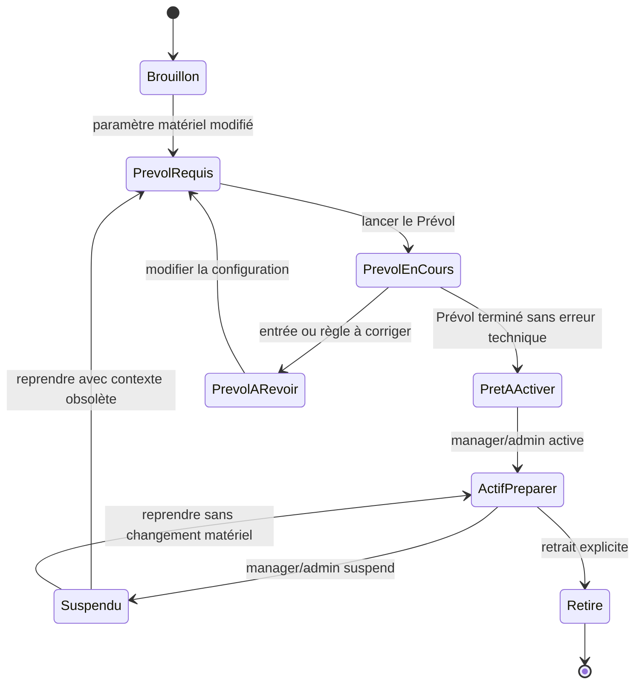
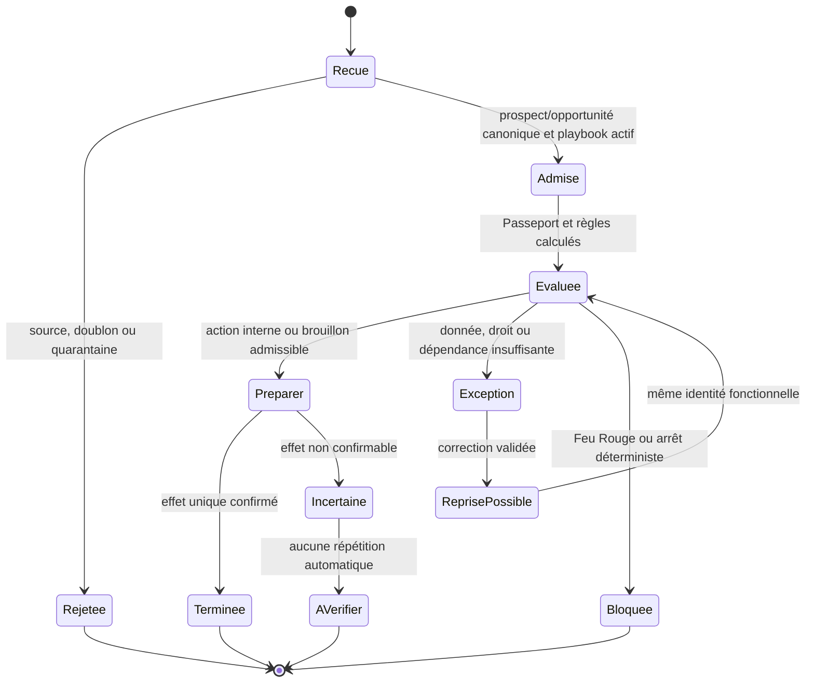
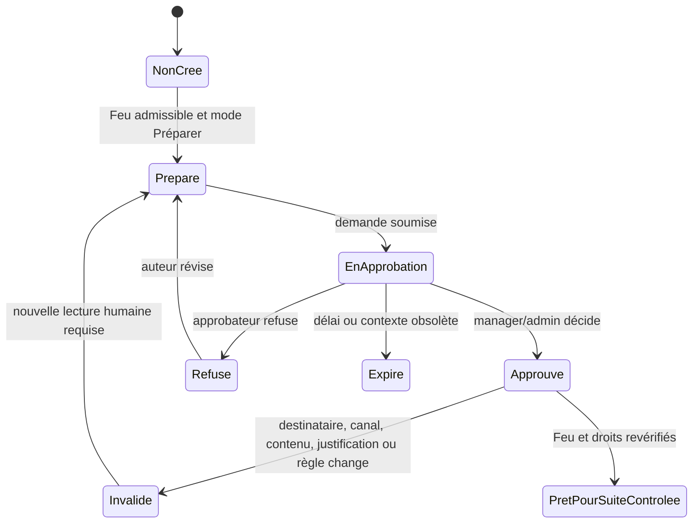

# Vague B — Rendre l’Automatisation testable

| Élément | Valeur |
| --- | --- |
| Produit | Marketteo CRM |
| Programme | Pré-Phase 5 — Automatisation |
| Étape | Étape interne 2 — Conception fonctionnelle et UX |
| Autorisation | `GO` Produit reçu le 30 septembre 2026 |
| Statut | **Clôturée — recette V2.1 validée et Porte 2 franchie avec réserves** |
| Prérequis | [Vague A contre-validée](./VAGUE_A_FONDATIONS_DECISION.md) |
| Contre-validations | [Avis et réserves transférées](./CONTRE_VALIDATIONS_VAGUE_A.md) |
| Prototype V2.1 | [Ouvrir le prototype intégré](./PROTOTYPE_CLIQUABLE_ETAPE_2_V2.html) |
| Revue Produit | [Rapport de validation favorable du prototype V2](./RAPPORT_VALIDATION_VAGUE_B.md) |
| Recette et recherche | [Recette V2.1 validée et sessions PME post-production — Vague C](./RECETTE_ET_RECHERCHE_VAGUE_C.md) |
| Décision de sortie | [Porte 2 — GO avec réserves](./PORTE_2_GO_AVEC_RESERVES.md) |
| Référence active | [`RF-AUT-2.1` — référence fonctionnelle figée](./REFERENCE_FONCTIONNELLE_AUTOMATISATION_V2_1.md) |

## 1. Objectif et limites

La Vague B rend les décisions de la Vague A observables, explicables et testables avec une PME. Elle ne lance pas le développement de production et n’autorise ni l’envoi externe, ni un connecteur social réel, ni une autonomie supérieure au mode `Préparer`.

Elle couvre :

| ID | Livrable | Résultat attendu |
| --- | --- | --- |
| `P2-PRE3-06` | Cycles de vie | États, transitions, acteurs, effets et invariants gelés fonctionnellement |
| `P2-PRE3-08` | Erreurs et récupération | Chaque situation explique ce qui s’est passé, ce qui n’a pas été fait et la prochaine action |
| `P2-PRE3-09` | Prototype V2 | Coque intégrée, exceptions contextualisées, capacité et trois playbooks démontrables |
| `P2-PRE3-10` | Deux playbooks complémentaires | Proposition en attente et Occasion oubliée compréhensibles sans créer de nouveau registre |
| `P2-PRE3-11` | Acceptation et télémétrie | Scénarios vérifiables et événements minimisés, versionnés et non sensibles |

## 2. `P2-PRE3-06` — Cycles de vie fonctionnels

### 2.1 Playbook et version

| État | Signification | Acteur autorisé | Effet permis | Invariant |
| --- | --- | --- | --- | --- |
| `Brouillon` | Recette non exécutante | `manager`, `admin` | Éditer une nouvelle version | Aucun déclenchement |
| `Prévol requis` | Une simulation à jour manque | `manager`, `admin` | Lancer Prévol | Activation impossible |
| `Prévol en cours` | Simulation déterministe en exécution | Système | Lire les résultats | Aucun effet CRM ou externe |
| `Prêt à activer` | Prévol courant et compréhensible | `manager`, `admin` | Activer en `Préparer` | Version et résultat liés |
| `Actif — Préparer` | Admission des événements autorisée | Système, sous contrôle | Préparer tâches, brouillons et exceptions | Aucun envoi externe automatique |
| `Suspendu` | Nouveaux effets arrêtés | `manager`, `admin` | Consulter, diagnostiquer, reprendre | Historique et tâches existantes préservés |
| `Retiré` | Recette arrêtée définitivement | `admin` | Consulter l’historique | Aucune reprise implicite |

Une modification matérielle concerne au minimum la source activée, le responsable, le délai, les étapes surveillées, le canal, la finalité, le niveau d’autonomie ou une règle de Feu. Elle crée une nouvelle version et exige un nouveau Prévol.

### 2.2 Admission, exécution et reprise

| Règle | Conséquence obligatoire |
| --- | --- |
| Une admission suit l’écriture CRM canonique | Aucun prospect parallèle n’est créé |
| La même identité fonctionnelle est rejouée | Aucun second effet métier n’est créé |
| Une incertitude après effet possible | Afficher `À vérifier`, ne jamais répéter automatiquement |
| Une capacité, appartenance ou permission est retirée | Réévaluer avant effet et basculer vers `Exception` ou `Bloquée` |
| Un playbook est suspendu | Arrêter les nouvelles admissions sans supprimer tâches, brouillons, décisions ou audit |

### 2.3 Brouillon et approbation

L’approbation est attachée à une empreinte du destinataire, du canal, du contenu, de la justification, de la version de playbook et de la version de règle. Elle ne constitue ni une permission de contact ni une dérogation au Feu Rouge.

### 2.4 Exception opérationnelle

| État | Entrée | Sortie autorisée | Interdit |
| --- | --- | --- | --- |
| `Ouverte` | Responsable inactif, source déconnectée, droit absent, limite temporaire, effet incertain | Réassigner, reconnecter, attendre, vérifier ou abandonner avec raison | Déguiser l’incident en Feu relationnel |
| `En traitement` | Un utilisateur autorisé prend en charge l’exception | Résoudre ou revenir à `Ouverte` | Masquer la cause initiale |
| `Résolue` | Correction vérifiée | Réévaluer l’action avec la même corrélation | Relancer sans réévaluation |
| `Abandonnée` | Décision explicite documentée | Consulter l’historique | Suppression silencieuse |

## 3. `P2-PRE3-08` — Erreurs, blocages et récupération

### 3.1 Contrat de message

Tout état affiche : le fait, l’effet réalisé ou non, la prochaine action, un accès au détail et, si nécessaire, une référence de diagnostic. Les libellés sont disponibles en français canadien et en anglais canadien lors de l’implémentation ; le prototype teste ici les libellés français de référence.

| Code fonctionnel | Catégorie | Libellé utilisateur | Aucun effet garanti | Action principale | État cible |
| --- | --- | --- | --- | --- | --- |
| `AUT-SRC-001` | Source | `Source déconnectée` | Aucune nouvelle entrée n’a été reçue | Reconnecter ou utiliser un prospect test | Exception ouverte |
| `AUT-SRC-002` | Source | `Entrée non authentifiée` | Aucun prospect n’a été créé | Vérifier la configuration source | Rejetée/quarantaine |
| `AUT-DUP-001` | Donnée | `Prospect déjà connu` | Aucune seconde tâche n’a été créée | Ouvrir la fiche existante | Rattachée |
| `AUT-MATCH-001` | Donnée | `Correspondance à vérifier` | Aucune fusion n’a été réalisée | Rattacher ou créer séparément | Quarantaine |
| `AUT-OWN-001` | Affectation | `Responsable indisponible` | Aucune attribution aléatoire n’a été faite | Choisir un membre actif | Exception ouverte |
| `AUT-PERM-001` | Relationnel | `À vérifier avant contact` | Aucun contact externe n’est proposé | Vérifier la permission | Feu Jaune |
| `AUT-PERM-002` | Relationnel | `Contact bloqué — opposition enregistrée` | Aucun brouillon destiné à l’envoi ni envoi n’a été créé | Consulter la raison | Feu Rouge |
| `AUT-RATE-001` | Opérationnel | `Action reportée par une limite` | L’action n’a pas été répétée | Revoir à la date proposée | Exception ouverte |
| `AUT-CAP-001` | Autorisation | `Cette action nécessite un responsable ou administrateur` | La configuration n’a pas changé | Demander l’intervention appropriée | Refus d’accès |
| `AUT-APPR-001` | Approbation | `Approbation à renouveler` | Aucun envoi n’est possible | Examiner le brouillon modifié | Brouillon préparé |
| `AUT-EXEC-001` | Exécution | `Résultat à vérifier` | L’effet ne peut pas être confirmé | Ouvrir l’historique, ne pas relancer | À vérifier |
| `AUT-PLAY-001` | Playbook | `Playbook suspendu` | Aucune nouvelle action n’est engagée | Voir la raison, reprendre si autorisé | Suspendu |

### 3.2 Principes non négociables

- Rouge et Jaune sont réservés au Feu relationnel ; source, limite, responsable et panne restent opérationnels.
- `Réessayer` n’est affiché que si l’identité d’exécution et l’absence d’effet sont certaines.
- Une reprise après correction conserve le lien de corrélation et l’historique.
- Une erreur technique ne devient jamais artificiellement un succès, un Rouge relationnel ou une donnée supprimée.
- La suspension est disponible avant la résolution totale d’un incident.

## 4. `P2-PRE3-09` — Prototype V2 intégré

Le [prototype V2](./PROTOTYPE_CLIQUABLE_ETAPE_2_V2.html) reproduit l’architecture de navigation décidée : Automatisation suit Tableau de bord dans la coque de bureau ; sur mobile elle est la première entrée de `Plus`. Il démontre :

1. les trois surfaces `Aujourd’hui`, `Playbooks` et `Entrées et exceptions` ;
2. des liens de conception vers les objets CRM existants, sans doublon de fiche ;
3. les erreurs de source rendues visibles dans les exceptions, avec un accès contextuel aux réglages d’intégration existants ;
4. un Feu relationnel distinct de l’action interne et de l’exception opérationnelle ;
5. une exception de responsable inactif, une source déconnectée, un doublon et une quarantaine ;
6. suspension, reprise et Prévol ;
7. édition d’un brouillon qui invalide l’approbation ;
8. refus de configuration lorsqu’un rôle `sales` est simulé ;
9. les trois playbooks, sans envoi externe réel.
10. `Demander à l’IA` dans Aujourd’hui comme unique point d’entrée d’une intention utilisateur : phrase libre ou suggestion guidée, plan explicable, périmètre estimé et garde-fous avant toute préparation ; elle ne produit aucun effet direct.

## 5. `P2-PRE3-10` — Deux playbooks complémentaires

### 5.1 Proposition en attente

| Élément | Décision testable |
| --- | --- |
| Objet maître | Opportunité canonique à l’étape `proposal` |
| Déclencheur | Aucune réponse ni activité pertinente après le délai configuré |
| Paramètres Lite | Délai de rappel, responsable, préparation de brouillon oui/non |
| Résultat normal | Tâche de suivi ou brouillon admissible ; jamais déplacement silencieux d’étape |
| Arrêts | Réponse reçue, proposition fermée, attente explicitement convenue, tâche équivalente, suspension |
| Exception | Permission inconnue, opposition, limite temporaire, responsable inactif |
| Valeur à tester | « Je ne laisse plus une proposition silencieuse sans prochaine action claire. » |

### 5.2 Occasion oubliée

| Élément | Décision testable |
| --- | --- |
| Objet maître | Opportunité ouverte dans `discovery`, `qualification`, `proposal` ou `negotiation` |
| Déclencheur | Aucune activité, tâche ouverte ni échéance dans la fenêtre d’inactivité configurée |
| Paramètres Lite | Durée, étapes concernées, responsable de revue |
| Résultat normal | Tâche de revue, proposition de relance/révision/fermeture ; aucune modification silencieuse |
| Arrêts | Opportunité fermée, activité récente, prochaine action existante, attente explicite, suspension |
| Exception | Synchronisation incertaine, responsable inactif, accès opportunité absent |
| Valeur à tester | « Je vois les occasions qui risquent de se perdre, sans que le système modifie mon pipeline à ma place. » |

## 6. `P2-PRE3-11` — Acceptation et télémétrie

### 6.1 Scénarios d’acceptation de la Vague B

| ID | Étant donné / Quand | Alors | Preuve |
| --- | --- | --- |
| `ACC-B-01` | Une PME ouvre Automatisation | Elle trouve Aujourd’hui, Playbooks et Exceptions sans perdre le CRM | Session observée |
| `ACC-B-02` | Un utilisateur mobile ouvre Plus | Automatisation est la première entrée et son contexte reste actif | Parcours navigateur/a11y |
| `ACC-B-03` | Nouveau prospect issu de Manuel, Google, CSV, Meta ou Web/API | Une même recette Nouveau prospect s’applique après admission canonique | Prototype + scénario d’intégration futur |
| `ACC-B-04` | Un doublon ou une quarantaine survient | Aucun second prospect/tâche ; cause et prochaine action visibles | Scénario d’exception |
| `ACC-B-05` | Permission courriel inconnue | Jaune pour le courriel ; tâche interne encore permise | Scénario Feu |
| `ACC-B-06` | Opposition explicite | Rouge ; aucune préparation destinée à l’envoi | Scénario Feu |
| `ACC-B-07` | Responsable inactif ou limite temporaire | Exception opérationnelle, sans altérer le Feu relationnel | Scénario d’exception |
| `ACC-B-08` | Un manager lance un Prévol puis active | Le mode affiché est `Préparer` et zéro envoi externe est explicite | Parcours prototype |
| `ACC-B-09` | Un commercial tente de configurer/suspendre | Le refus identifie la capacité attendue ; aucun état ne change | Scénario autorisation |
| `ACC-B-10` | Un brouillon est modifié après approbation | L’approbation devient invalide ; nouvelle lecture requise | Scénario approbation |
| `ACC-B-11` | Une source devient déconnectée | Les données existantes restent consultables ; nouvelles entrées sont signalées comme indisponibles | Scénario source |
| `ACC-B-12` | Proposition en attente ou Occasion oubliée est détectée | Une action humaine claire est proposée sans déplacer/fermer l’opportunité | Carte playbook |
| `ACC-B-13` | Le playbook est suspendu | Les admissions futures s’arrêtent, l’historique reste consultable | Scénario cycle de vie |
| `ACC-B-14` | Une exécution devient incertaine | Elle est à vérifier et jamais relancée automatiquement | Scénario reprise |
| `ACC-B-15` | Le service de génération IA est indisponible | Le même point d’entrée propose des intentions guidées déterministes ; les règles Lite restent utilisables et explicables | Scénario de résilience |
| `ACC-B-16` | L’utilisateur veut lancer une nouvelle demande | Il commence dans Aujourd’hui ; Playbooks et Exceptions n’offrent aucun second champ de création | Parcours prototype |

Les scénarios `CV-QA-01` à `CV-QA-20` du rapport de contre-validation restent la couverture de référence ; la présente liste organise leur observation dans le prototype V2 et leur future automatisation.

### 6.2 Catalogue d’événements produit minimal

| Événement versionné | Déclencheur | Propriétés admises | À exclure |
| --- | --- | --- | --- |
| `automation.surface_opened.v1` | Surface affichée | surface, rôle, langue, version UI | prospect, contenu, adresse, nom |
| `automation.intent_submitted.v1` | Intention soumise depuis Aujourd’hui | catégorie d’intention, mode libre/guidé, résultat de classification, rôle | phrase saisie, prospect, personne ou contenu libre |
| `automation.playbook_preflighted.v1` | Prévol terminé | playbook, version, mode, volumes agrégés, catégories de blocage | identifiants et messages |
| `automation.playbook_state_changed.v1` | Activation/suspension/reprise | playbook, de/vers, rôle, catégorie de raison | justification libre sensible |
| `automation.recommendation_decided.v1` | Préparer, reporter, ignorer, ouvrir | type, décision, règle, délai agrégé | identité prospect ou contenu |
| `automation.fire_evaluated.v1` | Feu calculé | action, canal, résultat, catégories de raisons, version de règle | preuve brute ou PII |
| `automation.approval_decided.v1` | Approbation/refus/invalidation | résultat, canal, rôle, motif codifié | brouillon ou destinataire |
| `automation.exception_resolved.v1` | Exception traitée | type, résolution, délai agrégé, rôle | détail de l’erreur fournisseur |
| `automation.first_value_reached.v1` | Première action utile préparée | playbook, durée, mode, rôle | objet CRM ou contenu |

Les événements sont versionnés, limités au locataire, agrégés dans les rapports d’usage et ajoutés au registre fermé seulement à l’Étape 3. Ils ne servent ni à facturer, ni à entraîner un modèle sans décision distincte.

### 6.3 Mesures de Porte 2

- réussite sans aide du parcours de valeur en moins de dix minutes ;
- compréhension correcte de `Prévol`, `Préparer`, Vert, Jaune, Rouge et exception opérationnelle ;
- capacité à trouver et suspendre un playbook ;
- absence de croyance qu’un envoi externe est automatique ;
- perception de valeur des trois recettes et préférence de départ ;
- fréquence des abandons, retours et demandes de capacité hors périmètre.

## 7. Critères de clôture de la Vague B

- [x] cycles de vie validés au niveau fonctionnel et transférés à l’architecture via `RF-AUT-2.1` ;
- [x] catalogue d’erreurs représenté et validé dans la recette V2.1 ;
- [x] prototype V2 validé statiquement (syntaxe JavaScript, service HTTP local et liens documentaires) ;
- [x] prototype V2 revu favorablement par Produit le 1er octobre 2026 ;
- [x] recette fonctionnelle V2.1 validée par le responsable Produit le 1er octobre 2026 ;
- [x] prototype V2.1 validé au clavier et sur mobile dans le cadre de `REC-B-01` à `REC-B-20` ;
- [x] les deux playbooks complémentaires sont validés en carte et en détail ;
- [x] scénarios d’acceptation et catalogue de télémétrie revus et transférés à `RF-AUT-2.1` et à l’Étape 3 ;
- [x] réserves de la Vague A rattachées à la Porte 2, à `RF-AUT-2.1` ou à une obligation d’Étape 3 ;
- [x] sessions PME et corrections critiques/élevées planifiées après la mise en production sous la réserve `P2-RSV-01` ;

### 7.1 Preuves et réserve de vérification

Le 30 septembre 2026, les contrôles suivants ont réussi :

- analyse syntaxique JavaScript du prototype ;
- serveur HTTP local répondant `200` avec le document V2 ;
- liens Markdown locaux de `docs/automatisation` ;
- présence des cinq livrables Vague B et des deux playbooks complémentaires.

Cette limitation d’outillage concernait la première vérification automatisée du 30 septembre 2026. Elle a été compensée le 1er octobre 2026 par la recette fonctionnelle V2.1 validée, incluant les contrôles navigateur, clavier et mobile applicables. Elle ne constitue plus une réserve de Porte 2. Les sessions d’observation PME restent toutefois différées après la mise en production sous `P2-RSV-01` et ne sont pas réputées réalisées.

## 8. Journal

| Date | Décision | Effet |
| --- | --- | --- |
| 30 septembre 2026 | `GO` Produit pour la Vague B | Les cinq livrables `P2-PRE3-06`, `08`, `09`, `10`, `11` sont autorisés ; aucun développement de production n’est autorisé |
| 1er octobre 2026 | Revue Produit du prototype V2 | Avis favorable ; pas d’ajustement Produit immédiat ; validation d’usage et de porte maintenue |
| 1er octobre 2026 | Recette prototype V2.1 validée | Point d’entrée unique, plan prévisualisé, garde-fous et séparation des Playbooks approuvés ; sessions PME maintenues post-production |
| 1er octobre 2026 | Porte 2 prononcée `GO avec réserves` | Vague B clôturée ; conception technique autorisée ; aucun GO de production |
| 1er octobre 2026 | Référence `RF-AUT-2.1` figée | Cycles, erreurs, Playbooks, télémétrie et limites deviennent des entrées versionnées de l’Étape 3 |
