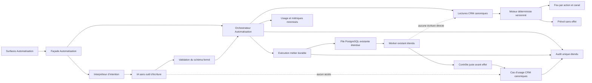
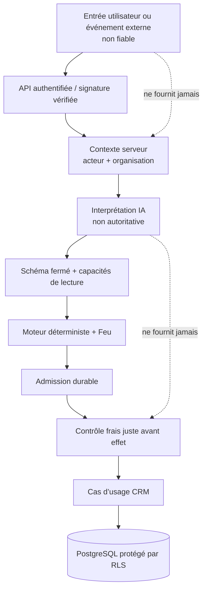

# Vague T1 — Cartographie du socle et des frontières

| Élément | Valeur |
| --- | --- |
| Produit | Marketteo CRM |
| Programme | Pré-Phase 5 — Automatisation |
| Étape parente | [Étape interne 3 — Architecture, données et sécurité](./ETAPE_3_ARCHITECTURE_DONNEES_SECURITE.md) |
| Séquence | Vague T1 — Cartographier le socle et les frontières |
| Statut | **CONTRE-VALIDÉE — GO sous prescriptions obligatoires** |
| Date | 1er octobre 2026 |
| Référence fonctionnelle | [`RF-AUT-2.1`](./REFERENCE_FONCTIONNELLE_AUTOMATISATION_V2_1.md) |
| Nature du travail | Analyse du code, des schémas, des contrats et des tests existants |
| Modification du produit | **Aucune** — aucun endpoint, aucune migration, aucun worker et aucun comportement actif créés |
| Contre-validation | [Rapport Architecture, Sécurité/Confiance, Produit PME et Exploitation/Qualité](./CONTRE_VALIDATION_VAGUE_T1.md) |
| Prochaine décision | Autoriser ou non la Vague T2 |

## 1. Verdict exécutif

Le socle actuel peut accueillir l’Automatisation V2.1 **sans créer un second CRM et sans imposer un nouveau service distribué pour la première version**.

Les fondations les plus coûteuses et les plus sensibles existent déjà :

- contexte d’organisation dérivé côté serveur ;
- isolation PostgreSQL par organisation avec RLS forcée ;
- capacités par rôle et contrôle de l’organisation active ;
- cas d’usage CRM versionnés et souvent idempotents ;
- file PostgreSQL durable avec bail, reprise, annulation et détection des rejeux ;
- worker avec pulsation, récupération de bail et limites de tentatives ;
- audit immuable, transactionnel et à métadonnées fermées ;
- métriques à labels bornés et journaux techniques à champs fermés ;
- registre d’usage agrégé et isolé par organisation ;
- intégration frontale par routes explicites et capacités requises.

Cependant, ces briques ne sont pas directement suffisantes pour activer l’Automatisation. Les extensions structurantes sont :

1. créer un domaine `automation` propriétaire des Playbooks, versions, plans IA, Prévols, exécutions, approbations et exceptions ;
2. ajouter des capacités Automatisation explicites ;
3. réévaluer les capacités CRM, la portée objet, le Feu et les permissions juste avant chaque effet différé ;
4. étendre la file et le worker avec des contrats Automatisation sans leur confier les décisions métier ;
5. ajouter les états métier `Bloquée`, `À vérifier`, `Suspendue` et `Annulée` au niveau de l’exécution, pas comme raccourcis techniques opaques ;
6. étendre l’audit, les métriques et le registre d’usage avec des vocabulaires fermés ;
7. construire de nouveaux composants pour le moteur de règles, le Prévol fidèle et l’interprétation IA sans droit d’écriture ;
8. ajouter un mécanisme de lancement à deux niveaux : drapeau global d’environnement et activation contrôlée par organisation.

### Conclusion T1

> **Le choix recommandé est un module Automatisation dans le monolithe modulaire actuel, orchestré par la file PostgreSQL et le worker existants, qui invoque les cas d’usage CRM canoniques.**

Cette conclusion a été [contre-validée](./CONTRE_VALIDATION_VAGUE_T1.md) avec dix prescriptions obligatoires. Elle ne constitue ni un GO de développement ni un GO de production.

## 2. Portée et méthode

La Vague T1 a examiné les éléments suivants :

- identité, sessions, membres, rôles et capacités ;
- contexte locataire, unités de travail et politiques RLS ;
- prospects, contacts, canaux, permissions, tâches, pipeline et opportunités ;
- audit métier et consultation d’audit ;
- file durable, worker, idempotence, reprise et annulation ;
- connecteur Meta contrôlé, import CSV et export ;
- métriques, journaux, registre d’usage et rétention ;
- composition du backend, routes et navigation du client ;
- tests unitaires et d’intégration qui matérialisent les garanties actuelles.

La classification utilisée est :

- **Réutilisé** : le composant et son contrat peuvent rester la base, avec configuration ou nouveaux appels seulement ;
- **Étendu** : la structure est conservée, mais son vocabulaire, son contrat ou ses contrôles doivent évoluer ;
- **Nouveau** : aucun composant existant ne porte correctement la responsabilité.

## 3. Architecture actuelle — vue `as-is`

```mermaid
flowchart LR
    U[Utilisateur] --> C[Client React]
    C --> R[Routes FastAPI]
    R --> A[Authentification et organisation active]
    A --> UC[Cas d’usage applicatifs]

    UC --> CRM[Domaines CRM canoniques]
    UC --> TUOW[Unités de travail locataires]
    TUOW --> PG[(PostgreSQL + RLS forcée)]
    UC --> AUD[Audit transactionnel]
    AUD --> PG

    UC --> Q[File durable PostgreSQL]
    Q --> W[Worker existant]
    W --> H[Gestionnaires fermés]
    H --> PG
    H --> EXT[Services externes autorisés]

    UC --> USAGE[Registre d’usage agrégé]
    UC --> OBS[Métriques et journaux fermés]
    USAGE --> PG

    A -. contexte serveur .-> TUOW
    TUOW -. app.organization_id .-> PG
```

### Lecture de cette vue

- Le client ne décide pas des permissions ; il masque les routes selon les capacités retournées, alors que le serveur reste l’autorité.
- Les routes construisent un `TenantContext` avec l’acteur, l’organisation active et un identifiant de requête.
- L’unité de travail injecte ces valeurs dans la transaction PostgreSQL ; les politiques RLS filtrent ensuite les données.
- Les modifications CRM passent par des cas d’usage et des dépôts dédiés.
- La file durable est elle-même isolée et idempotente, mais son catalogue de contrats est fermé.
- Le worker réévalue actuellement l’existence et l’activité de l’utilisateur et de son appartenance ; il ne réévalue pas encore une capacité métier précise ni le Feu relationnel.

## 4. Sources de vérité et propriété des données

### 4.1 Objets qui restent canoniques dans le CRM

| Objet | Propriétaire actuel | Décision T1 |
| --- | --- | --- |
| Organisation et membre | Identité / organisation | Réutiliser sans copie |
| Prospect | Domaine Prospect | Réutiliser sans copie |
| Contact et canal | Domaine Prospect / conformité | Réutiliser sans copie |
| Provenance et acquisition | Domaine Conformité prospect | Réutiliser sans copie |
| Permission par canal | Domaine Conformité prospect | Réutiliser comme preuve ; ne jamais laisser l’IA la créer |
| Opposition et restrictions | Domaine Conformité / rétention | Réutiliser comme blocage déterministe |
| Tâche et événements de tâche | Domaine Activités | Réutiliser par les cas d’usage existants |
| Étape du pipeline | Domaine Pipeline | Réutiliser par commande versionnée |
| Opportunité et événements | Domaine Opportunités | Réutiliser par les cas d’usage existants |
| Fournisseur, contrat et rattachement de source | Domaine Fournisseurs / connecteurs | Réutiliser pour une admission de source déjà approuvée |
| Événement d’audit | Infrastructure d’audit | Étendre le vocabulaire ; conserver le registre unique |
| Usage agrégé | Registre d’usage | Étendre les codes autorisés, sans contenu sensible |

### 4.2 Objets dont l’Automatisation sera propriétaire

Les objets suivants n’existent pas encore et appartiendront au futur domaine Automatisation :

- identité d’un Playbook ;
- version immuable d’un Playbook ;
- activation et mode d’un Playbook par organisation ;
- résultat de Prévol ;
- intention structurée et plan IA expirant ;
- exécution et étapes d’exécution ;
- brouillon préparé, avec empreinte ;
- approbation ou refus lié à cette empreinte ;
- exception opérationnelle et sa résolution ;
- suspension générale ou par Playbook ;
- références de corrélation entre plan, Prévol, exécution, effet CRM et audit.

Ces tables référenceront les identifiants CRM. Elles ne recopieront ni le profil prospect, ni la permission, ni l’état de l’opportunité comme source de vérité. Un instantané minimal et versionné ne sera admis que lorsqu’il est nécessaire pour expliquer une décision historique.

## 5. Frontières proposées — vue `to-be` logique



### 5.1 Règle de frontière principale

L’Automatisation orchestre. Le CRM décide et écrit ses propres objets.

Concrètement :

- le moteur d’Automatisation peut sélectionner un prospect ou proposer une tâche ;
- il ne doit pas effectuer un `INSERT` direct dans `prospect_tasks`, modifier directement une permission ou déplacer directement une opportunité ;
- le worker appelle une commande applicative CRM avec une clé d’idempotence, une version attendue et un contexte locataire ;
- le cas d’usage CRM applique ses validations, écrit son audit dans la même transaction et retourne un résultat stable ;
- l’exécution Automatisation conserve seulement la corrélation, l’état et le résultat nécessaire à l’explication.

Le connecteur Meta existant possède du SQL spécialisé et très borné pour son ingestion. Il constitue une preuve de contrôle des contrats, signatures et données autorisées, mais **pas** le modèle d’écriture recommandé pour l’Automatisation.

## 6. Matrice « réutilisé, étendu, nouveau »

| ID | Capacité technique | Classement | Décision T1 | Preuve principale dans le socle |
| --- | --- | --- | --- | --- |
| `T1-MAP-01` | Session utilisateur | Réutilisé | Conserver les cookies et dépendances d’authentification | `backend/app/presentation/api/dependencies.py` |
| `T1-MAP-02` | Contexte organisation/acteur | Réutilisé | Conserver `TenantContext`, toujours construit côté serveur | `backend/app/application/tenancy.py` |
| `T1-MAP-03` | Isolation transactionnelle | Réutilisé | Conserver les variables locales de transaction | `backend/app/infrastructure/postgres/tenant_unit_of_work.py` |
| `T1-MAP-04` | RLS PostgreSQL | Étendu | Appliquer `ENABLE` et `FORCE RLS` à chaque nouvelle table Automatisation | migrations PostgreSQL existantes et `tests/integration/test_tenant_rls.py` |
| `T1-MAP-05` | Catalogue de capacités | Étendu | Ajouter des capacités Automatisation explicites ; aucun droit implicite par simple accès CRM | `backend/app/domain/identity.py` |
| `T1-MAP-06` | Routes et navigation | Étendu | Ajouter une route protégée après validation ; l’emplacement Automatisation est déjà réservé | `client/src/app/routes.js`, `client/src/app/navigationModel.js` |
| `T1-MAP-07` | Prospects et contacts | Réutilisé | Lecture et effet uniquement via le domaine canonique | `backend/app/application/use_cases/prospects.py` |
| `T1-MAP-08` | Tâches CRM | Réutilisé | Utiliser `CreateTaskUseCase` et son idempotence | `backend/app/application/use_cases/activities.py` |
| `T1-MAP-09` | Pipeline | Réutilisé | Utiliser les transitions versionnées et idempotentes | `backend/app/application/use_cases/pipeline.py` |
| `T1-MAP-10` | Opportunités | Réutilisé | Utiliser les commandes et événements existants | `backend/app/application/use_cases/opportunities.py` |
| `T1-MAP-11` | Permissions et provenance | Réutilisé | Source du Feu ; jamais générée par IA | `backend/app/application/use_cases/prospect_compliance.py` |
| `T1-MAP-12` | File durable | Étendu | Ajouter des contrats Automatisation versionnés et une charge qualifiée | `backend/app/infrastructure/postgres/job_queue.py` |
| `T1-MAP-13` | Worker | Étendu | Ajouter les gestionnaires et un garde d’effet complet | `backend/app/cli/worker.py` |
| `T1-MAP-14` | Idempotence d’effet | Étendu | Dériver une clé stable par exécution/étape/objet/action | contraintes et cas d’usage CRM existants |
| `T1-MAP-15` | Audit immuable | Étendu | Ajouter actions, entités et métadonnées Automatisation à liste fermée | `backend/app/domain/audit.py` |
| `T1-MAP-16` | Enregistrement transactionnel d’audit | Réutilisé | Continuer à écrire l’audit avec l’effet métier | `backend/app/infrastructure/postgres/audit_recorder.py` |
| `T1-MAP-17` | Métriques techniques | Étendu | Ajouter des événements et labels bornés, sans identifiant métier | `backend/app/infrastructure/observability/metrics.py` |
| `T1-MAP-18` | Journaux structurés | Étendu | Ajouter seulement des noms et champs fermés ; interdire phrases et brouillons | `backend/app/infrastructure/observability/logging.py` |
| `T1-MAP-19` | Registre d’usage | Étendu | Mesurer unités, résultats et coûts agrégés sans texte libre | `backend/app/application/ports/usage.py`, `backend/app/infrastructure/postgres/usage_store.py` |
| `T1-MAP-20` | Drapeau global | Étendu | Reprendre le patron de configuration validée, avec un drapeau Automatisation global | `backend/app/config.py` |
| `T1-MAP-21` | Activation par organisation | Nouveau | Ajouter une admission locataire contrôlée, distincte du drapeau global | Aucun mécanisme générique actuel identifié |
| `T1-MAP-22` | Playbook et version | Nouveau | Domaine et stockage dédiés | Aucun objet actuel équivalent |
| `T1-MAP-23` | Moteur de règles / Feu | Nouveau | Noyau pur, déterministe et versionné | Aucun moteur partagé actuel identifié |
| `T1-MAP-24` | Prévol fidèle | Nouveau | Même noyau de règles et mêmes lectures que l’exécution, sans port d’écriture | Aucun composant actuel équivalent |
| `T1-MAP-25` | Plan IA structuré | Nouveau | Schéma fermé, expiration et absence d’outil d’écriture | Aucun composant IA actuel identifié |
| `T1-MAP-26` | Approbation liée au contenu | Nouveau | Empreinte, expiration et invalidation au changement | Aucun composant actuel équivalent |
| `T1-MAP-27` | Exception Automatisation | Nouveau | État métier explicable et résoluble | Les erreurs techniques actuelles ne couvrent pas cette responsabilité |
| `T1-MAP-28` | Événements métier Automatisation | Nouveau | Catalogue versionné et minimal ; ne pas confondre avec les logs | Aucun bus d’événements métier générique identifié |

## 7. Analyse du worker et de l’exécution durable

### 7.1 Forces réutilisables

La file actuelle apporte déjà :

- une clé d’idempotence protégée par HMAC et limitée par organisation et type ;
- une empreinte de requête pour détecter la réutilisation incohérente d’une clé ;
- des contrats `type:schema_version` explicitement pris en charge ;
- des statuts techniques, tentatives, baux, pulsations et annulation ;
- une récupération lorsque le bail expire ;
- une limite de trois tentatives ;
- une distinction entre erreurs transitoires et permanentes ;
- des événements de file et des métriques ;
- une réautorisation élémentaire de l’acteur au début de l’exécution ;
- une isolation locataire et des tests d’intégration de concurrence et de rejeu.

### 7.2 Écarts à fermer

| ID | Écart | Risque | Traitement attendu en T2/T3 |
| --- | --- | --- | --- |
| `T1-GAP-01` | Le worker vérifie l’activité du membre, pas une capacité métier précise | Effet différé après perte de droit | Garde d’effet avec capacité Automatisation et capacité CRM |
| `T1-GAP-02` | Le Feu, la permission et la version d’objet ne sont pas réévalués par le worker générique | Décision devenue invalide | Lecture fraîche et moteur de règles avant chaque effet |
| `T1-GAP-03` | Le catalogue ne connaît que trois contrats techniques | Aucun travail Automatisation admissible | Contrats fermés et versionnés pour l’Automatisation |
| `T1-GAP-04` | L’acteur système n’est pas autorisé par la politique actuelle du worker | Déclencheurs système impossibles ou mal identifiés | Principal technique limité et politique par type de travail |
| `T1-GAP-05` | La file permet une seule tâche active par organisation et au plus 100 en attente | Débit insuffisant ou blocage entre travaux différents | Mesure de charge et politique de priorité/backpressure |
| `T1-GAP-06` | Les statuts génériques ne portent pas `À vérifier` | Reprise automatique dangereuse après résultat incertain | État métier dans l’exécution Automatisation, sans répétition aveugle |
| `T1-GAP-07` | Aucun patron outbox métier générique n’a été identifié | Écart possible entre admission et émission de travail | Transaction d’admission + file ou outbox à décider dans `ADR-AUT-002` |
| `T1-GAP-08` | Les gestionnaires actuels peuvent contenir des écritures SQL spécialisées | Contournement futur des règles CRM | Port de commande imposant les cas d’usage CRM pour Automatisation |

### 7.3 Position T1

Le worker est **apte comme fondation**, sous réserve de ces extensions. Il n’est pas validé tel quel comme moteur d’Automatisation.

Les statuts techniques de la file ne doivent pas devenir les statuts visibles du produit. Par exemple, un job peut être techniquement `succeeded` après avoir placé une exécution dans l’état métier `Bloquée`, si sa mission était de réévaluer et constater le blocage.

## 8. Autorisation, organisation et sécurité

### 8.1 Garanties existantes

- le contexte locataire contient acteur, organisation et requête ;
- l’organisation n’est pas acceptée comme autorité depuis une phrase IA ;
- l’unité de travail configure le contexte PostgreSQL par transaction ;
- les tables métier sont protégées par des politiques RLS et des tests inter-organisations ;
- les rôles `admin`, `manager` et `sales` reçoivent un catalogue de capacités statique ;
- le client exige une capacité par route, mais le serveur demeure l’autorité ;
- les mutations sensibles emploient des versions attendues et des clés d’idempotence ;
- le pilote Meta réévalue contrat, rattachement, fournisseur, acquisition, membre et utilisateur avant persistance.

### 8.2 Frontières de confiance



### 8.3 Capacités à concevoir

La Vague T1 ne fige pas les noms définitifs, mais confirme le besoin d’au moins quatre familles :

- lire l’espace Automatisation et ses recommandations ;
- préparer ou lancer un Prévol ;
- administrer, activer, suspendre ou versionner un Playbook ;
- approuver un brouillon ou résoudre une exception.

Chaque effet doit aussi exiger la capacité CRM correspondante. Une capacité Automatisation ne doit jamais élargir les droits sur les prospects, tâches, opportunités, permissions ou membres.

## 9. Audit, journaux, métriques et usage

### 9.1 Audit métier

Le domaine d’audit actuel est strict : actions et portées fermées, métadonnées autorisées par action, taille bornée, événement immuable et écriture dans la transaction métier.

Cette base doit être étendue pour couvrir au minimum :

- interprétation acceptée ou refusée, sans enregistrer la phrase complète par défaut ;
- création et activation d’une version de Playbook ;
- calcul de Prévol et version des règles ;
- admission, blocage, préparation et annulation d’une exécution ;
- demande, accord, refus, expiration ou invalidation d’approbation ;
- suspension et reprise ;
- résolution d’exception ;
- effet CRM corrélé et raison codifiée.

Un helper d’audit adapté aux actions du worker ou du principal technique doit être ajouté. La corrélation doit survivre à plusieurs requêtes et ne pas reposer uniquement sur l’identifiant de la requête HTTP initiale.

### 9.2 Télémétrie et confidentialité

Les trois canaux restent distincts :

- **audit** : preuve métier consultable, avec identifiants strictement nécessaires ;
- **métriques** : compteurs techniques à labels bornés, sans identifiant prospect ou utilisateur ;
- **usage produit** : agrégats par organisation, période, type d’opération et résultat.

Sont interdits dans les métriques et journaux :

- phrase libre de l’utilisateur ;
- contenu d’un brouillon ;
- nom, courriel ou téléphone ;
- texte CRM présenté au modèle ;
- réponse brute du fournisseur IA ;
- secret, jeton ou référence externe sensible.

Le registre d’usage existant est réutilisable après extension de son catalogue fermé. Il ne doit pas devenir un entrepôt de prompts.

## 10. Frontière IA

La couche IA est entièrement nouvelle. Sa frontière minimale est la suivante :

1. recevoir une demande minimisée et un contexte contrôlé ;
2. produire une intention conforme à un schéma fermé ;
3. ne sélectionner que des verbes et Playbooks autorisés ;
4. ne jamais créer de permission, de tâche, de déplacement de pipeline ou d’envoi ;
5. laisser le serveur résoudre l’organisation, les objets, les capacités et le périmètre ;
6. laisser le moteur déterministe calculer Feu, blocages et Prévol ;
7. expirer le plan et le recalculer lorsque l’état CRM change ;
8. fonctionner avec un repli guidé lorsque l’IA est indisponible.

Les notes, descriptions, courriels, noms de fichiers, données de formulaire et contenus provenant de connecteurs doivent être traités comme données non fiables susceptibles de contenir une injection.

## 11. Frontière du client et des API

Le client actuel possède des routes explicites, chacune associée à une capacité et à une organisation active. La navigation réserve déjà la position d’Automatisation, mais aucune route active n’est enregistrée.

La future surface doit conserver les décisions fonctionnelles V2.1 :

- un point d’entrée de nouvelle intention dans `Aujourd’hui` ;
- `Playbooks` pour consulter, prévisualiser, activer ou suspendre ;
- `Entrées et exceptions` pour traiter les cas bloqués ;
- aucun menu `Sources` dans Automatisation ;
- aucune seconde zone de saisie concurrente ;
- aucune action client considérée comme autorisée sans validation serveur.

Les API devront être placées dans une façade Automatisation dédiée, mais les effets CRM seront transmis à des commandes applicatives internes. Cette séparation évite une API parallèle de tâches, prospects ou opportunités.

## 12. Drapeaux, suspension et retour arrière

Le socle offre des drapeaux d’environnement spécialisés, par exemple pour Meta et les métriques. Aucun mécanisme générique d’activation progressive par organisation n’a été identifié.

Le lancement nécessitera donc :

1. un drapeau global `automation_enabled` validé au démarrage ;
2. une admission par organisation, réversible et auditée ;
3. un état d’activation par Playbook et version ;
4. une suspension générale contrôlée avant admission et avant effet ;
5. une génération ou version de suspension permettant d’invalider le travail déjà en file ;
6. un mode dégradé conservant le CRM utilisable lorsque l’IA ou le worker est indisponible.

Le simple masquage de navigation n’est pas un mécanisme de sécurité ou d’arrêt.

## 13. Risques et contraintes révélés par T1

| ID | Risque ou contrainte | Sévérité initiale | Action requise |
| --- | --- | --- | --- |
| `T1-RSK-01` | Réautorisation insuffisante au moment de l’effet différé | Haute | Fermer par matrice de garde d’effet et tests négatifs |
| `T1-RSK-02` | Une seule tâche active par organisation peut limiter le débit | Moyenne | Modéliser les volumes des trois Playbooks et tester la file |
| `T1-RSK-03` | Capacité de 100 travaux en attente par organisation | Moyenne | Définir backpressure, agrégation et message utilisateur |
| `T1-RSK-04` | Absence d’état métier pour résultat incertain | Haute | Concevoir `À vérifier` et la réconciliation sans rejeu automatique |
| `T1-RSK-05` | Pas de bus/outbox métier générique | Moyenne | Choisir transaction directe ou outbox dans `ADR-AUT-002` |
| `T1-RSK-06` | Catalogue d’audit fermé sans actions Automatisation | Moyenne | Étendre actions et politique de métadonnées avant toute exécution |
| `T1-RSK-07` | Pas de principal système limité pour les déclencheurs | Haute | Définir origine technique, portée et révocation |
| `T1-RSK-08` | Pas d’activation progressive par organisation | Haute | Concevoir drapeau global, admission locataire et kill switch |
| `T1-RSK-09` | Pas de couche IA ni d’évaluation adversariale | Haute | Concevoir la frontière avant toute intégration de modèle |
| `T1-RSK-10` | Le pilote Meta contient des écritures spécialisées directes | Moyenne | Interdire sa généralisation aux effets CRM de l’Automatisation |
| `T1-RSK-11` | Preuve Azure 4.6 reportée | Réserve programme | Maintenir le jalon fin de Phase 5 ; ne pas l’utiliser comme preuve T1 |
| `T1-RSK-12` | Sessions PME reportées après production | Réserve Produit | Ne pas présenter l’adoption autonome comme démontrée |

## 14. Décisions proposées pour contre-validation

Les décisions suivantes ont reçu un GO de contre-validation. Les conditions associées sont consignées dans le [rapport T1](./CONTRE_VALIDATION_VAGUE_T1.md) et devront être transformées en ADR lors de T2/T3 :

| ID | Proposition | Conséquence |
| --- | --- | --- |
| `T1-DEC-01` | Conserver un monolithe modulaire pour la V1 | Pas de nouveau service réseau tant qu’une preuve de charge ne l’exige pas |
| `T1-DEC-02` | Créer un module de domaine `automation` distinct | Propriété claire des Playbooks, Prévols, exécutions et exceptions |
| `T1-DEC-03` | Réutiliser PostgreSQL, RLS et le worker existant | Extensions ciblées, pas de seconde infrastructure de file |
| `T1-DEC-04` | Interdire les écritures directes dans les tables CRM depuis l’Automatisation | Tous les effets passent par les cas d’usage canoniques |
| `T1-DEC-05` | Séparer état technique de job et état métier d’exécution | `À vérifier` et `Bloquée` restent explicables dans le produit |
| `T1-DEC-06` | Faire du moteur déterministe l’unique autorité de Feu et de Prévol | L’IA reste interprète et explicatrice |
| `T1-DEC-07` | Exiger une double autorisation à la demande et avant effet | Une perte de droit ou permission bloque le travail différé |
| `T1-DEC-08` | Conserver un audit unique et transactionnel | Pas de journal Automatisation parallèle |
| `T1-DEC-09` | Ajouter un drapeau global et une admission par organisation | Déploiement progressif et arrêt contrôlable |
| `T1-DEC-10` | Maintenir les textes sensibles hors logs, métriques et usage | Minimisation et maîtrise des coûts de conservation |

## 15. Traçabilité vers `RF-AUT-2.1`

| Invariant fonctionnel | Traduction de frontière T1 |
| --- | --- |
| Point d’entrée IA unique | Une façade d’intention ; aucun second champ de création dans Playbooks ou Exceptions |
| Mode `Préparer` | L’exécution ne possède aucun contrat d’envoi externe V1 |
| Prévol sans effet | Port de lecture et moteur commun ; aucun port de mutation accessible |
| Feu déterministe | Nouveau moteur versionné, séparé de l’IA |
| Trois Playbooks | Trois configurations d’un même moteur, pas trois sous-systèmes |
| Cycles de vie | États métier Automatisation distincts des statuts de job |
| Capacités par rôle | Extension du catalogue existant et combinaison avec les capacités CRM |
| Erreurs et exceptions | Domaine d’exception explicable, corrélé et résoluble |
| Traçabilité | Extension de l’audit unique, corrélation durable et versions |
| Absence d’effet externe autonome | Aucun contrat worker d’envoi externe dans la V1 |

## 16. Preuves consultées

La cartographie s’appuie notamment sur :

- `backend/app/domain/identity.py` — rôles et capacités ;
- `backend/app/application/tenancy.py` — contexte locataire ;
- `backend/app/infrastructure/postgres/tenant_unit_of_work.py` — contexte PostgreSQL transactionnel ;
- `backend/app/infrastructure/postgres/models/job.py` — modèle de file et contraintes ;
- `backend/app/infrastructure/postgres/job_queue.py` — admission, idempotence, bail, reprise et métriques ;
- `backend/app/cli/worker.py` — contrats exécutés, pulsation et réautorisation actuelle ;
- `backend/app/domain/audit.py` — actions, métadonnées et événement immuable ;
- `backend/app/infrastructure/postgres/audit_recorder.py` — audit dans la transaction ;
- `backend/app/infrastructure/observability/logging.py` et `metrics.py` — schémas fermés ;
- `backend/app/application/ports/usage.py` et `backend/app/infrastructure/postgres/usage_store.py` — usage agrégé ;
- `backend/app/application/use_cases/activities.py`, `pipeline.py`, `opportunities.py` et `prospect_compliance.py` — commandes CRM ;
- `backend/app/infrastructure/postgres/connector_pilot.py` — contrôles du pilote Meta ;
- `client/src/app/routes.js` et `client/src/app/navigationModel.js` — routes et navigation ;
- `tests/integration/test_tenant_rls.py`, `test_durable_jobs.py`, `test_audit_append_only.py` et `test_usage_reporting.py` — garanties d’intégration existantes ;
- tests unitaires des tâches, du pipeline, des opportunités, des capacités et du worker — contrats d’idempotence et de cycle.

## 17. Critères de sortie de T1

- [x] worker, cas d’usage CRM, capacités, audit, événements et isolation inventoriés ;
- [x] architecture `as-is` documentée ;
- [x] sources de vérité et propriétaires de données identifiés ;
- [x] besoins classés `Réutilisé`, `Étendu` ou `Nouveau` ;
- [x] frontières du domaine Automatisation proposées ;
- [x] écarts critiques du worker et de l’autorisation consignés ;
- [x] invariants de `RF-AUT-2.1` reliés aux frontières techniques ;
- [x] aucune modification active du produit réalisée ;
- [x] décisions `T1-DEC-01` à `T1-DEC-10` contre-validées avec prescriptions ;
- [ ] autorisation explicite d’ouvrir la Vague T2 reçue.

## 18. Recommandation de séquence

La Vague T1 est techniquement documentée et contre-validée. La séquence suivante recommandée est :

1. conserver les dix prescriptions du rapport comme exigences obligatoires ;
2. obtenir l’autorisation explicite d’ouvrir la **Vague T2 — Concevoir les données, les règles et les contrats** ;
3. commencer T2 par `ADR-AUT-001` et `ADR-AUT-002` ;
4. ne produire aucune migration ou implémentation active durant la conception.

T2 devra commencer par `ADR-AUT-001` sur la frontière de domaine et `ADR-AUT-002` sur l’orchestration, car les autres modèles en dépendent.

## 19. Journal

| Date | Événement | Effet |
| --- | --- | --- |
| 1er octobre 2026 | Vague T1 autorisée | Analyse du socle permise, aucune implémentation active |
| 1er octobre 2026 | Cartographie du code, des schémas et des tests réalisée | Socle classé en réutilisé, étendu et nouveau |
| 1er octobre 2026 | Dix décisions T1 proposées | Contre-validation requise avant T2 |
| 1er octobre 2026 | Contre-validation T1 favorable avec prescriptions | T1 clôturable ; T2 recommandée mais non ouverte |
