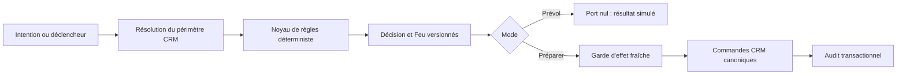
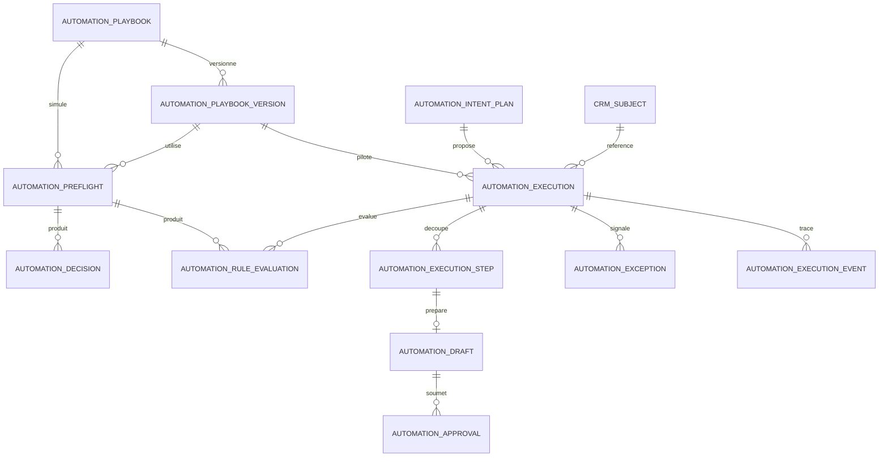
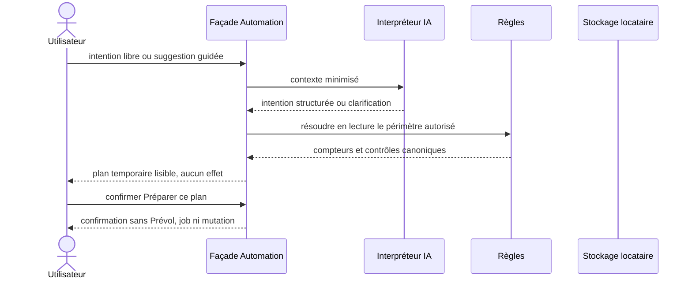
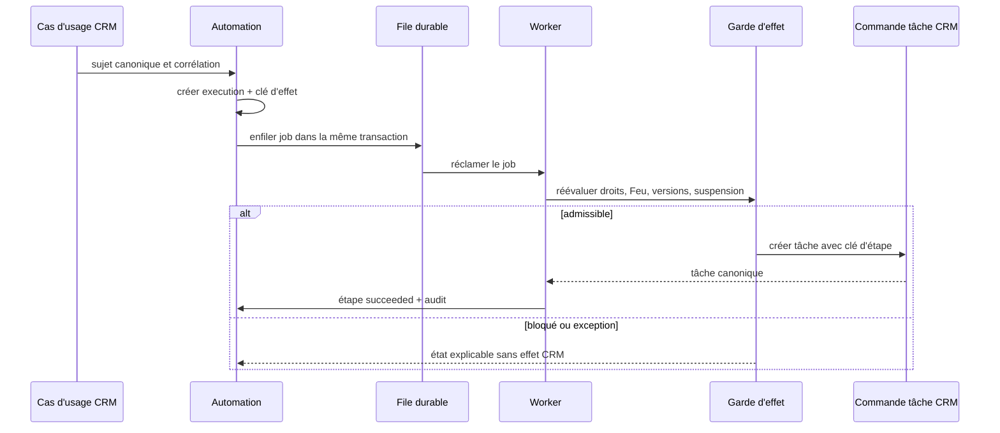
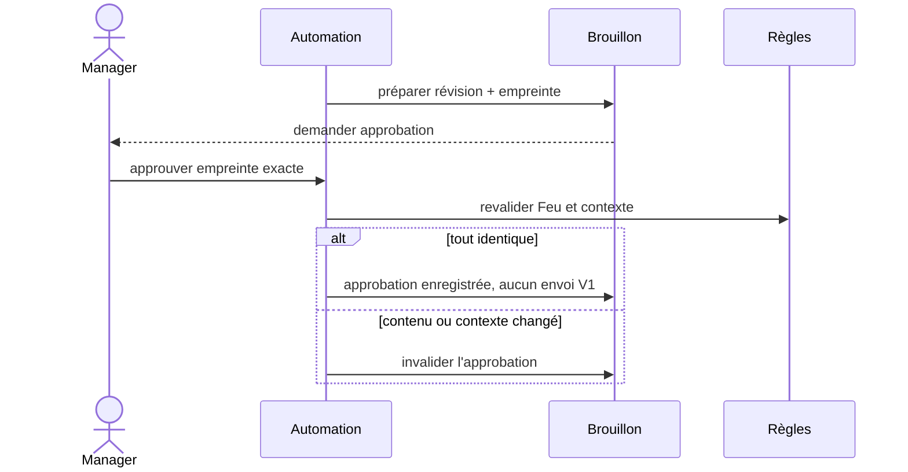
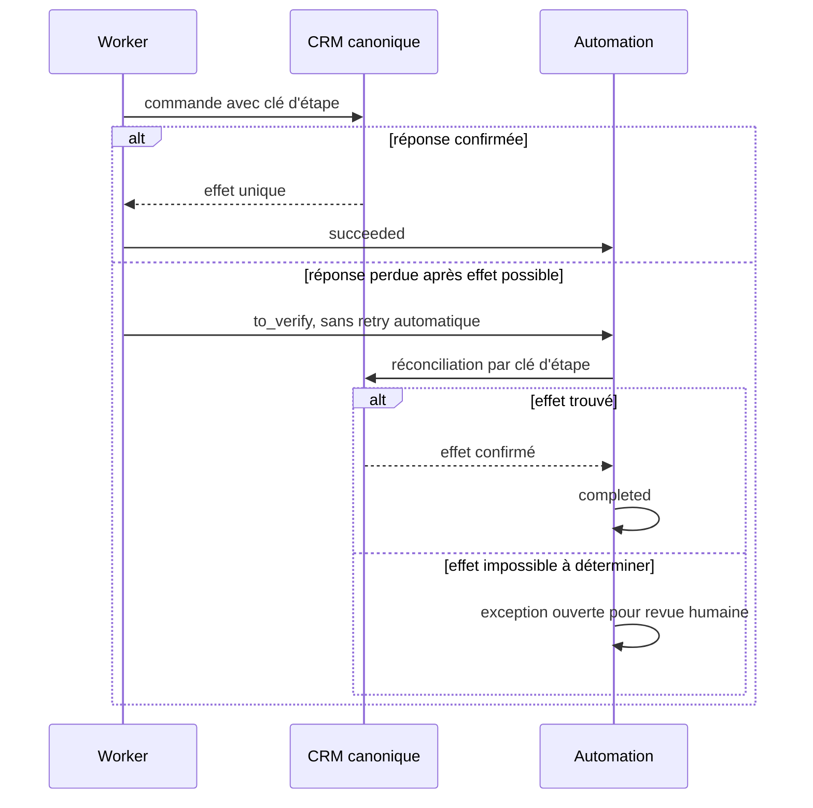

# Vague T2 — Données, règles et contrats

| Élément | Valeur |
| --- | --- |
| Produit | Marketteo CRM |
| Programme | Pré-Phase 5 — Automatisation |
| Étape parente | [Étape 3 — Architecture, données et sécurité](./ETAPE_3_ARCHITECTURE_DONNEES_SECURITE.md) |
| Autorisation | GO utilisateur — 1er octobre 2026 |
| Prérequis | [Vague T1 contre-validée](./CONTRE_VALIDATION_VAGUE_T1.md) |
| Référence fonctionnelle | [`RF-AUT-2.1`](./REFERENCE_FONCTIONNELLE_AUTOMATISATION_V2_1.md) |
| Statut | **PASSAGE T2 → T3 AUTORISÉ PAR GO UTILISATEUR** |
| Nature | Architecture logique, contrats et ADR ; aucune migration, API active ou exécution de production |
| Sortie | Vague T3 autorisée ; les contrats T2 restent soumis à la revue de sécurité T3 |

## 1. Décision d’ensemble

L’Automatisation sera un **module du monolithe Marketteo**. Elle possède les décisions, les versions, les Prévols, les exécutions, les brouillons, les approbations et les exceptions. Le CRM reste propriétaire des prospects, tâches, opportunités, permissions, membres, sources et historiques canoniques.

Le même noyau déterministe évalue le périmètre, les règles et le Feu pour le Prévol comme pour l’exécution. La seule différence est le port d’effet :

- le Prévol utilise un port nul et produit des résultats simulés ;
- `Préparer` appelle exclusivement des commandes CRM canoniques idempotentes ;
- aucun contrat V1 ne permet un envoi externe.



## 2. ADR-AUT-001 — Frontière du domaine Automatisation

| Champ | Décision |
| --- | --- |
| Statut | **Acceptée pour T2** |
| Décision | Créer un module `automation` interne, orchestrateur des recettes, sans écriture directe dans les tables CRM. |
| Motif | Préserver le CRM canonique, la RLS, l’audit et les règles déjà portées par les cas d’usage. |
| Réévaluation | Si les critères de `CV-T1-ARC-01` démontrent un besoin réel de séparation physique. |

### Options étudiées

| Option | Décision | Motif |
| --- | --- | --- |
| Écritures SQL directes dans prospects, tâches ou opportunités | Rejetée | Duplique règles, audit et idempotence ; crée un second CRM implicite. |
| Service d’Automatisation séparé dès V1 | Rejetée | Ajoute réseau, synchronisation et coûts sans preuve de besoin. |
| Module Automatisation appelant les cas d’usage CRM | **Retenue** | Préserve les responsabilités et réduit le coût de lancement. |
| Constructeur générique de workflows | Rejetée | Hors périmètre Lite et incompatible avec les trois recettes figées. |

### Responsabilités

| Domaine | Possède | Ne possède pas |
| --- | --- | --- |
| Automatisation | Playbooks, versions, plans, Prévols, évaluations, exécutions, brouillons, approbations, exceptions, corrélations | Prospect, contact, permission, tâche, pipeline, opportunité, membre, provenance |
| CRM | Objets métier, capacité CRM, versions, règles de mutation et leur audit | Séquencement d’un Playbook, résultat de Prévol, état d’approbation |
| Identité | Session, organisation active, membre, rôle, capacité | Décision de Feu ou cycle d’exécution |
| Audit | Registre immuable commun | État courant de l’exécution |
| Worker | Transport durable, bail, reprise, annulation | Règle métier, permission, décision de Feu |

### Interfaces imposées

L’Automatisation consomme des ports de lecture CRM et des ports de commande CRM. Elle ne dépend ni d’un dépôt SQL CRM, ni d’un modèle ORM CRM.

| Port logique | Usage | Effet autorisé |
| --- | --- | --- |
| `AutomationScopeReader` | Résoudre le périmètre et les versions canoniques | Aucun |
| `RelationalEvidenceReader` | Lire permission, provenance, opposition, fréquence et attente | Aucun |
| `CrmTaskCommand` | Préparer une tâche interne idempotente | Tâche CRM uniquement |
| `CrmDraftContextReader` | Lire le contexte minimal d’un brouillon | Aucun |
| `CrmOpportunityReader` | Détecter proposition en attente et occasion oubliée | Aucun |
| `AutomationAuditPort` | Écrire le fait d’Automatisation dans le registre commun | Audit seulement |
| `DurableWorkPort` | Enfiler une étape durable | Job, sans effet CRM |

**Conséquences :** le module Automatisation ajoute ses propres ports, modèles et tests, mais réutilise les commandes CRM pour chaque effet. Il ne peut pas contourner les règles CRM au motif qu’il détient une capacité Automatisation.

**Risques résiduels :** l’appel de plusieurs cas d’usage CRM peut rendre une opération composite plus longue. Le découpage en étapes idempotentes et la garde d’effet réduisent ce risque ; il sera mesuré en T4.

**Preuves :** la cartographie T1 a identifié des cas d’usage et des contraintes d’idempotence pour tâches, pipeline et opportunités, ainsi qu’une RLS locataire déjà testée. Voir [T1](./VAGUE_T1_CARTOGRAPHIE_SOCLE_FRONTIERES.md).

## 3. ADR-AUT-002 — Orchestration et worker

| Champ | Décision |
| --- | --- |
| Statut | **Acceptée pour T2, sous prescriptions T1** |
| Décision | Réutiliser la file PostgreSQL et le worker existants comme transport durable ; créer l’exécution Automatisation et le job dans la même transaction d’admission. |
| Non-décision | Aucun moteur de workflow externe et aucun bus/outbox générique en V1. |
| Prérequis avant implémentation | Garde d’effet, principal système limité, état `À vérifier`, test de capacité et stratégie de suspension. |

### Flux durable retenu

1. Une commande ou un déclencheur résout son périmètre canonique.
2. L’Automatisation crée une `execution` idempotente et son premier événement dans une transaction locataire.
3. La même transaction enfile un job `automation_execute:1` référencé par l’exécution.
4. Le worker réclame le job, reconstruit le contexte et lance la garde d’effet.
5. La garde réévalue les droits, versions, Feu, suspension et unicité de l’effet.
6. Le worker appelle une commande CRM canonique ou place l’exécution dans un état sans effet.
7. L’effet CRM, l’étape d’exécution et l’audit sont confirmés de façon atomique lorsque le cas d’usage le permet.

Le worker existant ne devient pas autorité métier. Le catalogue de ses contrats restera fermé et versionné.

### Identités et idempotence

| Niveau | Identité stable | Garantie |
| --- | --- | --- |
| Commande HTTP | `Idempotency-Key` du client, liée à organisation + acteur + empreinte de requête | Un même appel ne crée pas deux intentions ou deux Prévols |
| Prévol | organisation + version Playbook + empreinte périmètre + fenêtre temporelle + version règles | Un résultat est rattaché à une simulation précise |
| Exécution | organisation + version Playbook + sujet canonique + type de déclencheur + occurrence | Un événement fonctionnel ne produit pas deux exécutions |
| Étape d’effet | exécution + code d’étape + sujet + version de la commande | Une tâche ou un brouillon n’est pas dupliqué |
| Job | `aut:v1:<execution-id>:<step-code>` | Un transport rejoué ne relance pas l’étape |

Les clés exposées par le client respectent la convention du CRM existant. Les clés stockées ou comparées dans la file peuvent être protégées par le HMAC déjà utilisé par le socle. Toute réutilisation avec une empreinte différente échoue explicitement.

### Concurrence et résultat incertain

- une transition de Playbook, d’exécution, de brouillon, d’approbation ou d’exception porte une version attendue ;
- l’unicité de l’exécution et de l’étape d’effet est garantie par contrainte d’organisation et clé d’effet ;
- une transition concurrente incompatible retourne `version_conflict` ;
- un job perdu ou un bail expiré ne peut pas produire un second effet si l’étape CRM existe déjà avec sa clé ;
- après un effet possiblement réalisé mais non confirmé, l’état est `to_verify` ; aucune répétition automatique n’est admise ;
- la résolution de `to_verify` relit l’objet CRM et conserve la même corrélation.

**Conséquences :** le worker transporte et reprend des travaux, mais chaque handler Automatisation doit être un adaptateur vers la garde d’effet et les commandes CRM. La file n’est pas exposée au client comme une source de vérité métier.

**Risques résiduels :** une admission transactionnelle avec job ne remplace pas une architecture outbox pour des intégrations futures multiples. La décision est intentionnellement réversible : l’outbox ne sera introduite que si les preuves T4 le justifient.

**Preuves :** la file existante possède déjà une clé d’idempotence HMAC, un bail, une pulsation, des reprises limitées et une annulation. Ses écarts sont consignés dans [T1](./VAGUE_T1_CARTOGRAPHIE_SOCLE_FRONTIERES.md) et les prescriptions de sécurité restent obligatoires.

## 4. Modèle logique de données

### 4.1 Diagramme de relations



Tous les objets Automatisation portent `id`, `organization_id`, `created_at`, `updated_at` lorsque mutable, et sont soumis à `ENABLE ROW LEVEL SECURITY` et `FORCE ROW LEVEL SECURITY`. L’organisation est toujours dérivée du contexte serveur.

### 4.2 Dictionnaire de données

| Objet | Champs conceptuels clés | Rôle et invariants |
| --- | --- | --- |
| `automation_playbooks` | type fermé, état, version courante, version activée, génération de suspension, version optimiste | Uniquement les trois types V1 ; une seule version activée ; aucun effet en dehors de `active_prepare`. |
| `automation_playbook_versions` | numéro, configuration validée, empreinte, référence de règles, créateur | Immuable après le lancement d’un Prévol ; toute modification matérielle crée une ligne. |
| `automation_preflights` | version Playbook, version règles, empreinte périmètre, fenêtre, état, compteurs, date d’expiration | Simulation sans effet ; obsolète si version/règle/périmètre déterminant change. |
| `automation_decisions` | Prévol, sujet canonique, Feu, action simulée, décision, raisons codifiées, corrélation | Résultat enfant du Prévol, une ligne par sujet évalué ; références CRM seulement, aucune copie de profil ou de permission. |
| `automation_intent_plans` | source `assistant` ou `guided`, code d’intention, schéma, périmètre structuré, expiration, empreinte | La phrase libre n’est pas requise en stockage ; le plan ne commande rien directement. |
| `automation_rule_evaluations` | contexte Prévol/exécution, sujet, action, canal, Feu, décision, raisons, version règles, empreinte de lecture | Immuable ; explique une décision sans transformer le Feu en donnée globale. |
| `automation_executions` | version Playbook, sujet canonique, déclencheur, état, corrélation, clé d’exécution, acteur/principal, job, génération suspension | Un seul effet fonctionnel par clé ; statut métier distinct du statut de job. |
| `automation_execution_steps` | exécution, code d’effet, état, clé d’effet, objet CRM résultant, tentative, erreur codifiée | Une étape réussie n’est jamais rejouée sous une nouvelle identité. |
| `automation_drafts` | étape, contact/canal de référence, contenu protégé, empreinte contenu, état | Le contenu est modifiable seulement en créant une nouvelle révision ; son empreinte est l’objet d’approbation. |
| `automation_approvals` | brouillon/révision, approbateur, état, empreinte, expiration, décision | L’approbation ne vaut ni permission ni dérogation Rouge ; toute modification l’invalide. |
| `automation_exceptions` | code, état, sujet, exécution, responsable, résolution, version | Une exception opérationnelle ne change jamais la couleur du Feu. |
| `automation_execution_events` | agrégat, code d’événement, corrélation, causation, schéma, date, métadonnées fermées | Chronologie métier minimale, distincte de l’audit et des métriques. |

### 4.3 Références CRM admises

Les champs `subject_type` et `subject_id` peuvent viser seulement : `prospect`, `opportunity`, `prospect_task`, `contact`, `contact_channel` ou `membership`, selon l’action. Chaque référence est relue avec l’organisation avant utilisation.

Les données suivantes ne sont jamais copiées comme source de vérité : nom, courriel, téléphone, permission, état de pipeline, propriétaire de prospect, contenu de note et texte de l’intention. Une empreinte, une référence ou un instantané minimal de justification codifiée peut être conservé pour expliquer une décision historique.

### 4.4 États et transitions

| Agrégat | États retenus | Règles |
| --- | --- | --- |
| Playbook | `draft`, `preflight_required`, `preflight_running`, `ready`, `active_prepare`, `suspended`, `retired` | Conforme à `RF-AUT-2.1` ; activation impossible sans Prévol courant. |
| Prévol | `queued`, `running`, `completed`, `needs_review`, `failed`, `stale`, `cancelled` | N’écrit aucun objet CRM ; `completed` n’est utilisable que s’il est encore courant. |
| Plan IA | `valid`, `clarification_needed`, `rejected`, `expired`, `consumed` | Il expire ; une lecture de données n’est pas une autorisation. |
| Exécution | `queued`, `evaluating`, `preparing`, `prepared`, `blocked`, `exception`, `to_verify`, `cancelled`, `completed` | Les états terminaux ne sont pas réouverts par un rejeu aveugle. |
| Étape d’exécution | `pending`, `guarded`, `succeeded`, `blocked`, `exception`, `to_verify`, `cancelled` | Une étape `succeeded` conserve sa clé d’effet. |
| Brouillon | `prepared`, `awaiting_approval`, `approved`, `refused`, `expired`, `invalidated` | Toute révision matérielle invalide l’accord précédent. |
| Approbation | `requested`, `approved`, `refused`, `expired`, `invalidated` | Décision humaine liée à une empreinte exacte. |
| Exception | `open`, `in_progress`, `resolved`, `abandoned` | Résolution = réévaluation, pas rejet automatique. |

## 5. Noyau de règles et Feu relationnel

### 5.1 Contrat déterministe

```text
evaluate(context, rule_set_version, playbook_version, canonical_snapshot)
  -> Decision {
       fire: green | yellow | red | not_applicable,
       outcome: prepare | approval_required | block | exception | no_action,
       reasons: [code...],
       required_checks: [code...],
       effect_plan: [step...],
       decision_fingerprint,
       evaluated_at
     }
```

Le noyau est pur : aucune écriture, aucun appel au modèle IA, aucun envoi, aucun accès implicite au temps non fourni par le contexte. Il reçoit les faits canoniques déjà lus et une horloge explicite. Les raisons sont des codes fermés traduisibles dans l’interface.

### 5.2 Ordre de décision

1. valider la version Playbook, l’état, la génération de suspension et le périmètre ;
2. confirmer l’existence, l’organisation et la version des objets CRM ;
3. détecter les blocages absolus ;
4. détecter les preuves inconnues, contradictoires ou expirées ;
5. contrôler fréquence, attente, doublon et action déjà réalisée ;
6. distinguer une exception opérationnelle d’un état relationnel ;
7. construire le plan d’effet sans l’exécuter.

`Rouge > Jaune > Vert` reste impératif. Une exception opérationnelle est parallèle au Feu : une source déconnectée ou un responsable inactif crée une exception, elle ne transforme pas artificiellement une permission en Jaune ou Rouge.

### 5.3 Table de décision V1

| Fait déterminant | Feu | Décision V1 | Raison codifiée principale |
| --- | --- | --- | --- |
| Tâche interne seulement, responsable actif | `not_applicable` | Préparer la tâche | `internal_action_allowed` |
| Opposition active ou canal interdit | Rouge | Bloquer tout contact | `contact_opposed` ou `channel_prohibited` |
| Finalité incompatible | Rouge | Bloquer | `purpose_not_allowed` |
| Permission absente, expirée ou contradictoire | Jaune | Créer tâche de vérification ; pas de brouillon de contact | `permission_missing`, `permission_expired`, `permission_conflict` |
| Fréquence ou attente convenue non respectée | Jaune | Reporter ou créer une tâche de revue | `frequency_limited`, `waiting_window_active` |
| Permission et provenance valides, aucune restriction | Vert | Préparer un brouillon ; approbation humaine requise | `contact_preparation_allowed` |
| Responsable cible inactif ou introuvable | sans changement de Feu | Ouvrir exception | `owner_unavailable` |
| Source requise indisponible ou non authentifiée | sans changement de Feu | Ouvrir exception ou quarantaine | `source_unavailable`, `source_untrusted` |
| Doublon exact ou action déjà réalisée | sans changement de Feu | Aucun effet ou rattachement canonique | `duplicate_exact`, `effect_already_exists` |
| Playbook suspendu ou Prévol obsolète | sans changement de Feu | Annuler l’admission / demander nouveau Prévol | `playbook_suspended`, `preflight_stale` |

En V1, aucun résultat ne produit un envoi externe. Un Vert permet au plus la préparation d’un brouillon et une approbation, jamais son expédition.

### 5.4 Paramètres par Playbook

| Playbook | Paramètres versionnés autorisés | Effets V1 autorisés |
| --- | --- | --- |
| Nouveau prospect | responsable de tâche, délai de prise en charge, source admise, fenêtre de déduplication | tâche interne, exception, brouillon admissible |
| Proposition en attente | délai d’inactivité, étapes opportunité admises, fenêtre de fréquence | tâche de suivi, exception, brouillon admissible |
| Occasion oubliée | délai sans activité, absence de prochaine action/échéance, étapes admises | tâche de revue, exception, aucune fermeture ou transition automatique |

Un responsable configuré signifie le destinataire de la tâche de prise en charge. Le Playbook ne modifie pas silencieusement le propriétaire CRM du prospect.

## 6. Fidélité du Prévol

Le Prévol appelle exactement :

- le même `AutomationScopeReader` ;
- la même version Playbook ;
- la même version de règles ;
- la même table de décision ;
- le même constructeur de plan d’étapes ;
- le même calcul de raisons, compteurs et coûts estimés.

Il remplace seulement le port de mutation par un `NoEffectPort`. Il écrit exclusivement son propre Prévol parent, ses
décisions enfants et son audit de consultation ; il ne crée ni tâche, ni brouillon, ni permission, ni changement de
pipeline.

| Condition | Conséquence |
| --- | --- |
| Version de Playbook, règle ou configuration modifiée | Prévol `stale`, nouveau Prévol obligatoire |
| Périmètre ou fenêtre modifié | Nouvelle empreinte, nouveau Prévol |
| Donnée CRM déterminante modifiée après simulation | L’exécution recalcule ; une différence est expliquée, jamais masquée |
| Prévol terminé sans erreur mais avec blocages | Peut être `ready` ; l’activation affiche les volumes et blocages |
| Prévol échoue techniquement | Activation refusée ; aucune déduction sur l’admissibilité |

La fidélité signifie « mêmes règles pour un même instantané », non « résultat identique après une modification du CRM ». Chaque exécution conserve le lien vers le Prévol et les différences de décision.

## 7. Contrats API de conception

Tous les contrats : dérivent l’organisation et l’acteur de la session, exigent une capacité serveur, reçoivent une clé d’idempotence lors d’une création ou mutation, retournent une corrélation, et écrivent un audit proportionné. Les chemins sont proposés, non encore implémentés.

| Commande proposée | Capacité Automatisation minimale | Préconditions clés | Résultat / erreur principale |
| --- | --- | --- | --- |
| `POST /automation/intent-plans` | `automation:plan:create` | Intention compatible et schéma fermé | Plan temporaire non persisté / `clarification_needed`, `intent_not_supported`, `fallback_guided` |
| `POST /automation/playbooks` | `automation:playbooks:manage` | Type V1 autorisé | Brouillon de Playbook / `playbook_type_invalid` |
| `POST /automation/playbooks/{id}/versions` | `automation:playbooks:manage` | Version attendue du Playbook | Version immuable / `version_conflict` |
| `POST /automation/playbook-versions/{id}/preflights` | `automation:preflights:run` | Configuration complète | Prévol durable / `preflight_already_running` |
| `POST /automation/playbooks/{id}/activation` | `automation:playbooks:activate` | Prévol courant et version attendue | `active_prepare` / `preflight_required`, `preflight_stale` |
| `POST /automation/executions` | `automation:prepare:self` ou portée organisation | Playbook actif, objet CRM admissible | Exécution durable / `playbook_suspended`, `effect_already_exists` |
| `POST /automation/drafts/{id}/approvals` | `automation:approvals:decide` | Empreinte exacte, Feu revalidé | Approbation enregistrée / `approval_invalid`, `approval_expired` |
| `POST /automation/playbooks/{id}/suspension` | `automation:playbooks:suspend` | Version attendue | Suspension + génération / `version_conflict` |
| `POST /automation/exceptions/{id}/resolution` | `automation:exceptions:resolve` | Exception ouverte, action de résolution définie | Réévaluation demandée / `exception_not_open` |

### 7.1 Envelope de réponse commune

```json
{
  "data": { "id": "uuid", "status": "queued" },
  "correlation_id": "server-generated-id",
  "schema_version": 1
}
```

Les erreurs utilisent les conventions du socle : code stable, message humain, champs éventuellement concernés, aucun détail sensible. Codes obligatoires : `capability_missing`, `organization_inactive`, `version_conflict`, `idempotency_conflict`, `plan_expired`, `preflight_required`, `preflight_stale`, `playbook_suspended`, `fire_blocked`, `approval_invalid`, `effect_uncertain` et `source_unavailable`.

### 7.2 Contrat d’approbation

Une demande d’approbation contient l’identifiant de brouillon, sa révision, son empreinte, le canal, le destinataire de référence, les versions Playbook/règles et une expiration. Le serveur refuse l’approbation si l’une de ces données diffère de l’état courant.

L’action `approved` V1 signifie seulement « décision humaine enregistrée ». Elle ne déclenche aucun envoi ; un futur contrat d’envoi devra être versionné dans une référence fonctionnelle ultérieure.

## 8. Catalogue d’événements métier

Les événements sont des faits internes versionnés, avec enveloppe minimale : `event_id`, `event_type`, `schema_version`, `occurred_at`, `organization_id`, `aggregate_type`, `aggregate_id`, `correlation_id`, `causation_id`, `actor_kind`, `actor_ref`, `metadata` fermée.

| Événement | Émetteur | Métadonnées admises | Données interdites |
| --- | --- | --- | --- |
| `automation.intent_plan.created.v1` | plan | code intention, expiration, source | phrase libre, contexte brut IA |
| `automation.preflight.completed.v1` | Prévol | versions, compteurs, statut | liste de contacts, contenu brouillon |
| `automation.playbook.activated.v1` | activation | Playbook, version, Prévol, mode | données prospect |
| `automation.execution.admitted.v1` | admission | type sujet, référence, déclencheur, versions | profil copié |
| `automation.execution.prepared.v1` | étape réussie | code effet, référence objet CRM | contenu de brouillon |
| `automation.execution.blocked.v1` | moteur | code raison, Feu | preuve brute de permission |
| `automation.exception.opened.v1` | exception | code, sujet, responsable | diagnostic sensible non redigé |
| `automation.draft.prepared.v1` | brouillon | canal, empreinte, statut | contenu et coordonnées |
| `automation.approval.recorded.v1` | approbation | décision, empreinte, expiration | contenu et destinataire |
| `automation.execution.to_verify.v1` | reprise | étape, code incertitude | réponse brute dépendance |
| `automation.playbook.suspended.v1` | suspension | portée, génération, raison codifiée | texte libre non nécessaire |

Ces événements n’introduisent pas un bus externe. Ils forment la chronologie métier de l’agrégat ; l’audit et les métriques restent des canaux distincts.

## 9. Séquences critiques

### 9.1 Assistant → plan → Prévol



Cette séquence est l'application confirmée pour `IMP-A5`. Le plan n'est pas enregistré et un véritable passage vers un
Prévol durable nécessitera une tranche ultérieure explicitement autorisée. Le texte utilisateur et la réponse brute ne
figurent ni dans le stockage, ni dans l'audit, ni dans les métriques.

### 9.2 Déclencheur → préparation idempotente



### 9.3 Brouillon → approbation → invalidation



### 9.4 Rejeu ou résultat incertain



## 10. Traçabilité des prescriptions T1

| Prescription T1 | Réponse T2 | Reste à fermer |
| --- | --- | --- |
| `CV-T1-ARC-02` | ADR-AUT-002 choisit transaction d’admission + job, sans outbox générique | Test et revue de capacité T4 |
| `CV-T1-SEC-01` | Garde d’effet définie comme précondition de chaque étape | Matrice complète et tests négatifs T3 |
| `CV-T1-PRD-01` | Trois recettes, point d’entrée unique et absence d’envoi inscrits dans les contrats | Revue T3 Produit/Confiance |
| `CV-T1-PRD-02` | Les statuts job restent invisibles ; API retourne des états métier | Validation UX ultérieure |
| `CV-T1-OPS-02` | `to_verify`, réconciliation et rejet de retry aveugle définis | Pannes détaillées et testables T3 |

## 11. Critères de sortie T2

- [x] ADR de frontière et d’orchestration rédigées ;
- [x] modèle logique et propriété des données définis ;
- [x] règles du Feu versionnées sous forme de contrat ;
- [x] fidélité Prévol/exécution spécifiée ;
- [x] commandes, erreurs et événements versionnés décrits ;
- [x] idempotence, concurrence, approbation et résultat incertain traités ;
- [x] quatre séquences critiques documentées ;
- [x] aucune migration ou API active créée ;
- [x] passage T2 → T3 explicitement autorisé par l’utilisateur ;
- [ ] contre-validation consolidée à consigner dans la revue T3.

## 12. Recommandation

Le passage T2 → T3 a été explicitement autorisé par l’utilisateur. La présente conception reste une entrée contrôlée de la revue T3, focalisée sur :

1. la suffisance du modèle sans copie du CRM ;
2. le choix de transaction + file sans outbox générique ;
3. la table de décision du Feu ;
4. l’identité exacte de l’effet et le traitement `to_verify` ;
5. l’absence structurelle d’envoi externe V1.

La Vague T3 est ouverte ; ses conclusions devront reporter toute contradiction découverte dans le présent dossier.

## 13. Journal

| Date | Événement | Effet |
| --- | --- | --- |
| 1er octobre 2026 | GO utilisateur pour T2 | Conception des données, règles et contrats autorisée |
| 1er octobre 2026 | ADR-AUT-001 et ADR-AUT-002 rédigées | Frontières et orchestration logiques fixées pour contre-validation |
| 1er octobre 2026 | Modèle, contrats, événements et séquences produits | T2 prête à contre-validation ; aucun développement autorisé |
| 1er octobre 2026 | GO utilisateur pour T3 | Passage T2 → T3 autorisé ; revue de sécurité intégrée à T3 |
