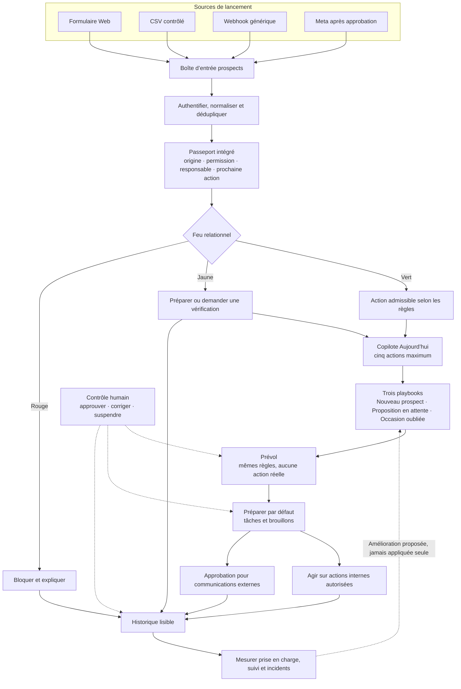

# Volet Automatisation Marketteo

| Élément | Valeur |
| --- | --- |
| Produit | Marketteo CRM |
| Volet | Automatisation commerciale assistée par l’IA |
| Statut | Vision produit revue — noyau Lite validé |
| Décision | GO conditionnel à une surface de lancement réduite |
| Révision | Double validation par trois expertises — 21 septembre 2026 |
| Portée | Cadrage produit, sans spécification d’implémentation |
| Boussole d’évolution | [Parcours complet de réalisation et de validation](./BOUSSOLE_EVOLUTION_AUTOMATISATION_MARKETTEO.md) |

## 1. Décision exécutive

Le volet Automatisation est pertinent et commercialisable, mais la proposition initiale était trop vaste pour être perçue comme une offre légère par une PME. Elle combinait des bénéfices visibles, des mécanismes de confiance, des fondations techniques et des fonctions avancées nécessitant beaucoup de données.

La décision validée est de conserver la vision complète pour les évolutions futures, tout en lançant une expérience simple autour d’un seul résultat :

> **Chaque prospect pris en charge. Chaque suivi maîtrisé.**

Le parcours produit devient :

> **Capturer → Attribuer → Agir → Prouver**

Marketteo ne doit pas être vendu comme une plateforme d’agents à configurer. Il doit être présenté comme le CRM qui empêche les prospects et les suivis de tomber entre les mailles du filet, sans workflow complexe à construire.

## 2. Double validation de la proposition

La proposition a été évaluée en deux passes par trois expertises indépendantes :

1. une analyse initiale selon la spécialité de chaque expert ;
2. une contre-vérification commune du noyau Lite consolidé.

| Expertise | Première vérification | Seconde vérification | Verdict |
| --- | --- | --- | --- |
| Produit SaaS pour PME | Vision forte, mais charge cognitive trop élevée | Le noyau réduit devient vendable et rapidement adoptable | GO |
| Automatisation IA et confiance | Architecture cohérente, mais trop de capacités se chevauchent | Le moteur déterministe et l’autonomie par action sont faisables | GO |
| Commercialisation et packaging | Proposition différenciante, mais difficile à expliquer dans sa forme complète | La combinaison Prévol, Feu relationnel et passeport est démontrable | GO conditionnel |

### 2.1 Consensus obtenu

Les trois vérifications convergent sur les décisions suivantes :

- réduire de 50 à 60 % la surface fonctionnelle visible au lancement ;
- proposer cinq capacités cohérentes plutôt que treize modules ;
- supprimer le constructeur de workflows de l’expérience Lite ;
- rendre la conformité, l’audit et les limites de fréquence presque invisibles ;
- démarrer avec des règles déterministes et utiliser l’IA pour résumer ou préparer ;
- conserver l’approbation humaine par défaut pour toute communication externe ;
- ne pas dépendre d’un connecteur social pour livrer la valeur initiale ;
- présenter toute l’offre comme une seule expérience guidée.

## 3. Positionnement et démarcation

Les recommandations quotidiennes, les agents de prospection, les séquences et la génération de workflows par IA deviennent courants sur le marché. Ils ne constituent donc pas, séparément, une démarcation suffisante.

La signature Marketteo repose sur la chaîne suivante :

> **Passeport du prospect → Feu relationnel → Prévol → Autonomie progressive**

Cette combinaison permet à une PME de comprendre :

- d’où vient le prospect ;
- si une action est permise selon les données disponibles ;
- ce que Marketteo recommande ;
- ce qui se serait produit avant une activation ;
- ce que le système peut exécuter sans approbation.

La proposition commerciale courte est :

> **L’automatisation commerciale que vous pouvez essayer avant de lui faire confiance.**

## 4. Offre Lite validée

L’offre Lite comporte cinq capacités visibles. Le passeport de prise en charge est intégré aux fiches et aux actions ; il ne devient pas un sixième module.

### 4.1 Boîte d’entrée prospects

Marketteo centralise les prospects entrants provenant de sources autorisées.

Périmètre de lancement recommandé :

- formulaire Web ;
- import CSV contrôlé ;
- webhook générique ;
- prospect test intégré à l’onboarding ;
- un seul connecteur social lorsque son accès est approuvé, Meta en priorité.

Fonctions incluses :

- authentification de la source ;
- correspondance contrôlée des champs ;
- déduplication exacte ;
- quarantaine des correspondances ambiguës ;
- enregistrement de la provenance et des permissions déclarées ;
- rattachement ou création du prospect et de la personne de contact.

LinkedIn, TikTok, Google Ads et les partenaires spécialisés restent dans la feuille de route. L’offre initiale doit conserver toute sa valeur avec Web, CSV et webhook, sans dépendance à une approbation externe.

### 4.2 Copilote « Aujourd’hui »

Une seule page présente au maximum cinq actions prioritaires par utilisateur.

Exemples :

- nouveau prospect non traité ;
- proposition sans réponse ;
- occasion sans prochaine action ;
- tâche critique ou en retard ;
- permission de contact à clarifier.

Chaque carte affiche :

- pourquoi agir maintenant ;
- la prochaine action proposée ;
- le résultat attendu ;
- l’état du Feu relationnel ;
- un choix simple : `Exécuter maintenant` (action manuelle), `Préparer` ou `Reporter`.

La priorisation initiale repose surtout sur des règles explicites : retard, étape, valeur, absence de prochaine action et date du dernier échange. L’IA peut résumer le contexte, mais ne décide pas seule de la permission ou de la priorité réglementaire.

### 4.3 Trois playbooks prêts à utiliser

La version Lite ne propose pas de constructeur visuel. L’utilisateur choisit un objectif, ajuste deux ou trois paramètres et active un playbook guidé.

#### Nouveau prospect

- assigner un responsable ;
- créer une tâche ;
- fixer une échéance ;
- mesurer le délai de prise en charge ;
- préparer un premier message si le canal est admissible.

#### Proposition en attente

- détecter une proposition sans réponse après le délai choisi ;
- vérifier le Feu relationnel ;
- préparer un rappel ou demander une action humaine ;
- arrêter la recette lorsqu’une réponse ou un changement d’état survient.

#### Occasion oubliée

- repérer une occasion sans activité ou prochaine action ;
- proposer une relance, une révision ou une fermeture ;
- ne jamais déplacer silencieusement l’occasion dans le pipeline.

### 4.4 Feu relationnel Marketteo

Le Feu relationnel condense les permissions, la provenance, la fréquence et les conflits en un indicateur compréhensible.

| État | Signification | Comportement |
| --- | --- | --- |
| Vert | Action permise selon les preuves disponibles et les règles configurées | L’action peut être préparée ou exécutée selon son niveau d’autonomie |
| Jaune | Donnée absente, contradictoire, expirée ou approbation nécessaire | Marketteo prépare, demande ou crée une tâche de vérification |
| Rouge | Opposition ou interdiction déterministe | Marketteo bloque l’action et journalise la raison |

Le Feu relationnel vérifie notamment :

- permission par canal ;
- provenance et finalité ;
- opposition ;
- échéance d’une permission ;
- fréquence récente des sollicitations ;
- attente explicitement convenue ;
- doublon ou conflit avec une autre automatisation.

Le vert ne constitue jamais une garantie juridique. Il signifie seulement que l’action est permise selon les données et règles configurées. Toute information inconnue ou insuffisamment prouvée produit un état jaune, jamais vert.

### 4.5 Prévol et autonomie progressive

Le Prévol exécute virtuellement le même playbook et les mêmes règles que le mode actif, sans produire d’action réelle.

Exemple :

> Sur les sept derniers jours, cette recette aurait créé 18 tâches, préparé 7 brouillons et bloqué 3 communications.

Les trois niveaux sont présentés dans un seul parcours guidé :

1. **Essayer** — simulation, aucune action ;
2. **Préparer** — création de tâches et de brouillons ;
3. **Agir** — exécution des actions explicitement autorisées.

Principes obligatoires :

- le lancement commence en mode `Préparer` après le test initial ;
- le niveau est défini par playbook et par type d’action, jamais globalement ;
- Marketteo ne promeut jamais automatiquement un playbook vers `Agir` ;
- le système peut rétrograder ou suspendre un playbook après une anomalie ;
- toute nouvelle version repasse par le Prévol ;
- une explication cite les champs et règles effectivement évalués.

## 5. Passeport de prise en charge

Chaque prospect possède un résumé intégré contenant quatre preuves opérationnelles :

1. **Origine** — source, formulaire, campagne, date et identifiant externe lorsque disponibles ;
2. **Permission** — canaux, finalités, preuve disponible et Feu relationnel ;
3. **Responsable** — membre ou équipe chargée du traitement ;
4. **Prochaine action** — tâche, échéance et état de prise en charge.

Le passeport n’est pas un écran administratif supplémentaire. Il apparaît dans la fiche prospect, les cartes du Copilote et les détails d’une automatisation.

La promesse opérationnelle est :

> Aucun prospect admissible ne reste sans responsable, sans prochaine action ou sans délai.

## 6. Onboarding PME

L’objectif est d’obtenir une première preuve de valeur en moins de dix minutes.

1. L’utilisateur connecte une source Web, téléverse un CSV ou choisit un prospect test.
2. Il sélectionne un responsable par défaut.
3. Il fixe un délai de prise en charge, par exemple quinze minutes.
4. Il active un playbook recommandé.
5. Marketteo exécute un Prévol et montre l’attribution, la tâche, le brouillon éventuel et la preuve d’origine.
6. Le playbook démarre en mode `Préparer`.
7. Après plusieurs exécutions fiables, Marketteo peut proposer à l’administrateur d’autoriser certaines actions internes.

Le parcours n’utilise pas les termes « gouvernance des agents », « orchestration », « laboratoire d’évaluation » ou « contrat d’autonomie ».

## 7. Répartition entre règles et IA

Marketteo doit rester utile dès le premier prospect, avant de disposer d’un historique suffisant pour apprendre.

### 7.1 Règles déterministes

Les règles structurées décident :

- des permissions et oppositions ;
- des limites de fréquence ;
- des échéances ;
- des doublons exacts ;
- des transitions autorisées ;
- des plafonds de volume et de coût ;
- des conditions de suspension.

### 7.2 Assistance IA

L’IA peut :

- résumer une chronologie ;
- préparer un brouillon ;
- classer une réponse non structurée ;
- suggérer une prochaine action ;
- expliquer une recommandation à partir des règles réellement évaluées.

L’IA ne peut pas :

- inventer une permission ;
- fusionner deux prospects sur une ressemblance approximative ;
- lever une opposition ;
- modifier seule un playbook ;
- augmenter son propre niveau d’autonomie ;
- transformer une corrélation limitée en règle automatique.

## 8. Matrice d’autonomie initiale

| Action | Essayer | Préparer | Agir en V1 |
| --- | --- | --- | --- |
| Assigner un responsable | Simulation | Proposition | Oui, si la règle est explicite |
| Créer une tâche ou une échéance | Simulation | Brouillon | Oui |
| Envoyer une notification interne | Simulation | Préparation | Oui |
| Préparer un courriel | Simulation | Brouillon | Brouillon seulement |
| Envoyer un courriel ou un message | Simulation | Approbation requise | Non en V1 — préparation et approbation humaine obligatoires |
| Modifier une étape du pipeline | Simulation | Proposition | Non par défaut |
| Fusionner des prospects | Simulation | Proposition de revue | Jamais automatiquement |
| Lever une opposition | Non | Non | Jamais automatiquement |

## 9. Protections intégrées

Les protections suivantes sont indispensables, mais ne deviennent pas des modules à apprendre :

- authentification des webhooks ;
- idempotence des événements et des commandes ;
- isolation stricte entre organisations ;
- accès au moindre privilège pour chaque connecteur ;
- limites de volume, fréquence, coût et nombre de tentatives ;
- arrêt général et pause par playbook ;
- validation structurée avant toute écriture ;
- journal immuable des données, règles, versions et actions ;
- source visible pour chaque fait utilisé par l’IA ;
- conservation minimale des données personnelles ;
- régression des cas de test à chaque nouvelle version ;
- blocage des actions ambiguës ou contradictoires.

Une approbation ne doit être demandée que lorsqu’elle réduit un risque réel. Une confirmation systématique pour chaque action créerait une fatigue d’approbation et nuirait à l’adoption.

## 10. Packaging recommandé

### Découvrir

- prospect test ;
- Copilote quotidien limité ;
- un playbook en Prévol ;
- aucune action externe automatique ;
- démonstration du passeport et du Feu relationnel.

### Suivi intelligent

- acquisition Web et CSV ;
- cinq priorités quotidiennes ;
- trois playbooks ;
- tâches et brouillons ;
- Prévol ;
- Feu relationnel ;
- historique lisible ;
- forfait prévisible par organisation.

### Pilotage contrôlé

- connecteur Meta approuvé ;
- attribution d’équipe ;
- actions internes automatisées ;
- volumes et rapports supplémentaires ;
- audit exportable ;
- règles avancées ;
- futurs connecteurs selon les autorisations réellement obtenues.

La tarification précise reste à fixer après mesure des coûts d’IA, de livraison, de connecteurs et de soutien. Les crédits techniques opaques ne devraient pas constituer l’expérience tarifaire principale d’une PME.

## 11. Indicateurs de succès

### 11.1 Adoption

- première valeur démontrée en moins de dix minutes ;
- taux d’activation d’un premier playbook ;
- taux d’acceptation des recommandations du Copilote ;
- pourcentage d’organisations encore actives après quatre semaines ;
- nombre moyen d’actions demandant une approbation.

### 11.2 Résultat commercial

- temps médian de prise en charge d’un prospect ;
- pourcentage de prospects avec responsable ;
- pourcentage de prospects actifs avec prochaine action et échéance ;
- nombre de prospects récupérés avant oubli ;
- progression des propositions en attente.

### 11.3 Confiance et sécurité

- communications bloquées par permission insuffisante ;
- communications externes envoyées sans approbation : cible de zéro en V1 ;
- doublons évités ;
- automatisations suspendues après anomalie ;
- explications consultées ou contestées ;
- incidents de connecteur détectés avant perte de prospect.

## 12. Décision sur les propositions initiales

| Proposition initiale | Décision Lite | Traitement |
| --- | --- | --- |
| Pilote commercial quotidien | Conserver | Devient Copilote « Aujourd’hui », cinq actions maximum |
| Mode observation | Conserver et renommer | Devient Prévol |
| Conformité avant action | Conserver et simplifier | Devient Feu relationnel |
| Playbooks orientés résultat | Conserver partiellement | Trois recettes prêtes à utiliser |
| Détecteur de silence | Fusionner | Alimente Copilote et « Occasion oubliée » |
| Relance adaptative | Reporter | Évolution après validation des données et canaux |
| Automatiser ce que je viens de faire | Reporter | Phase ultérieure avec approbation explicite |
| Gardien du pipeline | Fusionner partiellement | Alimente Copilote et « Occasion oubliée » |
| Recettes apprenantes | Reporter | Volume insuffisant probable au lancement |
| Simulateur « Et si ? » | Simplifier | Inclus dans le Prévol |
| Boîte noire transparente | Intégrer | Historique lisible et passeport |
| Budget d’attention | Intégrer silencieusement | Garde-fou de fréquence et de charge |
| Acquisition multicanale | Réduire | Web, CSV, webhook, puis un connecteur social |

## 13. Feuille de route différée

Les capacités suivantes restent pertinentes, mais ne doivent pas alourdir le lancement :

- relance adaptative avancée ;
- « automatiser ce que je viens de faire » ;
- recettes apprenantes propres à l’organisation ;
- analyse d’incrémentalité et groupes témoins ;
- simulation prédictive avancée ;
- résumé automatique de réunion ;
- préparation de scripts d’appel ;
- détection des raisons de perte récurrentes ;
- prévision explicable des revenus ;
- redistribution selon la capacité de l’équipe ;
- conversations entrantes Messenger, Instagram Direct ou WhatsApp ;
- LinkedIn Lead Sync après approbation ;
- TikTok et Google Ads selon la demande réelle ;
- signaux externes et enrichissements licenciés ;
- connecteurs partenaires supplémentaires ;
- automatisations interéquipes.

### 13.1 Ce que Marketteo doit éviter

- constructeur de workflows complexe au lancement ;
- tour de contrôle multi-agents sans besoin réel ;
- prospection sortante autonome activée par défaut ;
- scraping de profils ou de coordonnées sociales ;
- score opaque impossible à expliquer ;
- fusion approximative automatique ;
- changement silencieux d’étape ou de responsable ;
- permission inconnue traitée comme autorisation ;
- apprentissage automatique sur un faible volume ;
- multiplication des connecteurs avant validation commerciale ;
- promesse de conformité juridique absolue ;
- tarification fondée sur des crédits incompréhensibles.

## 14. Schéma de conception Lite

## 15. Références de marché et de conformité

- [HubSpot — Prospecting Agent](https://knowledge.hubspot.com/prospecting/use-the-prospecting-agent) : modes avec révision, garde-fous et limites d’envoi.
- [ActiveCampaign — Active Intelligence](https://help.activecampaign.com/hc/en-us/articles/20843404001436-Active-Intelligence-overview) : automatisation marketing autonome et contextualisée.
- [Pipedrive — Pulse](https://support.pipedrive.com/en/article/pulse) : priorisation et prochaines actions commerciales.
- [OpenAI — Guide pratique de construction d’agents](https://openai.com/business/guides-and-resources/a-practical-guide-to-building-ai-agents/) : outils, garde-fous, évaluations et intervention humaine.
- [CRTC — Guide sur le consentement implicite](https://crtc.gc.ca/eng/com500/guide.htm) : consentement, identification, désabonnement et preuve.
- [LinkedIn — Accès à Lead Sync](https://learn.microsoft.com/en-us/linkedin/marketing/lead-sync/getting-access-leadsync) : accès conditionnel à une approbation.
- [TikTok — Intégrations CRM Lead Generation](https://ads.tiktok.com/resources/help/article/available-crm-integrations-tiktok-lead-generation?lang=en-GB) : webhooks et intégrations officielles.
- [Google Ads — Lead Form Webhook](https://developers.google.com/google-ads/webhook/docs/overview) : transmission officielle des formulaires vers un CRM.

## 16. Conclusion

Marketteo ne doit pas chercher à gagner par le nombre de déclencheurs, d’agents ou de connecteurs. Sa valeur distinctive repose sur une prise en charge commerciale simple, traçable et progressivement automatisable.

La proposition finale est :

> **Chaque prospect pris en charge. Chaque suivi maîtrisé.**

Sa signature produit est :

> **Essayer. Préparer. Agir. Toujours avec le feu vert.**

Le noyau Lite doit fonctionner dès le premier prospect, sans historique important, sans constructeur de workflow et sans envoi externe autonome. La vision avancée demeure disponible pour les phases ultérieures, lorsque l’usage réel et les volumes justifieront davantage d’intelligence et d’autonomie.
