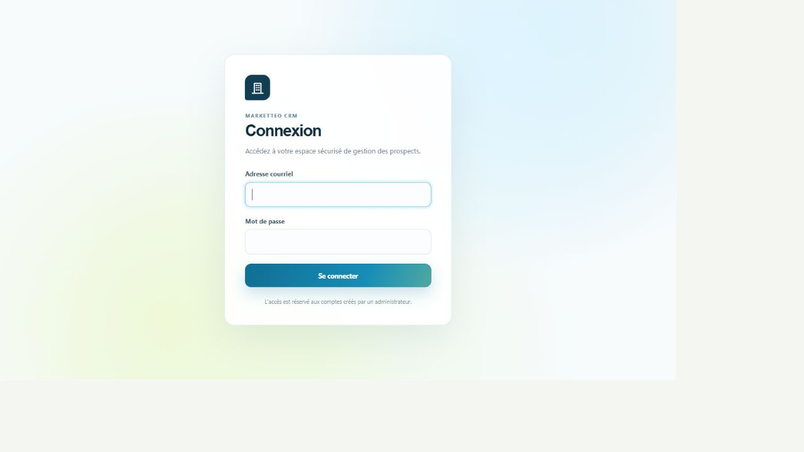
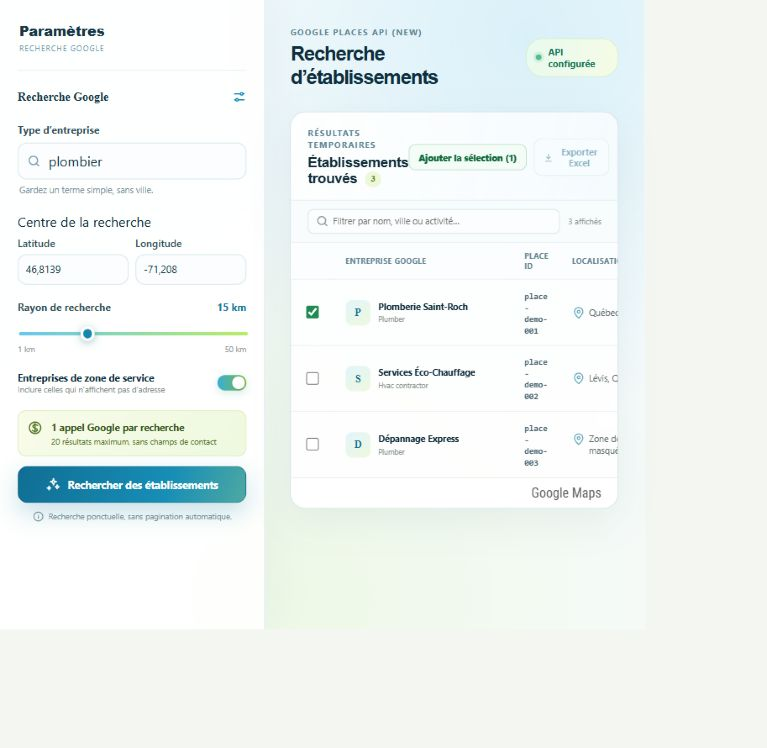
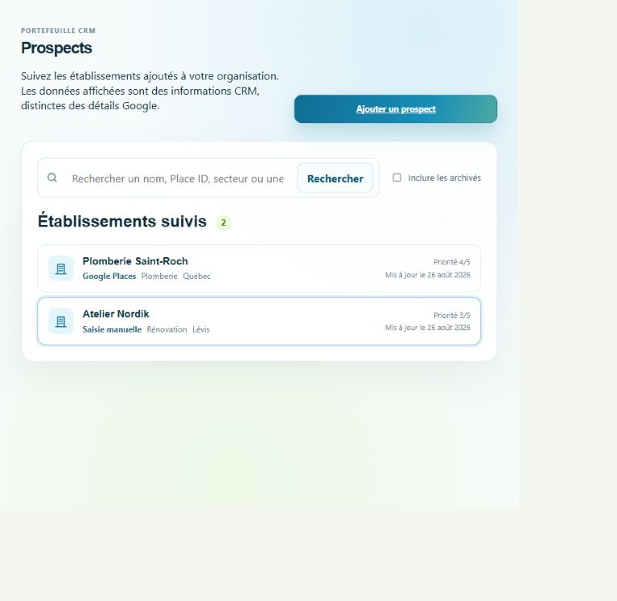
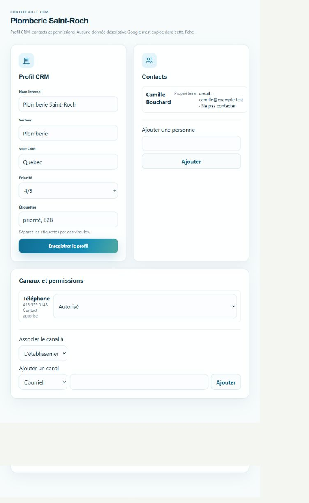

# Marketteo CRM - Manuel utilisateur

**Version :** 0.7
**État :** édition 3.3 préparée pour recette fonctionnelle
**Date de référence :** 5 septembre 2026
**Public :** commerciaux, gestionnaires, administrateurs d'organisation et administrateurs de plateforme

> Les libellés visibles de l'application utilisent désormais la marque Marketteo CRM. Les identifiants techniques historiques peuvent encore contenir `prospect` ou `LeadGenerator` afin de préserver les installations existantes.

## 1. À propos de Marketteo CRM

Marketteo CRM permet à une organisation de rechercher ponctuellement des établissements, de les ajouter à un portefeuille CRM et de gérer des informations commerciales obtenues ou saisies de façon autorisée. L'application sépare les résultats Google temporaires des données CRM persistantes.

Le parcours quotidien le plus courant est le suivant :

1. ouvrir l'organisation dans laquelle vous travaillez ;
2. rechercher, importer ou créer un prospect manuellement ;
3. compléter le profil CRM, les personnes et les canaux obtenus indépendamment ;
4. consigner les interactions déjà réalisées dans la chronologie commerciale ;
5. suivre le prospect dans le pipeline, sans contourner la permission de contact.

### 1.1 Règle essentielle sur les données Google

Les résultats affichés dans « Recherche Google » sont temporaires. Ils peuvent montrer le nom, l'adresse, la distance, le type d'activité et l'état d'un établissement pendant la consultation, mais ces contenus ne sont pas copiés dans le CRM et ne peuvent pas être exportés.

Lorsqu'un résultat est ajouté au CRM, Marketteo conserve la référence Google autorisée et crée un profil CRM distinct. Les champs internes, contacts, canaux, étiquettes, priorités et permissions sont ensuite gérés comme des données de l'organisation.

### 1.2 Fonctionnalités actuellement limitées

- Une recherche Google retourne au maximum 20 résultats et ne lance pas de pagination automatique.
- Une limite opérationnelle est appliquée par journée UTC : 20 recherches par utilisateur dans l'organisation active et 100 par organisation. Elle protège le budget technique Google ; ce n'est pas encore un forfait commercial ni une facture.
- Le bouton « Exporter Excel » des résultats Google est désactivé.
- L'import accepte uniquement un CSV UTF-8 de 10 Mio ou moins. Les formats Excel, PDF, ZIP et les connecteurs externes ne sont pas pris en charge.
- Les tâches et rappels sont internes à Marketteo : ils n’envoient aucune notification externe. Les opportunités,
  automatisations commerciales et la facturation ne font pas partie de cette édition.
- Les métriques et journaux techniques sont réservés à l’exploitation : ils ne sont pas visibles dans le CRM et ne
  changent ni les droits commerciaux ni les limites affichées.

## 2. Accéder à l'application

### 2.1 Accepter une invitation

Une invitation est envoyée par courriel et contient un lien à usage limité.

Si vous n'avez pas encore de compte :

1. ouvrez le lien complet reçu par courriel ;
2. vérifiez le nom de l'organisation et le rôle proposé ;
3. saisissez votre nom affiché ;
4. créez un mot de passe de 12 à 128 caractères et confirmez-le ;
5. sélectionnez « Créer le compte et accepter ».

Si un compte existe déjà pour l'adresse invitée :

1. connectez-vous directement dans la page d'invitation ;
2. vérifiez le compte connecté ;
3. sélectionnez « Accepter l'invitation ».

Si un autre compte est déjà connecté, utilisez « Utiliser un autre compte » ou déconnectez-vous avant de poursuivre. Un lien expiré, révoqué, déjà utilisé ou associé à un autre compte ne peut pas être accepté.

### 2.2 Se connecter

1. ouvrez l'adresse de Marketteo CRM communiquée par votre administrateur ;
2. saisissez votre adresse courriel ;
3. saisissez votre mot de passe ;
4. sélectionnez « Se connecter ».

L'accès est réservé aux comptes créés ou invités par un administrateur. En cas d'échec répété, vérifiez l'adresse utilisée et contactez l'administrateur de votre organisation.

*Figure 1 — Écran de connexion Marketteo CRM. Les champs restent volontairement vides dans toute capture diffusée.*

### 2.3 Choisir l'organisation active

Si vous appartenez à plusieurs organisations, le sélecteur « Organisation active » apparaît dans l'en-tête.

1. ouvrez le sélecteur ;
2. choisissez l'organisation voulue ;
3. attendez la fin du changement avant de continuer.

Les données, membres, prospects et journaux sont isolés par organisation. Vérifiez toujours l'organisation active avant de créer ou modifier une donnée.

### 2.4 Navigation et accès selon le rôle

Le menu affiche uniquement les pages autorisées pour votre rôle. L'absence d'une page indique généralement que votre compte ne possède pas la capacité correspondante.

| Fonction | Commercial | Gestionnaire | Administrateur | Admin plateforme |
|---|---:|---:|---:|---:|
| Recherche Google et carte | Oui | Oui | Oui | Selon appartenance |
| Prospects, contacts et canaux | Oui | Oui | Oui | Selon appartenance |
| Autoriser un contact | Non | Oui | Oui | Selon appartenance |
| Enregistrer « Ne pas contacter » ou une opposition | Oui | Oui | Oui | Selon appartenance |
| Pipeline commercial | Consulter et déplacer | Consulter, déplacer et réouvrir | Consulter, déplacer et réouvrir | Selon appartenance |
| Chronologie commerciale | Consulter, créer et corriger ses saisies | Consulter, créer et corriger les saisies | Consulter, créer et corriger les saisies | Selon appartenance |
| Sources et acquisitions | Non | Consultation et déclaration | Gestion et revue | Selon appartenance |
| Conservation et imports CSV | Consultation du rapport | Déclarer, téléverser, mapper, valider et confirmer | Gestion complète | Selon appartenance |
| Membres et journal d'activité | Non | Consultation | Gestion | Selon appartenance |
| Organisations et audit de plateforme | Non | Non | Non | Oui |

Un administrateur de plateforme qui appartient aussi à une organisation cumule les accès correspondants.

## 3. Rechercher des établissements

Ouvrez « Recherche Google » dans la navigation.

### 3.1 Configurer la recherche

1. dans « Type d'entreprise », saisissez un terme simple, par exemple `plombier` ; n'ajoutez pas la ville au terme ;
2. saisissez la latitude et la longitude du centre de recherche ;
3. choisissez un rayon de 1 à 50 km ;
4. activez « Entreprises de zone de service » si vous souhaitez inclure les entreprises qui n'affichent pas d'adresse ;
5. sélectionnez « Rechercher des établissements ».

Chaque recherche effectue un seul appel Google Text Search et affiche jusqu'à 20 résultats. La carte de couverture apparaît si votre rôle permet l'accès à la carte et si le service est disponible.

La limite quotidienne est calculée par le serveur et se remet à zéro à minuit UTC. Lorsqu'elle est atteinte, aucune recherche n'est transmise à Google. Attendez le délai affiché, ou contactez l'administrateur de votre organisation si l'activité prévue nécessite une révision de la configuration.

### 3.2 Lire et filtrer les résultats

Le tableau indique l'entreprise Google temporaire, son `place_id`, la localisation, la distance, l'état et un lien d'ouverture dans Google Maps. Le `place_id` est la référence technique Google qui permet d'éviter les doublons ; ce n'est pas le nom commercial du prospect dans Marketteo. « Non vérifiable » signifie que la distance ne peut pas être confirmée, notamment pour certaines entreprises de zone de service.

Utilisez « Filtrer par nom, ville ou activité… » pour réduire localement la liste déjà affichée. Ce filtre ne déclenche pas une nouvelle recherche Google.

### 3.3 Ajouter un résultat au CRM

Pour ajouter un établissement :

1. saisissez un « Nom interne CRM » dans la ligne voulue ; ce nom est choisi par votre organisation et ne doit pas être une copie automatique du nom Google ;
2. sélectionnez « Ajouter » dans la ligne ; le bouton reste inaccessible tant que le nom interne est vide ;
3. attendez le résultat : « Ajouté » confirme la création et « Déjà au CRM » indique qu'un prospect portant ce `place_id` existe déjà ;
4. ouvrez ensuite « Prospects » pour compléter le profil CRM.

Pour ajouter plusieurs résultats, cochez les lignes, renseignez un nom interne pour chacune, puis sélectionnez « Ajouter la sélection ». Une nouvelle recherche efface la sélection courante.

> Important : « Ajouter » ne copie pas les détails descriptifs Google dans la fiche. Les coordonnées de contact doivent provenir d'une source autorisée et être saisies séparément.

*Figure 2 — Recherche d'établissements et ajout au CRM. Le nom interne est saisi par l'utilisateur avant l'ajout.*

## 4. Gérer les prospects

### 4.1 Consulter le portefeuille

Ouvrez « Prospects ». La liste montre le nom interne, l'origine, le secteur et la ville lorsqu'ils sont renseignés, la priorité, la dernière mise à jour et l'état archivé. Pour un prospect issu de Google, le `place_id` est affiché séparément et en lecture seule.

- Recherchez par nom, secteur, ville ou `place_id`, puis sélectionnez « Rechercher ».
- Cochez « Inclure les archivés » pour afficher les éléments archivés.
- Sélectionnez « Afficher davantage » lorsqu'une page suivante est disponible.
- Sélectionnez une ligne pour ouvrir la fiche.

*Figure 3 — Portefeuille des prospects avec les informations CRM utiles au suivi commercial.*

### 4.2 Créer un prospect manuellement

1. dans « Prospects », sélectionnez « Ajouter un prospect » ;
2. saisissez le « Nom interne de l'établissement » ;
3. sélectionnez « Créer le prospect ».

Cette action crée une donnée CRM manuelle et ne copie aucune information depuis Google.

### 4.3 Modifier le profil CRM

Dans la fiche du prospect, la section « Profil CRM » contient :

- le nom interne ;
- le secteur ;
- la ville CRM ;
- une priorité de 0 à 5 ;
- des étiquettes séparées par des virgules.

Modifiez les champs puis sélectionnez « Enregistrer le profil ». Si votre rôle est en lecture seule, le formulaire est remplacé par un message d'information.

Pour un prospect Google, la fiche affiche aussi le `place_id`. Cette référence est non modifiable. Modifier le nom interne ne modifie ni le `place_id`, ni les données temporaires affichées par Google.

### 4.4 Ajouter une personne de contact

1. ouvrez la fiche du prospect ;
2. dans « Contacts », saisissez le nom de la personne ;
3. sélectionnez « Ajouter ».

La personne est enregistrée comme donnée saisie manuellement pour le suivi commercial.

### 4.5 Ajouter un canal de contact

1. dans « Canaux et permissions », choisissez si le canal appartient à l'établissement ou à une personne ;
2. choisissez le type : courriel, téléphone, LinkedIn, Facebook ou autre ;
3. saisissez la valeur ;
4. sélectionnez « Ajouter ».

Tout nouveau canal est créé avec l'état « Permission non déterminée ». Ne contactez pas la personne tant que la base autorisant le contact n'a pas été vérifiée.

### 4.6 Gérer la permission de contact

Les états possibles sont :

| État | Signification | Conduite à tenir |
|---|---|---|
| Permission non déterminée | La permission n'a pas été établie | Ne pas contacter avant vérification |
| Contact autorisé | Une base et une provenance valides ont été enregistrées | Contact possible dans la finalité prévue |
| Ne pas contacter | Une restriction manuelle s'applique | Aucun contact |
| Opposition enregistrée | La personne s'est opposée au contact | Aucun contact ; conserver la trace |

Les gestionnaires et administrateurs peuvent autoriser un canal lorsqu'une provenance compatible existe. Les commerciaux peuvent enregistrer une restriction ou une opposition, mais ne peuvent pas transformer seuls un état inconnu en « Contact autorisé ».

*Figure 4 — Fiche prospect : profil CRM, contacts, canaux et état de permission. Les données affichées sont fictives.*

### 4.7 Consigner une activité commerciale

La section « Chronologie commerciale » de la fiche prospect conserve les faits utiles au suivi. Elle est distincte du « Journal d'activité », qui reste un audit technique. Une activité n'envoie aucun courriel, ne lance aucun appel et ne modifie jamais la permission d'un canal.

1. ouvrez la fiche du prospect, puis « Ajouter une activité » ;
2. choisissez le type : note interne, appel déclaré, courriel déclaré ou réunion déclarée ;
3. pour un appel ou un courriel, choisissez le sens de l'échange et, si utile, le canal correspondant ;
4. indiquez la date et l'heure réelles, un résumé, puis des détails internes facultatifs ;
5. sélectionnez « Enregistrer l'activité ».

Un avertissement s'affiche si le canal choisi est restreint ou si sa permission est non déterminée. Il signale qu'il faut vérifier la permission avant tout contact réel ; l'inscription d'un fait passé ne constitue ni une autorisation ni une action de contact.

### 4.8 Corriger une activité

Une activité déjà inscrite ne se modifie pas directement. Ouvrez « Corriger », ajustez le résumé, les détails ou la date, indiquez le motif de la correction puis enregistrez. La saisie initiale demeure dans la chronologie et la nouvelle entrée porte sa correction. Un commercial corrige ses propres saisies ; un gestionnaire ou un administrateur peut corriger les saisies de l'organisation.

## 5. Suivre le pipeline commercial

Ouvrez « Pipeline ». Cette vue classe les prospects actifs par étape commerciale ; elle ne contient pas les prospects archivés et ne remplace ni les permissions de contact ni les données de provenance.

Les étapes initiales sont : Nouveau, Qualification en cours, Qualifié, Contact établi, Opportunité détectée, Proposition envoyée, Négociation, Gagné et Perdu. Utilisez le champ « Filtrer » pour rechercher un nom interne, un secteur ou une ville CRM.

### 5.1 Faire progresser un prospect

1. repérez la carte du prospect dans sa colonne ;
2. utilisez le bouton vers l'étape précédente ou suivante ;
3. attendez le rechargement de la colonne avant une nouvelle action.

Un déplacement est contrôlé par la version courante du prospect. Si un autre membre a modifié le même prospect, rechargez le pipeline, vérifiez l'étape affichée puis recommencez seulement si le déplacement reste pertinent.

### 5.2 Marquer un prospect comme perdu ou le réouvrir

Depuis une étape non terminale, sélectionnez « Marquer perdu », puis choisissez le motif commercial. Si vous sélectionnez « Autre motif », précisez la raison avant de confirmer.

Les étapes « Gagné » et « Perdu » sont terminales. Un gestionnaire ou un administrateur peut sélectionner « Réouvrir », choisir un motif et confirmer la reprise du suivi. Un commercial peut consulter ces étapes mais ne peut pas les réouvrir.

> Important : le passage à une étape ne crée pas d'appel, de courriel, de tâche ou de permission de contact. Consignez séparément les activités déjà réalisées.

### 5.3 Gérer les tâches et rappels

Sur la fiche d’un prospect, ouvrez « Tâches et prochaine action » pour planifier une tâche. Saisissez un titre, une
échéance et, si utile, un rappel interne. Les heures sont affichées dans le fuseau horaire de l’organisation ; elles ne
déclenchent aucun courriel, appel ou notification externe.

Ouvrez « Mes tâches » pour consulter vos tâches ouvertes et les rappels dus. Vous pouvez terminer une tâche, l’annuler
en indiquant un motif, la rouvrir avec un motif, accuser un rappel ou le reporter. Le report est limité à sept jours. Une
tâche en retard reste visible jusqu’à sa finalisation. Si l’application indique que le responsable est désactivé, contactez
un gestionnaire pour décider de la suite : aucune réaffectation n’est faite automatiquement.

La « prochaine action » affichée sur la fiche, dans la liste des prospects et sur une carte Kanban est calculée à partir
de la première tâche ouverte. Elle ne modifie jamais l’étape commerciale du prospect.

## 6. Documenter les sources et acquisitions

Ouvrez « Sources et acquisitions ». Une acquisition approuvée documente la provenance des données, mais ne crée jamais automatiquement une permission de contact.

### 6.1 Cycle d'un fournisseur

Cette procédure est réservée à l'administrateur.

1. dans l'onglet « Fournisseurs », sélectionnez un type de source et saisissez le nom du fournisseur ;
2. sélectionnez « Créer le brouillon » ;
3. ouvrez « Modifier » ;
4. renseignez la référence contractuelle, l'URL des conditions, les dates de validité et les territoires ;
5. sélectionnez les finalités et catégories de données autorisées ;
6. cochez l'attestation de droits lorsque la vérification est terminée ;
7. choisissez l'état approprié et enregistrez.

N'activez pas un fournisseur dont les droits, dates, territoires ou catégories ne sont pas confirmés.

### 6.2 Déclarer une acquisition

Cette action est accessible au gestionnaire et à l'administrateur lorsqu'un fournisseur actif et compatible existe.

1. ouvrez l'onglet « Acquisitions » ;
2. choisissez le fournisseur et le type de source ;
3. saisissez un libellé clair, le territoire, la finalité et la date d'obtention ;
4. ajoutez une référence externe si disponible ;
5. cochez les catégories de données réellement obtenues ;
6. sélectionnez « Déclarer l'acquisition ».

L'administrateur peut ensuite approuver ou rejeter une acquisition en attente. Une déclaration rejetée reste visible dans l'historique d'audit et ne peut pas servir de provenance.

## 7. Conservation et déclarations d'import

Ouvrez « Conservation et imports ». Les archivages sont logiques : ils ne suppriment pas physiquement les données.

### 7.1 Consulter ou créer une politique

L'onglet « Politiques » présente la ressource, le délai de revue, l'état et la version.

Pour un administrateur :

1. choisissez le type de ressource ;
2. saisissez un code, un libellé et le nombre de jours avant revue ;
3. ajoutez un délai d'archivage si nécessaire ;
4. sélectionnez « Créer » ;
5. vérifiez le brouillon puis sélectionnez « Activer ».

### 7.2 Utiliser un hold

Un hold protège une ressource contre le traitement normal de conservation, par exemple pendant une demande légale ou une revue qualité.

1. ouvrez « Holds et revues » ;
2. choisissez le type de ressource et saisissez son identifiant exact ;
3. choisissez le motif et ajoutez une note utile ;
4. sélectionnez « Ajouter ».

Un gestionnaire ou administrateur autorisé peut créer un hold. Seul un rôle disposant de la capacité de libération peut sélectionner « Lever ». Ces actions sont journalisées.

### 7.3 Déclarer un import CSV

1. ouvrez « Déclarations d'import » ;
2. choisissez une acquisition approuvée ;
3. saisissez un libellé et, si connu, le volume estimé ;
4. cochez les champs et catégories réellement présents ;
5. sélectionnez « Déclarer sans téléverser ».

La déclaration ne téléverse aucun fichier. Elle peut être annulée ou archivée selon votre rôle.

### 7.4 Importer un CSV déclaré

Après avoir créé une déclaration CSV liée à une acquisition approuvée :

1. ouvrez « Déclarations d’import » ;
2. choisissez la déclaration et un fichier CSV UTF-8 de 10 Mio ou moins ;
3. consultez l’aperçu temporaire, puis associez chaque colonne utile à un champ CRM ;
4. sélectionnez « Enregistrer le mapping », puis « Valider le fichier » ;
5. vérifiez les compteurs de créations, doublons exacts et lignes en quarantaine ;
6. sélectionnez « Confirmer l’import ».

Les lignes valides créent des données CRM avec leur provenance. Les canaux reçoivent toujours la permission « non déterminée » : un import n’autorise jamais à contacter une personne. Les doublons exacts sont ignorés. Le rapport n’affiche que les numéros de lignes, les codes de motifs et une référence opaque ; il ne restitue aucune valeur brute du fichier. Le fichier source reste privé et temporaire, puis est supprimé après confirmation ou au plus tard dans les 24 heures.

## 8. Administrer une organisation

### 8.1 Consulter ou modifier l'organisation

Ouvrez « Organisation » pour consulter le nom, la langue, le fuseau horaire, l'état et la date de création. L'administrateur peut modifier le nom, la langue et le fuseau horaire IANA, puis enregistrer.

Si l'écran signale « Une version plus récente existe », rechargez les données avant de reprendre vos changements. Ce contrôle évite d'écraser la modification d'un autre utilisateur.

### 8.2 Gérer les membres

Ouvrez « Membres », puis l'onglet « Membres ».

- Le gestionnaire peut consulter la liste.
- L'administrateur peut sélectionner « Modifier », changer le rôle ou l'état et confirmer l'action sensible.
- Le dernier administrateur actif de l'organisation ne peut pas être désactivé ou rétrogradé sans remplacement.

### 8.3 Inviter une personne

Dans l'onglet « Invitations » :

1. saisissez l'adresse courriel ;
2. choisissez le rôle proposé ;
3. envoyez l'invitation ;
4. vérifiez son état et sa date d'expiration dans la liste.

L'administrateur peut renvoyer ou révoquer une invitation lorsqu'une action est proposée. Un renvoi invalide l'ancien lien. Aucun jeton d'invitation n'est affiché dans le navigateur.

### 8.4 Consulter le journal d'activité

Ouvrez « Journal d'activité ». Vous pouvez filtrer par période, action, type d'entité, identifiant exact et acteur.

1. renseignez les filtres utiles ;
2. sélectionnez « Appliquer » ;
3. ouvrez un événement pour consulter ses détails ;
4. utilisez « Afficher davantage » si une page suivante existe ;
5. sélectionnez « Réinitialiser » pour effacer les filtres.

Le journal présente les changements validés de l'organisation active. Il ne remplace pas une sauvegarde et n'autorise pas la modification des événements.

## 9. Mon compte et session

Ouvrez « Compte » ou sélectionnez votre nom dans l'en-tête pour consulter :

- votre nom affiché et votre adresse courriel ;
- votre rôle de plateforme, le cas échéant ;
- vos organisations et votre rôle dans chacune ;
- l'organisation actuellement active.

Sélectionnez « Se déconnecter » lorsque vous avez terminé, particulièrement sur un appareil partagé. Les informations de session ne sont pas enregistrées dans le stockage du navigateur.

## 10. Administration de la plateforme

Cette section s'adresse uniquement aux administrateurs de plateforme.

### 10.1 Provisionner une organisation

1. ouvrez « Plateforme » ;
2. saisissez le nom de l'organisation, la langue et le fuseau horaire IANA ;
3. saisissez le courriel de l'administrateur initial ;
4. lancez le provisionnement ;
5. vérifiez l'organisation et l'état de la première invitation dans la liste.

L'administrateur initial reçoit un lien à usage unique. Si une intention de renvoi reste bloquée, utilisez « Abandonner l'intention » seulement après avoir vérifié l'état affiché.

Selon les actions disponibles, un administrateur de plateforme peut renvoyer ou révoquer l'invitation initiale, suspendre une organisation ou la réactiver. Chaque opération sensible demande une justification ou une confirmation et est auditée.

### 10.2 Consulter l'audit plateforme

Ouvrez « Audit plateforme ». Utilisez les filtres de période, action, type d'entité, identifiant et acteur comme dans le journal d'une organisation. L'audit plateforme reste séparé des données propres aux organisations et s'affiche en UTC.

## 11. Dépannage de premier niveau

### Une page n'apparaît pas dans le menu

Votre rôle ne possède probablement pas la capacité requise, ou aucune organisation active n'est sélectionnée. Vérifiez « Mon compte » et l'organisation active, puis contactez un administrateur.

### « Accès refusé » s'affiche

Revenez à l'accueil proposé. Si l'accès est nécessaire à votre travail, demandez à un administrateur de vérifier votre rôle ; n'utilisez pas l'adresse directe d'une page pour contourner les droits.

### La recherche Google indique « Clé API absente »

Le service doit être configuré côté serveur avec la clé Google Maps. Signalez le message à l'équipe qui exploite Marketteo CRM ; aucun réglage utilisateur ne peut le corriger.

### La limite quotidienne de recherches Google est atteinte

Marketteo a bloqué la recherche avant l'appel Google afin de protéger le budget de l'organisation. Attendez la remise à zéro indiquée par l'application. Modifier le terme, le rayon ou actualiser la page ne contourne pas cette limite. Les limites actuelles sont opérationnelles et peuvent évoluer avant la commercialisation des forfaits.

### La recherche ou la carte indique que la protection est temporairement indisponible

Réessayez après quelques instants. Marketteo ne lance pas la recherche ou la carte tant que sa protection temporaire ne
peut pas être garantie ; évitez donc de cliquer plusieurs fois. Si le message persiste, transmettez l'heure approximative
de l'incident à l'équipe qui exploite l'application. Aucun réglage de navigateur n'est nécessaire.

### La carte n'est pas disponible

Les résultats textuels peuvent rester utilisables. Réessayez, puis signalez l'erreur si elle persiste. N'interprétez pas une carte absente comme une absence de résultats.

### Une modification signale une version plus récente

Rechargez la ressource avant de recommencer. Comparez les nouvelles valeurs et réappliquez seulement les changements encore nécessaires.

### Une invitation ne fonctionne plus

Vérifiez que le lien est complet et que le compte connecté correspond à l'adresse invitée. Demandez ensuite à un administrateur de renvoyer une invitation si elle est expirée ou révoquée.

### Un canal reste « Permission non déterminée »

C'est l'état normal après sa création. Un gestionnaire ou administrateur doit vérifier une provenance compatible avant de l'autoriser. En cas d'opposition ou de doute, choisissez l'état restrictif approprié.

### Un déplacement du pipeline est refusé

Vérifiez que le prospect n'est pas archivé, que l'étape cible est proposée par l'application et que votre rôle permet l'action. En cas de conflit de version, rechargez le pipeline avant de décider si le déplacement doit être repris.

## 12. Glossaire

**Activité commerciale** : note ou interaction déjà réalisée, inscrite volontairement dans la chronologie du prospect. Elle n'envoie aucun message et ne crée pas de permission.

**Acquisition** : déclaration décrivant comment, quand et pour quelle finalité un ensemble de données a été obtenu.

**Canal de contact** : moyen de joindre un établissement ou une personne, par exemple un courriel, un téléphone ou un profil social.

**Étape commerciale** : position actuelle d'un prospect dans le pipeline, distincte de son archivage et de la permission de contact.

**Hold** : protection temporaire empêchant l'application normale d'une politique de conservation sur une ressource.

**Organisation active** : espace de données dans lequel l'utilisateur travaille actuellement.

**Permission de contact** : état déterminant si un canal peut être utilisé pour la finalité prévue.

**Provenance** : trace de l'origine d'une donnée et des droits associés.

**Prospect** : établissement suivi dans le portefeuille CRM de l'organisation.

**Résultat Google temporaire** : information affichée pendant une recherche et non conservée comme donnée descriptive dans le CRM.

## 13. Historique du document

| Version | Date | État | Résumé |
|---|---|---|---|
| 0.7 | 5 septembre 2026 | À valider | Ajout des tâches, rappels internes et prochaine action 3.3-D |
| 0.6 | 5 septembre 2026 | À valider | Ajout du pipeline commercial, de la chronologie d'activités et du parcours réel d'import CSV ; limites mises à jour |
| 0.5 | 26 août 2026 | À valider | Ajout de quatre captures d'écran avec données de démonstration ; procédures alignées sur le nom interne CRM et le `place_id` |
| 0.1 | 25 août 2026 | À valider | Structure initiale fondée sur les routes, composants, capacités et règles métier présentes dans le dépôt |
