# Manuel utilisateur Marketteo CRM

**Version :** 0.13
**État :** phase 4.6 clôturée localement ; Pré-Phase 5 Automatisation autorisée en P4-Lite sous réserves
**Date de référence :** 6 octobre 2026
**Public :** commerciaux, gestionnaires, administrateurs d'organisation et administrateurs de plateforme

Cette édition est alignée sur le dernier commit documentaire `9f174b8` (« document spécification Pre-Phase 5 ») et sur les routes Automatisation présentes dans l'application locale.

> Les libellés visibles de l'application utilisent désormais la marque Marketteo CRM. Les identifiants techniques historiques peuvent encore contenir `prospect` ou `LeadGenerator` afin de préserver les installations existantes.

## 1. À propos de Marketteo CRM

Marketteo CRM permet à une organisation de rechercher ponctuellement des établissements, de les ajouter à un portefeuille CRM et de gérer des informations commerciales obtenues ou saisies de façon autorisée. L'application sépare les résultats Google temporaires des données CRM persistantes.

Le parcours quotidien le plus courant est le suivant :

1. ouvrir l'organisation dans laquelle vous travaillez ;
2. rechercher, importer ou créer un prospect manuellement ;
3. compléter le profil CRM, les personnes et les canaux obtenus indépendamment ;
4. consigner les interactions déjà réalisées dans la chronologie commerciale ;
5. suivre les tâches, le pipeline et les opportunités, sans contourner la permission de contact ;
6. consulter le tableau de bord, les quotas et les rapports d'usage lorsque votre rôle y donne accès.

### 1.1 Règle essentielle sur les données Google

Les résultats affichés dans « Recherche Google » sont temporaires. Ils peuvent montrer le nom, l'adresse, la distance, le type d'activité et l'état d'un établissement pendant la consultation, mais ces contenus ne sont pas copiés dans le CRM et ne peuvent pas être exportés.

Lorsqu'un résultat est ajouté au CRM, Marketteo conserve la référence Google autorisée et crée un profil CRM distinct. Les champs internes, contacts, canaux, étiquettes, priorités et permissions sont ensuite gérés comme des données de l'organisation.

### 1.2 Fonctionnalités actuellement limitées

- Une recherche Google retourne au maximum 20 résultats et ne lance pas de pagination automatique.
- Une limite opérationnelle est appliquée par journée UTC : 20 recherches par utilisateur dans l'organisation active et 100 par organisation. Elle protège le budget technique Google ; ce n'est pas encore un forfait commercial ni une facture.
- Le bouton « Exporter Excel » des résultats Google est désactivé.
- L'import accepte uniquement un CSV UTF-8 de 10 Mio ou moins. Les formats Excel, PDF, ZIP et les connecteurs externes ne sont pas pris en charge.
- Les tâches et rappels sont internes à Marketteo : ils n’envoient aucune notification externe. Les automatisations
  commerciales, la facturation et la conversion de devises ne font pas partie de cette édition.
- Les métriques et journaux techniques sont réservés à l'exploitation : ils ne sont pas visibles dans le CRM et ne
  changent ni les droits commerciaux ni les limites affichées.
- La recette locale de phase 4.6 a validé les parcours E2E-01 à E2E-12, le verrou qualité sans skip et les contrôles d'accessibilité ; le pipeline Azure doit encore publier les preuves sur le commit de clôture avant l'entrée en phase 5.
- L'activation du connecteur Meta avec un compte réel reste `BLOCKED_EXTERNAL` jusqu'à l'autorisation externe, la revue de l'application et la validation des permissions officielles. Le pilote local simulé ne vaut pas activation fournisseur.
- La Pré-Phase 5 Automatisation expose désormais les surfaces « Aujourd'hui », « Playbooks » et « Entrées et exceptions ». Elles sont documentées comme P4-Lite : les flags sont désactivés par défaut, le fournisseur IA est simulé et aucune communication externe, réattribution automatique ou modification silencieuse du pipeline n'est exécutée.
- La préparation d'un plan Automatisation reste une proposition temporaire en lecture seule. Elle ne crée ni prospect, ni tâche, ni brouillon persistant et ne lance aucun appel OpenAI réel.
- La phase 5 générale reste cadrée mais non disponible dans l'application : préproduction, abonnements, facturation, restauration, essais de charge et déploiement progressif restent à décider et à implémenter.

## 2. Accéder à l'application

### 2.1 Accepter une invitation

Une invitation est envoyée par courriel et contient un lien à usage limité.

Si vous n'avez pas encore de compte :

1. ouvrez le lien complet reçu par courriel ;
2. vérifiez le nom de l'organisation et le rôle proposé ;
3. saisissez votre nom affiché ;
4. créez un mot de passe de 12 à 128 caractères et confirmez-le ;
5. sélectionnez « Créer le compte et accepter ».

Si un compte existe déjà pour l'adresse invitée :

1. connectez-vous directement dans la page d'invitation ;
2. vérifiez le compte connecté ;
3. sélectionnez « Accepter l'invitation ».

Si un autre compte est déjà connecté, utilisez « Utiliser un autre compte » ou déconnectez-vous avant de poursuivre. Un lien expiré, révoqué, déjà utilisé ou associé à un autre compte ne peut pas être accepté.

### 2.2 Se connecter

1. ouvrez l'adresse de Marketteo CRM communiquée par votre administrateur ;
2. saisissez votre adresse courriel ;
3. saisissez votre mot de passe ;
4. sélectionnez « Se connecter ».

L'accès est réservé aux comptes créés ou invités par un administrateur. En cas d'échec répété, vérifiez l'adresse utilisée et contactez l'administrateur de votre organisation.

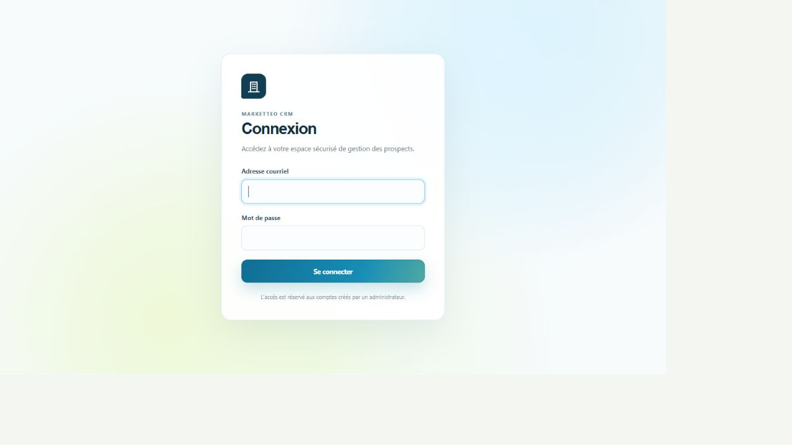
*Figure 1 — Écran de connexion Marketteo CRM. Les champs restent volontairement vides dans toute capture diffusée.*

### 2.3 Choisir l'organisation active

Si vous appartenez à plusieurs organisations, le sélecteur « Organisation active » apparaît dans l'en-tête.

1. ouvrez le sélecteur ;
2. choisissez l'organisation voulue ;
3. attendez la fin du changement avant de continuer.

Les données, membres, prospects et journaux sont isolés par organisation. Vérifiez toujours l'organisation active avant de créer ou modifier une donnée.

### 2.4 Navigation et accès selon le rôle

Le menu affiche uniquement les pages autorisées pour votre rôle. L'absence d'une page indique généralement que votre compte ne possède pas la capacité correspondante.

| Fonction | Commercial | Gestionnaire | Administrateur | Admin plateforme |
|---|---:|---:|---:|---:|
| Tableau de bord | Mes données | Organisation et membres | Organisation et membres | Selon appartenance |
| Recherche Google et carte | Oui | Oui | Oui | Selon appartenance |
| Prospects, contacts et canaux | Oui | Oui | Oui | Selon appartenance |
| Autoriser un contact | Non | Oui | Oui | Selon appartenance |
| Enregistrer « Ne pas contacter » ou une opposition | Oui | Oui | Oui | Selon appartenance |
| Pipeline commercial | Consulter et déplacer | Consulter, déplacer et réouvrir | Consulter, déplacer et réouvrir | Selon appartenance |
| Chronologie commerciale | Consulter, créer et corriger ses saisies | Consulter, créer et corriger les saisies | Consulter, créer et corriger les saisies | Selon appartenance |
| Tâches et rappels | Gérer les tâches assignées | Gérer les tâches de l'organisation | Gérer les tâches de l'organisation | Selon appartenance |
| Opportunités | Voir, créer, modifier et conclure ses opportunités ; aucune réouverture ni réaffectation | Voir, créer, modifier, conclure, réouvrir et réaffecter toutes les opportunités | Voir, créer, modifier, conclure, réouvrir et réaffecter toutes les opportunités | Selon appartenance |
| Sources, acquisitions et connexions | Non | Consultation et déclaration | Gestion, revue et connexions | Selon appartenance |
| Conservation, imports CSV et historique | Consultation du rapport | Déclarer, téléverser, mapper, valider, confirmer et consulter l'historique | Gestion complète | Selon appartenance |
| Exports CSV | Export de son périmètre | Export organisationnel selon capacité | Export organisationnel selon capacité | Selon appartenance |
| Quotas et rapports d'usage | Rapport personnel | Organisation et membres | Organisation et membres | Selon appartenance |
| Membres et journal d'activité | Non | Consultation | Gestion | Selon appartenance |
| Organisations et audit de plateforme | Non | Non | Non | Oui |

Un administrateur de plateforme qui appartient aussi à une organisation cumule les accès correspondants.

### 2.5 Utiliser la navigation responsive

La navigation est filtrée par les capacités de la session. Sur grand écran, les cinq accès fréquents (« Tableau de bord », « Mes tâches », « Prospects », « Pipeline » et « Opportunités ») sont visibles dans l'en-tête ; les autres pages sont regroupées dans « Acquisition », « Données et audit » et « Administration ».

À largeur intermédiaire, sélectionnez « Menu » pour ouvrir le panneau. Sur téléphone, la barre inférieure conserve « Accueil », « Tâches », « Prospects », « Pipeline » et « Plus ». « Plus » ouvre le même panneau catégorisé et donne aussi accès au « Manuel ».

- sélectionnez une catégorie pour afficher ou masquer ses liens ;
- utilisez « Échap », le bouton de fermeture ou le bouton « Menu » pour refermer le panneau ;
- le bouton « Manuel » ouvre la dernière édition HTML publiée dans un nouvel onglet ;
- si un lien n'apparaît pas, vérifiez votre rôle et l'organisation active plutôt que de saisir une URL directe.

*Figure 11 — Panneau de navigation responsive avec les catégories Acquisition, Données et audit et Administration.*

## 3. Rechercher des établissements

Ouvrez « Recherche Google » dans la navigation.

### 3.1 Configurer la recherche

1. dans « Type d'entreprise », saisissez un terme simple, par exemple `plombier` ; n'ajoutez pas la ville au terme ;
2. dans « Pays ou région », commencez à saisir le lieu, puis choisissez une proposition Google ;
3. dans « Ville ou quartier », saisissez le lieu précis et choisissez une proposition : la latitude et la longitude du centre sont remplies automatiquement ;
4. au besoin, ouvrez « Coordonnées avancées » pour saisir directement la latitude et la longitude ;
5. choisissez un rayon de 1 à 50 km ;
6. activez « Entreprises de zone de service » si vous souhaitez inclure les entreprises qui n'affichent pas d'adresse ;
7. sélectionnez « Rechercher des établissements ».

Chaque recherche effectue un seul appel Google Text Search et affiche jusqu'à 20 résultats. La carte de couverture apparaît si votre rôle permet l'accès à la carte et si le service est disponible.
L'autocomplétion et la résolution du lieu utilisent des appels Google distincts et facturables ; elles ne lancent pas automatiquement de recherche d'établissements. Les propositions sont temporaires et ne sont pas enregistrées dans le CRM.

La limite quotidienne est calculée par le serveur et se remet à zéro à minuit UTC. Lorsqu'elle est atteinte, aucune recherche n'est transmise à Google. Attendez le délai affiché, ou contactez l'administrateur de votre organisation si l'activité prévue nécessite une révision de la configuration.

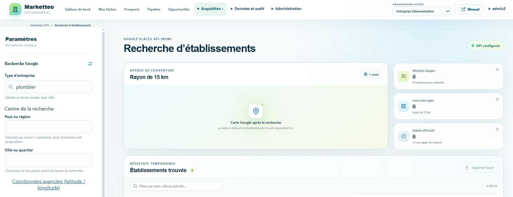
*Figure 12 — Recherche Google phase 4 : paramètres à gauche, couverture et résultats temporaires à droite.*

### 3.2 Lire et filtrer les résultats

Le tableau indique l'entreprise Google temporaire, son `place_id`, la localisation, la distance, l'état et un lien d'ouverture dans Google Maps. Le `place_id` est la référence technique Google qui permet d'éviter les doublons ; ce n'est pas le nom commercial du prospect dans Marketteo. « Non vérifiable » signifie que la distance ne peut pas être confirmée, notamment pour certaines entreprises de zone de service.

Utilisez « Filtrer par nom, ville ou activité… » pour réduire localement la liste déjà affichée. Ce filtre ne déclenche pas une nouvelle recherche Google.

### 3.3 Ajouter un résultat au CRM

Pour ajouter un établissement :

1. saisissez un « Nom interne CRM » dans la ligne voulue ; ce nom est choisi par votre organisation et ne doit pas être une copie automatique du nom Google ;
2. sélectionnez « Ajouter » dans la ligne ; le bouton reste inaccessible tant que le nom interne est vide ;
3. attendez le résultat : « Ajouté » confirme la création et « Déjà au CRM » indique qu'un prospect portant ce `place_id` existe déjà ;
4. ouvrez ensuite « Prospects » pour compléter le profil CRM.

Pour ajouter plusieurs résultats, cochez les lignes, renseignez un nom interne pour chacune, puis sélectionnez « Ajouter la sélection ». Une nouvelle recherche efface la sélection courante.

> Important : « Ajouter » ne copie pas les détails descriptifs Google dans la fiche. Les coordonnées de contact doivent provenir d'une source autorisée et être saisies séparément.

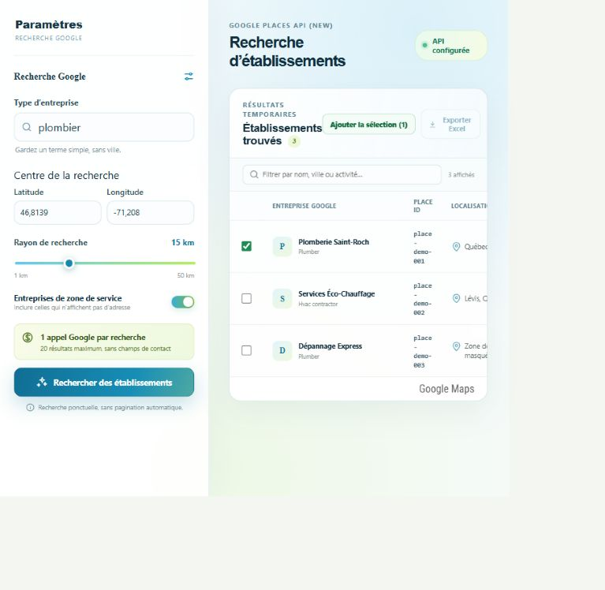
*Figure 2 — Recherche d'établissements et ajout au CRM. Le nom interne est saisi par l'utilisateur avant l'ajout.*

## 4. Gérer les prospects

### 4.1 Consulter le portefeuille

Ouvrez « Prospects ». La liste montre le nom interne, l'origine, le secteur et la ville lorsqu'ils sont renseignés, la priorité, la dernière mise à jour et l'état archivé. Pour un prospect issu de Google, le `place_id` est affiché séparément et en lecture seule.

- Recherchez par nom, secteur, ville ou `place_id`, puis sélectionnez « Rechercher ».
- Cochez « Inclure les archivés » pour afficher les éléments archivés.
- Sélectionnez « Afficher davantage » lorsqu'une page suivante est disponible.
- Sélectionnez une ligne pour ouvrir la fiche.

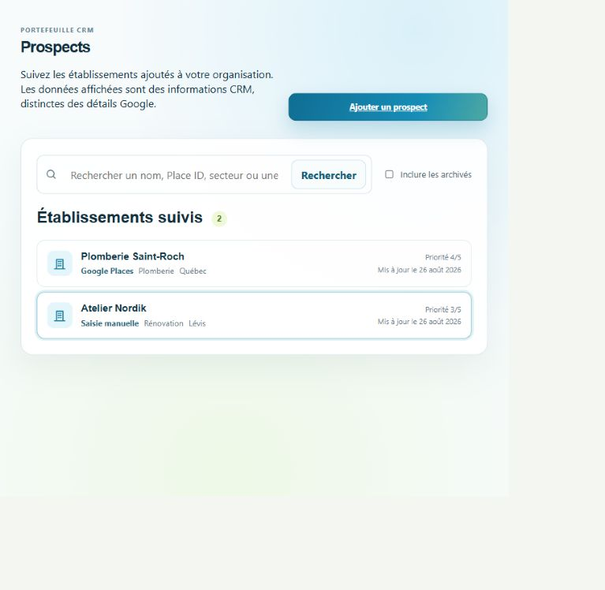
*Figure 3 — Portefeuille des prospects avec les informations CRM utiles au suivi commercial.*

### 4.2 Créer un prospect manuellement

1. dans « Prospects », sélectionnez « Ajouter un prospect » ;
2. saisissez le « Nom interne de l'établissement » ;
3. sélectionnez « Créer le prospect ».

Cette action crée une donnée CRM manuelle et ne copie aucune information depuis Google.

### 4.3 Modifier le profil CRM

Dans la fiche du prospect, la section « Profil CRM » contient :

- le nom interne ;
- le secteur ;
- la ville CRM ;
- une priorité de 0 à 5 ;
- des étiquettes séparées par des virgules.

Modifiez les champs puis sélectionnez « Enregistrer le profil ». Si votre rôle est en lecture seule, le formulaire est remplacé par un message d'information.

Pour un prospect Google, la fiche affiche aussi le `place_id`. Cette référence est non modifiable. Modifier le nom interne ne modifie ni le `place_id`, ni les données temporaires affichées par Google.

### 4.4 Ajouter une personne de contact

1. ouvrez la fiche du prospect ;
2. dans « Contacts », saisissez le nom de la personne ;
3. sélectionnez « Ajouter ».

La personne est enregistrée comme donnée saisie manuellement pour le suivi commercial.

### 4.5 Ajouter un canal de contact

1. dans « Canaux et permissions », choisissez si le canal appartient à l'établissement ou à une personne ;
2. choisissez le type : courriel, téléphone, LinkedIn, Facebook ou autre ;
3. saisissez la valeur ;
4. sélectionnez « Ajouter ».

Tout nouveau canal est créé avec l'état « Permission non déterminée ». Ne contactez pas la personne tant que la base autorisant le contact n'a pas été vérifiée.

### 4.6 Gérer la permission de contact

Les états possibles sont :

| État | Signification | Conduite à tenir |
|---|---|---|
| Permission non déterminée | La permission n'a pas été établie | Ne pas contacter avant vérification |
| Contact autorisé | Une base et une provenance valides ont été enregistrées | Contact possible dans la finalité prévue |
| Ne pas contacter | Une restriction manuelle s'applique | Aucun contact |
| Opposition enregistrée | La personne s'est opposée au contact | Aucun contact ; conserver la trace |

Les gestionnaires et administrateurs peuvent autoriser un canal lorsqu'une provenance compatible existe. Les commerciaux peuvent enregistrer une restriction ou une opposition, mais ne peuvent pas transformer seuls un état inconnu en « Contact autorisé ».

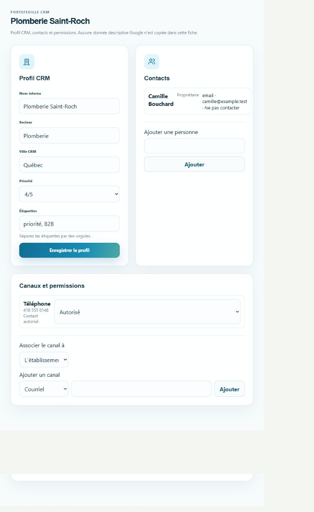
*Figure 4 — Fiche prospect : profil CRM, contacts, canaux et état de permission. Les données affichées sont fictives.*

### 4.7 Consigner une activité commerciale

La section « Chronologie commerciale » de la fiche prospect conserve les faits utiles au suivi. Elle est distincte du « Journal d'activité », qui reste un audit technique. Une activité n'envoie aucun courriel, ne lance aucun appel et ne modifie jamais la permission d'un canal.

1. ouvrez la fiche du prospect, puis « Ajouter une activité » ;
2. choisissez le type : note interne, appel déclaré, courriel déclaré ou réunion déclarée ;
3. pour un appel ou un courriel, choisissez le sens de l'échange et, si utile, le canal correspondant ;
4. indiquez la date et l'heure réelles, un résumé, puis des détails internes facultatifs ;
5. sélectionnez « Enregistrer l'activité ».

Un avertissement s'affiche si le canal choisi est restreint ou si sa permission est non déterminée. Il signale qu'il faut vérifier la permission avant tout contact réel ; l'inscription d'un fait passé ne constitue ni une autorisation ni une action de contact.

### 4.8 Corriger une activité

Une activité déjà inscrite ne se modifie pas directement. Ouvrez « Corriger », ajustez le résumé, les détails ou la date, indiquez le motif de la correction puis enregistrez. La saisie initiale demeure dans la chronologie et la nouvelle entrée porte sa correction. Un commercial corrige ses propres saisies ; un gestionnaire ou un administrateur peut corriger les saisies de l'organisation.

## 5. Suivre le pipeline commercial

Ouvrez « Pipeline ». Cette vue classe les prospects actifs par étape commerciale ; elle ne contient pas les prospects archivés et ne remplace ni les permissions de contact ni les données de provenance.

Les étapes initiales sont : Nouveau, Qualification en cours, Qualifié, Contact établi, Opportunité détectée, Proposition envoyée, Négociation, Gagné et Perdu. Utilisez le champ « Filtrer » pour rechercher un nom interne, un secteur ou une ville CRM.

### 5.1 Faire progresser un prospect

1. repérez la carte du prospect dans sa colonne ;
2. utilisez le bouton vers l'étape précédente ou suivante ;
3. attendez le rechargement de la colonne avant une nouvelle action.

Un déplacement est contrôlé par la version courante du prospect. Si un autre membre a modifié le même prospect, rechargez le pipeline, vérifiez l'étape affichée puis recommencez seulement si le déplacement reste pertinent.

### 5.2 Marquer un prospect comme perdu ou le réouvrir

Depuis une étape non terminale, sélectionnez « Marquer perdu », puis choisissez le motif commercial. Si vous sélectionnez « Autre motif », précisez la raison avant de confirmer.

Les étapes « Gagné » et « Perdu » sont terminales. Un gestionnaire ou un administrateur peut sélectionner « Réouvrir », choisir un motif et confirmer la reprise du suivi. Un commercial peut consulter ces étapes mais ne peut pas les réouvrir.

> Important : le passage à une étape ne crée pas d'appel, de courriel, de tâche ou de permission de contact. Consignez séparément les activités déjà réalisées.

### 5.3 Gérer les tâches et rappels

Sur la fiche d’un prospect, ouvrez « Tâches et prochaine action » pour planifier une tâche. Saisissez un titre, une
échéance et, si utile, un rappel interne. Les heures sont affichées dans le fuseau horaire de l’organisation ; elles ne
déclenchent aucun courriel, appel ou notification externe.

Ouvrez « Mes tâches » pour consulter vos tâches ouvertes et les rappels dus. Vous pouvez terminer une tâche, l’annuler
en indiquant un motif, la rouvrir avec un motif, accuser un rappel ou le reporter. Le report est limité à sept jours. Une
tâche en retard reste visible jusqu’à sa finalisation. Si l’application indique que le responsable est désactivé, contactez
un gestionnaire pour décider de la suite : aucune réaffectation n’est faite automatiquement.

La « prochaine action » affichée sur la fiche, dans la liste des prospects et sur une carte Kanban est calculée à partir
de la première tâche ouverte. Elle ne modifie jamais l’étape commerciale du prospect.

### 5.4 Comprendre une opportunité

Une opportunité représente une affaire commerciale interne liée à un prospect. Elle possède son propre nom, son montant, sa devise, sa probabilité, son échéance, son responsable et son étape. La valeur pondérée correspond au montant multiplié par la probabilité. Une opportunité ne crée ni facture, ni client, ni permission de contact, ni tâche ou notification.

Les étapes sont : Découverte, Qualification, Proposition, Négociation, Gagnée et Perdue. Elles sont indépendantes de l'étape Kanban du prospect. Les montants sont conservés tels qu'ils ont été saisis : Marketteo n'effectue aucune conversion de devise.

### 5.5 Consulter le portefeuille des opportunités

Ouvrez « Opportunités » dans le menu. Le portefeuille présente les affaires auxquelles votre rôle donne accès, avec leur étape, leur montant, leur valeur pondérée, leur échéance et l'indication « En retard » lorsqu'elle s'applique.

1. saisissez un nom d'opportunité ou de prospect dans la zone de recherche ;
2. filtrez au besoin par étape, par code de devise ou par retard ;
3. sélectionnez « Filtrer » ;
4. consultez les totaux et valeurs pondérées, regroupés séparément par devise ;
5. sélectionnez « Voir le prospect » pour ouvrir la fiche associée ;
6. utilisez « Charger plus » lorsqu'une page suivante est disponible.

Ne calculez jamais un total général en additionnant des montants CAD, USD ou exprimés dans d'autres devises. L'état « En retard » ne change pas automatiquement l'étape et ne crée aucun rappel.

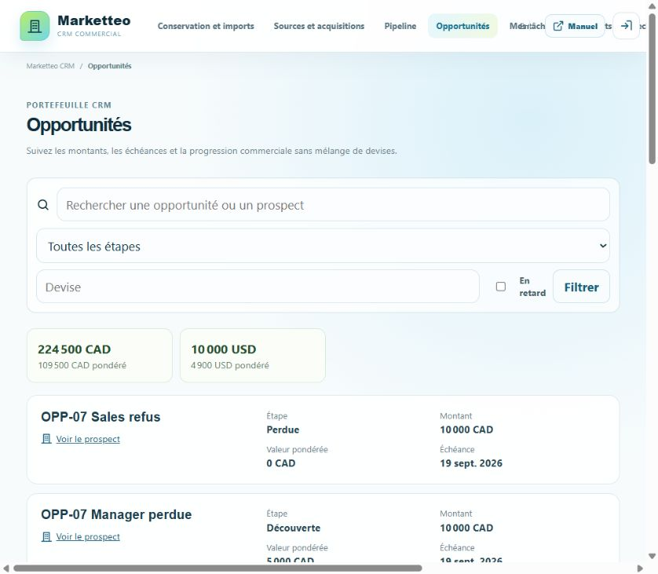
*Figure 5 — Portefeuille des opportunités : recherche, filtres, totaux distincts par devise et principales données commerciales.*

### 5.6 Créer une opportunité

Ouvrez la fiche d'un prospect, puis la section « Opportunités ».

1. saisissez un nom explicite, d'au plus 160 caractères ;
2. saisissez un montant supérieur à zéro, avec au plus quatre décimales ;
3. vérifiez le code de devise ISO à trois lettres, proposé à `CAD` ;
4. saisissez une probabilité entière de 0 à 100 ;
5. choisissez une échéance égale ou postérieure à la date courante de l'organisation ;
6. sélectionnez « Créer l'opportunité ».

L'opportunité est attribuée au membre qui la crée. Un commercial ne voit et ne modifie que ses propres opportunités ; un gestionnaire ou un administrateur peut gérer celles de toute l'organisation. La création est refusée lorsque le prospect est archivé ou lorsque son étape Kanban est déjà Gagné ou Perdu. Réouvrez d'abord le prospect si le suivi doit reprendre.

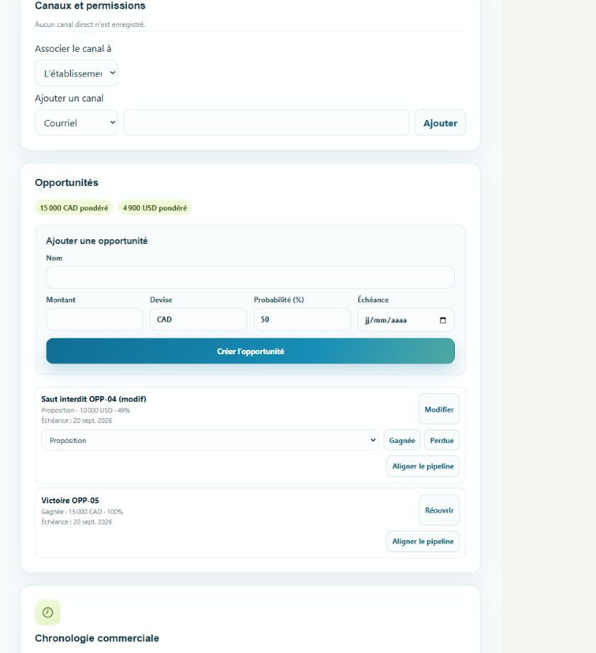
*Figure 6 — Fiche prospect : création, valeurs pondérées par devise, étapes ouvertes, clôture, réouverture et alignement explicite du pipeline.*

### 5.7 Modifier une opportunité ou son responsable

Sur une opportunité ouverte, sélectionnez « Modifier ». Vous pouvez ajuster le nom, le montant, la devise, la probabilité, l'échéance et, selon votre rôle, le responsable.

Si vous changez de devise, vérifiez d'abord que le montant saisi est bien exprimé dans la nouvelle devise, puis cochez « J'ai confirmé le montant dans la nouvelle devise ». Marketteo conserve le nombre saisi sans conversion automatique.

Le responsable choisi doit être un membre actif. Lorsqu'un responsable est désactivé, l'opportunité reste lisible mais ses actions commerciales sont bloquées. Un gestionnaire ou un administrateur doit alors sélectionner « Réaffecter le responsable » et choisir un membre actif ; seule cette réaffectation est permise tant qu'elle n'est pas terminée.

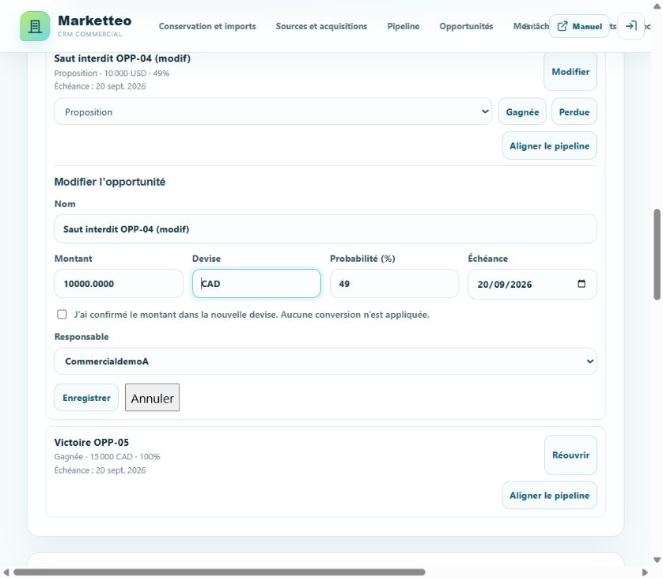
*Figure 7 — Modification d'une opportunité : montant, devise, probabilité, échéance, confirmation sans conversion et responsable actif.*

### 5.8 Faire progresser ou conclure une opportunité

Pour une opportunité ouverte, le sélecteur d'étape propose uniquement l'étape voisine précédente ou suivante. Un saut direct est refusé.

- « Gagnée » est disponible depuis Proposition ou Négociation. La probabilité devient 100 % et l'affaire passe en lecture seule.
- « Perdue » est disponible depuis toute étape ouverte. Choisissez un motif dans la liste ; « Autre motif » exige une précision. La probabilité devient 0 % et l'affaire passe en lecture seule.
- « Réouvrir » est réservé aux gestionnaires et administrateurs. Un motif est obligatoire. L'affaire revient à une étape ouverte et la probabilité proposée est 50 %.

Un commercial peut conclure ses propres affaires, mais ne peut ni les réouvrir ni les réaffecter. La clôture d'une opportunité ne crée aucun client, document de vente ou automatisation.

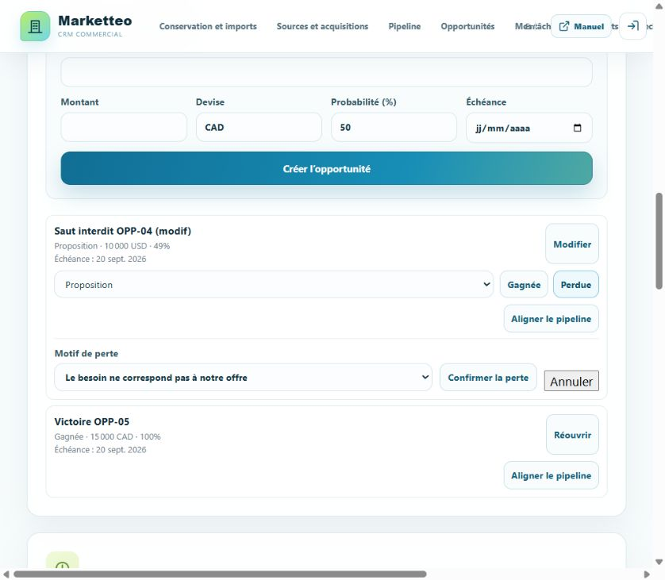
*Figure 8 — Cycle de vie : motif de perte, confirmation, affaire gagnée en lecture seule et action de réouverture selon le rôle.*

### 5.9 Aligner explicitement le pipeline du prospect

L'étape de l'opportunité et celle du prospect restent indépendantes. Lorsque « Aligner le pipeline » apparaît :

1. sélectionnez l'action ;
2. comparez l'étape actuelle du prospect et l'étape suggérée par l'opportunité ;
3. confirmez seulement si la transition Kanban proposée est pertinente et voisine ;
4. si l'interface refuse le saut, fermez le message et déplacez le prospect étape par étape dans « Pipeline ».

Fermer ou déplacer une opportunité ne modifie jamais silencieusement le Kanban. L'alignement constitue une seconde intention explicite.

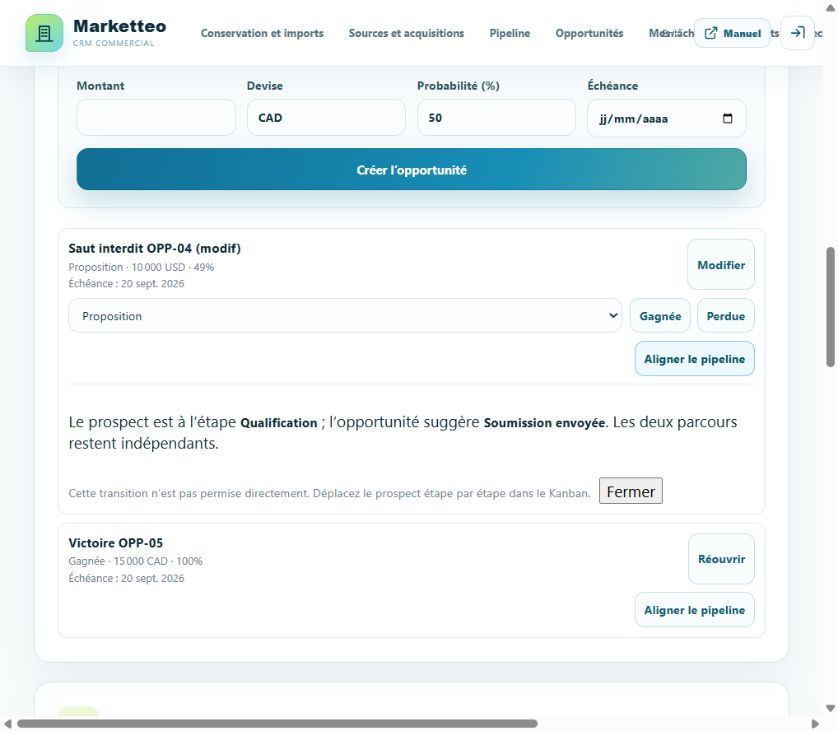
*Figure 9 — Alignement du pipeline : les deux parcours restent indépendants et un saut Kanban interdit doit être effectué étape par étape.*

### 5.10 Lire l'historique et résoudre un conflit

La « Chronologie commerciale » de la fiche rassemble les événements « Opportunité créée », « Opportunité modifiée », « Étape de l'opportunité modifiée » et « Opportunité réouverte ». Les changements d'étape affichent le passage effectué et l'heure de l'organisation.

Chaque modification vérifie la version de l'opportunité. Si une autre fenêtre ou un autre membre a enregistré un changement entre-temps, le message « L'opportunité a changé depuis sa lecture. » s'affiche. Rechargez la fiche, examinez les nouvelles valeurs, puis réappliquez uniquement les changements encore nécessaires. Ne renvoyez pas aveuglément l'ancienne saisie.

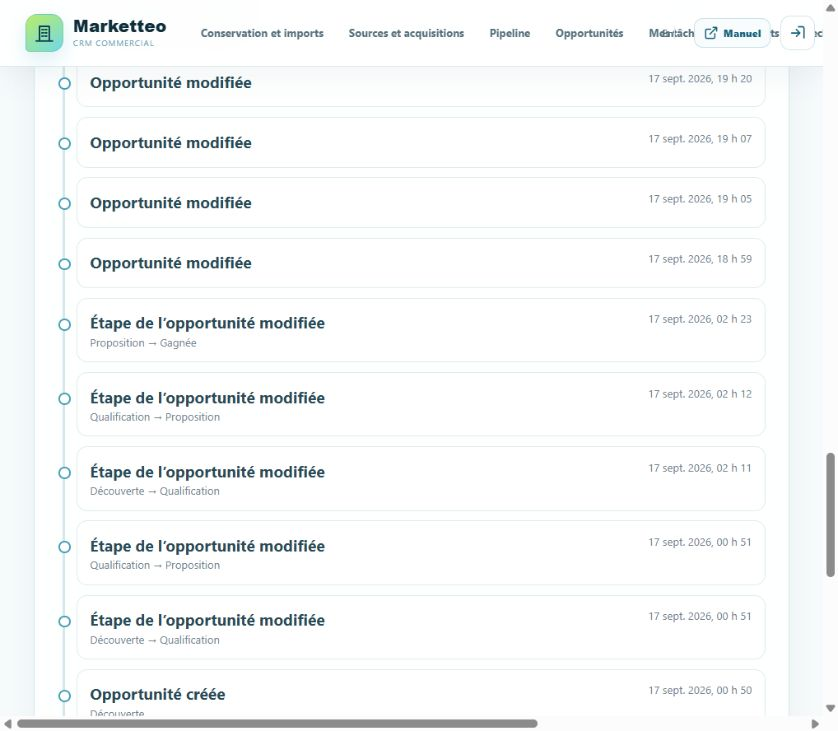
*Figure 10 — Chronologie commerciale : créations, modifications et changements d'étape des opportunités, avec date et heure.*

## 6. Documenter les sources et acquisitions

Ouvrez « Sources et acquisitions ». Une acquisition approuvée documente la provenance des données, mais ne crée jamais automatiquement une permission de contact.

### 6.1 Cycle d'un fournisseur

Cette procédure est réservée à l'administrateur.

1. dans l'onglet « Fournisseurs », sélectionnez un type de source et saisissez le nom du fournisseur ;
2. sélectionnez « Créer le brouillon » ;
3. ouvrez « Modifier » ;
4. renseignez la référence contractuelle, l'URL des conditions, les dates de validité et les territoires ;
5. sélectionnez les finalités et catégories de données autorisées ;
6. cochez l'attestation de droits lorsque la vérification est terminée ;
7. choisissez l'état approprié et enregistrez.

N'activez pas un fournisseur dont les droits, dates, territoires ou catégories ne sont pas confirmés.

### 6.2 Déclarer une acquisition

Cette action est accessible au gestionnaire et à l'administrateur lorsqu'un fournisseur actif et compatible existe.

1. ouvrez l'onglet « Acquisitions » ;
2. choisissez le fournisseur et le type de source ;
3. saisissez un libellé clair, le territoire, la finalité et la date d'obtention ;
4. ajoutez une référence externe si disponible ;
5. cochez les catégories de données réellement obtenues ;
6. sélectionnez « Déclarer l'acquisition ».

L'administrateur peut ensuite approuver ou rejeter une acquisition en attente. Une déclaration rejetée reste visible dans l'historique d'audit et ne peut pas servir de provenance.

## 7. Conservation et déclarations d'import

Ouvrez « Conservation et imports ». Les archivages sont logiques : ils ne suppriment pas physiquement les données.

### 7.1 Consulter ou créer une politique

L'onglet « Politiques » présente la ressource, le délai de revue, l'état et la version.

Pour un administrateur :

1. choisissez le type de ressource ;
2. saisissez un code, un libellé et le nombre de jours avant revue ;
3. ajoutez un délai d'archivage si nécessaire ;
4. sélectionnez « Créer » ;
5. vérifiez le brouillon puis sélectionnez « Activer ».

### 7.2 Utiliser un hold

Un hold protège une ressource contre le traitement normal de conservation, par exemple pendant une demande légale ou une revue qualité.

1. ouvrez « Holds et revues » ;
2. choisissez le type de ressource et saisissez son identifiant exact ;
3. choisissez le motif et ajoutez une note utile ;
4. sélectionnez « Ajouter ».

Un gestionnaire ou administrateur autorisé peut créer un hold. Seul un rôle disposant de la capacité de libération peut sélectionner « Lever ». Ces actions sont journalisées.

### 7.3 Déclarer un import CSV

1. ouvrez « Déclarations d'import » ;
2. choisissez une acquisition approuvée ;
3. saisissez un libellé et, si connu, le volume estimé ;
4. cochez les champs et catégories réellement présents ;
5. sélectionnez « Déclarer sans téléverser ».

La déclaration ne téléverse aucun fichier. Elle peut être annulée ou archivée selon votre rôle.

### 7.4 Importer un CSV déclaré

Après avoir créé une déclaration CSV liée à une acquisition approuvée :

1. ouvrez « Déclarations d’import » ;
2. choisissez la déclaration et un fichier CSV UTF-8 de 10 Mio ou moins ;
3. consultez l’aperçu temporaire, puis associez chaque colonne utile à un champ CRM ;
4. sélectionnez « Enregistrer le mapping », puis « Valider le fichier » ;
5. vérifiez les compteurs de créations, doublons exacts et lignes en quarantaine ;
6. sélectionnez « Confirmer l’import ».

Les lignes valides créent des données CRM avec leur provenance. Les canaux reçoivent toujours la permission « non déterminée » : un import n’autorise jamais à contacter une personne. Les doublons exacts sont ignorés. Le rapport n’affiche que les numéros de lignes, les codes de motifs et une référence opaque ; il ne restitue aucune valeur brute du fichier. Le fichier source reste privé et temporaire, puis est supprimé après confirmation ou au plus tard dans les 24 heures.

## 8. Piloter l'activité avec le tableau de bord

Ouvrez « Tableau de bord ». Les indicateurs sont calculés côté serveur pour l'organisation active et respectent votre périmètre d'accès. Un Commercial voit « Mes données » ; un Gestionnaire ou un Administrateur peut choisir « Organisation » ou un « Commercial » actif ou désactivé.

### 8.1 Choisir le périmètre et la période

1. choisissez « Mes données », « Organisation » ou « Commercial » lorsque ces options sont proposées ;
2. choisissez « Aujourd'hui », « Cette semaine », « Ce mois » ou « Dates personnalisées » ;
3. pour une période personnalisée, saisissez une plage locale de 93 jours civils au maximum ;
4. sélectionnez « Afficher », puis « Actualiser » après une mutation récente.

Le fuseau affiché est celui de l'organisation active. Les dates du calendrier sont inclusives et les événements sont arrêtés à l'instant de lecture (`as_of`). Une période de flux en cours indique « Observé jusqu'au » ; elle ne compte pas d'événements futurs.

### 8.2 Lire les indicateurs

Le tableau de bord sépare les photographies actuelles des flux de période :

- les prospects actifs par étape, les tâches dues ou en retard et les opportunités ouvertes, gagnées ou perdues sont des photographies ;
- les activités par type, le passage direct entre étapes et les pertes directes décrivent la période choisie ;
- le montant ouvert et la valeur pondérée sont regroupés par devise : aucune conversion n'est appliquée ;
- « Ventilation par responsable » n'est disponible que dans une portée organisationnelle autorisée ; les éléments sans responsable restent dans une ligne « Non assigné » ;
- « Usage Google » peut afficher « Compteur indisponible » : une réservation de quota n'est jamais présentée comme une facturation.

La ventilation historique des passages utilise le responsable actuel du prospect. Une réaffectation peut donc modifier cette ventilation sans modifier l'événement historique.

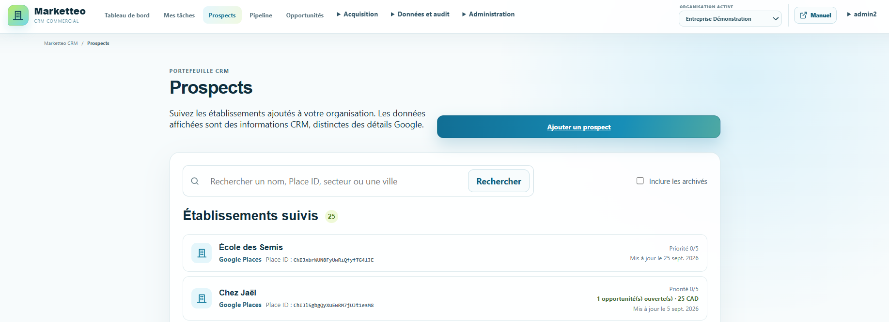
*Figure 13 — Portefeuille CRM dans l'interface phase 4, avec accès direct au tableau de bord et aux catégories de navigation.*

## 9. Consulter les quotas et rapports d'usage

Ouvrez « Données et audit », puis « Quotas et usage ». Cette page décrit la consommation technique observée ; elle ne constitue pas une facture.

### 9.1 Vérifier le quota courant

La carte de quota indique la fenêtre UTC, la limite et le niveau d'avertissement. Pour la recherche Google, la limite opérationnelle reste de 20 réservations par utilisateur et 100 par organisation et par jour UTC, avec avertissement à 80 %. Une limite atteinte bloque la recherche avant l'appel fournisseur.

### 9.2 Lire un rapport historique

1. choisissez une période d'au plus 93 jours ;
2. sélectionnez « Mes données », « Organisation » ou un membre si votre capacité l'autorise ;
3. appliquez les filtres puis lisez la série journalière et la ventilation par membre ;
4. vérifiez l'indication « période partielle » pour une période non terminée.

Le rapport distingue Text Search, Autocomplete, Details, Static Maps, exports, imports et les cinq événements du connecteur Meta. Il ne montre ni requête Google, ni réponse fournisseur, ni contenu CSV, ni référence personnelle brute.

## 10. Importer et exporter des données CRM

### 10.1 Suivre un import et sa quarantaine

Dans « Conservation et imports », déclarez l'import lié à une acquisition approuvée, téléversez un CSV UTF-8 de 10 Mio ou moins, mappez les colonnes, validez puis confirmez. Le traitement peut être exécuté par le worker ; l'interface affiche l'attente, l'échec ou l'état final.

Ouvrez ensuite « Historique des imports » pour consulter les sessions et les runs. Une fiche affiche uniquement les compteurs de créations, doublons et lignes en quarantaine. Les lignes de quarantaine sont identifiées par numéro, codes de motifs et référence opaque ; les valeurs brutes du fichier ne sont jamais restituées. Une relance crée un nouveau fichier et un nouveau lot après revérification de la source et des droits.

### 10.2 Demander un export CSV

1. ouvrez « Exports » ;
2. choisissez l'un des jeux CRM proposés et les colonnes autorisées dans l'ordre canonique ;
3. choisissez votre périmètre, appliquez les filtres bornés puis lancez l'export ;
4. attendez la fin du traitement et téléchargez le fichier depuis la liste des exports.

Les exports sont limités à 50 000 lignes ou 50 Mio par fichier, avec au plus cinq demandes actives. Le fichier est privé, authentifié, conservé 24 heures puis purgé. Les colonnes provenant d'une source sans règle de provenance valide sont omises ; les formules de tableur sont neutralisées. Les résultats Google temporaires et leurs contenus directs ne sont jamais exportables.

## 11. Gérer les fournisseurs, acquisitions et connexions

Ouvrez « Acquisition », puis « Sources et acquisitions ». Une provenance approuvée n'autorise jamais à contacter une personne.

### 11.1 Déclarer un fournisseur et une acquisition

Un Administrateur crée un fournisseur en brouillon, renseigne les conditions, territoires, finalités, catégories et atteste les droits, puis l'active. Un Gestionnaire ou un Administrateur peut déclarer une acquisition à partir d'un fournisseur actif ; l'Administrateur chargé de la revue l'approuve ou la rejette séparément.

### 11.2 Utiliser l'onglet « Connexions »

L'onglet « Connexions » est réservé à la configuration des intégrations autorisées. Un contrat Meta Lead Ads suit le cycle « Brouillon » → « Soumis » → revue par un autre Administrateur → « Actif ». L'auteur ne peut pas approuver sa propre soumission. Un arrêt d'urgence désactive le binding et bloque les nouveaux webhooks.

### 11.3 Pilote Meta Lead Ads

Le webhook doit présenter un challenge valide et une signature `X-Hub-Signature-256`. Marketteo admet le message de façon idempotente, le traite par le worker puis extrait uniquement `full_name`, `email` et `phone` selon le mapping déclaré. Les champs non autorisés, les oppositions existantes et les permissions de contact sont respectés ; un canal créé par ingestion reste « Permission non déterminée » tant qu'aucune base compatible n'est enregistrée.

Le corps Meta n'est pas conservé. La référence de lead est chiffrée puis détruite après 30 jours. Les audits et rapports d'usage ne conservent que des métadonnées minimisées. L'activation Meta réelle reste bloquée tant qu'une revue et une autorisation externe n'ont pas été produites : le pilote interne et l'activation fournisseur sont deux décisions distinctes.

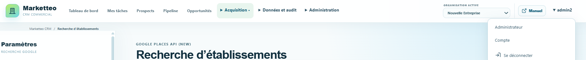
*Figure 14 — Navigation desktop phase 4, catégories regroupées et menu utilisateur séparé.*

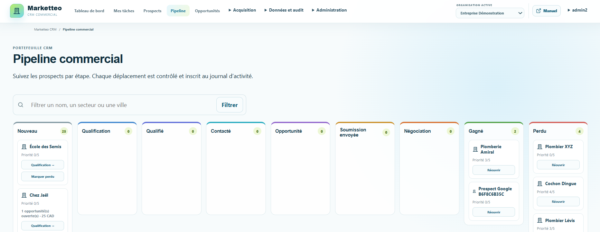
*Figure 15 — Pipeline commercial avec les étapes, compteurs et actions de réouverture.*

## 12. Préparer l'automatisation (Pré-Phase 5)

La Pré-Phase 5 ajoute une surface Automatisation au CRM sans créer un second CRM. Elle prépare et explique des actions contrôlées ; elle ne décide pas à la place d'un humain et ne communique pas avec un contact externe.

> **État produit au 6 octobre 2026.** La Porte 4 est clôturée avec un **GO avec réserves**. La tranche `P4-Lite` peut être préparée avec des données synthétiques, un faux fournisseur IA et des flags désactivés par défaut. Cette édition décrit les écrans livrés et leurs limites ; elle ne vaut pas autorisation d'activation, de staging ou de production.

### 12.1 Ouvrir « Aujourd'hui »

Dans le menu « Automatisation », sélectionnez « Aujourd'hui » (`/app/automation/today`). L'écran affiche l'identifiant `IMP-A5`, un champ « Votre demande » limité à 500 caractères et trois suggestions guidées :

1. « Cadrer mes prospects ouverts » ;
2. « Étudier un rééquilibrage » ;
3. « Préparer le suivi des nouveaux prospects ».

Décrivez un besoin de lecture ou sélectionnez une suggestion, puis choisissez « Préparer un plan ». Le résultat attendu est un plan explicable, temporaire et en lecture seule. Dans l'environnement où les flags sont désactivés, l'application affiche « L'assistant est désactivé. » et n'exécute aucun effet CRM ou externe. Une erreur d'API doit rester lisible et ne doit jamais être interprétée comme un plan validé.

### 12.2 Examiner les « Playbooks »

L'onglet « Playbooks » présente les trois parcours cadrés par la Pré-Phase 5 : « Nouveau prospect », « Proposition en attente » et « Occasion oubliée ». Chaque carte indique si un Prévol est requis et si une configuration active existe.

- Sans configuration active, l'écran indique que le Prévol et l'activation ne sont pas disponibles ; aucun compteur ou bouton d'activation fictif ne doit être déduit.
- Si une organisation pilote est explicitement autorisée, un administrateur peut préparer un Prévol, activer le mode « préparer » ou suspendre un Playbook selon les capacités et la garde de version.
- Même dans ce mode, Marketteo n'envoie pas de courriel, SMS ou message social, ne réattribue pas automatiquement une fiche, ne fusionne pas de doublon et ne déplace pas silencieusement le pipeline.

### 12.3 Traiter les « Entrées et exceptions »

La page « Entrées et exceptions » regroupe les cas qui demandent une décision humaine. Les états suivis sont « Ouverte », « En traitement », « À vérifier », « Résolue » et « Abandonnée ».

Prenez en charge une entrée, vérifiez le contexte et utilisez uniquement un motif fermé proposé par l'interface pour la résoudre ou l'abandonner. Une exception `effect_uncertain` doit rester en vérification : il n'y a ni nouvelle tentative aveugle, ni réattribution, ni second effet CRM automatique. Si aucune entrée n'est disponible, l'état vide « Aucune entrée ou exception à traiter » est normal et distinct d'une erreur de chargement.

### 12.4 Limites, rôles et retour arrière

L'accès dépend de la capacité `automation:plan:create` et de l'organisation active. Les règles d'arrêt sont prioritaires : `AUTOMATION_ENABLED=false` et `AUTOMATION_ROLLOUT_MODE=off` restent les valeurs de référence en préproduction et en production. Toute suspension ou reprise doit être versionnée et auditée ; la reprise impose un nouveau Prévol frais.

La version actuelle autorise le faux fournisseur déterministe, la minimisation des preuves, les fixtures synthétiques, l'idempotence et le rollback local. Elle n'autorise pas l'appel OpenAI réel, la persistance de phrases libres, les connecteurs sociaux, les brouillons envoyables, l'envoi externe, la réattribution automatique ou l'activation générale pour une organisation cliente. Les réserves de contrat, quotas, rétention, capacité, environnement isolé et preuve Azure restent ouvertes.

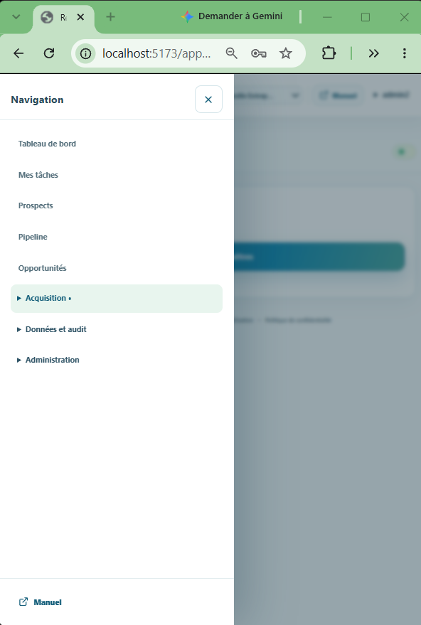
*Figure 16 — Capture récente de la navigation mobile : le panneau « Acquisition », « Données et audit » et « Administration » reste regroupé ; le lien « Manuel » est disponible en bas du panneau.*

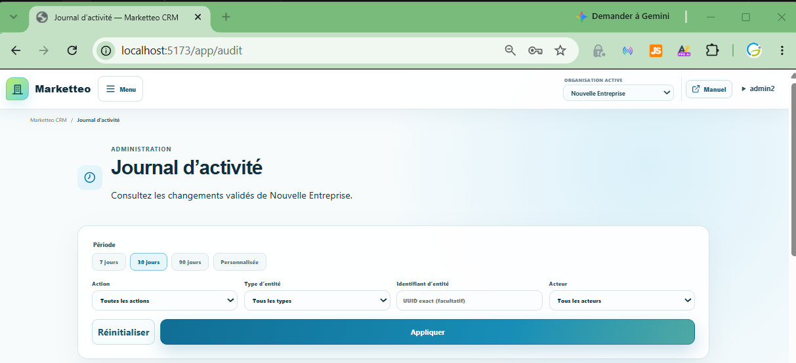
*Figure 17 — Capture récente du journal d'activité : période, action, type d'entité, identifiant exact et acteur sont filtrables pour contrôler les opérations sensibles.*

## 13. Administrer une organisation

### 13.1 Consulter ou modifier l'organisation

Ouvrez « Organisation » pour consulter le nom, la langue, le fuseau horaire, l'état et la date de création. L'administrateur peut modifier le nom, la langue et le fuseau horaire IANA, puis enregistrer.

Si l'écran signale « Une version plus récente existe », rechargez les données avant de reprendre vos changements. Ce contrôle évite d'écraser la modification d'un autre utilisateur.

### 13.2 Gérer les membres

Ouvrez « Membres », puis l'onglet « Membres ».

- Le gestionnaire peut consulter la liste.
- L'administrateur peut sélectionner « Modifier », changer le rôle ou l'état et confirmer l'action sensible.
- Le dernier administrateur actif de l'organisation ne peut pas être désactivé ou rétrogradé sans remplacement.

### 13.3 Inviter une personne

Dans l'onglet « Invitations » :

1. saisissez l'adresse courriel ;
2. choisissez le rôle proposé ;
3. envoyez l'invitation ;
4. vérifiez son état et sa date d'expiration dans la liste.

L'administrateur peut renvoyer ou révoquer une invitation lorsqu'une action est proposée. Un renvoi invalide l'ancien lien. Aucun jeton d'invitation n'est affiché dans le navigateur.

### 13.4 Consulter le journal d'activité

Ouvrez « Journal d'activité ». Vous pouvez filtrer par période, action, type d'entité, identifiant exact et acteur.

1. renseignez les filtres utiles ;
2. sélectionnez « Appliquer » ;
3. ouvrez un événement pour consulter ses détails ;
4. utilisez « Afficher davantage » si une page suivante existe ;
5. sélectionnez « Réinitialiser » pour effacer les filtres.

Le journal présente les changements validés de l'organisation active. Il ne remplace pas une sauvegarde et n'autorise pas la modification des événements.

*Figure 18 — Journal d'activité avec période, action, type d'entité, identifiant et acteur filtrables.*

## 14. Mon compte et session

Ouvrez « Compte » ou sélectionnez votre nom dans l'en-tête pour consulter :

- votre nom affiché et votre adresse courriel ;
- votre rôle de plateforme, le cas échéant ;
- vos organisations et votre rôle dans chacune ;
- l'organisation actuellement active.

Sélectionnez « Se déconnecter » lorsque vous avez terminé, particulièrement sur un appareil partagé. Les informations de session ne sont pas enregistrées dans le stockage du navigateur.

## 15. Administration de la plateforme

Cette section s'adresse uniquement aux administrateurs de plateforme.

### 15.1 Provisionner une organisation

1. ouvrez « Plateforme » ;
2. saisissez le nom de l'organisation, la langue et le fuseau horaire IANA ;
3. saisissez le courriel de l'administrateur initial ;
4. lancez le provisionnement ;
5. vérifiez l'organisation et l'état de la première invitation dans la liste.

L'administrateur initial reçoit un lien à usage unique. Si une intention de renvoi reste bloquée, utilisez « Abandonner l'intention » seulement après avoir vérifié l'état affiché.

Selon les actions disponibles, un administrateur de plateforme peut renvoyer ou révoquer l'invitation initiale, suspendre une organisation ou la réactiver. Chaque opération sensible demande une justification ou une confirmation et est auditée.

### 15.2 Consulter l'audit plateforme

Ouvrez « Audit plateforme ». Utilisez les filtres de période, action, type d'entité, identifiant et acteur comme dans le journal d'une organisation. L'audit plateforme reste séparé des données propres aux organisations et s'affiche en UTC.

## 16. Dépannage de premier niveau

### Une page n'apparaît pas dans le menu

Votre rôle ne possède probablement pas la capacité requise, ou aucune organisation active n'est sélectionnée. Vérifiez « Mon compte » et l'organisation active, puis contactez un administrateur.

### « Accès refusé » s'affiche

Revenez à l'accueil proposé. Si l'accès est nécessaire à votre travail, demandez à un administrateur de vérifier votre rôle ; n'utilisez pas l'adresse directe d'une page pour contourner les droits.

### La recherche Google indique « Clé API absente »

Le service doit être configuré côté serveur avec la clé Google Maps. Signalez le message à l'équipe qui exploite Marketteo CRM ; aucun réglage utilisateur ne peut le corriger.

### La limite quotidienne de recherches Google est atteinte

Marketteo a bloqué la recherche avant l'appel Google afin de protéger le budget de l'organisation. Attendez la remise à zéro indiquée par l'application. Modifier le terme, le rayon ou actualiser la page ne contourne pas cette limite. Les limites actuelles sont opérationnelles et peuvent évoluer avant la commercialisation des forfaits.

### La recherche ou la carte indique que la protection est temporairement indisponible

Réessayez après quelques instants. Marketteo ne lance pas la recherche ou la carte tant que sa protection temporaire ne
peut pas être garantie ; évitez donc de cliquer plusieurs fois. Si le message persiste, transmettez l'heure approximative
de l'incident à l'équipe qui exploite l'application. Aucun réglage de navigateur n'est nécessaire.

### La carte n'est pas disponible

Les résultats textuels peuvent rester utilisables. Réessayez, puis signalez l'erreur si elle persiste. N'interprétez pas une carte absente comme une absence de résultats.

### Une modification signale une version plus récente

Rechargez la ressource avant de recommencer. Comparez les nouvelles valeurs et réappliquez seulement les changements encore nécessaires.

### Une invitation ne fonctionne plus

Vérifiez que le lien est complet et que le compte connecté correspond à l'adresse invitée. Demandez ensuite à un administrateur de renvoyer une invitation si elle est expirée ou révoquée.

### Un canal reste « Permission non déterminée »

C'est l'état normal après sa création. Un gestionnaire ou administrateur doit vérifier une provenance compatible avant de l'autoriser. En cas d'opposition ou de doute, choisissez l'état restrictif approprié.

### Un déplacement du pipeline est refusé

Vérifiez que le prospect n'est pas archivé, que l'étape cible est proposée par l'application et que votre rôle permet l'action. En cas de conflit de version, rechargez le pipeline avant de décider si le déplacement doit être repris.

### Une opportunité ne peut pas être créée ou modifiée

Vérifiez que le prospect n'est ni archivé ni dans une étape Kanban terminale. Vérifiez ensuite que le responsable est actif et que votre rôle autorise l'action. Si le message signale une version plus récente, rechargez la fiche avant de reprendre. Un commercial ne peut intervenir que sur ses propres opportunités.

### La valeur pondérée ou la devise semble incorrecte

La valeur pondérée est calculée à partir du montant et de la probabilité. Les totaux restent séparés par devise et aucune conversion n'est appliquée. Si la devise a changé, confirmez que le montant était déjà exprimé dans la nouvelle devise ; corrigez-le manuellement au besoin.

### Un export reste en attente ou échoue

Les exports volumineux sont traités par le worker. Actualisez « Exports » après quelques instants et vérifiez l'état du
travail (`queued`, `running`, `succeeded` ou `failed`). Une reprise réussie ne crée qu'un seul fichier. Si l'état reste
bloqué, notez l'identifiant de l'export et l'heure observée, puis transmettez-les à l'administrateur ; ne relancez pas
plusieurs demandes identiques.

### « Usage temporairement indisponible » s'affiche

Le rapport d'usage n'a pas pu réserver ou lire son compteur technique. Il ne s'agit pas d'une facture et aucune recherche
Google ne doit être répétée en boucle. Réessayez après le rétablissement du service ; l'application doit ensuite afficher
à nouveau le quota courant et le mode Google actif.

### La connexion Meta n'est pas activable

Une connexion « Brouillon », « Soumise » ou « Bloquée » peut être normale. Vérifiez que le fournisseur, l'acquisition,
le contrat et la revue interne sont approuvés. Si l'interface indique `BLOCKED_EXTERNAL`, l'autorisation d'un compte Meta
réel ou la revue fournisseur manque encore : seul l'administrateur habilité peut poursuivre après obtention de cette
preuve. N'utilisez pas de jeton personnel et ne tentez pas de contourner l'état affiché.

### Une erreur d'import place des lignes en quarantaine

Ouvrez « Historique des imports » et consultez les numéros de lignes, les codes de motifs et la référence opaque. Les
valeurs brutes ne sont pas restituées. Corrigez le fichier source, vérifiez de nouveau l'acquisition et relancez un lot
distinct ; le rejeu idempotent ne doit pas créer de doublon.

### « L'assistant est désactivé. » s'affiche

C'est le comportement attendu lorsque le flag global ou celui de l'organisation est désactivé. Vérifiez l'organisation
active et demandez à l'administrateur si une tranche pilote est autorisée ; ne tentez pas de contourner le message par une
adresse directe. Aucun plan ni effet CRM n'a été produit.

### Un Playbook indique que le Prévol ou l'activation est indisponible

Une configuration active et un Prévol frais sont nécessaires. L'interface peut donc afficher les trois cartes sans proposer
de commande. Il ne s'agit pas d'un incident et cela ne vaut pas autorisation d'activer une organisation cliente.

### Une entrée d'exception reste « À vérifier »

Conservez l'exception en traitement et vérifiez la corrélation et l'idempotence avec l'administrateur. Ne relancez pas
manuellement un effet incertain et ne créez pas un doublon pour « tester » la reprise ; le retour arrière doit rester
auditable.

## 17. État de sortie de la phase 4

La phase 4.6 a été clôturée localement le 30 septembre 2026 avec un **GO produit**. Cette décision signifie que les
parcours livrés sont utilisables dans l'environnement local et que les réserves de la phase 3.4 transférées à la recette
ont été rejouées. Elle ne constitue pas encore une autorisation de mise en production : le pipeline Azure doit publier
les preuves sur le même commit de clôture avant le démarrage de la phase 5.

### 17.1 Ce que la recette confirme

| Parcours ou contrôle | Résultat utilisateur | Portée |
|---|---|---|
| E2E-01 à E2E-02 | Connexion, changement d'organisation, prospect, activité, tâche, pipeline et opportunité cohérents | Données synthétiques isolées par organisation |
| E2E-03 | Import CSV confirmé, rejeu sans nouvelle création et lignes invalides visibles en quarantaine | Déduplication exacte et motifs minimisés |
| E2E-04 à E2E-05 | Export privé téléchargeable et reprise du worker sans doublon | Fichier allowlisté, temporaire et authentifié |
| E2E-06 à E2E-07 | Compteurs Google agrégés, quota `429` et indisponibilités `503` compréhensibles puis réversibles | Usage technique, jamais facturation |
| E2E-08 à E2E-09 | Pilote Meta simulé admis, rejoué et révoqué de façon idempotente | Aucun appel à Meta réel |
| E2E-10 | Rôles et isolation multi-organisation respectés, y compris RLS PostgreSQL | Aucune lecture ou mutation inter-tenant |
| E2E-11-AUTO et E2E-11-MANUAL | 44 parcours Axe sans violation et quatre contrôles manuels validés | Français/anglais, clavier, zoom 200 %, états vides et erreurs réversibles |
| E2E-12 | Données synthétiques de recette archivées avec compteur final nul | Archivage logique audité |

Le verrou local final est **VERT** : 345 tests backend, 216 tests frontend, 44 parcours navigateur Axe, audit npm sans
vulnérabilité et build Vite réussis sans skip. Les données Google descriptives, les jetons et les fichiers sources ne
sont pas exposés dans les indicateurs, les exports ou les journaux.

### 17.2 Limites à connaître avant la suite

- `META-EXT-01` reste `BLOCKED_EXTERNAL` : la validation avec un compte Meta Lead Ads réel exige une autorisation externe,
  une revue préalable de l'application et un environnement de test autorisé.
- Le rapport d'usage est un compteur technique. Les plans, prix, sièges, taxes, paiements et factures appartiennent au
  cadrage de la phase 5 et ne sont pas disponibles.
- La preuve Azure de la révision de clôture, la préproduction, les essais de charge/coûts, la sauvegarde/restauration
  et le lancement progressif restent des portes de phase 5. Une mention dans une spécification n'est pas une fonction
  accessible dans le produit.
- Pour l'Automatisation, la campagne locale du 5 octobre 2026 confirme le rendu des trois surfaces et le refus sûr
  lorsque les flags sont désactivés ; la préparation d'un plan avec l'organisation de démonstration reste bloquée par la
  garde organisationnelle. Ce résultat ne constitue pas un GO d'activation.

Pour signaler un écart, indiquez l'organisation active, le rôle, l'heure, le parcours concerné et le message affiché.
N'ajoutez jamais de mot de passe, jeton, courriel réel ou contenu de prospect dans un ticket ou une capture.

## 18. Glossaire

**Activité commerciale** : note ou interaction déjà réalisée, inscrite volontairement dans la chronologie du prospect. Elle n'envoie aucun message et ne crée pas de permission.

**Acquisition** : déclaration décrivant comment, quand et pour quelle finalité un ensemble de données a été obtenu.

**Canal de contact** : moyen de joindre un établissement ou une personne, par exemple un courriel, un téléphone ou un profil social.

**Étape commerciale** : position actuelle d'un prospect dans le pipeline, distincte de son archivage et de la permission de contact.

**Opportunité** : affaire commerciale interne liée à un prospect, avec un montant, une devise, une probabilité, une échéance et une étape propre.

**Responsable d'opportunité** : membre actif auquel une affaire est attribuée. Un commercial ne consulte que les affaires dont il est responsable.

**Valeur pondérée** : montant d'une opportunité multiplié par sa probabilité, présenté sans conversion et regroupé par devise.

**Hold** : protection temporaire empêchant l'application normale d'une politique de conservation sur une ressource.

**Organisation active** : espace de données dans lequel l'utilisateur travaille actuellement.

**Permission de contact** : état déterminant si un canal peut être utilisé pour la finalité prévue.

**Provenance** : trace de l'origine d'une donnée et des droits associés.

**Prospect** : établissement suivi dans le portefeuille CRM de l'organisation.

**Résultat Google temporaire** : information affichée pendant une recherche et non conservée comme donnée descriptive dans le CRM.

**Worker** : traitement asynchrone qui exécute une demande longue, enregistre son état et peut reprendre après une interruption.

**Usage technique** : compteur agrégé servant à protéger les services et à suivre leur consommation ; il ne constitue pas une facture.

**Quarantaine** : résultat minimisé d'une ligne d'import refusée, conservant un numéro, un code de motif et une référence opaque sans valeur brute.

**Idempotence** : propriété d'une relance qui conserve le même résultat métier sans créer de doublon.

**Activation externe** : autorisation et revue d'un fournisseur réel, distinctes de la simulation locale du connecteur.

**Automatisation — Aujourd'hui** : surface de préparation d'un plan explicable, temporaire et en lecture seule ; elle ne
crée pas d'objet CRM et ne contacte aucun tiers.

**Feu relationnel** : décision déterministe qui classe une action selon les permissions, oppositions, limites et données
connues ; une information inconnue ou contradictoire ne devient jamais un feu vert implicite.

**P4-Lite** : tranche de Pré-Phase 5 limitée aux fixtures synthétiques, au faux fournisseur, aux garde-fous et au
rollback local ; les flags sont désactivés par défaut.

**Prévol** : vérification versionnée et fraîche d'un Playbook avant toute préparation ou activation autorisée.

**Playbook** : parcours métier borné, versionné et suspendable ; il ne s'agit pas d'un constructeur libre de workflows.

**Exception** : cas nécessitant une décision humaine (par exemple responsable indisponible ou effet incertain), avec état,
motif fermé, audit et idempotence.

## 19. Historique du document

| Version | Date | État | Résumé |
|---|---|---|---|
| 0.13 | 6 octobre 2026 | P4-Lite sous réserves — flags désactivés | Mise à jour sur le dernier commit d'automatisation : surfaces Aujourd'hui, Playbooks et Entrées et exceptions, limites du faux fournisseur et de la Porte 4, dépannage dédié et deux captures récentes ajoutées |
| 0.12 | 30 septembre 2026 | GO local — preuve Azure requise | Clôture de la phase 4.6 : parcours E2E-01 à E2E-12, verrou qualité, accessibilité, worker, imports/exports, usage, isolation et limites de l'activation Meta réelle ; ajout du bilan de sortie et des captures phase 4 conservées |
| 0.11 | 26 septembre 2026 | À valider | Mise à jour phase 4 : tableau de bord, usage, imports/exports, connexions Meta, navigation responsive et six nouvelles captures d'écran de l'application |
| 0.10 | 18 septembre 2026 | À valider | Couverture complète de la phase 3.4 : portefeuille, création, édition, responsable, cycle de vie, alignement, conflits et six nouvelles captures d'écran |
| 0.9 | 18 septembre 2026 | À valider | Consolidation des opportunités 3.4, des droits associés et des limites de devise, avec édition HTML du manuel |
| 0.8 | 10 septembre 2026 | À valider | Ajout du portefeuille, du cycle de vie et de l’alignement explicite des opportunités 3.4 |
| 0.7 | 5 septembre 2026 | À valider | Ajout des tâches, rappels internes et prochaine action 3.3-D |
| 0.6 | 5 septembre 2026 | À valider | Ajout du pipeline commercial, de la chronologie d'activités et du parcours réel d'import CSV ; limites mises à jour |
| 0.5 | 26 août 2026 | À valider | Ajout de quatre captures d'écran avec données de démonstration ; procédures alignées sur le nom interne CRM et le `place_id` |
| 0.1 | 25 août 2026 | À valider | Structure initiale fondée sur les routes, composants, capacités et règles métier présentes dans le dépôt |
